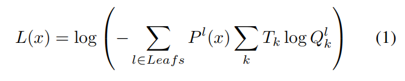
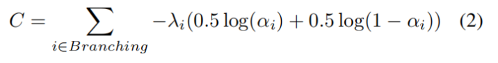
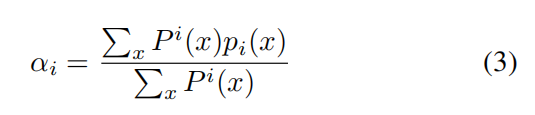

| **原文题目** | Distilling Deep Reinforcement Learning Policies in Soft Decision Trees |
| ------------ | ------------------------------------------------------------ |
| **中文题目** | 使用软决策树提取深度强化学习策略                             |
| **发表刊物** | IJCAI 2019 Workshop（CCF推荐的A类期刊）                      |
| **原文链接** | https://arxiv.org/abs/1707.00784v2                           |
| **相关代码** | 无                                                           |

## 摘要

 	强化学习 (RL) 研究的一个重要步骤是创建一个机制（mechanisms）可以对当今使用的黑盒策略模型提供更高层次的见解，并为这些（智能体）学到的行为提供解释或激发某些决策步骤背后的选择。 在本文中，我们说明了如何使用软决策树 (SDT) 提取方法使通过强化学习学到的策略更具可解释性。 软决策树创建预先定好深度的二叉树，其中每个分支节点代表影响输入数据分类的分层过滤器。 我们从用于 Mario AI 基准测试的深度神经网络的 RL 策略中提取 SDT，并检查学习到的过滤器层次结构，显示哪些输入特征导致该段情节（episode）中的特定动作分布。 我们实现了面向智能体学到行为策略的可解释的初步步骤，并讨论了未来的改进。

## 1 简介

​		近年来，强化学习 (RL) 的进展主要归功于深度神经网络 (DNN) 技术的进步，使用深度神经网络模型作为函数近似技术来估计各种任务中的人类水平（humans-level）控制策略 [Mnih等人., 2015; 舒尔曼等人，2017]。 鉴于这些模型的大量参数和复杂的架构，很难直接解释和理解学习到的策略，尤其是随着网络规模越来越大。人工智能研究的一个重要步骤是创建一个对这些黑盒模型的学习行为提供更高层次洞察力的机制（mechanisms），并使学习到的策略可解释。

​       给定一个学习的 RL 控制策略，它将状态观察映射到一组有限动作的概率，我们可以很容易地将类比到分类任务中，在其中我们学习哪些动作对应于特定状态。 为了进一步深入了解学习到的深度强化学习策略，我们研究了类似于 [Frost and Hinton, 2017] 的网络蒸馏（distillation）技术的适用性，该技术试图通过软决策树(SDT)代理模型来模拟DNN分类输出。 更准确地说，这项工作的贡献是我们训练 SDT 来模拟 Mario AI 基准的深度神经网络控制策略的动作分类，并展示树如何分层过滤输入特征，从而通过神经网络得到选择的动作。 这种方法提供了一种对深度控制策略如何运作的解释。

## 2 相关工作

​		知识蒸馏（distillation）技术：尝试将知识从大型机器学习模型中提取出来，转移到较小的模型中，达到用较少的计算开销来实现较好性能的目的。

| **文献来源** | **相关文献**                                                 | **主要工作**                                                 |
| ------------ | ------------------------------------------------------------ | ------------------------------------------------------------ |
| arvix 2015   | Distilling the Knowledge in a Neural Network.从神经网络中提取知识。 | 该研究将模型集合中的知识提取到单个模型中，显著改进了目前大量使用的商业系统的声学模型。 |
| ICLR 2016    | Policy distillation 策略蒸馏                                 | 该方法可用于提取基于DQN算法的强化学习智能体的策略，并用于高效地训练一个专家级的新网络；在Atari领域证明了还可以将多个特定任务的策略合并到单个策略中。 |

​		决策树模型是模型可解释性的首选方法之一。

| **文献来源**             | **相关文献**                                                 | **主要工作**                                                 |
| ------------------------ | ------------------------------------------------------------ | ------------------------------------------------------------ |
| Jordan 和 Jacobs, 1994年 | Hierarchical Mixtures of Experts and the EM Algorithm  专家分层混合与EM算法 | 该研究提出了一种树结构的分层混合模型，其中混合系数和混合成分均为广义线性模型（GLIM）；使用一种期望最大化（EM）算法来调整模型参数。 |
| Frosst和Hinton，2017年   | Distilling a Neural Network Into a Soft Decision Tree  提取神经网络为软决策树 | 提出了一种使用经过训练的神经网络来创建一种软决策树的方法，这种软决策树比直接从训练数据中学习的软决策树具有更好的泛化能力。 |
| Tanno 等人，2019年，ICML | Adaptive Neural Trees  自适应神经树                          | 将神经网络和决策树的混合概念概括为自适应神经树               |

 		最近，RL 社区已经开始探索导致可解释策略的方法。

| **文献来源**            | **相关文献**                                                 | **主要工作**                                                 |
| ----------------------- | ------------------------------------------------------------ | ------------------------------------------------------------ |
| Hein等人, 2017年        | Particle swarm optimization for generating interpretable fuzzy reinforcement learning policies.  用于生成可解释模糊强化学习策略的粒子群优化算法。 | 该研究通过添加模糊粒子群优化来学习高性能、可解释的模糊策略   |
| Hein等人，2018年        | Interpretable policies for reinforcement learning by genetic program 通过遗传程序进行强化学习的可解释策略 | 提出了一种基于基于模型的批量强化学习和遗传规划的强化学习遗传规划（GPRL）方法。 |
| Verma等人, 2018年，ICML | Programmatically Interpretable Reinforcement Learning. 可编程解释的强化学习。 | 提出了一个强化学习框架PIRL，使用一种神经定向程序搜索（NDPS）算法，工作原理是首先使用DRL学习策略神经网络，然后对编程策略执行局部搜索来尽量缩短与神经网络的距离。 |
| Liu等人, 2019年         | Toward Interpretable Deep Reinforcement Learning with Linear Model U  使用线性U模型解释深度强化学习 | 该研究尝试引入一种线性模型U树（LMUT）来模拟表示 Q 值函数的深度神经网络 |

​		与本文思路最相似的是Liu [2019] 的工作，因为该研究试图将 Q 值神经网络提炼成决策树代理模型；本文工作侧重于模仿明确的策略神经网络。

## 3 背景 

### 3.1 强化学习

​        强化学习解决了学习在环境中做出决策的问题 [Sutton和Barto, 2018]。 这通常通过马尔可夫决策过程建模为元组 (S, A, T , R, γ)，其中 S 表示状态空间，A 表示动作空间，T : S × A × S → [0, 1] 状态转换函数，R : S ×A → R 奖励函数和 γ ∈ [0, 1] 折扣因子。

​        在离散设置中，智能体在每个时间步t观察环境的当前状态st，接着从其当前策略 πt : S × A → [0, 1] 中采样一个动作。 在执行动作后，智能体获到奖励 rt = R(st, at)，并且环境按照 T 定义的转换概率转换到下一个状态 st+1。 智能体的目标是从其观察到的状态-动作转换中学习最大化期望回报 E[Rt]，其中 Rt = P∞i=0 γirt+i，即未来折扣奖励的总和。 折扣因子 γ 调节智能体在即时奖励和长期奖励之间的偏好。 较低的折扣因子值将重点放在即时奖励上，而较高的值会导致 Rt 中当前和未来奖励的权衡更加平衡。基于策略的方法通过在具有策略梯度的参数θ上执行梯度上升∇θlogπθ（at | st）Rt来显式地学习一个参数化的控制策略模型，作为给定一个状态观测的所有动作的条件概率分布πθ(at|st)[Williams, 1992]。

### 3.2 软决策树

​       软决策树 (SDT) [Frost和Hinton, 2017] 是具有预定深度和神经网络的二元决策树的混合分类模型。 在模型中，每个分支节点 i 由单个具有权重向量参数 wi 和偏置参数 bi 感知器组成。 在一个给定的输入 x 上，分支节点确定遍历到右子节点的概率为 pi(x) = σ(β(xwi + bi))，其中 β 是逆温度参数，σ 是 sigmoid 逻辑函数。

​       该模型在其分支节点中学习过滤器的层次结构，以将输入数据分配给具有特定路径概率 Pl(x) （即从根到节点 l 的分支概率的总乘积）的特定叶节点 l。 叶节点在可能的输出类别 k 上学习 由 φk 参数化的softmax 分布 Qlk = exp(φlk) Pk0 exp(φlk0 )。

​        输入样本 L(x) 的训练损失基于叶预测和目标分布 Tk 之间的熵，由其各自的路径概率加权： 

​       除了训练损失之外，SDT还为分支节点添加了一个基于分支节点的当前分布 αi 和离散二元均匀分布之间的交叉熵的正则化成本 C，以鼓励在决策过程中平等使用它们各自的子树：

其中

​       每个分支节点都会收到一个惩罚强度 λi，它基于一个起始值 λ，然后在树的深度上衰减 2-d 倍。 因此，对于高度确定性分支，树中较高的节点会获得更强的惩罚成本。 使用小批量梯度下降优化使整体损失最小化。

## 4 方法

​        在这项工作中，我们感兴趣于将深度强化学习策略提炼为软决策树，以进一步了解深度策略决定动作的方式。 我们基于公共 Java 模拟器 Infinite Mario Bros 评估了该方法在 Mario AI 基准测试 [Karakovskiy 和 Togelius，2012] 上的适用性。代理能够通过 TCP 网络连接与模拟器交互。 我们训练了一个 Deep RL 代理来控制 Mario 并玩一个模拟器的简单关卡，我们稍微修改了模拟器来在关卡中引入不同类型的硬币。  Mario 代理的可用动作是按下 5 个模拟器按钮（向左、向右、向下、跳跃和奔跑）的任何可能组合，总共有 32 (= 25) 个动作。

​       目标是在3000步的时间内到达关卡结束的公主，同时收集点数。 到达公主将给予智能体100点的奖励。 使代理靠近公主的每一步都会得到 +1 的奖励，反之亦然，远离公主的步会受到 -1 的奖励。四种不同类型的硬币（绿色、蓝色、黄色和红色）散布在整个关卡中，分别提供 -20、-10、0 和 +20 的独特奖励。 因此，最好的马里奥应该学会收集红色硬币并避免拿走绿色和蓝色硬币。 跳到敌人身上并杀死他们会获得 +10 的奖励。 马里奥不会死亡，但被敌人击中时会受到 -20 的惩罚。

​       我们的智能体在学习过程中使用的状态表示是围绕 Mario 的 10 x 10 感受野，即以块分辨率描述代理周围世界的二维网格。 每个单元格包含一个与该位置环境中存在的游戏对象相关的数字标签。图 1 说明了从游戏框架到感受野的转换。 作为这种转换的结果，我们的深度强化学习代理接受了 100 个输入特征的训练。

​		我们使用 PPO算法 [Schulman等人, 2017] 训练我们的深度强化学习代理 1000 万步。 给定输入的状态观察，训练两个独立的神经网络分别表示策略（actor）和状态值函数（critic）。状态值网络输出用作更新策略网络的基线，由 2 个具有双曲正切激活函数的 128 个单元的多层感知器 (MLP) 隐藏层和最终线性层来输出状态值。 同样，策略网络也由 2 个具有双曲正切激活的 128 个单元的 MLP 隐藏层组成，最后一个线性层产生 32 个动作概率。

​       训练后，我们将深度策略网络的输出提炼成软决策树，并分析这棵基于树的模型是否使我们能够深入了解我们的深度强化学习代理控制马里奥和选择动作的方式。 我们生成了一个训练和测试数据集，每个数据集都包含由经过训练的 PPO 策略播放的 50 个回合的记录。 数据集由 DNN的 输入和输出对 (s, π(s)) 组成，即状态观察s和所执行回合的每个步骤的预测动作概率分布π(s)。 我们在40 个时期的训练集上安装了多个深度范围从 3 到 7的 SDT。 在所有设置中，使用 Adam 优化 [Kingma 和 Ba，2014]，正则化成本 λ 的惩罚权重为 0.1，小批量大小为 64。

## 6 讨论和未来工作

​       使用软决策树来解释深度强化学习策略是致力于可解释强化学习研究的众多步骤中的第一步。 鉴于我们评估的环境包含空间特性，我们能够通过可视化学到的特征并遵循这些特征来选择行动来提供解释。 问题仍然是这些软决策树模型是否也能在非空间环境中实现更高的可解释性，例如与生物逻辑数据。 然而，软决策树仍然缺乏一种人类可读形式的抽象。 人们可以争辩说它没有提供解释，例如 一种符号形式。 添加基于规则的机器学习技术可能会成为一项为强化学习策略提供更多符号性解释的有趣资源。 通过执行用户测试，我们还可以尝试确定这些类型的模型是否可以被普遍接受为人类对 RL 智能体做出的决策的解释。

相比于模仿预先训练的 DNN，软决策树可以直接在数据上拟合。Frosst [2017] 在分类任务中证明了这一点，但该方法在数据集上训练软决策树时据说出现了较低的性能。 因此，我们尚未在 RL 设置中对此进行探讨。 我们假设必须对损失函数进行调整才能允许我们直接从智能体经验中训练软决策树策略。 因此，一些考虑的未来步骤是检查 Liu 的 [2019] 使用的方法，并绘制与策略级别而不是 Q 值的关系。 这可能允许我们直接将软决策树作为策略来训练。

​       鉴于我们拟合的代理模型在回合奖励方面的表现较低，问题出现了 SDT 是否真的在解释潜在的策略。 因此，必须进一步关注 SDT 与模拟策略的匹配程度。 为了提高 SDT 的性能，我们可以选择在环境中对代理模型进行在线微调，而不是仅对回合经验进行监督训练。 这种微调将类似于 [Liu等人, 2019] 中执行的主动播放设置。

​       此外，软决策树的一个缺点是它们具有预先确定的深度，必须事先手动选择。 理想情况下，我们可以选择自适应生长的树，正如 [Tanno等人, 2019] 最近提出的那样，可以确定用户在可解释性和复杂性方面想要的妥协程度。

## 7 结论

​        我们已经展示了直接在动作分布上解释强化学习策略的初步步骤，主要是通过应用软决策树来模拟 Mario AI 基准的深度强化学习策略。 通过从一个训练好的 PPO 智能体上生成状态策略样本，我们学习了（软决策树上）分支节点中状态的分层决策过滤器和叶子中的广义动作策略分布。 通过可视化和测试这些过滤器，我们发现了一些沿着决策树中现有路径的一些值得思考的特征。 将这些过滤器应用于状态样本，可以初步了解状态观察中存在的哪些元素会导致特定的动作分布。 检查叶子中的当前动作分布可以让人们深入了解智能体所采用的策略。 这种方法可以提升研究人员对于状态观察中元素和策略运行时直接联系的理解。

