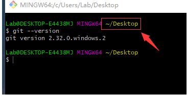
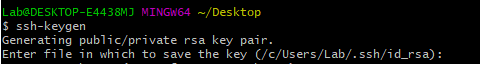
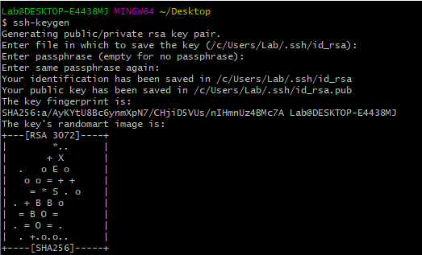
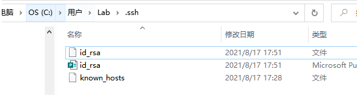
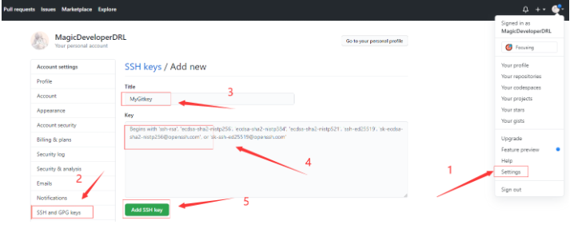
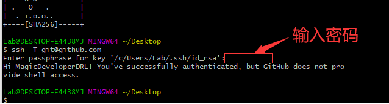

Git 是一个开源的分布式版本控制系统，用于敏捷高效地处理任何或小或大的项目。

# 一、git的安装

Git 目前支持 Linux/Unix、Solaris、Mac和 Windows 平台上运行。

Git 各平台安装包下载地址为：http://git-scm.com/downloads

本文我们暂时介绍windows系统的安装。

windows上安装包下载地址：https://gitforwindows.org/

官网慢，可以用国内的镜像：https://npm.taobao.org/mirrors/git-for-windows/。

然后运行安装程序，一直点next，直至安装完成。

然后在桌面空白处鼠标右击“Git Bash Here”就可以打开Git Bash窗口，输入“git --version”：




请注意，上述红线标识的就是当前命令行默认操作的根目录，在输入命令时要时刻注意自己的“当前目录”

> Tips：在想要操作的目录下直接鼠标右击“Git Bash Here”就可以打开当前目录下的Git Bash窗口
>

# 二、生成本地Git的SSh key

个人用户在初次使用git时一般将远程服务器设置为自己的GitHub网站，两者通过ssh服务建立加密连接。

所以请先确保自己有一个GitHub账户，没有的话可以先去用自己的邮箱免费注册一个。

这就需要我们先用Git在本地生成ssh的公钥：

直接在Git Bash中输入如下命令：

```
方式一：ssh-keygen
方式二（推荐）：ssh-keygen -t rsa -c "你的GitHub注册邮箱"
```




这个时候就会让你输入保存公钥的路径和文件名，强烈建议直接回车继续，这样就会使用默认路径！

接着就会让你设置一个密码，然后输入第二次验证，之后就会生成如下信息：




根据提示信息，我们可以在c/Users/用户名/.ssh/中找到如下文件：




里面有id_rsa和id_rsa.pub两个文件，这两个就是SSH Key的秘钥对，id_rsa是私钥，不能泄露，id_rsa.pub是公钥，可以公开。

## Linux下查看：

进入 /root/.ssh 目录，查看 id_rsa 和 id_rsa.pub 文件：

```
ls -al ~/.ssh
cd ~/.ssh
vim id_rsa.pub
```


# 三、设置远程GitHub的SSH key

按照下图步骤，将id_rsa.pub中的内容黏贴上去即可添加：




验证是否成功，在git bash里输入下面的命令：

```
ssh -T git@github.com
```

初次连接会让你输入上一步设置ssh时的密码，如下图：




# 四、配置个人信息

安装完后，就要继续设置个人的本地用户信息：

## 1、设置个人信息

```python
git config --global user.name "你的GitHub用户名"
git config --global user.email "你的GitHub注册邮箱"
```

如果用了 **--global** 选项，那么更改的配置文件就是位于你用户主目录下的那个/etc/gitconfig，以后你所有的项目都会默认使用这里配置的用户信息。

如果要在某个特定的项目中使用其他名字或者电邮，只要去掉 --global 选项重新配置即可，新的设定保存在当前项目的 .git/config 文件里。

## 2、查看个人配置

```python
git config --list
```
