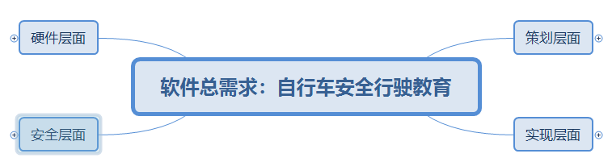
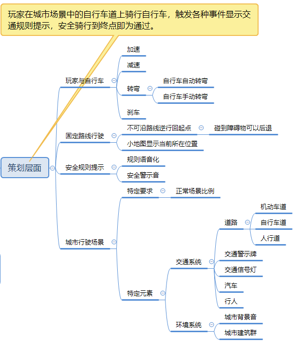
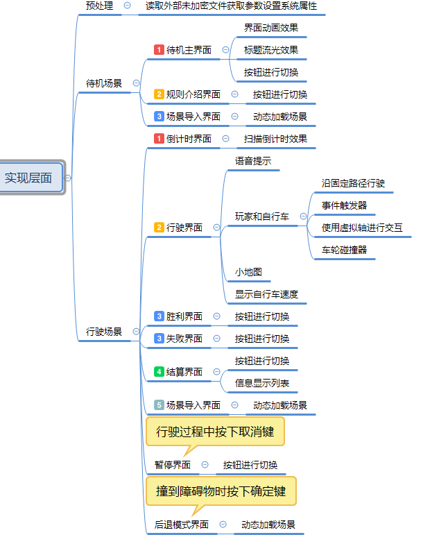
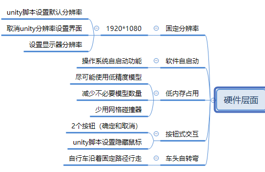
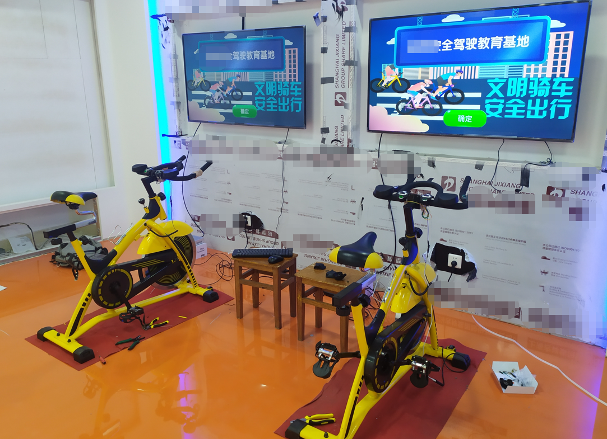
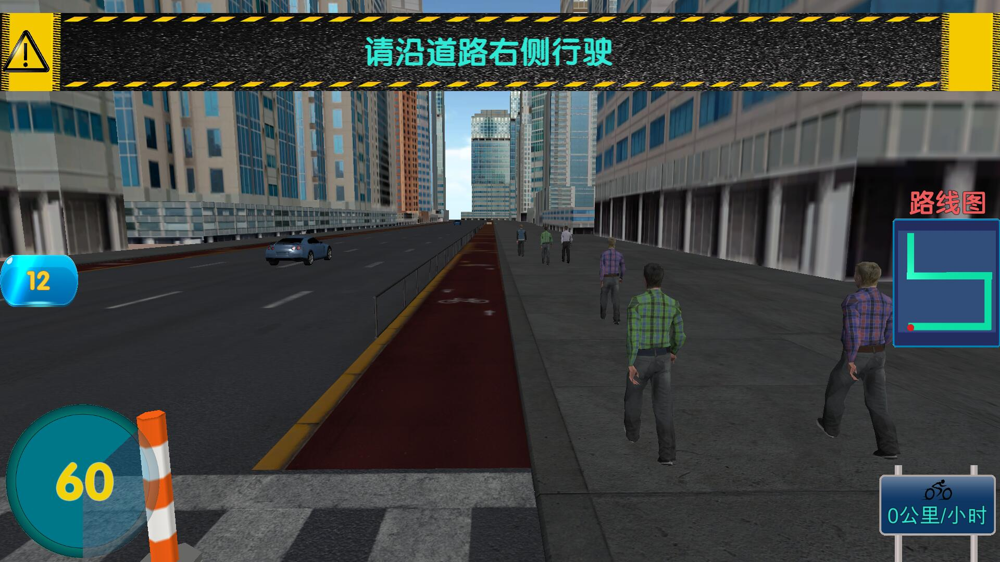
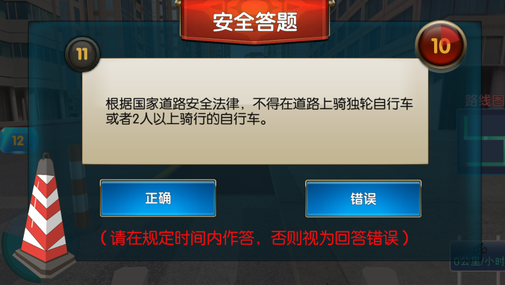

​	 	`自行车安全驾驶模拟器项目`是一款`软硬件结合`的`三维程序仿真项目`，是作者本科时期在导师指导下与`某城市交通安全馆`签订的项目，整套项目分为`硬件`和`软件`两部分，作者`独立负责`了其中的软件部分`开发`，并且承担了后续与`硬件`结合的`调试`与`安装`工作，最终成功通过了`甲方`验收。

[TOC]

## 一、项目主要介绍

​		该项目的软件部分是一款三维程序软件，作为独立开发者，作者采用了业界流行的三维游戏引擎Unity作为主要工具，结合C#脚本程序完成主要编码工作。

### 1、项目难点

​		需要作者一个人完成软件的功能策划、程序开发、界面美工以及和硬件的协同调试，**最大的困难是没有成员可以讨论或分工，没有成熟项目案例可以参考，只能自行完成设计**。经过长达小半年左右的摸索和总结，作者归纳出了该软件的四个层面的策划设计工作：

### （1）策划层面

​		**先将软件的使用场景定义下来，然后针对该需求场景划分出更多的子需求，从而化繁为简**。个人将该软件的使用场景定义为"玩家在城市场景中的自行车道上骑行自行车，触发各种事件显示交通规则提示，安全骑行到终点即为通过"。然后针对玩家与自行车的交互设计关键功能，针对固定路线、安全规则提示和城市行驶场景等分别策划。

### （2）实现层面

​		**整体上思路是需求场景->软件界面->功能模块->基础服务（封装成工具）**。由于该软件的需求情景简单，作者将使用场景划分为待机场景、行驶场景，在不同场景下设计关键的界面效果和主要功能模块，最后分析已有的功能模块，需要哪些基础服务，例如计时服务、资源加载服务、界面切换服务等，将这些基础服务的算法抽象出来进行封装。

### （3）硬件层面

### （4）安全层面

​		**因为该项目属于商业合同性质，有一定的安全加密要求**。

​		首先该软件只能在特定的硬件设备运行，不能跨设备移植，所以作者购买了成熟的付费加密模块来为整个软件进行加密，该加密模块会针对特征设备的硬件号生成一组软件序列号，软件运行是必须验证序列号。

​		由于现场调试时，作者需要经常更改一些参数设置，例如自行车最高时速、分辨率、转弯最大角度、计时等，为了不重复修改代码，作者从软件外读取软件参数，并对参数文本进行加密映射。

### 2、个人收获

### （1）前期策划多做点，后期开发少改点

​		在项目开发初期，由于个人缺乏经验，在策划上容易考虑不周，例如使用大量耗费资源的三维模型；在项目开发编码初期没有考虑框架设计，后期需要不断添加新功能或者改动已有功能的代码，费时费力，可靠性还差。

### （2）满足功能容易，安全可靠更难

​		该项目的软件开发不能随心所欲的使用精美的三维模型，必须考虑硬件运行能力，做到尽可能地低内存占用。同时，由于一些三维场景和编码设计，总可能出现一些小概率的未知bug，即运行时有一定的概率会出现bug，测试时却很难重现，所以感觉做出安全可靠的软件产品更难。

### （3）软硬协同反复调，麻烦不断磨心性

​		由于作者只负责软件层面，现场安装调试时，需要反复和硬件老师进行沟通，总会出现各种意想不到的问题，例如硬件自行车的转弯头磨损严重，直接将转弯节点焊死，让软件层面实现自动拐弯；例如项目验收时，甲方临时提出新需求，又得在原有架构上补上新的功能设计。

## 二、项目简要展示

### 1、现场调试图

	

### 2、软件开始界面

### 3、自行车骑行界面

### 4、计时答题界面

