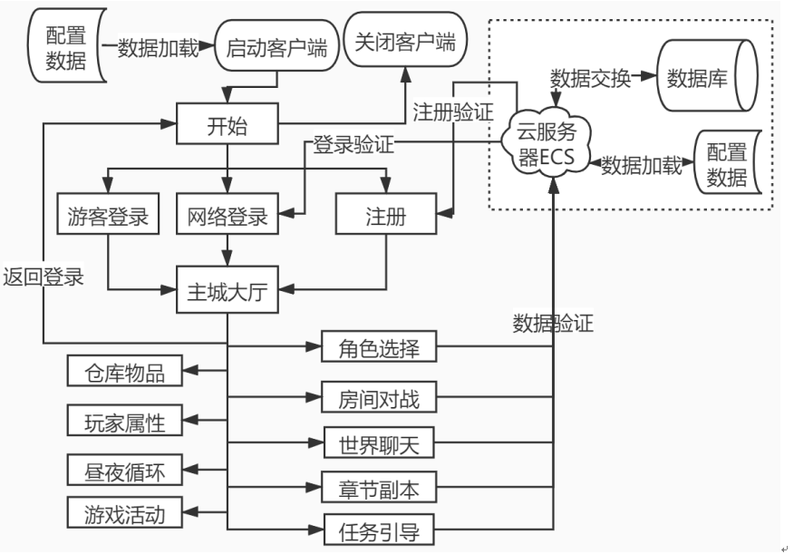
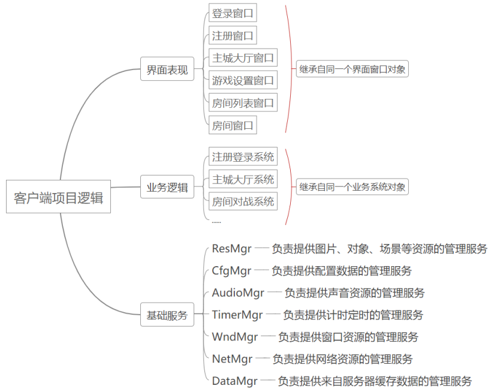
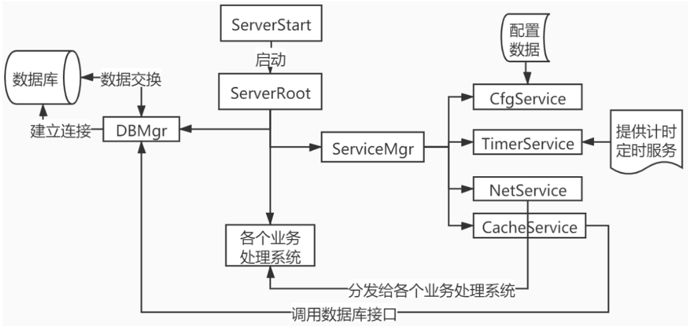
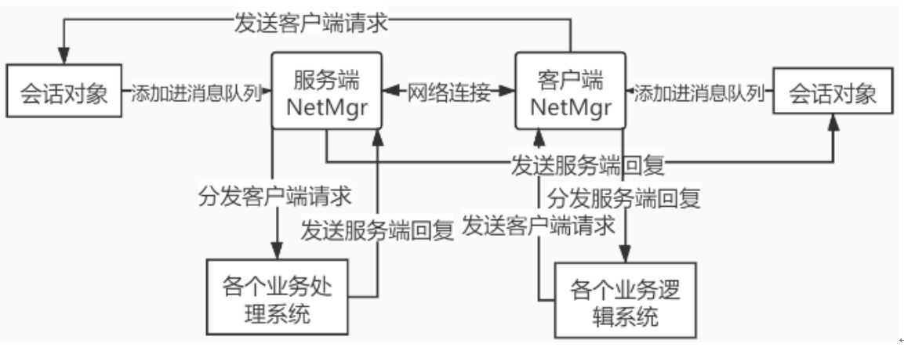
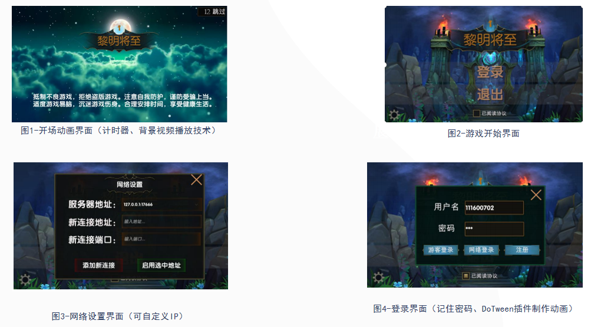
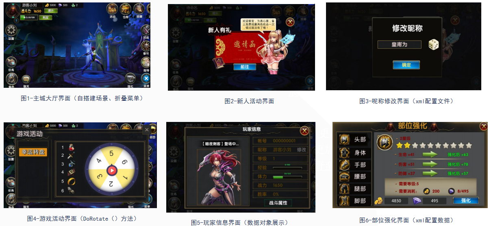
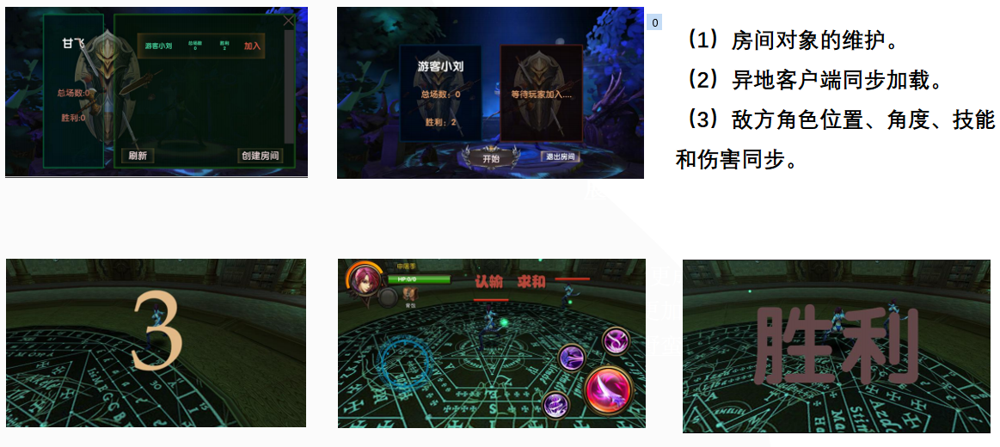
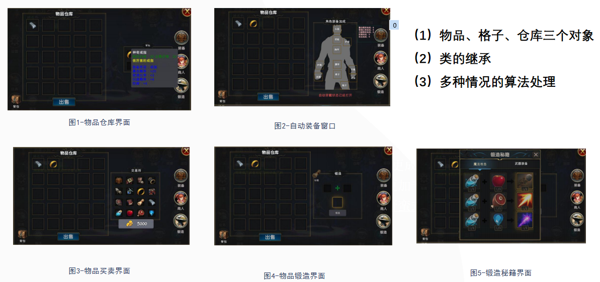
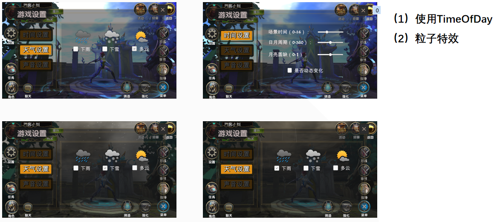
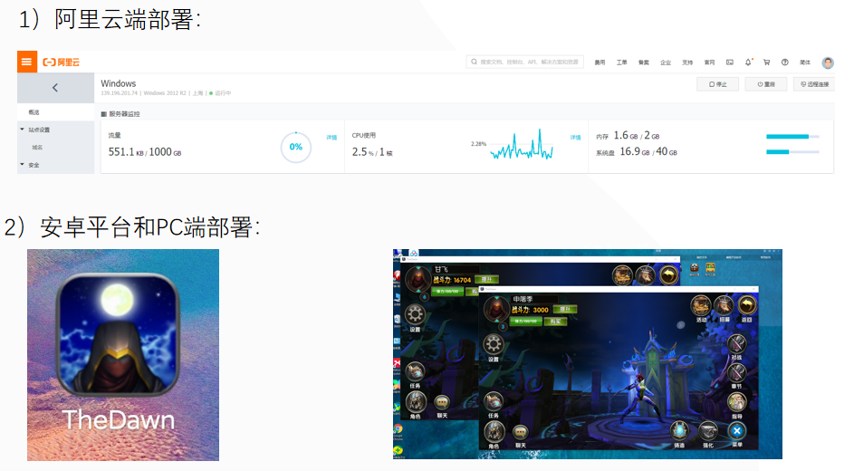

​	 	`某中小手游的服务端和客户端设计`是作者本科的毕设作品，也是作者本科在公司实习期间所学知识的运用。整套项目分为`客户端`和`服务端`两部分，作者`独立完成`了其中的`游戏策划`，`程序开发`和`美术处理`等，封装的类文件达200个以上，代码量累计超过万行。

[TOC]

## 一、项目主要介绍

​		该项目开发出了一套具备网络通信功能的三维网络对战游戏《黎明将至》，旨在研究网络通信、游戏编程框架等在游戏开发中的应用，对于独立游戏开发者入门提供借鉴意义，整个游戏部分分为客户端和服务端两部分，客户端基于三维游戏引擎Unity+服务端基于C#编程+MySQL数据库的PC端桌面程序开发。该游戏的总体流程图如下：

主要技术难点：

* 用于**基础服务层、业务逻辑层、界面表现层**的分层解耦设计；

  服务端不需要界面表现层，在基础服务层前添加了数据服务层来操作数据库

* 用于**控制对象初始化次序**和**支持跨场景访问**的**游戏启动器**设计

  使用基于单例模式的全局启动器来初始各个层的对象初始化和销毁

* 基于**静态加载**和**对象池技术**的**资源管理器**设计；

  使用Unity中Resource静态加载方式，为了提升效率借助对象池技术

* 基于**XML文件**的配置管理器设计；

  每一个XML文件中存在多条配置数据，每条配置数据对应一个配置数据模型类，一组配置数据存储在哈希表中

* 基于**Socket编程**和**异步IO**的网络管理器设计；

  服务端的监听socket连接后维护一组网络会话对象，每组网络会话的建立连接、断开连接、接收消息和发送消息的接口可以由各个终端继承，C#提供socket的异步IO方式，只在接收到连接和完成连接时进行提醒。

* 用于跨客户端和服务端工程的**第三方公用库**开发；

  网络消息类型、错误码类型、业务处理方式等客户端和服务端通用的方法以

  第三方公用库的形式共用

  

### 1、项目难点

​		需该项目的主要难点在于要同时满足各种不同的游戏逻辑系统：例如仓库物品、人物角色、房间对战、章节副本等，业务代码量较大，**如何组织不同类型的业务逻辑模块？在编码开发上，需要使用一些有效的编程框架手段**。

### （1）客户端编程框架

​		笔者借鉴了“Manager of Managers”（简称MOM）的通用脚本管理方式，将游戏的基础服务封装成了一个个提供服务的管理器，**这种方式就是将同类型的行为或操作者组织起来进行统一管理**，例如将游戏中的所有与声音有关的方法组织起来形成一个声音管理器。

​		游戏引擎提供了各种API，在实际的开发过程中证明，这种编程思想较好地实现了在实现复杂的游戏逻辑的同时也保持了同类对象的有效管理。

### （2）服务端编程框架

​		该项目的服务端服务端的编程框架和客户端编程框架的基本思路是一致的，也是遵循基础服务、业务逻辑、界面表现三个层次。但是服务端与客户端存在一些不同之处：

（1）一是该文中的服务端不进行前端界面的开发，所以信息全部以日志的形式打印出来；

（2）二是服务器需要处理数据库中的数据，这就需要我们专门进行一些对于数据库的管理设计。

​		鉴于本服务器的需求较简单，这里的服务器程序架构也仅考虑少量客户端的最基本的网络通信的请求与响应服务，暂不考虑负载均衡、资源下载等更多情景。

​		ServerStart是服务端的启动入口，它通过项目的Main函数来启动程序，先初始化ServerRoot,然后进入循环，不断执行ServerRoot的业务更新逻辑Update()，这里需要注意，为了节省系统开销，我们需要循环每执行一次就休息20ms左右。

​		ServerRoot的初始化工作主要分为三类，分别是初始化DBMgr来和数据库建立连接，初始化ServiceMgr来启动服务器的基础服务，初始化各个业务处理系统。

​		初始化工作完成后，每次服务端接收到外部请求的时候，首先通过NetService将请求消息缓存进消息队列，然后消息队列不断分发给各个业务处理系统的对应业务处理程序，业务处理程序根据需要调用DBMgr的封装接口，DBMgr调用数据库操作API完成与数据库的数据交换。

### （3）服务端与客户端的网络通信

​		网络管理器是属于基础服务层的全局可调用的服务实例，它的主要功能是提供网络数据资源的通信服务等。

​		本项目使用的是PESocket插件，该网络通信插件会提供基础的网络通信方法。首先使用IP地址和端口号生成PESession类对象，当客户端连接到服务器时，网络服务初始化成功。此时PESession类对象开始侦听服务器消息，服务端和客户端的网络通信逻辑如图。

### 2、技术收获

### （1）对象池技术

​		对象池技术是在软件开发中应用频率很高的内存管理技术，它降低了创建对象的系统开销。在游戏开发时，创建的新对象数量庞大会影响程序的稳定。

​		对象池的实质就是在一个容器中存放对象。当每次加载对象时就去该容器中查找是否存在该对象，如果存在则获取它并从该容器中移除，如果不存在则重新生成一个对象并且添加到该容器中。当每次销毁对象时就将对象回收到容器中。

### （2）设计模式

​		设计模式是前人软件开发经验的结晶，恰当的使用会让开发和维护效率翻倍。**本项目中突出的设计模式就是单例模式和命令模式**。

​		单例模式给其他对象提供自己创建的唯一的单例对象。这在游戏开发中也经常被用来进行脚本之间的对象引用，但是注意单例模式不能滥用。

​		命令模式将请求视为命令对象，并传给调用对象，调用对象再分发给对应的处理程序。本文的客户端项目中使用命令模式将网络消息请求封装成单独的请求对象，降低了系统耦合度，也有利于系统维护。

### （3）网络通信技术

​		套接字编程是当前应用程序中网络通信的成熟解决方案，可以实现可靠的、有连接的数据流服务。

​		本项目使用C#语言在微软的VisualStudio2018平台来利用套接字开发服务端的网络通信功能，借助个人开发包PESocket来提供网络通信功能，也可借助较成熟的服务器引擎，例如PhotonServer等。

## 二、项目简要展示

### 1、登录界面与注册界面

	

### 2、主城大厅界面

### 3、房间对战界面

### 4、物品仓库界面

### 5、环境控制界面

### 6、服务端和客户端部署界面

