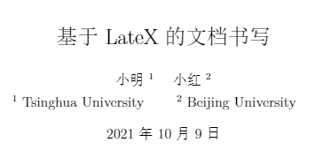
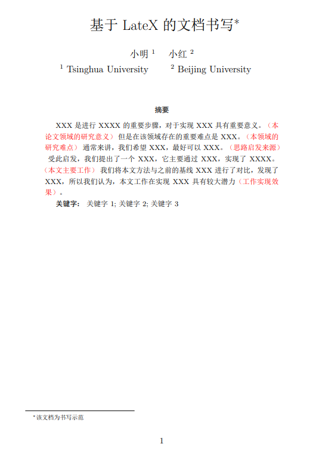
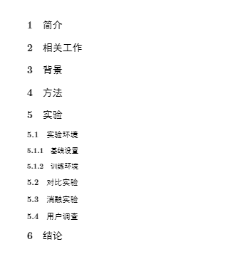
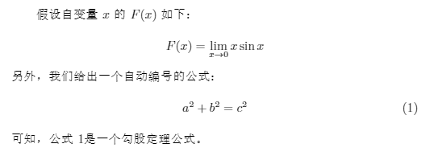
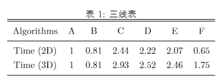
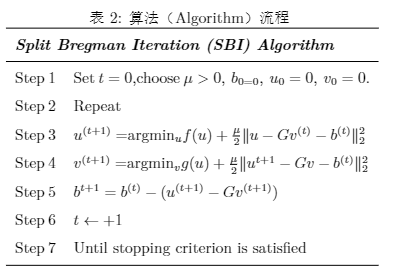
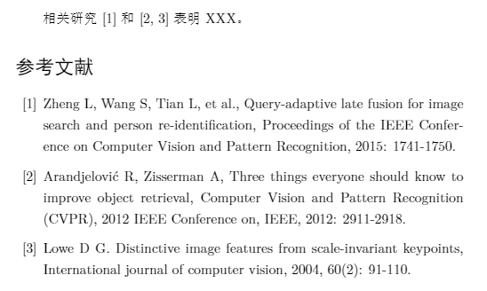

LaTeX（音译’拉泰赫‘）是一种基于TeX的排版系统，它将文章的排版以代码的形式呈现，可以帮助我们快速生成高质量的复杂表格和数学公式等，所以几乎是理工科，特别是计算机学科的研究人员进行论文排版的首选工具。

本文使用overleaf在线编辑器（[Overleaf, Online LaTeX Editor](https://www.overleaf.com/)）来书写LaTeX文档，新手需要先免费注册一个账号，然后新建一个空项目。

本文展示的整个代码在文章最后给出。

## 1、新建hello world文档

由于我们希望新建一个中英文都可编译的文档，所以首先需要将overleaf在线编辑器的编译器设置为`XeLaTex`。

然后新建一个`.tex`文件，例如main.tex，在其中加入以下代码：

```latex
% 必须使用XeLaTex编译器
\documentclass{article} % 指定要调用的文档类
\usepackage[utf8]{ctex} % 用来帮助显示中文字符

\begin{document}
hello world!\\
你好,世界
\end{document}
```

编译成功后会生成一个`pdf`，其中出现中英文内容。

从以上几行代码中，简单介绍如下代码：

> - %：注释单行，其后内容不编译，`ctrl+？`可以将选中内容注释/消除注释
> - \documentclass[options]{**class**} 是一句命令，[options]表示`可选项`，{**class**}表示要输入一个类名，`article` 排版科技期刊、短报告、程序文档、邀请函等，`report` 排版多章节的长报告、短篇的书籍、博士论文等，`book` 排版书籍
> - \begin{document}和\end{document} 必须成对出现，它们之间的所有内容都属于`document`环境，只有`document`环境内的内容才会编译后被输出到pdf中。
> - \begin{document} 与 \documentclass{article} 之间的部分被称为`导言区`。`导言区`中的控制序列，通常会影响到整个输出文档，通常在`导言区`设置页面大小、页眉页脚样式、章节标题样式等。

## 2、添加标题、作者和作者单位

添加如下代码：

```latex
% 必须使用XeLaTex编译器
\documentclass{article} % 指定要调用的文档类
%%% 导言区
\usepackage[utf8]{ctex} % 用来帮助显示中文字符
%%%%%%%%% 文章题目和作者
\title{基于LateX的文档书写}
\author{小明$^{1}$ \quad 小红$^{2}$ \\
$^{1}$ Tsinghua University \quad \quad
$^{2}$ Beijing University \quad \quad
}
\date{\today}
%%% PDF输出内容
\begin{document}
\maketitle % 负责将导言区中定义的标题、作者、日期按格式显示
\end{document}
```

输出效果如下：




## 3、添加摘要、关键字、脚注，修改字体颜色

添加`摘要`和`关键字`按照如下模板即可：

```latex
\begin{abstract}
\par\textbf{关键字: } 关键字1; 关键字2; 关键字3
\end{abstract}
```

> \begin{abstract}和\end{abstract}之间的内容属于abstract环境
>
> \par表示新起一行，\textbf{}表示将{}内的内容加粗

如果想要修改某段文字的颜色，需要在`导言区`添加：`\usepackage{color}`，然后可以仿照如下：

```
XXX是进行XXXX的重要步骤，对于实现XXX具有重要意义。{\color{red}（本论文领域的研究意义）}
```

`\date{\today}`用来显示当天的日期，但是在论文中一般不需要显示，所以我们可以使用`\date{}`来不显示日期

很多论文也会有一些脚注，这里我们直接使用`\thanks{脚注内容}`来添加。最终的代码如下：

```latex
% 必须使用XeLaTex编译器
\documentclass{article} % 指定要调用的文档类
%%% 导言区
\usepackage[utf8]{ctex} % 用来帮助显示中文字符
\usepackage{color} % 用来帮助修改颜色


%%%%%%%%% 文章题目和作者
\title{基于LateX的文档书写\thanks{该文档为书写示范}}
\author{小明$^{1}$ \quad 小红$^{2}$ \\
$^{1}$ Tsinghua University \quad \quad
$^{2}$ Beijing University \quad \quad
}
\date{} % \date{\today}显示日期

%%% PDF输出内容
\begin{document}
\maketitle % 负责将导言区中定义的标题、作者、日期按格式显示
%%%%%%%%% 文章摘要和关键字
\begin{abstract}
    XXX是进行XXXX的重要步骤，对于实现XXX具有重要意义。{\color{red}（本论文领域的研究意义）}
    但是在该领域存在的重要难点是XXX。{\color{red}（本领域的研究难点）}
    通常来讲，我们希望XXX，最好可以XXX。{\color{red}（思路启发来源）}
    受此启发，我们提出了一个XXX，它主要通过XXX，实现了XXXX。{\color{red}（本文主要工作）}
    我们将本文方法与之前的基线XXX进行了对比，发现了XXX，所以我们认为，本文工作在实现XXX具有较大潜力{\color{red}（工作实现效果）}。
\par\textbf{关键字: } 关键字1; 关键字2; 关键字3
\end{abstract}
\end{document}
```

输出效果如下：




## 4、另起一页、添加章节与子章节

另起一页只需要添加一行代码即可：`\newpage %新起一页`

添加`章节标题`和`子标题`同样也很简单：

```latex
\newpage %新起一页
\section{简介}
\section{相关工作}
\section{背景}
\section{方法}
\section{实验}
\subsection{实验环境}
\subsubsection{基线设置}
\subsubsection{训练环境}
\subsection{对比实验}
\subsection{消融实验}
\subsection{用户调查}
\section{结论}
```

其效果如下：




## 5、插入图片

插入图片需要先在`导言区`引入以下两个包：

```latex
\usepackage{graphicx}%插入图片时需要调用的包
\usepackage{subfigure}%插入子图片时需要调用的包
```

插入1张图片：

```latex
%插入图片
\begin{figure}[h]
    \centering%图片居中显示
    \includegraphics[scale=0.7]{figures/图片1.png}%花括号内为图片相对路径
    \caption{图片的图题}%图片标题
    \label{fig0}%图片label，便于文中引用
\end{figure}
如图\ref{fig0}所示，我们可以发现XXX。
```

并排插入2张图片：

```latex
%并排插入2张图片，共用一个图题
\begin{figure}[h]
    \centering
    \subfigure[左图]{  
    \includegraphics[width=3cm]{figures/图片1.png}}
    \hspace{0in}
    \subfigure[右图]{
    \includegraphics[width=3cm]{figures/图片1.png}}
    \caption{两张图片公用的图题}
    \label{fig1}%图片label，便于文中引用
\end{figure}
如图\ref{fig1}所示，我们可以发现XXX。
```

最终展示效果如下：


## 6、插入公式

插入公式前我们一般现在一些`公式编辑器`上编辑好我们的公式，例如我们在[在线LaTeX公式编辑器(latexlive.com)](https://www.latexlive.com/)上编辑一个简单的公式如下：
$$
F(x)=\lim_{x \to 0} x\sin x
$$
我们将其公式代码放入`$$`中即可显示该公式：

```latex
假设自变量$x$的$F(x)$如下：
$$F(x)=\lim_{x \to 0} x\sin x $$
```

或者要给`自动编号`的公式将其引用：

```latex
另外，我们给出一个自动编号的公式：
\begin{equation}%插入公式
    \label{eq2}
    a^{2} +b^{2}=c^{2}
\end{equation}
可知，公式\ref{eq2}是一个勾股定理公式。
```

最后显示效果如下：




## 7、插入表格

表格多种多样，我们这里只介绍`三线表`、`算法流程表`。

首先给出一个`三线表`的代码：

```Latex
\begin{table}[p]%调节位置，h：浮动；t：顶部；b:底部；p：当前位置
    \centering % 居中显示
    \caption{三线表} % 表格简介
    \label{tab1} 
    \begin{tabular}{ cccc ccc}
        \hline\hline\noalign{\smallskip}	
        Algorithms & A & B & C& D& E &F  \\
        \noalign{\smallskip}\hline\noalign{\smallskip}
		Time (2D) & 1 & 0.81 &2.44 &2.22 &2.07 &0.65 \\
		Time (3D) & 1 & 0.81 & 2.93&2.52 &2.46 &1.75 \\
		\noalign{\smallskip}\hline
    \end{tabular}
\end{table}
```




> 在上述代码中`\begin{table}`和`\end{table}`负责将其中的表格内容`自动编号`（表1，2），并且可以整体控制其显示位置；
>
> `\label`负责给该表格打上标签，在想引用该表格的地方直接使用`\ref{tab1}`就可以自动引用其编号；
>
> `\begin{tabular}`和`\end{tabular}`负责显示表格，其后的`{ cccc ccc}`表格有7列并且居中显示`（c:center）`;
>
> `\hline`负责显示一条横线，多次引用就是显示多条横线；
>
> `Algorithms & A & B & C& D& E &F`表示一行的内容，`&`负责分割每一列。

同样的，我们直接给出一个`算法流程表`：

```latex
\section{方法}
\begin{table}[p]% 创建表格
    \centering
    \caption{算法（Algorithm）流程 }%写标题
    \label{tab:1}       % Give a unique label给表格命名方便以后调用
    % For LaTeX tables use
    \begin{tabular}{ll}     %设置表格为两列并且是左对齐（l:left;c:center;r:right）
    \hline\noalign{\smallskip}       %画表格的一行，并且行距设置为smallskip（可以不设行距，或者设为bigskip）
    \multicolumn{2}{l}{\textbf{\emph{Split Bregman Iteration (SBI) Algorithm}}}  \\  %在第一行将列给合并成一列\multicolumn{n},n代表合并几列，并且加粗，斜体
    \noalign{\smallskip}\hline\noalign{\smallskip}
    Step$\:$1 & Set$\:t=0$,choose$\:\mu>0,\:b_{0=0},\:u_{0}=0,\:v_{0}=0$.\\   %区分两列需要通过&符号
    \noalign{\smallskip}
    Step$\:$2 & Repeat  \\
    \noalign{\smallskip}
    Step$\:$3 &$u^{(t+1)}=$argmin$_{u}f(u)+\frac{\mu}{2}\|u-Gv^{(t)}-b^{(t)}\|^{2}_{2}$\\
    \noalign{\smallskip}
    Step$\:$4 &$v^{(t+1)}=$argmin$_{v}g(u)+\frac{\mu}{2}\|u^{t+1}-Gv-b^{(t)}\|^{2}_{2}$\\
    \noalign{\smallskip}
    Step$\:$5 &$b^{t+1}=b^{(t)}-(u^{(t+1)}-Gv^{(t+1)})$\\
    \noalign{\smallskip}
    Step$\:$6 &$t\leftarrow+1$\\
    \noalign{\smallskip}
    Step$\:$7 &Until stopping criterion is satisfied\\
    \noalign{\smallskip}\hline
    \end{tabular}
\end{table}
```




## 8、插入引用

LaTeX插入参考文献可以使用`BibTex`批量插入，也可以不使用`BibTex`手动插入。

此处我们先介绍手动插入的方式，直接给出代码：

```latex
相关研究\cite{ref1}和\cite{ref2,ref3}表明XXX。
\begin{thebibliography}{99}  %99表示参考文献的最大个数为99
    \bibitem{ref1}Zheng L, Wang S, Tian L, et al., Query-adaptive late fusion for image search and person re-identification, Proceedings of the IEEE Conference on Computer Vision and Pattern Recognition, 2015: 1741-1750.  
    \bibitem{ref2}Arandjelović R, Zisserman A, Three things everyone should know to improve object retrieval, Computer Vision and Pattern Recognition (CVPR), 2012 IEEE Conference on, IEEE, 2012: 2911-2918.  
    \bibitem{ref3}Lowe D G. Distinctive image features from scale-invariant keypoints, International journal of computer vision, 2004, 60(2): 91-110.  
\end{thebibliography}
```

> `\begin{thebibliography}{99}`和`\end{thebibliography}`显示“参考文献”标题，99表示此处参考文献的最大个数为99；
>
> `\bibitem{ref1}`负责插入一条文献，其label为ref1
>
> `\cite{ref1}`表示引用label为ref1的文献。

其最终显示效果如下：




关于使用`BibTex`批量插入参考文献的方式，读者可以自行搜索，相信容易理解。

## 9、全部代码

直接给出全部的代码：

```latex
\documentclass{article} % 指定要调用的文档类
%%% 导言区
\usepackage[utf8]{ctex} % 用来帮助显示中文字符，必须使用XeLaTex编译器
\usepackage{color} % 用来帮助修改颜色
\usepackage{graphicx}%插入图片时需要调用的包
\usepackage{subfigure}%插入子图片时需要调用的包

%%%%%%%%% 文章题目和作者
\title{基于LateX的文档书写\thanks{该文档为书写示范}}
\author{小明$^{1}$ \quad 小红$^{2}$ \\
$^{1}$ Tsinghua University \quad \quad
$^{2}$ Beijing University \quad \quad
}
\date{} % \date{\today}显示日期

%%% PDF输出内容
\begin{document}
\maketitle % 负责将导言区中定义的标题、作者、日期按格式显示
%%%%%%%%% 文章摘要和关键字
\begin{abstract}
    XXX是进行XXXX的重要步骤，对于实现XXX具有重要意义。{\color{red}（本论文领域的研究意义）}
    但是在该领域存在的重要难点是XXX。{\color{red}（本领域的研究难点）}
    通常来讲，我们希望XXX，最好可以XXX。{\color{red}（思路启发来源）}
    受此启发，我们提出了一个XXX，它主要通过XXX，实现了XXXX。{\color{red}（本文主要工作）}
    我们将本文方法与之前的基线XXX进行了对比，发现了XXX，所以我们认为，本文工作在实现XXX具有较大潜力{\color{red}（工作实现效果）}。
\par\textbf{关键字: } 关键字1; 关键字2; 关键字3
\end{abstract}


\newpage %新起一页
%%%%%%%%%%%%%%%%%%%%%%%%%%%%%%%%%%%%%%%%%%%%%%%%%%%%%%%%%%
\section{简介}
%插入1张图片
\begin{figure}[h]
    \centering%图片居中显示
    \includegraphics[scale=0.7]{figures/图片1.png}%花括号内为图片相对路径
    \caption{图片的图题}%图片标题
    \label{fig0}%图片label，便于文中引用
\end{figure}
如图\ref{fig0}所示，我们可以发现XXX。

%并排插入2张图片，共用一个图题
\begin{figure}[h]
    \centering
    \subfigure[左图]{  
    \includegraphics[width=3cm]{figures/图片1.png}}
    \hspace{0in}
    \subfigure[右图]{
    \includegraphics[width=3cm]{figures/图片1.png}}
    \caption{两张图片公用的图题}
    \label{fig1}%图片label，便于文中引用
\end{figure}
如图\ref{fig1}所示，我们可以发现XXX。
%%%%%%%%%%%%%%%%%%%%%%%%%%%%%%%%%%%%%%%%%%%%%%%%%%%%%%%%%%
\section{相关工作}
\begin{table}[htbp]%调节图片位置，h：浮动；t：顶部；b:底部；p：当前位置
    \centering % 居中显示
    \caption{三线表} % 表格简介
    \label{tab:1} 
    \begin{tabular}{ cccc ccc}
        \hline\hline\noalign{\smallskip}	
        Algorithms & A & B & C& D& E &F  \\
        \noalign{\smallskip}\hline\noalign{\smallskip}
		Time (2D) & 1 & 0.81 &2.44 &2.22 &2.07 &0.65 \\
		Time (3D) & 1 & 0.81 & 2.93&2.52 &2.46 &1.75 \\
		\noalign{\smallskip}\hline
    \end{tabular}
\end{table}
%%%%%%%%%%%%%%%%%%%%%%%%%%%%%%%%%%%%%%%%%%%%%%%%%%%%%%%%%%
\section{背景}

假设自变量$x$的$F(x)$如下：
$$F(x)=\lim_{x \to 0} x\sin x $$
另外，我们给出一个自动编号的公式：
\begin{equation}%插入公式
    \label{eq2}
    a^{2} +b^{2}=c^{2}
\end{equation}
可知，公式\ref{eq2}是一个勾股定理公式。
%%%%%%%%%%%%%%%%%%%%%%%%%%%%%%%%%%%%%%%%%%%%%%%%%%%%%%%%%%
\section{方法}
\begin{table}[htbp]% 创建表格
    \centering
    \caption{算法（Algorithm）流程 }%写标题
    \label{tab:1}       % Give a unique label给表格命名方便以后调用
    % For LaTeX tables use
    \begin{tabular}{ll}     %设置表格为两列并且是左对齐（l:left;c:center;r:right）
    \hline\noalign{\smallskip}       %画表格的一行，并且行距设置为smallskip（可以不设行距，或者设为bigskip）
    \multicolumn{2}{l}{\textbf{\emph{Split Bregman Iteration (SBI) Algorithm}}}  \\  %在第一行将列给合并成一列\multicolumn{n},n代表合并几列，并且加粗，斜体
    \noalign{\smallskip}\hline\noalign{\smallskip}
    Step$\:$1 & Set$\:t=0$,choose$\:\mu>0,\:b_{0=0},\:u_{0}=0,\:v_{0}=0$.\\   %区分两列需要通过&符号
    \noalign{\smallskip}
    Step$\:$2 & Repeat  \\
    \noalign{\smallskip}
    Step$\:$3 &$u^{(t+1)}=$argmin$_{u}f(u)+\frac{\mu}{2}\|u-Gv^{(t)}-b^{(t)}\|^{2}_{2}$\\
    \noalign{\smallskip}
    Step$\:$4 &$v^{(t+1)}=$argmin$_{v}g(u)+\frac{\mu}{2}\|u^{t+1}-Gv-b^{(t)}\|^{2}_{2}$\\
    \noalign{\smallskip}
    Step$\:$5 &$b^{t+1}=b^{(t)}-(u^{(t+1)}-Gv^{(t+1)})$\\
    \noalign{\smallskip}
    Step$\:$6 &$t\leftarrow+1$\\
    \noalign{\smallskip}
    Step$\:$7 &Until stopping criterion is satisfied\\
    \noalign{\smallskip}\hline
    \end{tabular}
\end{table}
%%%%%%%%%%%%%%%%%%%%%%%%%%%%%%%%%%%%%%%%%%%%%%%%%%%%%%%%%%
\section{实验}
\subsection{实验环境}
\subsubsection{基线设置}
\subsubsection{训练环境}
\subsection{对比实验}
\begin{table*}[htbp]
    \centering
    \begin{tabular}{l|c|c|c|c|c|c|c|c|c|c} 
    \hline\hline
      方法  &  IT   &  MZ  &   GB  &  SR   &  FT  &  AC  &  CA   & LC   &  HC   &  RC   \\ \hline
      时间(秒) & 0.611  & 0.070 & 1.614  & 0.064  & 0.016 & 0.109 &  53.1  & 0.018 & 0.019 & 0.253 \\ \hline
      代码类型    & Matlab & C++   & Matlab & Matlab &  C++  &  C++  & Matlab &  C++  &  C++  &  C++  \\ 
    \hline\hline
    \end{tabular}
    \caption{表格简介} 
    \label{TimeEfficency}
\end{table*}
表格\ref{TimeEfficency}表明XXX
\subsection{消融实验}
\subsection{用户调查}
%%%%%%%%%%%%%%%%%%%%%%%%%%%%%%%%%%%%%%%%%%%%%%%%%%%%%%%%%%
\section{结论}

%%%%%%%%%%%%%%%%%%%%%%%%%%%%%%%%%%%%%%%%%%%%%%%%%%%%%%%%%%
相关研究\cite{ref1}和\cite{ref2,ref3}表明XXX。
\begin{thebibliography}{99}  %99表示参考文献的最大个数为99
    \bibitem{ref1}Zheng L, Wang S, Tian L, et al., Query-adaptive late fusion for image search and person re-identification, Proceedings of the IEEE Conference on Computer Vision and Pattern Recognition, 2015: 1741-1750.  
    \bibitem{ref2}Arandjelović R, Zisserman A, Three things everyone should know to improve object retrieval, Computer Vision and Pattern Recognition (CVPR), 2012 IEEE Conference on, IEEE, 2012: 2911-2918.  
    \bibitem{ref3}Lowe D G. Distinctive image features from scale-invariant keypoints, International journal of computer vision, 2004, 60(2): 91-110.  
\end{thebibliography}
\end{document}
```

