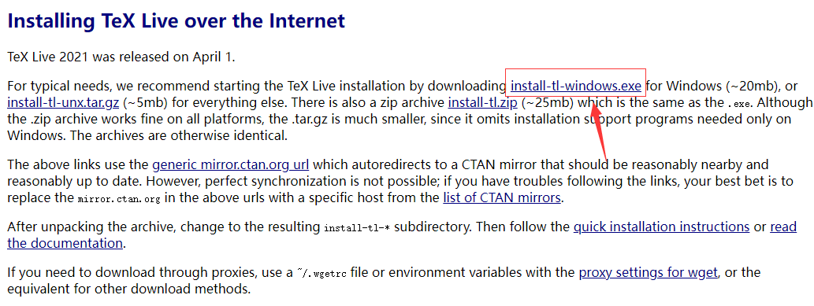
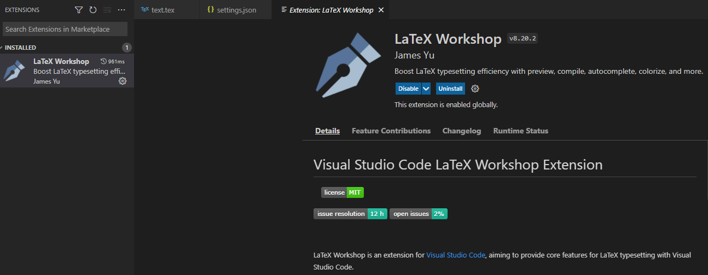
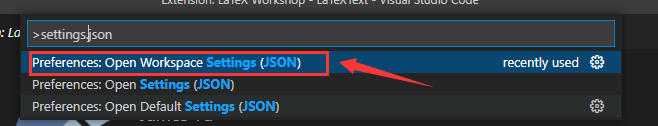

由于`LaTeX`是基于代码的文档排版，所以对非计算机类人员可能不太友好；所以建议新手先使用`overleaf在线编辑器`（[Overleaf, Online LaTeX Editor](https://www.overleaf.com/)）来书写LaTeX文档，可以参考博客`2021-10-09-【环境配置】使用LaTeX排版论文的简单教程`。

本地化书写`LaTeX`文档也有许多方式，例如最常见的`TeXstudio`，但是其安装需要若干G的内存；

我们将使用目前更高效的工具`VS Code`来配置书写`LaTeX`的环境。

# 一、安装TeX系统TeX Live

`LaTeX`基于`Tex`，所以使用`LaTeX`需要先安装`Tex引擎`。目前官方的`Tex`引擎就是`TeXLive`，它是由国际`TeX`用户组织 `TUG `(TeX User Group) 发布并维护的`TeX`系统，支持不同的操作系统平台，其Windows版本又称`fpTeX`， Unix/Linux 版本即著名的 `teTeX `。

## 1、下载安装包

通常有两种下载方式：

第1种方式是到[texlive官方](https://www.tug.org/texlive/)直接联网下载，通过链接获取 [window](https://link.zhihu.com/?target=http%3A//mirror.ctan.org/systems/texlive/tlnet/install-tl-windows.exe) 或者 [Linux](https://link.zhihu.com/?target=http%3A//mirror.ctan.org/systems/texlive/tlnet/install-tl-unx.tar.gz) 的下载文件；

第2种方式是到[清华镜像列表](https://link.zhihu.com/?target=https%3A//mirrors.tuna.tsinghua.edu.cn/CTAN/systems/texlive/Images/)、[中科大镜像列表]([Index of /CTAN/systems/texlive/Images/ (ustc.edu.cn)](https://mirrors.ustc.edu.cn/CTAN/systems/texlive/Images/)))、[HK镜像](https://link.zhihu.com/?target=https%3A//mirror-hk.koddos.net/CTAN/systems/texlive/Images/)通过直接下载ISO镜像。

作者是使用第1种方式，这里直接给出网址：https://link.zhihu.com/?target=https%3A//www.tug.org/texlive/acquire-netinstall.html

在该页面下载安装程序：




## 2、安装安装包

随后，按照步骤一步步安装即可，建议不要修改任何配置信息（包括安装目录），`安装过程比较漫长`（大约有6GB）。

# 二、配置VS Code的编译环境

## 1、安装软件VS Code

首先，需要安装 `Visual Studio Code` 软件。下载网址：[Visual Studio Code](https://link.zhihu.com/?target=https%3A//code.visualstudio.com/)。

按照安装文件的要求，完成安装即可。

## 2、安装插件LaTeX Workshop

打开 `VS Code`，选择左侧栏的`扩展选项`，搜索插件`LaTeX Workshop`，点击安装即可。




## 3、配置编译工具

经历上述步骤，已经可以正常编写` LaTeX `了。然而，为了更加适合我们的中文环境，可以修改` VS Code` 对应的配置文件。

点击`help/show all commands`，输入 `settings.json`，选择下图所示进入配置文件：




在两个花括号中间放入下面的代码，就可以将编译工具改成适合中文的` XeLaTeX`。

```C++
"latex-workshop.latex.tools": [
    {
        // 编译工具和命令
        "name": "xelatex",
        "command": "xelatex",
        "args": [
            "-synctex=1",
            "-interaction=nonstopmode",
            "-file-line-error",
            "-pdf",
            "%DOCFILE%"
        ]
    },
    {
        "name": "pdflatex",
        "command": "pdflatex",
        "args": [
            "-synctex=1",
            "-interaction=nonstopmode",
            "-file-line-error",
            "%DOCFILE%"
        ]
    },
    {
        "name": "bibtex",
        "command": "bibtex",
        "args": [
            "%DOCFILE%"
        ]
    }
],
```

为了方便将整个` LaTeX `工程进行编译（也就是生成 PDF），我们还需要导入`编译链`。

如果不导入会怎样呢？比如说，有的模板需要编译 bib 文件，否则就看不到参考文献。这时候如果没有编译链，就无法正常显示参考文献。而如果使用编译链（例如 `xe->bib->xe->xe`），就可以正常编译工程，生成 PDF 了。

配置编译链，可以将这些代码放在之前的代码下方：

```c++
"latex-workshop.latex.recipes": [
    {
        "name": "xelatex",
        "tools": [
            "xelatex"
        ],
    },
    {
        "name": "pdflatex",
        "tools": [
            "pdflatex"
        ]
    },
    {
        "name": "xe->bib->xe->xe",
        "tools": [
            "xelatex",
            "bibtex",
            "xelatex",
            "xelatex"
        ]
    },
    {
        "name": "pdf->bib->pdf->pdf",
        "tools": [
            "pdflatex",
            "bibtex",
            "pdflatex",
            "pdflatex"
        ]
    }
],
```

保存之后就可以了。

## 4、常见错误

### （1）编译时报错：Recipe terminated with fatal error: spawn xelatex ENOENT

该情况一般是系统变量设置不正确，只需要`texlive`安装完成后把`C:\texlive\2020\bin\win32`添加到了用户变量path中，重启vscode就可以

### （2）编译时报错：Reference `fig1' on page 2 undefined.

该情况一般是LaTex 编译时自动删除多余的文件，如果自动删除 .aux 文件，则 \ref{} 会报错； .out 文件被删除也会产生一个警告.

解决方案：

只需要在前文配置文件`settings.json`中添加如下代码就可以：

```c++
// LaTex 编译时自动删除多余的文件，如果自动删除 .aux 文件，则 \ref{} 会报错； .out 文件被删除也会产生一个警告
  "latex-workshop.latex.autoClean.run": "onBuilt", //注意结尾是 t 不是 d
  "latex-workshop.latex.clean.fileTypes": [
    // "*.aux",
    "*.bbl",
    "*.blg",
    "*.idx",
    "*.ind",
    "*.lof",
    "*.lot",
    // "*.out",
    "*.toc",
    "*.acn",
    "*.acr",
    "*.alg",
    "*.glg",
    "*.glo",
    "*.gls",
    "*.ist",
    "*.fls",
    "*.log",
    "*.fdb_latexmk"
  ]
```

