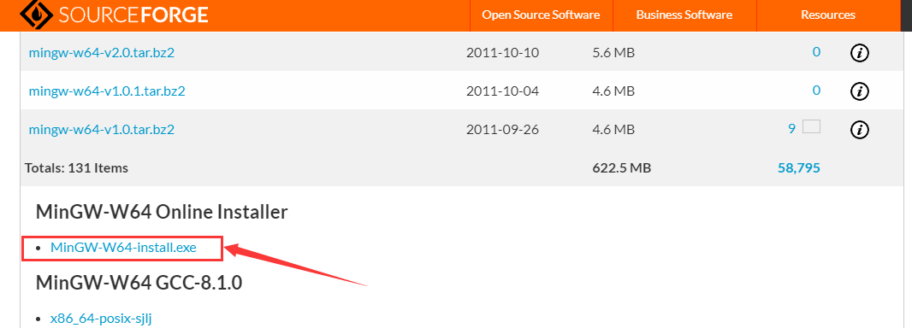
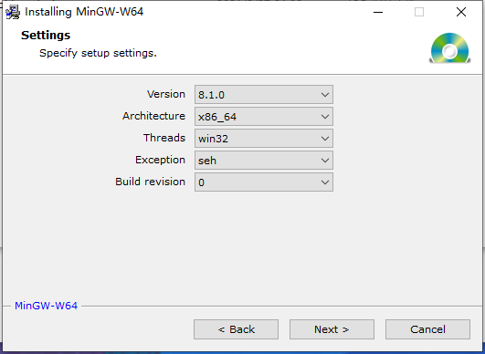
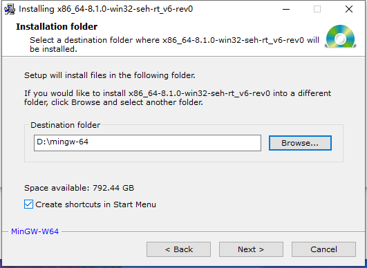
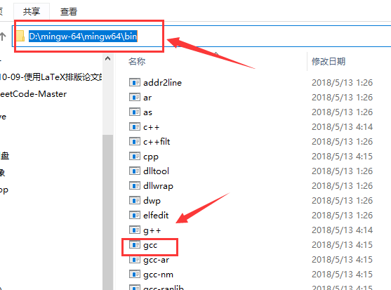
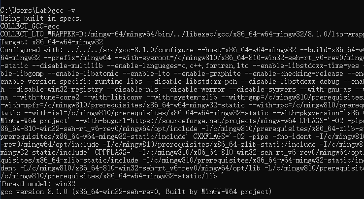
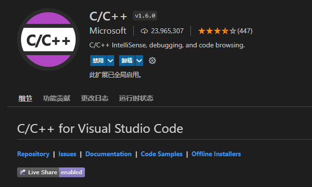
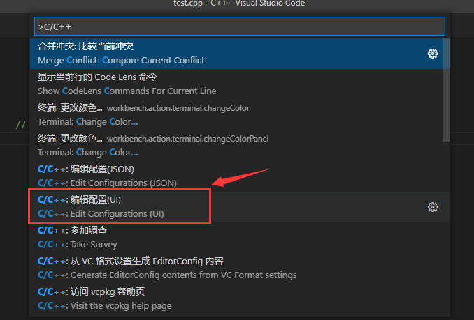
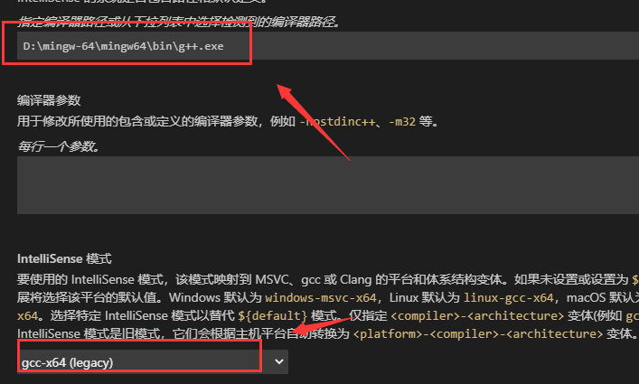

VS Code是一款微软出的轻量级文本编辑器，支持各大主流操作系统和非常多的主题和图标，它本身只是一款文本编辑器，所有的功能都以插件扩展的形式存在，想用什么功能就安装对应的扩展即可，非常方便。

# 一、安装MinGW编译器

MinGW 的全称是：Minimalist GNU on Windows 。它实际上是将经典的开源 C语言 编译器 GCC 移植到了 Windows 平台下，并且包含了 Win32API 。可以认为MinGW 就是 GCC 的 Windows 版本 。

## 1、下载安装包

MinGW-w64 的代码和可执行文件被托管存储在 SourceForge 上。MinGW-w64 为了适应各种操作系统，其组件会存在各种不同的版本。我们直接下载 MinGW-w64 的安装程序，它会按照我们的需要，自动下载适合的组件。

到[MinGW-w64 ](https://sourceforge.net/projects/mingw-w64/files/mingw-w64/mingw-w64-release/)直接联网下载，通过链接获取mingw-w64-install.exe:




## 2、安装安装包

运行mingw-w64-install.exe，根据提示继续，进入设置页面，如下：




> Version 指的是 gcc 的版本，如果没有特殊的需求，一般选择最高的版本号即可。
>
> Architecture 是指电脑系统是 32位 还是 64位，根据你的电脑系统做出对应选择，64位选择x86_64，32位选择 i686即可。
>
> Threads是选择操作系统接口协议类型，如果你只需要开发 Windows 程序，选择 win32 ，而开发 Linux、Unix、Mac OS 等其他操作系统下的程序，则需要选择 posix 。
>
> Exception是指异常处理模型，seh 性能比较好，但不支持 32位。 sjlj 稳定性好，支持 32位。
>
> Build revision选择默认即可。

接下来就是选择安装路径，可以自定义，注意不要路径中不要有任何中文字符和空格：





## 3、配置系统变量

安装完成后找到安装文件中gcc.exe程序：




最后打开系统变量设置页面加入该路径即可：

操作：右键点击“此电脑”，在弹出的菜单中点击红框中的“属性”项；点击“高级系统设置”链接，将打开“系统属性”窗口；点击“环境变量”按钮，打开“环境变量”窗口。

## 4、测试gcc

打开命令提示符窗口，输入“gcc -v” 并按回车键（Enter），如果成功显示 MinGW-w64 的组件列表说明前面的系统变量设置成功：




# 二、配置VS Code的编译环境

## 1、安装软件VS Code

首先，需要安装 `Visual Studio Code` 软件。下载网址：[Visual Studio Code](https://link.zhihu.com/?target=https%3A//code.visualstudio.com/)。

按照安装文件的要求，完成安装即可。

## 2、安装插件C/C++

打开 `VS Code`，选择左侧栏的`扩展选项`，搜索插件`C/C++`，点击安装即可。




## 3、配置编译工具

经历上述步骤，已经可以正常编写` LaTeX `了。然而，为了更加适合我们的中文环境，可以修改` VS Code` 对应的配置文件。

点击`help/show all commands`（Ctrl+Shift+P），输入 `C/C++`，选择“Edit Configurations(UI)”进入配置：





如果是编译c++程序则使用g++.exe,如果是编译c程序则使用gcc.exe：




最后生成` c_cpp_properties.json`。

```C++
{
    "configurations": [
        {
            "name": "Win32",
            "includePath": [
                "${workspaceFolder}/**"
            ],
            "defines": [
                "_DEBUG",
                "UNICODE",
                "_UNICODE"
            ],
            "windowsSdkVersion": "10.0.17763.0",
            "compilerPath": "D:\\mingw-64\\mingw64\\bin\\g++.exe",
            "cStandard": "c17",
            "cppStandard": "c++17",
            "intelliSenseMode": "gcc-x64"
        }
    ],
    "version": 4
}
```

继续生成tasks.json：

```c++
{
    // See https://go.microsoft.com/fwlink/?LinkId=733558 
    // for the documentation about the tasks.json format
    "version": "2.0.0",
    "tasks": [
        {
            "type": "shell",
            "label": "g++.exe build active file",//任务的名字，就是刚才在命令面板中选择的时候所看到的，可以自己设置
            "command": "D:/mingw-64/mingw64/bin/g++.exe",
            "args": [//编译时候的参数
                "-g",//添加gdb调试选项
                "${file}",
                "-o",//指定生成可执行文件的名称
                "${fileDirname}\\${fileBasenameNoExtension}.exe"
            ],
            "options": {
                "cwd": "D:/mingw-64/mingw64/bin"
            },
            "problemMatcher": [
                "$gcc"
            ],
            "group": {
                "kind": "build",
                "isDefault": true//表示快捷键Ctrl+Shift+B可以运行该任务
            },
            "presentation": { 
                "panel": "new" //默认为“shared“表示共享，改成new之后每个进程创建新的端口
            }
        }
    ]
}
```

继续生成launch.json：

```c++
{
    // 使用 IntelliSense 了解相关属性。 
    // 悬停以查看现有属性的描述。
    // 欲了解更多信息，请访问: https://go.microsoft.com/fwlink/?linkid=830387
    "version": "0.2.0",
    "configurations": [
        {
            "name": "(gdb) Launch",
            "preLaunchTask": "g++.exe build active file",//调试前执行的任务，就是之前配置的tasks.json中的label字段
            "type": "cppdbg",//配置类型，只能为cppdbg
            "request": "launch",//请求配置类型，可以为launch（启动）或attach（附加）
            "program": "${fileDirname}\\${fileBasenameNoExtension}.exe",//调试程序的路径名称
            "args": [],//调试传递参数
            "stopAtEntry": false,
            "cwd": "${workspaceFolder}",
            "environment": [],
            "externalConsole": true,//true显示外置的控制台窗口，false显示内置终端
            "MIMode": "gdb",
            "miDebuggerPath": "D:\\mingw-64\\mingw64\\bin\\gdb.exe",
            "setupCommands": [
                {
                    "description": "Enable pretty-printing for gdb",
                    "text": "-enable-pretty-printing",
                    "ignoreFailures": true
                }
            ]
        }
    ]
}
```

## 4、编译程序

按F5调试程序并且生成.exe程序，如果exe文件出现闪退（在Windows系统中比较常见），可以在代码中添加暂停语句：

```c++
int main() {
    cout<<"hello world!"<<endl;
    system("pause");

    return 0;
}
```

在终端继续输入执行exe程序即可。

