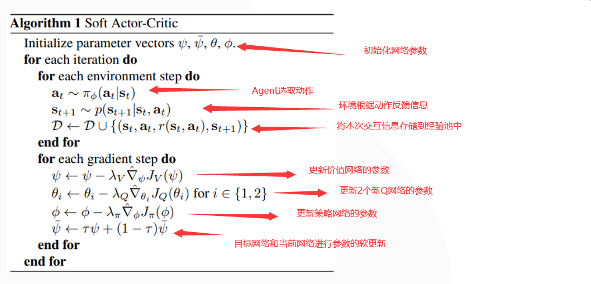
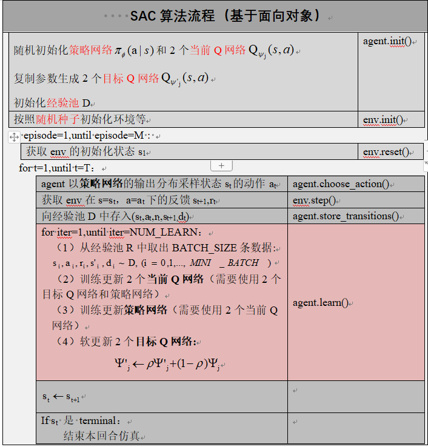

---

layout:     post
title:      「强化学习」SAC算法及其简易实现
subtitle:   基于PyTorch框架
date:       2021-10-19
author:     MRL Liu
header-img: img/the-first.png
toc: true
math: true
categories: 强化学习
tags:
    - 强化学习
---

SAC（Soft Actor-Critic）算法的中文全称是***软演员-批评家***，该算法的原始论文是2018年在ICML会议上发表的《Soft Actor-Critic:Off-Policy Maximum Entropy Deep Reinforcement Learning with a Stochastic Actor》，论文中文名称是《软演员-批评家：随机演员的离线策略的最大熵深度强化学习》。

# 一、SAC算法的主要特点

如其名，从SAC论文名称中，我们可以知道这个算法基本由这几个关键点组成：Actor-Critic、Off-Policy和Maximum Entropy。

| ***重要概念***  | ***介绍***                                        | ***主要作用***                             |
| --------------- | ------------------------------------------------- | ------------------------------------------ |
| Actor-Critic    | 目前主流RL算法的通用框架，源自策略迭代思想。      | 该架构有利于使用深度学习技术设计策略迭代   |
| Off-Policy      | 目前主流RL算法的常见形式，与之相对应的是on-Policy | 有利于从数据中学习策略                     |
| Maximum Entropy | 较少接触                                          | 可能是提升探索的随机性，不利于陷入次优策略 |

 那么什么是最大熵呢？我们可以看下以下概念：

| ***重要概念*** | ***相关解释***                                               | ***备注***                                                   |
| -------------- | ------------------------------------------------------------ | ------------------------------------------------------------ |
| 熵             | 熵定义为信息量的期望。用来描述随机变量的不确定性的度量。     | 随机变量不确定性越大时，熵越大；随机变量是确定值，则它的熵为零。 |
| 最大熵         | 当随机变量取每一种可能值的概率相等时熵最大，即随机事件服从均匀分布 | 在满足已知知识或者限定条件下，对未知的最好推断是随机不确定性的各随机变量等概率。 |
| SAC中的最大熵  | 在满足最大化回报的同时最大化熵，即动作的取值尽可能相等，从而提升算法的探索能力。 | 在满足限定条件下（获得足够多的回报），对未知状态空间等概率随机探索。 |

假设P是关于随机变量x的一个概率分布，那么x的熵为：
$$
\mathrm{H}(P)=\underset{\mathrm{x}\sim \mathrm{P}}{\mathrm{E}}[-\log P(x)]
$$
在SAC提出之前，主流RL算法在处理连续动作空间的复杂RL问题时都存在着以下两类缺陷：

| ***缺陷类型***                                 | ***详细描述***                                               | ***相关举例***                                               | ***SAC解决思路***                            |
| ---------------------------------------------- | ------------------------------------------------------------ | ------------------------------------------------------------ | -------------------------------------------- |
| 算法采样效率低，需要长时间的训练               | 由于每一次策略更新都需要在当前策略下重新采样足够多的样本数，完全抛弃之前的采样数据，需要非常高的样本数以及样本复杂性才能保证收敛。 | 主要为TRPO/PPO/A3C等On-Policy方法的不足，稳定性高，但是需要不断采样 | 使用off-policy的更新机制，不断复用之前的经验 |
| 算法难收敛，对超参数极其敏感，容易陷入次优策略 | 虽然使用Replay Buffer解决了样本利用效率问题，但是策略与Q-value相互耦合，使其性能不稳定，容易受超参的影响。 | 主要为DDPG/D4PG等Off-Policy方法的不足。                      | 利用最大熵增加算法的随机探索能力             |

# 二、SAC算法的主要机制

## 1、SAC算法中的网络

​		SAC中使用了双网络机制和软更新机制。

***什么是双网络机制？***   

​        双网络机制就是将一类网络分为当前网络和目标网络，当前网络用来计算当前状态（和动作）的映射值，目标网络用来计算后继状态（和后继动作）的映射值，这种设计可以缓和数据的相关性。（该思想来自于Nature DQN）

***软更新和硬更新的区别？***   

​        当前网络和目标网络结构一致，参数在不同时刻可能不一致，目标网络的参数由当前网络的参数复制而来。如果每次复制部分参数，那么就是软更新，如果每次复制全部参数，那么就是硬更新。（硬更新来自于Nature DQN，软更新来自于DDPG）

​		SAC中共有2类网络：策略网络和评价网络（Q网络），每个Q网络都使用了双网络机制，所以总共使用了5个网络。

***为什么要使用两个Q网络？***

​    策略网络负责选取动作，可视为Actor；Q网络负责评价动作好坏，可视为Critic。使用两个Q网络是为了减少Q网络的过估计，取最小Q值。（该思想来自于TD3算法中的clipped double-Q trick）。

## 2、SAC算法中的符号表示

基于SAC最大熵的RL基础公式解析：

| 相关概念 | 相关解释                                                     | 符号表示                                                     |
| -------- | ------------------------------------------------------------ | ------------------------------------------------------------ |
| 策略     | 关于动作a的概率分布函数                                      |  |
| 策略的熵 | 关于策略的函数 |  |
| 目标函数 | 关于策略的长期回报与熵的期望函数 |  |
| 最优策略 |  |                                                              |
| 价值函数 | 在状态s时的长期回报与熵的期望函数                            |  |
| Q函数    | 在状态s采取动作a时的长期回报与熵的期望函数                   |  |

SAC中的神经网络解析：

| **网络种类** | ***连续设置下的符号表示***  | 输入输出                                                     | **离散设置下的符号表示** | 输入输出                                                     | ***参数更新机制*** |
| ------------ | --------------------------- | ------------------------------------------------------------ | ------------------------ | ------------------------------------------------------------ | ------------------ |
| 当前策略网络 | $\pi_{\phi}(a \mid s)$      | 输入当前状态或者后继状态；输出均值mu，标准差std来构建高斯分布采样动作 | $\pi_{\phi}(s)$          | 输入当前状态或者后继状态；输出n个动作的categorical distribution（例如softmax得到） | 反向传播训练       |
| 当前Q网络1   | $Q_{\psi_{1}}(s, a)$        | 输入当前状态和当前动作；输出当前Q值                          | $Q_{\psi_{1}}(s)$        | 输入当前状态；输出每个动作的Q值                              | 反向传播训练       |
| 目标Q网络1   | $Q_{\hat{\psi} _{1}}(s, a)$ | 输入后继状态和后继动作，输出目标Q值的计算必需量              | $Q_{\hat{\psi} _{1}}(s)$ | 输入后继状态，输出目标Q值的计算必需量                        | 软（硬）更新       |
| 当前Q网络2   | $Q_{\psi_{2}}(s, a)$        | 输入当前状态和当前动作；输出当前Q值                          | $Q_{\psi_{2}}(s)$        | 输入当前状态；输出每个动作的Q值                              | 反向传播训练       |
| 目标Q网络2   | $Q_{\hat{\psi} _{2}}(s, a)$ | 输入后继状态和后继动作，输出目标Q值的计算必需量              | Q_{\hat{\psi} _{2}}(s)$  | 输入后继状态，输出目标Q值的计算必需量                        | 软（硬）更新       |

## 3、SAC算法中的损失函数和软更新

### （1）策略网络的损失函数

反向更新当前策略网络

|          | 连续设置                                                     | 离散设置                                                     |
| -------- | ------------------------------------------------------------ | ------------------------------------------------------------ |
| 动作概率 | $a \sim \pi_{\phi}\left(a \mid s_{i}\right)\Leftrightarrow a=\tanh \left(\mu_{\phi}\left(s_{i}\right)+\sigma_{\phi}\left(s_{i}\right) \Theta \xi\right)\text { 其中,} \quad \xi \sim \mathrm{N}(0, I)$ | $a=\pi_{\phi}\left( s_{i}\right)$                            |
| 最小Q值  | $\min _{j=1,2} Q_{\psi_{j}}\left(s_{i}, a\right)$            | $\min _{j=1,2} Q_{\psi_{j}}\left(s_{i}, a\right)$            |
| 策略的熵 | $H\left(\pi_{\phi}\left(a \mid s_{\mathrm{i}}\right)\right)=-\alpha \log \left(\pi_{\phi}\left(a \mid s_{\mathrm{i}}\right)\right)$ | $H\left(\pi_{\phi}\left( s_{\mathrm{i}}\right)\right)=-\alpha \log \left(\pi_{\phi}\left(s_{\mathrm{i}}\right)\right)$ |
| 损失函数 | $\mathrm{L}=-\sum_{\mathrm{i}=0}^{\text {MINI BATCH }} \mathrm{E}_{s_{i} \in \mathrm{D}}\left[\min _{j=1,2} Q_{\psi_{j}}\left(s_{i}, a\right)+H\left(\pi_{\theta}\left(a \mid s_{i}\right)\right)\right]$ | $\mathrm{L}=-\sum_{\mathrm{i}=0}^{\text {MINI BATCH }} \mathrm{\pi_{\phi}\left( s_{i}\right)}_{s_{i} \in \mathrm{D}}\left[\min _{j=1,2} Q_{\psi_{j}}\left(s_{i}, a\right)+H\left(\pi_{\theta}\left(a \mid s_{i}\right)\right)\right]$ |

### （2）评价网络的损失函数

反向更新2个当前Q网络

|                    | 连续设置                                                     | 离散设置                                                     |
| ------------------ | ------------------------------------------------------------ | ------------------------------------------------------------ |
| 后继状态的目标动作 | $a^{\prime} \sim \pi_{\phi}\left(a^{\prime} \mid s^{\prime}_{i}\right)\Leftrightarrow a^{\prime}=\tanh \left(\mu_{\phi}\left(s^{\prime}_{i}\right)+\sigma_{\phi}\left(s^{\prime}_{i}\right) \Theta \xi\right)\text { 其中,} \quad \xi \sim \mathrm{N}(0, I)$ | $a^{\prime} = \pi_{\phi}\left(s^{\prime}_{i}\right)$         |
| 策略的熵           | $H\left(\pi_{\phi}\left(a^{\prime} \mid s^{\prime}_{\mathrm{i}}\right)\right)=-\alpha \log \left(\pi_{\phi}\left(a^{\prime} \mid s^{\prime}_{\mathrm{i}}\right)\right)$ | $H\left(\pi_{\phi}\left( s^{\prime}_{\mathrm{i}}\right)\right)=-\alpha \log \left(\pi_{\phi}\left(s^{\prime}_{\mathrm{i}}\right)\right)$ |
| 计算目标Q值        | $\mathrm{y}_{\mathrm{i}}=\mathrm{r}\left(s_{\mathrm{i}}, a_{\mathrm{i}}\right)+\gamma\left(1-d_{\mathrm{i}}\right)\left(\min _{i=12} Q_{\psi^{\prime}}\left(s_{\mathrm{i}}^{\prime}, a^{\prime}\right)+H\left(\pi_{\phi}\left(a^{\prime} \mid s_{\mathrm{i}}^{\prime}\right)\right)\right)$ | $\mathrm{y}_{\mathrm{i}}=\mathrm{r}\left(s_{\mathrm{i}}, a_{\mathrm{i}}\right)+\gamma\left(1-d_{\mathrm{i}}\right)\left(\min _{i=12} Q_{\psi^{\prime}}\left(s_{\mathrm{i}}^{\prime}, a^{\prime}\right)+H\left(\pi_{\phi}\left(a^{\prime} \mid s_{\mathrm{i}}^{\prime}\right)\right)\right)$ |
| 损失函数L1         | $\left.\mathrm{L}_{1}=\sum_{\mathrm{i}=0}^{\mathrm{MINI}} \mathrm{EATCH}_{\left(s_{i}, a_{1}, \mathrm{r}_{1}, \mathrm{~d}_{\mathrm{i}}\right) \in \mathrm{D}}\left[\frac{1}{2}\left(\mathrm{y}_{i}-\mathrm{Q}_{\psi_{1}}\left(s_{\mathrm{i}}, a_{\mathrm{i}}\right)^{2}\right)\right)\right]$ | $\left.\mathrm{L}_{1}=\sum_{\mathrm{i}=0}^{\mathrm{MINI}} \mathrm{EATCH}_{\left(s_{i}, a_{1}, \mathrm{r}_{1}, \mathrm{~d}_{\mathrm{i}}\right) \in \mathrm{D}}\left[\frac{1}{2}\left(\mathrm{y}_{i}-\mathrm{Q}_{\psi_{1}}\left(s_{\mathrm{i}}, a_{\mathrm{i}}\right)^{2}\right)\right)\right]$ |
| 损失函数L2         | $\left.\mathrm{L}_{2}=\sum_{\mathrm{i}=0}^{\mathrm{MINI}} \mathrm{EATCH}_{\left(s_{i}, a_{1}, \mathrm{r}_{1}, \mathrm{~d}_{\mathrm{i}}\right) \in \mathrm{D}}\left[\frac{1}{2}\left(\mathrm{y}_{i}-\mathrm{Q}_{\psi_{2}}\left(s_{\mathrm{i}}, a_{\mathrm{i}}\right)^{2}\right)\right)\right]$ | $\left.\mathrm{L}_{2}=\sum_{\mathrm{i}=0}^{\mathrm{MINI}} \mathrm{EATCH}_{\left(s_{i}, a_{1}, \mathrm{r}_{1}, \mathrm{~d}_{\mathrm{i}}\right) \in \mathrm{D}}\left[\frac{1}{2}\left(\mathrm{y}_{i}-\mathrm{Q}_{\psi_{2}}\left(s_{\mathrm{i}}, a_{\mathrm{i}}\right)^{2}\right)\right)\right]$ |

### （3）评价网络的软更新公式

软更新2个目标Q网络
$$
\Psi_{j}^{\prime} \leftarrow \rho \Psi_{j}^{\prime}+(1-\rho) \Psi_{j}
$$

## 4、SAC算法中的主要流程

SAC原始论文中的算法流程：

注意：价值网络在SAC后续的改进算法中已经被舍弃，所以这里我们不再讨论它

为了便于理解，我们使用面向对象思想将其进行改造：

# 三、SAC算法的总结

SAC算法的实验结果，在复杂的连续动作空间RL任务中表现出色，而且更加稳定，比较敏感的超参数是控制熵的超参数-奖励尺度，奖励尺度较小时，策略的平均回报趋于一致;

奖励尺度较大时，策略的学习效率会变快，但是也容易陷入次优结果。平滑常数τ是RL算法的超参数，SQL也不例外；但是平滑常数τ在SQL中不是很敏感，合适值范围较广，原论文使用了0.005用于了所有的任务都效果较好。
