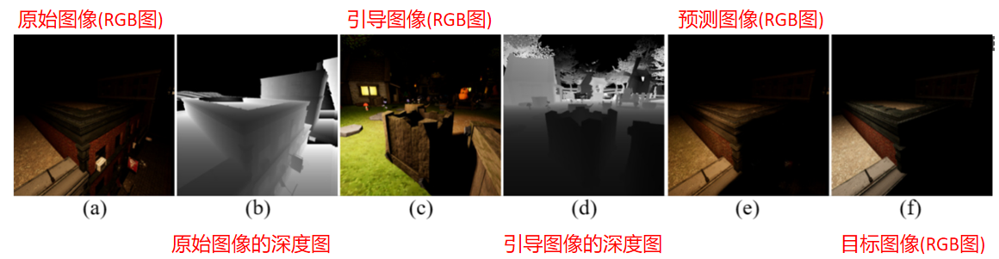
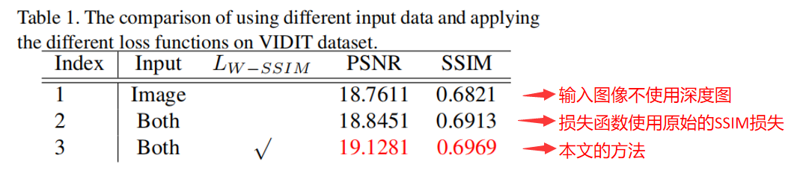
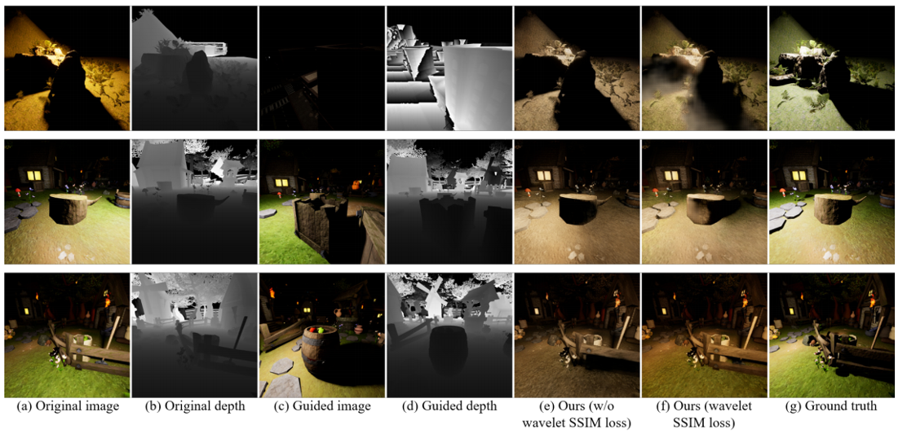
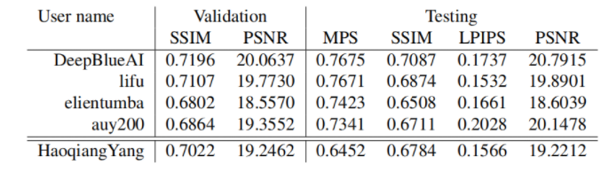
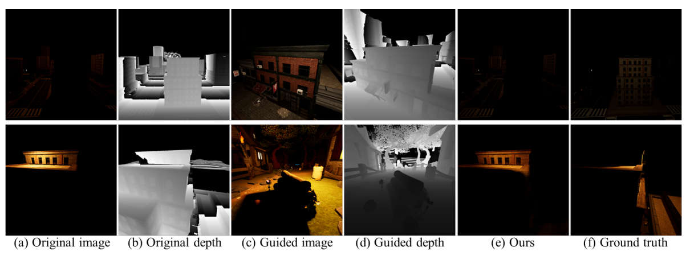

---

layout:     post
title:      「论文分享」S3net：深度引导图像重照明的单流结构
subtitle:   CVPRW 2021
date:       2021-11-04
author:     WJ
header-img: img/post-bg-hacker.png
catalog: true
tags:
    - 论文分享
---

​		《S3Net: A Single Stream Structure for Depth Guided Image Relighting》是来自中国台湾的Hao-Hsiang Yang等人发表在CVPR 2021（CCF推荐的A类会议）上的一篇WorkShip论文，这里是[原文链接](https://openaccess.thecvf.com/content/CVPR2021W/NTIRE/papers/Yang_S3Net_A_Single_Stream_Structure_for_Depth_Guided_Image_Relighting_CVPRW_2021_paper.pdf)和[原文代码](https://github.com/dectrfov/NTIRE-2021-Depth-Guided-Image-Any-to-Any-relighting)。

# 摘要

​		深度引导（Depth guided）的任意到任意（ any-to-any）图像重光照的目的是通过原始图像和相应的深度图生成重照明的图像，来匹配给定引导图像及其深度图的照明设置。 据该文所称，这项任务是一个在以前的文献中没有提及过的新挑战。 

​		为了解决这个问题，该文提出了一种基于深度学习的单流结构的神经网络，称为S3Net。 该网络是一个编码器-解码器（ encoder-decoder）模型，其输入是 原始图像、引导图像和相应的深度图，共计4张图（2张RGB图+2张深度图）。 该网络的特点是向解码器部分中加入了注意力模块和增强模块，用来关注引导图像中与重照明相关的区域。

​		最终的实验表明，该论文提出的模型在竞赛（the NTIRE 2021 Depth Guided Any-to-any Relighting Challenge）中实现了第三高的SSIM。

## 一、简介

​		图像重照明是一项新兴且关键的技术，其在可视化、图像编辑和增强现实 (AR) 中的具有较大应用潜力，例如为第一人称和第三人称游戏渲染具有各种环境照明条件的图像。该文的目的是解决深度引导的any to any的重光照任务，该任务的特点是用深度图引导图像的照明设置来重新照明输入图像。这里给出一组图像说明：

### 1、any-to-any重光照任务和风格转换的异同点：

| 任务类型             | 相同点                                 | 不同点                                                       |
| -------------------- | -------------------------------------- | ------------------------------------------------------------ |
| 风格迁移             | 输入是原始图像和引导图像               | 风格迁移一般侧重于纹理渲染                                   |
| （any to any）重光照 | 输入是原始图像和引导图像（及其深度图） | 需要去除原始图像的阴影，并且在预测图像中生成新的阴影，风格转换一般做不到这点 |

### 2、any-to-any重光照任务的相关研究

​		因为深度卷积神经网络 (CNN) 在许多计算机视觉任务中取得了成功，而且之前的重光照方法都直接使用CNN并遵循端到端（end-to-end）的方式直接生成重光照图像（没有假定任何物理先验），受这些方法的启发，该文依旧使用深度学习网络来解决深度引导的任意对任意重照明任务。

| **作者年份**                    | **论文题目**                                                 | **主要贡献** |
| ------------------------------- | ------------------------------------------------------------ | ------------ |
| Puthussery和Kuriakose等人，2020 | WDRN: A wavelet decomposed relightnet for image relighting   | 2            |
| Hu和Huang等人 ,ECCV，2020       | SA-AE for any-to-any relighting                              | 3            |
| Guo和Liao等人，BMVC，2019       | Deep learning fusion of rgb and depth images for pedestrian detection | 4            |
| Xu和Sunkavalli等人, ToG，2018   | Deep image-based relighting from optimal sparse samples      | 5            |
| Yang和Chen等人，CVPRW，2021     | Multi modal bifurcated network for depth guided image relighting | 6            |

​		与传统的图像重光照任务不同，该文使用了NTIRE 2021竞赛中提供的额外的深度图，这有利于模型学习场景的物理空间表示。 

​		该文在解码器部分使用了多尺度特征提取器和注意力机制，多尺度特征提取器 可用于增加感受野并整合粗到细的表示，有必要采用这个模块，因为重光照图像包含各种尺度的对象；注意力机制可以分配特征图权重来放大局部区域的特征，由于重光照图像包含方向信息，使用注意力机制有利于模型学习方向的特征表示。

​		该文在 VIDIT 数据集上测试了我们提出的方法，多个实验表明，所提出的 S3Net 在 NTIRE 2021 深度引导任意对任意重新照明挑战中实现了第三高的 SSIM 和 MPS。

​		笔者认为该文的创新点或贡献如下：

1、提出了一个单流结构网络 (S3Net)处理any to any重光照任务

2、为了设计一个高效的图像重照明网络，在解码器部分加入了注意力模块和增强模块

3、为了进一步优化模型，该文在目标函数上使用了结合了离散小波变换（DWT）理论的多尺度损失函数，提升了准确性。

# 二、相关工作

## 1、带有深度图的图像处理

​       与传统的只使用RGB图像的计算机视觉任务不同，使用额外的深度信息可以提高许多计算机视觉任务的准确性，当与 RGB 图像结合使用时，深度图已被证明是提供几何和空间信息的有用提示。

​	   2019年Guo和Liao等人的《Deep learning fusion of rgb and depth images for pedestrian detection》，提出了 Faster RCNN模型来解决行人检测问题，该工作证明可以利用深度图来细化从 RGB 图像中提取的卷积特征， 而且可以在深度信息的帮助下探索透视投影，从而实现更准确的区域建议。

​	   2020年Chen和Lin等人的ECCV上的《Bi-directional cross-modality feature propagation with separation-and-aggregation gate for rgb-d semantic segmentation》中，提出了一种统一且高效的跨模态引导的语义分割编码器。 这种结构在跨模态聚合之前联合过滤和重新校准两种表示。 同时，引入了双向多步传播策略以有效融合两种模态之间的信息。  

​		为了有效地提取 RGB 图像和深度特征，最流行的方法是使用双流主干网络的结构，如下相关研究： 

| **作者年份**             | **论文题目**                                                 | **主要贡献**                        |
| ------------------------ | ------------------------------------------------------------ | ----------------------------------- |
| Pang和Zhang等人，2020    | Hierarchical dynamic filtering network for rgb-d salient object detection | 使用双流主干，输入为RGB图像和深度图 |
| Chen和Fu等人 ,ECCV，2020 | Progressively guided alternate refinement network for rgb-d salient object detection | 使用双流主干，输入为RGB图像和深度图 |

​		然后，VIDIT 数据集中重光照图像的大小和相应的深度图非常大（1024×1024），且每次输入都是两个RGB图像和两个深度图，所以这种输入会在双主干网络结构中造成巨大的计算负担，而且论文作者认为重光照图像包含光源方向信息，这不适合在训练期间将大图像裁剪为小块， 所以该文设计了一个单一的流结构来联合提取深度和图像特征。

## 2、基于深度学习的图像重光照

​        在NTIRE 2021的竞赛规则中，有两种重光照任务设置：

| **作者年份**     | **论文题目**                         | **相关研究**                                                 |
| ---------------- | ------------------------------------ | ------------------------------------------------------------ |
| one-to-one重光照 | 光源方向和光源色温是预先定义的       | 《WDRN: A wavelet decomposed relightnet for image relighting》、《Multi modal bifurcated network for depth guided image relighting》 |
| any-to-any重光照 | 光源方向和光源色温是基于一张引导图像 | 《SA-AE for any-to-any relighting》                          |

​		由于都是图像到图像的转换任务，重光照任务似乎与其他低级计算机视觉任务非常相似，例如图像去雾 、图像烟雾去除、图像去雪、反射去除和水下图像增强等，但是与它们不同的是，重光照任务包含光源方向和色温的信息，需要在预测图像中估计物体的阴影。 

​		图像到图像的转换任务经常使用编码器-解码器架构，其中U-net [22, 23] 是最流行的图像到图像转换任务网络：

| **作者年份**                   | **论文题目**                                                 | **主要贡献**                                       |
| ------------------------------ | ------------------------------------------------------------ | -------------------------------------------------- |
| Ronneberger和Fischer等人，2015 | 《U-net: Convolutional networks for biomedical image segmentation》 | 提出了用于生物医学图像语义分割的卷积神经网络：Unet |
| Hu和Shen等人，CVPR，2018       | 《Squeeze-and-excitation networks》                          | 提出了通道注意力模块（CAM）                        |

​		Unet结构不仅包括编码器-解码器结构，还包括跳跃连接，它将从编码器到解码器具有相同大小的特征连接起来。 例如，Puthussery 等人 [2] 提出了一种用于图像重光照的离散小波分解重光照网络。 

## 3、离散小波变换（Wavelet Transform）

​        1999年Elsevier等人的论文《A wavelet tour of signal processing》提出了离散小波变换（DWT），该操作可以将图像分解为不同频率间隔的各种小块，可以替代现有的下采样操作，如最大池化或平均池化。 因此，许多计算机视觉任务应用 DWT 来减少特征图并实现多尺度特征，如下：

​		2019年ICIP上的《Wavelet U-net and the chromatic adaptation transform for single image dehazing》；

​		2020年ECCV上的《WDRN: A wavelet decomposed relightnet for image relighting》 。

​		2020年的CASSP上的《Y-net: Multiscale feature aggregation network with wavelet structure similarity loss function for single image dehazing》利用 DWT 来设计目标函数来测量真实图像和预测图像之间的相似性。受该工作的启发，该文也在损失函数中结合了 DWT，使其网络可以学习多尺度表示。

## 4、注意力机制

​        注意机制在人类感知系统和深度学习任务中都起着重要作用。注意机制提供特征图或某些序列权重，以便可以放大区域或位置的特征。 具体来说，对于计算机视觉任务，注意力机制分为空间注意力和通道注意力。 前者在空间上利用权重来细化特征图，后者计算全局平均池化特征以实现通道注意力。 		在本文中，我们的模型利用了这两种注意力机制来进一步提高网络的性能。

| **作者年份**              | **论文题目**                                                 | **主要贡献**                             |
| ------------------------- | ------------------------------------------------------------ | ---------------------------------------- |
| Mnih和Heess 等人，2014    | 《Recurrent models of visual attention》                     | 空间注意力                               |
| Hu和Shen等人，CVPR，2018  | 《Squeeze-and-excitation networks》                          | 通道注意力                               |
| Yang等人，ECCV，2020      | 《Wavelet channel attention module with a fusion network for single image deraining》 | 通道注意力，注意力机制应用于图像增强领域 |
| Hu和Huang等人 ,ECCV，2020 | 《SA-AE for any-to-any relighting》                          | 空间注意力                               |

# 三、方法

## 1、网络模型

​			该文的整个网络模型的输入是原始RGB图（1024x1024x3）、原始深度图（1024x1024x1）、引导RGB图（1024x1024x3）和引导深度图（1024x1024x1）连接在一起形成的8通道张量（1024x1024x8），输出的是3通道的预测RGB图（1024x1024x3）。

​			本文提出的 S3Net 的架构如下图所示。该网络基于***《Knowledge transfer dehazing network for nonhomogeneous dehazing》***，包含编码器和解码器部分。 

​		【编码器】该文使用***《Res2net: A new multi-scale backbone architecture》***提出的Res2Net101网络主干作为编码器，因为Res2Net 可以在粒度级别表示多尺度特征，并增加每个网络层的感受野范围，输入通过主干后可以实现多尺度特征提取。该文的工作在Res2Net做了如下修改：

- 修改第一个卷积使网络可以使用8 通道张量作为输入；
- 丢弃网络最后的全连接层，使最终输出的特征图的大小为 16分之一 ；
- 编码器的初始权重是用 ImageNet 训练的预训练参数，底部特征使用跳跃连接连接到解码器。

​       【解码器】解码器由卷积堆栈组成，以细化特征图。

​		 利用注意力模块（Attention，P）来细化中间特征。 注意模块由残差层 （residual layer）***《Deep residual learning for image recognition》***、空间注意力模块（SAM）***《Recurrent models of visual attention》*** 和通道注意力模块（CAM）***《Squeeze-and-excitation networks》*** 组成。

​		 利用像素混洗（Pixel shuffle，P）***《Real-time single image and video super-resolution using an efficient subpixel convolutional neural network》***和转置卷积（Transposed convolution，T）***《Pixel transposed convolutional networks》***来放大特征图。

​		此外，受***《Enhanced pix2pix dehazing network》***的启发，该文章在 S3Net 中添加了增强模块。 增强模块利用不同步幅的平均池化来改变特征图和感受野的大小，这对于提取多尺度特征是有效的。 最后，应用上采样来恢复减少的特征图，并将所有特征图拼接起来。 

​		【跳跃连接】众所周知，类 U-Net 结构在许多任务中是有益的，例如图像去雾（《PMS-net: Robust haze removal based on patch map for single images》，《PMHLD: patch map-based hybrid learning dehazenet for single image haze removal》） 和语义分割 （***《U-net: Convolutional networks for biomedical image segmentation》***）。 它的跳跃连接鼓励特征重用。 因此S3Net 中也采用跳跃连接将来自主干的最后三个特征图合并到它们对应的特征图。

## 2、损失函数

​		该文章的S3Net一共使用了三个损失函数，其整体损失如下：
$$
L_{\text {Total }}=\lambda_{1} L_{\text {cha }}+\lambda_{2} L_{W-S S I M}+\lambda_{3} L_{P e r}
$$
​		其中 $\lambda_{1}$、$\lambda_{2}$ 和$\lambda_{3}$ 是缩放系数，用于调整三个分量的相对权重。

### （1）Charbonnier 损失

​		该损失函数来自于《A general and adaptive robust loss function》，其可以看做是一个高鲁棒性的L1损失函数，该损失函数可以还原全局结构并且可以更鲁棒地处理异常值，其公式如下：
$$
L_{C h a}(I, \hat{I})=\frac{1}{T} \sum_{i}^{T} \sqrt{\left(I_{i}-\hat{I}_{i}\right)^{2}+\epsilon^{2}}
$$
​       其中$I$ 和$\hat{I}$ 分别代表目标图像和该文网络输出的预测图像， $\epsilon$被视为一个微小的常数（例如）,用$10^{-6}$来实现稳定和鲁棒的收敛。

### （2）SSIM 损失

​		该损失函数来自于《Loss functions for image restoration with neural networks》 ，其能够重建局部纹理和细节。 可以表示为： 
$$
L_{S S I M}(I, \hat{I})=-\frac{\left(2 \mu_{I} \mu_{\hat{I}}+C_{1}\right)\left(2 \sigma_{I \hat{I}}+C_{2}\right)}{\left(\mu_{I}^{2}+\mu_{\hat{I}}^{2}+C_{1}\right)\left(\sigma_{I}^{2}+\sigma_{\hat{I}}^{2}+C_{2}\right)}
$$
​		 其中 σ 和 µ 表示图像的标准偏差、协方差和均值。 

​		在图像重照明任务中，为了从原始图像中去除阴影，该文扩展了 SSIM 损失函数，以便使网络可以恢复更详细的部分。 

​		该文使用《Y-net: Multiscale feature aggregation network with wavelet structure similarity loss function for single image dehazing》 中的方法将 DWT 组合到 SSIM 损失中，这有利于重建重光照图像的清晰细节。最初，DWT 将预测图像分解为四个不同的小sub-band图像。 操作可以表示为：
$$
\hat{I}^{L L}, \hat{I}^{L H}, \hat{I}^{H L}, \hat{I}^{H H}=\operatorname{DWT}(\hat{I})
$$

​       其中上标表示来自各个过滤器的输出（例如，$$\hat{I}^{L L}, \hat{I}^{L H}, \hat{I}^{H L}, \hat{I}^{H H}$$）。

​       $$\hat{I}^{H L}, \hat{I}^{L H}, \hat{I}^{H H}$$分别是水平边缘、垂直边缘和角点检测的高通滤波器。  fLL 被视为下采样操作。 此外，DWT 可以不断分解$$\hat{I}^{L L}$$ 以生成具有不同尺度和频率信息的图像。 这一步写成： 
$$
\hat{I}_{i+1}^{L L}, \hat{I}_{i+1}^{L H}, \hat{I}_{i+1}^{H L}, \hat{I}_{i+1}^{H H}=\operatorname{DWT}\left(\hat{I}_{i}^{L L}\right)
$$
​       其中下标 i 表示第 i 次 DWT 迭代的输出。 上述 SSIM 损失项是根据原始图像对和各种子带图像对计算得出的。  SSIM损失和DWT的融合整合为：
$$
\begin{array}{l}
L_{W-S S I M}(I, \hat{I})=\sum_{0}^{r} \gamma_{i} L_{\mathrm{SSIM}}\left(I_{i}^{w}, \hat{I}_{i}^{w}\right) \\
w \in\{L L, H L, L H, H H\}
\end{array}
$$
   	其中$$\gamma_{i}$$  基于原文来控制不同补丁的重要性。

### （3）感知损失

​			该损失函数来自于《Perceptual losses for real-time style transfer and super-resolution》， 与前面提到的两个损失函数不同，感知损失利用从预训练的深度神经网络（例如 VGG19 （《Very deep convolutional networks for large-scale image recognition》））获得的多尺度特征来测量预测图像和目标图像之间的视觉特征差异。该文章使用在ImageNet 上预训练的 VGG19 被用作损失函数网络。

​    		感知损失定义为
$$
L_{P e r}(I, \hat{I})=\mid(\operatorname{VGG}(I)-\operatorname{VGG}(\hat{I}) \mid
$$

​			其中$\mid·\mid$ 是绝对值。

# 四、实验

 		该文的实验使用的是NTIRE 2021中使用的数据集是the Virtual Image Dataset for Illumination Transfer (VIDIT) 。 该图像数据集总共有15600张图片，包含390 个不同的虚拟场景及其对应的390 张深度图，每个场景具有40种不同的照明设置（从2500到6500K的五种不同色温和 8 个方位角）。 所有训练图像和深度图的大小分别为 1024 × 1024 × 3 和 1024 × 1024 × 1。  

​		在整个数据集中300 个场景用于训练，剩下的 90 个场景用于验证和测试。

| **作者年份**          | **论文题目**                                               | **主要贡献**                              |
| --------------------- | ---------------------------------------------------------- | ----------------------------------------- |
| Helou和Zhou等人，2020 | 《Vidit: Virtual image dataset for illumination transfer》 | 提出了用于图像重光照的虚拟图像数据集VIDIT |

​		在训练阶段，该项目首先选择任意图像和相应的深度图。然后，我们选择一个包含随机色温和方位角的图像作为引导图像。利用该信息，可以确定输出图像。我们的网络利用原始图像、原始深度图、引导图像和引导深度图作为输入来重建最终确定的图像。在训练阶段，我们不应用任何数据扩充，如随机翻转和随机裁剪。

​		该项目使用AdamW（2017年的《Decoupled weight decay regularization》）作为新的优化器，批量大小设置为3，网络训练100个阶段，动量β1=0.5，β2=0.999。学习速率设置为$10^{-4}$，在20个时代之后，它被除以10。这三个损失项（即λ1、λ2和λ3）的权重分别设置为1、1.1和0.1。所有实验均在PyTorch平台和单个Nvidia V100显卡上进行，总共花了大约80个小时完成模型训练。

## 1、消融实验的定量分析

## 2、消融实验的定性分析

## 3、与其他方法的对比实验

​		如下表所示，列出的是本文提出的方法和在NTIRE2021 workshop的深度引导的any-to-any重光照挑战中的其他竞争方法的对比结构：

​        结果显示本文方法的结果在 SSIM、PSNR、LPIPS 和 MPS 方面分别获得了第 3、第 4、第 2 和第 3 名。
​        本文模型在测试阶段平均需要 2.042 秒来生成 1024 × 1024大小的 重光照图像。

# 五、总结与不足

​		该文提出了一种单流结构网络（S3Net）用于深度引导的任意对任意的图像重照明。该网络的编码器部分基于Res2Net，解码器部分加入了注意力模块和增强模块 ；损失函数中加入了离散小波变换的SSIM损失。

​		该方法在NTIRE 2021的PMS 和 SSIM 方面获得了第三名，但是实验证明，该文的方法也会在某些条件下可能会失败，如下图所示，当原始图像包含大面积的阴影时，该文的模型无法识别它们的前景和背面，导致预测图像与真实图像非常不同，论文作者认为这是因为即使给出了深度图，这些信息也只是提供了正面而不是全方位的空间信息。  

