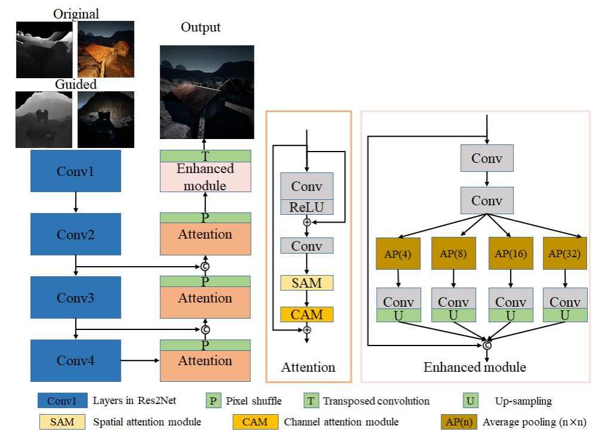

---

layout:     post
title:      「项目复现」s3net：深度引导图像重照明的单流结构
subtitle:   CVPRW 2021
date:       2021-11-05
author:     MRL Liu,WJ
header-img: img/post-bg-hacker.png
catalog: true
tags:
    - 项目复现
---

​		本文是《S3Net: A Single Stream Structure for Depth Guided Image Relighting》其项目训练代码的关键复现流程。

# 一、网络模型

## 1、网络模型

​			该文的整个网络模型的输入是原始RGB图（1024x1024x3）、原始深度图（1024x1024x1）、引导RGB图（1024x1024x3）和引导深度图（1024x1024x1）连接在一起形成的8通道张量（1024x1024x8），输出的是3通道的预测RGB图（1024x1024x3）。

​			本文提出的 S3Net 的架构如下图所示。该网络基于***《Knowledge transfer dehazing network for nonhomogeneous dehazing》***，包含编码器和解码器部分。 




​		【编码器】该文使用***《Res2net: A new multi-scale backbone architecture》***提出的Res2Net101网络主干作为编码器，因为Res2Net 可以在粒度级别表示多尺度特征，并增加每个网络层的感受野范围，输入通过主干后可以实现多尺度特征提取。该文的工作在Res2Net做了如下修改：

- 修改第一个卷积使网络可以使用8 通道张量作为输入；
- 丢弃网络最后的全连接层，使最终输出的特征图的大小为 16分之一 ；
- 编码器的初始权重是用 ImageNet 训练的预训练参数，底部特征使用跳跃连接连接到解码器。

​       【解码器】解码器由卷积堆栈组成，以细化特征图。

​		 利用注意力模块（Attention，P）来细化中间特征。 注意模块由残差层 （residual layer）***《Deep residual learning for image recognition》***、空间注意力模块（SAM）***《Recurrent models of visual attention》*** 和通道注意力模块（CAM）***《Squeeze-and-excitation networks》*** 组成。

​		 利用像素混洗（Pixel shuffle，P）***《Real-time single image and video super-resolution using an efficient subpixel convolutional neural network》***和转置卷积（Transposed convolution，T）***《Pixel transposed convolutional networks》***来放大特征图。

​		此外，受***《Enhanced pix2pix dehazing network》***的启发，该文章在 S3Net 中添加了增强模块。 增强模块利用不同步幅的平均池化来改变特征图和感受野的大小，这对于提取多尺度特征是有效的。 最后，应用上采样来恢复减少的特征图，并将所有特征图拼接起来。 

​		【跳跃连接】众所周知，类 U-Net 结构在许多任务中是有益的，例如图像去雾（《PMS-net: Robust haze removal based on patch map for single images》，《PMHLD: patch map-based hybrid learning dehazenet for single image haze removal》） 和语义分割 （***《U-net: Convolutional networks for biomedical image segmentation》***）。 它的跳跃连接鼓励特征重用。 因此S3Net 中也采用跳跃连接将来自主干的最后三个特征图合并到它们对应的特征图。

# 二、损失函数

​		该项目的S3Net一共使用了三个损失函数，其整体损失如下：
$$
L_{\text {Total }}=\lambda_{1} L_{\text {cha }}+\lambda_{2} L_{W-S S I M}+\lambda_{3} L_{P e r}
$$
​		其中 $\lambda_{1}$、$\lambda_{2}$ 和 $\lambda_{3}$ 是缩放系数，用于调整三个分量的相对权重。

### （1）Charbonnier 损失

​		该损失函数来自于《A general and adaptive robust loss function》，其可以看做是一个高鲁棒性的L1损失函数，该损失函数可以还原全局结构并且可以更鲁棒地处理异常值，其公式如下：
$$
L_{C h a}(I, \hat{I})=\frac{1}{T} \sum_{i}^{T} \sqrt{\left(I_{i}-\hat{I}_{i}\right)^{2}+\epsilon^{2}}
$$
​       其中$I$ 和$\hat{I}$ 分别代表目标图像和该文网络输出的预测图像， $\epsilon$被视为一个微小的常数（例如$10^{-6}$​）,用来实现稳定和鲁棒的收敛。根据这篇超分辨领域的论文《Fast and Accurate Image Super-Resolution with Deep Laplacian Pyramid Networks》，采用该函数可以使得模型的收敛速度加快。其实现代码相对简单“

```python
class L1_Charbonnier_loss(torch.nn.Module):
    """L1 Charbonnierloss."""
    def __init__(self):
        super(L1_Charbonnier_loss, self).__init__()
        self.eps = 1e-6

    def forward(self, X, Y):
        diff = torch.add(X, -Y)
        error = torch.sqrt(diff * diff + self.eps)
        loss = torch.mean(error)
        return loss
```

### （2）SSIM 损失

​		该损失函数来自于《Loss functions for image restoration with neural networks》 ，其能够重建局部纹理和细节。 可以表示为： 
$$
L_{S S I M}(I, \hat{I})=-\frac{\left(2 \mu_{I} \mu_{\hat{I}}+C_{1}\right)\left(2 \sigma_{I \hat{I}}+C_{2}\right)}{\left(\mu_{I}^{2}+\mu_{\hat{I}}^{2}+C_{1}\right)\left(\sigma_{I}^{2}+\sigma_{\hat{I}}^{2}+C_{2}\right)}
$$
​		 其中 σ 和 µ 表示图像的标准偏差、协方差和均值。 

​		在图像重照明任务中，为了从原始图像中去除阴影，该文扩展了 SSIM 损失函数，以便使网络可以恢复更详细的部分。 

​		该文使用《Y-net: Multiscale feature aggregation network with wavelet structure similarity loss function for single image dehazing》 中的方法将 DWT 组合到 SSIM 损失中，这有利于重建重光照图像的清晰细节。最初，DWT 将预测图像分解为四个不同的小sub-band图像。 操作可以表示为：
$$
\hat{I}^{L L}, \hat{I}^{L H}, \hat{I}^{H L}, \hat{I}^{H H}=\operatorname{DWT}(\hat{I})
$$


​       其中上标表示来自各个过滤器的输出（例如，$$\hat{I}^{L L}, \hat{I}^{L H}, \hat{I}^{H L}, \hat{I}^{H H}$$）。

​       $$\hat{I}^{H L}, \hat{I}^{L H}, \hat{I}^{H H}$$分别是水平边缘、垂直边缘和角点检测的高通滤波器。  fLL 被视为下采样操作。 此外，DWT 可以不断分解$$\hat{I}^{L L}$$ 以生成具有不同尺度和频率信息的图像。 这一步写成： 
$$
\hat{I}_{i+1}^{L L}, \hat{I}_{i+1}^{L H}, \hat{I}_{i+1}^{H L}, \hat{I}_{i+1}^{H H}=\operatorname{DWT}\left(\hat{I}_{i}^{L L}\right)
$$
​       其中下标 i 表示第 i 次 DWT 迭代的输出。 上述 SSIM 损失项是根据原始图像对和各种子带图像对计算得出的。  SSIM损失和DWT的融合整合为：
$$
\begin{array}{l}
L_{W-S S I M}(I, \hat{I})=\sum_{0}^{r} \gamma_{i} L_{\mathrm{SSIM}}\left(I_{i}^{w}, \hat{I}_{i}^{w}\right) \\
w \in\{L L, H L, L H, H H\}
\end{array}
$$
其中$\gamma_{i}$​  基于原文来控制不同补丁的重要性。

​		这里的实现我们参考了[wavelet_ssim](https://github.com/dectrfov/Y-net/tree/master/pytorch_ssim)的实现。

### （3）感知损失

​		该损失函数来自于2016年代ECCV会议的《Perceptual losses for real-time style transfer and super-resolution》，该论文在图像转换问题中使用感知损失（perceptual loss）函数代替之前的逐像素（per-pixel）损失函数，结果在速度和图片质量上均得到了大幅度提升。

​		感知损失定义为
$$
L_{P e r}(I, \hat{I})=\mid(\operatorname{VGG}(I)-\operatorname{VGG}(\hat{I}) \mid
$$


​		其中$\mid·\mid$ 是绝对值。

​		该损失函数利用从预训练的深度神经网络（例如 VGG19 （《Very deep convolutional networks for large-scale image recognition》））中获得的多尺度特征，然后使用L1损失来测量预测图像和目标图像之间的视觉特征差异，从而使得训练的图像尽可能地逼近目标图像。该项目使用在ImageNet 上预训练的 VGG19 被用作损失函数网络。

​		首先使用代码获取vgg19模型：

```Python
import torch
import torchvision.models as models
# 加载预训练的模型
vgg_model = models.vgg19(pretrained=True)
print(vgg_model.features)
```

​		vgg19整体结构分为'features', 'avgpool', 和 'classifier'三大部分,而计算损失函数只需要用到'features'部分，打印其结果如下：

```Python
Sequential(
  (0): Conv2d(3, 64, kernel_size=(3, 3), stride=(1, 1), padding=(1, 1))
  (1): ReLU(inplace)
  (2): Conv2d(64, 64, kernel_size=(3, 3), stride=(1, 1), padding=(1, 1))
  (3): ReLU(inplace)
  (4): MaxPool2d(kernel_size=2, stride=2, padding=0, dilation=1, ceil_mode=False)
  (5): Conv2d(64, 128, kernel_size=(3, 3), stride=(1, 1), padding=(1, 1))
  (6): ReLU(inplace)
  (7): Conv2d(128, 128, kernel_size=(3, 3), stride=(1, 1), padding=(1, 1))
  (8): ReLU(inplace)
  (9): MaxPool2d(kernel_size=2, stride=2, padding=0, dilation=1, ceil_mode=False)
  (10): Conv2d(128, 256, kernel_size=(3, 3), stride=(1, 1), padding=(1, 1))
  (11): ReLU(inplace)
  (12): Conv2d(256, 256, kernel_size=(3, 3), stride=(1, 1), padding=(1, 1))
  (13): ReLU(inplace)
  (14): Conv2d(256, 256, kernel_size=(3, 3), stride=(1, 1), padding=(1, 1))
  (15): ReLU(inplace)
  (16): Conv2d(256, 256, kernel_size=(3, 3), stride=(1, 1), padding=(1, 1))
  (17): ReLU(inplace)
  (18): MaxPool2d(kernel_size=2, stride=2, padding=0, dilation=1, ceil_mode=False)
  (19): Conv2d(256, 512, kernel_size=(3, 3), stride=(1, 1), padding=(1, 1))
  (20): ReLU(inplace)
  (21): Conv2d(512, 512, kernel_size=(3, 3), stride=(1, 1), padding=(1, 1))
  (22): ReLU(inplace)
  (23): Conv2d(512, 512, kernel_size=(3, 3), stride=(1, 1), padding=(1, 1))
  (24): ReLU(inplace)
  (25): Conv2d(512, 512, kernel_size=(3, 3), stride=(1, 1), padding=(1, 1))
  (26): ReLU(inplace)
  (27): MaxPool2d(kernel_size=2, stride=2, padding=0, dilation=1, ceil_mode=False)
  (28): Conv2d(512, 512, kernel_size=(3, 3), stride=(1, 1), padding=(1, 1))
  (29): ReLU(inplace)
  (30): Conv2d(512, 512, kernel_size=(3, 3), stride=(1, 1), padding=(1, 1))
  (31): ReLU(inplace)
  (32): Conv2d(512, 512, kernel_size=(3, 3), stride=(1, 1), padding=(1, 1))
  (33): ReLU(inplace)
  (34): Conv2d(512, 512, kernel_size=(3, 3), stride=(1, 1), padding=(1, 1))
  (35): ReLU(inplace)
  (36): MaxPool2d(kernel_size=2, stride=2, padding=0, dilation=1, ceil_mode=False)
)
```

这里我们使用[DRN项目中的vggloss]([DeepRelight/networks.py at master · WangLiwen1994/DeepRelight (github.com)](https://github.com/WangLiwen1994/DeepRelight/blob/master/models/networks.py))的实现来获取多尺度特征，如下：

```python
class Vgg19(nn.Module):
    def __init__(self, requires_grad=False):
        super(Vgg19, self).__init__()
        # vgg_pretrained_features = models.vgg19(pretrained=True).features # #pretrained是true，导入预训练模型
        # 加载预训练模型
        vgg19_model = models.vgg19(pretrained=True)
        # 获取中间层特征
        vgg_pretrained_features = vgg19_model.features

        self.slice1 = torch.nn.Sequential()
        self.slice2 = torch.nn.Sequential()
        self.slice3 = torch.nn.Sequential()
        self.slice4 = torch.nn.Sequential()
        self.slice5 = torch.nn.Sequential()
        # 获取中间层特征，把不同层的特征分别加入不同的模块
        for x in range(2):
            self.slice1.add_module(str(x), vgg_pretrained_features[x])
        for x in range(2, 7):
            self.slice2.add_module(str(x), vgg_pretrained_features[x])
        for x in range(7, 12):
            self.slice3.add_module(str(x), vgg_pretrained_features[x])
        for x in range(12, 21):
            self.slice4.add_module(str(x), vgg_pretrained_features[x])
        for x in range(21, 28):
            self.slice5.add_module(str(x), vgg_pretrained_features[x])
        # 设置所有参数都不需要计算梯度，使得之后不进行反向传播及权重更新
        if not requires_grad:
            for param in self.parameters():
                param.requires_grad = False

    def forward(self, X):

        h_relu1 = self.slice1(X)
        h_relu2 = self.slice2(h_relu1)
        h_relu3 = self.slice3(h_relu2)
        #h_relu4 = self.slice4(h_relu3)
        #h_relu5 = self.slice5(h_relu4)
        #out = [h_relu1, h_relu2, h_relu3, h_relu4, h_relu5]
        out = [h_relu1, h_relu2, h_relu3]#, h_relu4, h_relu5]
        return out
class VGGLoss(nn.Module):
    def __init__(self, gpu_ids):
        super(VGGLoss, self).__init__()
        self.vgg = Vgg19().cuda()
        self.criterion = nn.L1Loss() # L1损失，平均绝对值损失
        self.weights = [1.0 / 32, 1.0 / 16, 1.0 / 8, 1.0 / 4, 1.0]

    def forward(self, x, y):
        x_vgg, y_vgg = self.vgg(x), self.vgg(y)
        loss = 0.0
        for i in range(len(x_vgg)):
            loss += self.weights[i] * self.criterion(x_vgg[i], y_vgg[i].detach())
        return loss
```


