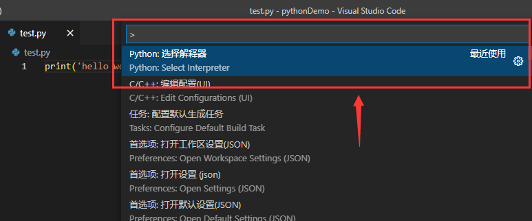
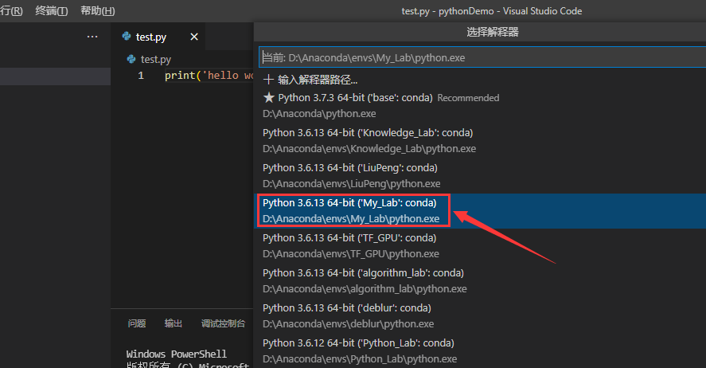
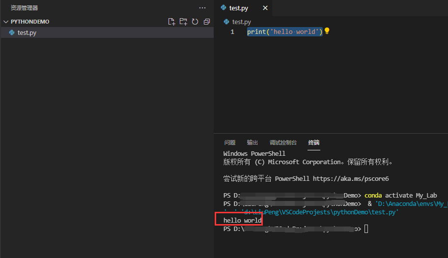

本博客记录使用VS Code编译Python程序的过程。

## 1、安装软件VS Code

首先，需要安装 `Visual Studio Code` 软件。下载网址：[Visual Studio Code](https://link.zhihu.com/?target=https%3A//code.visualstudio.com/)。

按照安装文件的要求，完成安装即可。

## 2、创建项目文件夹

打开 `VS Code`，选择`文件/打开文件夹`，该文件夹即是你的项目文件夹根目录。

## 3、安装插件Python

选择左侧栏的`扩展选项`，搜索插件`Python`，点击安装即可。


## 3、配置Python解释器

Python插件并不是Python编译器，只是VS Code和Python解释器进行交互的工具。

这个时候我们就要配置Python解释器，如果没有安装，则需要安装（安装Python环境时自带Python解释器）。

这里我使用Anaconda的虚拟环境中的Python解释器，设置如下：

在菜单栏打开VSCode的`命令面板`（Ctrl+Shift+P），输入 `Python:选择解释器`：




此时我们就可以选择一个自己的Python解释器：




## 4、编译Python代码

经历上述步骤，如果没有问题，已经可以正常编写` python代码 `了。

在当前项目文件夹中新建一个.py文件，在文件中输入第一行Python代码来测试解释器是否可以成功运行：

```python
print('hello world')
```

然后编译该文件即可：





