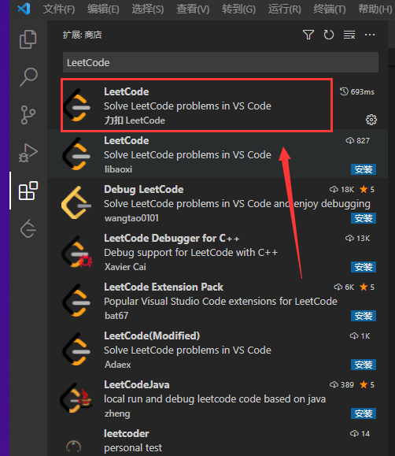
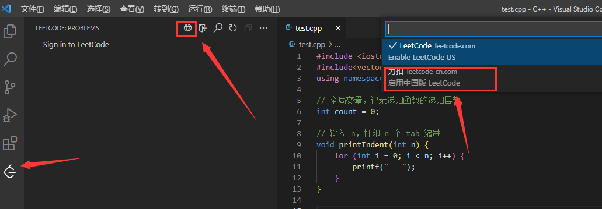
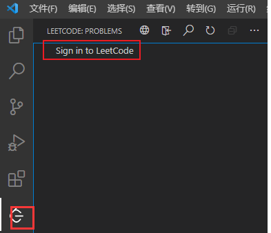
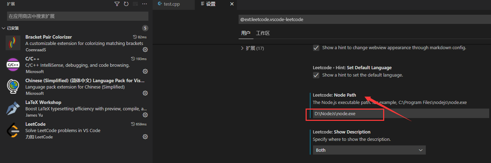
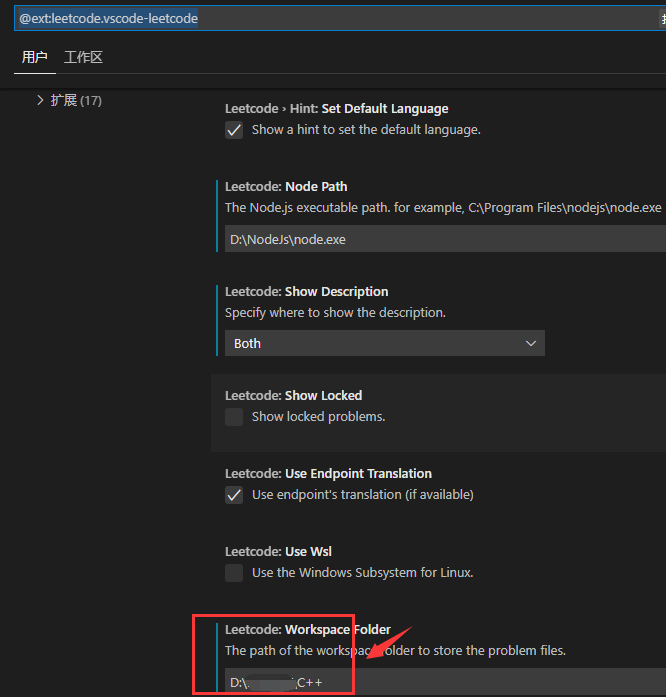
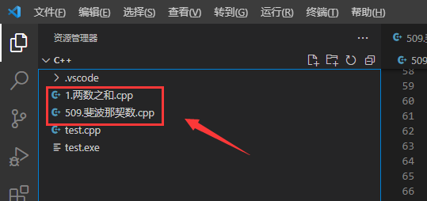
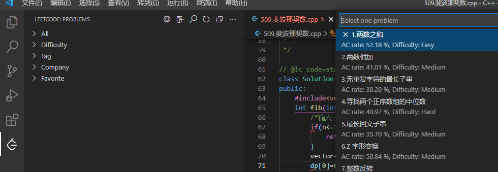
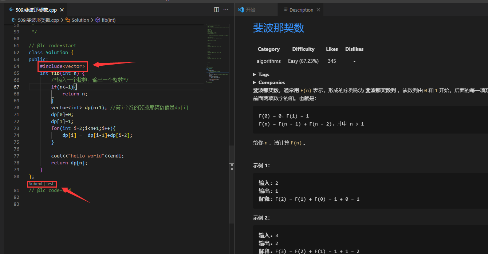
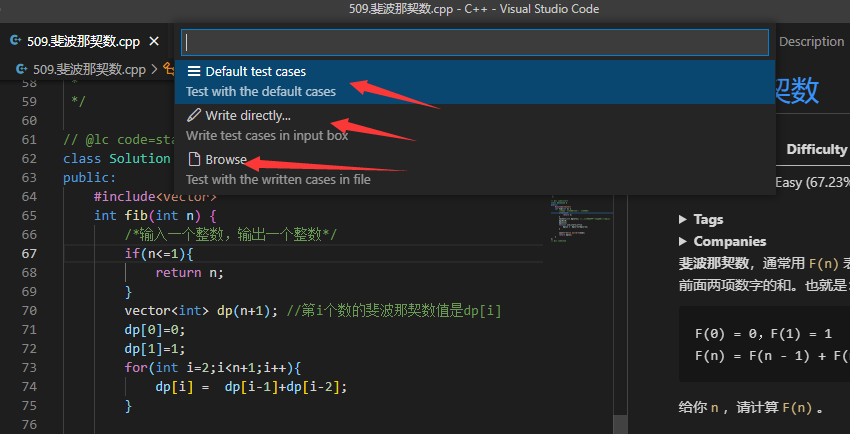
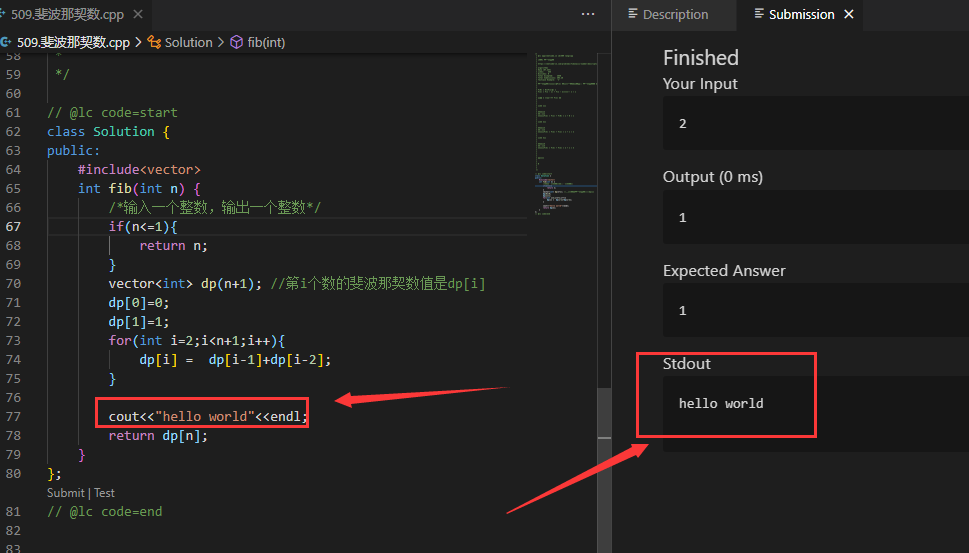

本博客记录在VS code中配置LeetCode的过程，在VS Code中可以方便我们调试代码。

# 一、配置环境

### 1. 安装[VSCode](https://so.csdn.net/so/search?from=pc_blog_highlight&q=VSCode)并配置环境

Leetcode插件本身是不需要配置编程语言环境的，因为它使用的是LeetCode官方编译器进行调试。

所以正常只需要安装VSCode即可，这一步比较简单。

### 2. 安装LeetCode插件

在插件扩展中搜索LeetCode插件，安装热度最高的那个即可。

### 3. 安装Node.js

在安装完LeetCode插件之后，点击LeetCode插件的Tab页，会提示你安装Node.js，按照安装程序的提示安装即可。

Node.js在安装完成之后会自动配置环境变量，但需要记住安装位置，后边配置LeetCode会使用到。

### 4. 登录LeetCode账户

完成上述操作后，建议重启一次VS Code。

### （1）修改站点

### （2）登录账户

登录账户前请登录网页版LeetCode确认自己的账户名（非昵称）和密码（很可能没有设置）。

然后点击LeetCode插件按钮，点击Sign in LeetCode，然后输入自己的账号和密码，即可登录。

### 5. 配置Node.js路径

点击扩展按钮，选中LeetCode插件，鼠标右键选择扩展设置
找到Node Path，选择相应路径。

### 6. 配置文件路径

编程的代码文件都会保存到本地，默认路径为“$HOME.leetcode"。

我们可以自行设置其保存到我们的项目路径
点击扩展按钮，选中LeetCode插件，鼠标右键选择扩展设置
找到Workspace Folder，输入绝对路径。

这样我们就可以在当前路径中找到我们写过的每一个问题的代码：

# 二、使用操作

## 1、选择题目

LeetCode插件提供类似网页版的题目筛选功能，可以按照题目序号、难度、标签等筛选。

## 2、编辑题目代码

选择一个题目，双击就能出现具体的题目描述。

左侧显示编程窗口，右侧显示题目描述。

如果代码中出现STL报错，这是因为默认模板中并没有增加STL头文件，

为了方便编程过程中提示，我们可以主动增加头文件。

点击上图中的**Submit**按钮就可以提交结果，

## 3、使用测试用例

点击**Test**，会有三个选项供你选择。

需要注意的是：在使用第二个自行输入用例时，可能有的用例会有多个输入，需要用到换行符，由于LeetCode插件默认“Enter”键为输入结束，所以输入用例时不能使用“Enter”表示换行，需要我们手动输入**“\n“**代替换行符。

## 4、打印输出信息

在代码中添加输出信息，然后使用Test可以输出信息。

