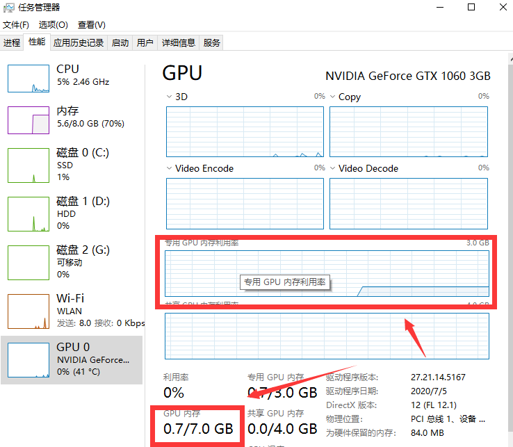
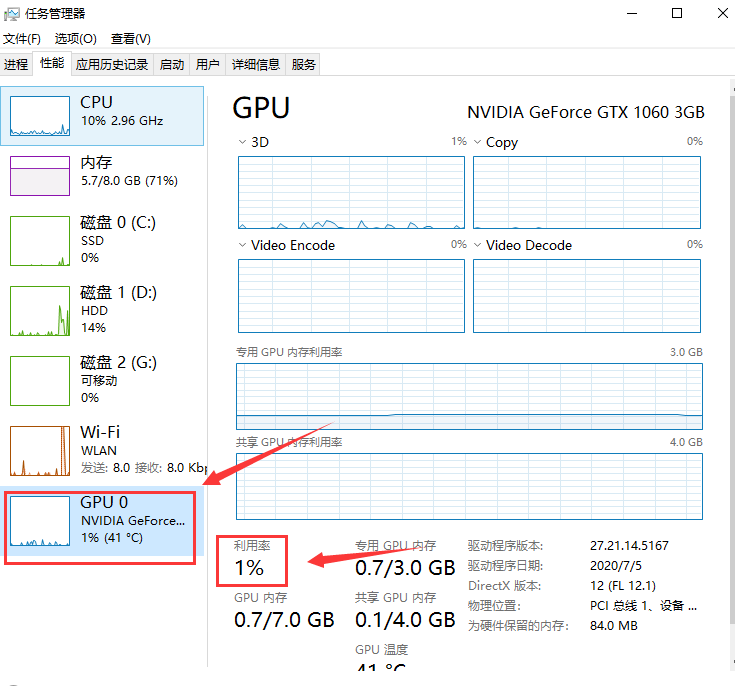
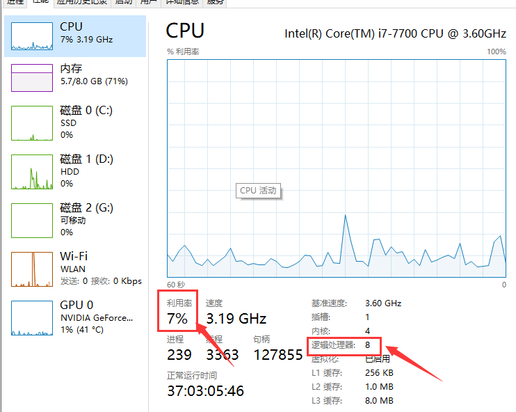

---

layout:     post
title:      「深度学习」GPU和CPU的利用率
subtitle:   基于Pytorch平台和windows系统
date:       2021-11-26
author:     MRL Liu
header-img: img/the-first.png
catalog: True
tags:
    - 深度学习
---

​		本博客是记录作者部署优化本地`深度学习项目`的经验。在深度学习项目中，我们最常见的提速方式是使用GPU，但是GPU使用了后可能会发现`GPU利用率`和`CPU利用率`很低，这很可能是我们项目中`batch size`和`num_workers`的参数设置没有充分发挥`GPU`和`CPU`的性能。（直接上更好硬件的方式不在此笔记考虑范围）

## 一、CPU和GPU做什么？

​	CPU是计算机的`中央处理器`，这一点相信不必多言。在深度学习项目中，CPU主要负责从磁盘中读取数据集数据、显示或者保存实验数据到磁盘。

​	GPU是计算机的`图形处理器`，平常主要负责`图形渲染`。在深度学习项目中，GPU主要负责深度学习框架中的张量（tensor）计算，主要工作基本是前向传播和反向传播部分。

## 二、记录项目指标

为了方便我们了解此时影响深度学习项目的主要因素，我们可以在训练中统计以下三个阶段的用时：

| 阶段     | 主要操作                                  |
| -------- | ----------------------------------------- |
| 数据加载 | 获取输入数据和目标数据，并且转换为GPU类型 |
| 前向传播 | model.forward()                           |
| 反向传播 | 计算loss，loss.backward()，优化器的step() |

## 三、优化项目参数

本次我们主要调节batch_size和num_workers两个参数，使用Pytorch平台(tensorflow平台类似)，相关API如下：

```python
torch.utils.data.DataLoader(image_datasets[x],
                            batch_size=batch_size, 
                            shuffle=True,
                            num_workers=8,
                            pin_memory=True)
```

注意：pin_memory参数根据你的机器CPU内存情况，选择是否打开。

pin_memory参数为False时，数据从CPU传入到缓存RAM里面，再给传输到GPU上；

pin_memory参数为True时，数据从CPU直接映射到GPU的相关内存块上。

如果调节batch size和num_workers后，CPU内存依旧剩余较多，可以设置其为True来省掉一点数据传输时间。

### 1、优化batch_size

​		batch_size一般要设置为2的整数倍，最好是4的整数倍，如4，8，12，16，32，128、256

当然如果GPU内存特别小，那可能只能设为1。

​		在GPU训练时，影响batch_size的优化的主要因素是GPU内存占用率（Memory-Usage）。

​		在命令行输入nvidia-smi或者打开任务管理器的性能页面，可以查看到GPU内存占用率情况，当模型的结构固定时，这个值一般也是一个相对平稳的值：




​		我们要尽可能地提升batch_size大小，确保GPU内存占用率达到90%以上。

### 2、GPU利用率

​		上面我们调整完batch_size，GPU内存占用率达到90%以上后，但是GPU利用率（Volatile GPU-Util）依旧非常低，这个参数一般是反复跳动的，突然升高然后降低。




​		这个时候说明我们的主要瓶颈在CPU的数据吞吐量，即GPU会非常快计算完CPU传输进去的数据，主要时间花在CPU的处理数据和传输数据上。

​		这个时候我们就要利用CPU的多线程来提高CPU的效率

### 3、优化num_workers

​		除了换更好的内存条或者CPU外，我们基本只能调节num_workers参数。注意，这个参数不一定是越大越好，首先我们要查看CPU的线程数，这规定了num_workers的最大值。




​		num_workers一般是8、12等，具体要结合机器的硬件性能。我们不断调高num_workers的数量，然后查看CPU占用率和数据加载时间，尽可能使用最少的CPU占用率来减少更多的数据加载时间。

​		假如我们在8-12之间数据加载时间变化不大，但是CPU占用率提高很大，则建议选用8，这由于提升机器的整体性能。

