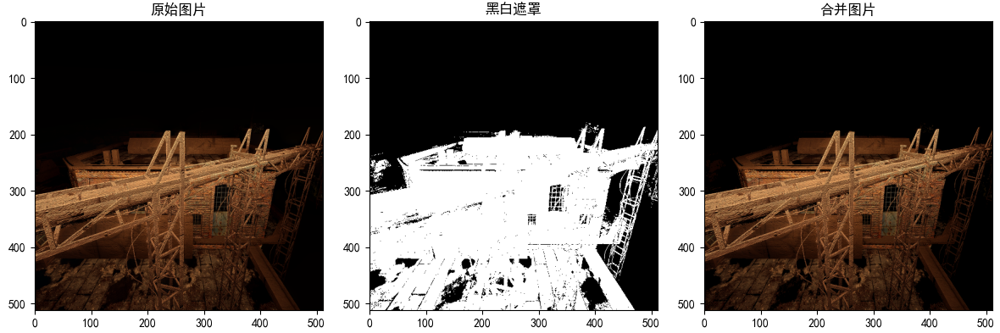
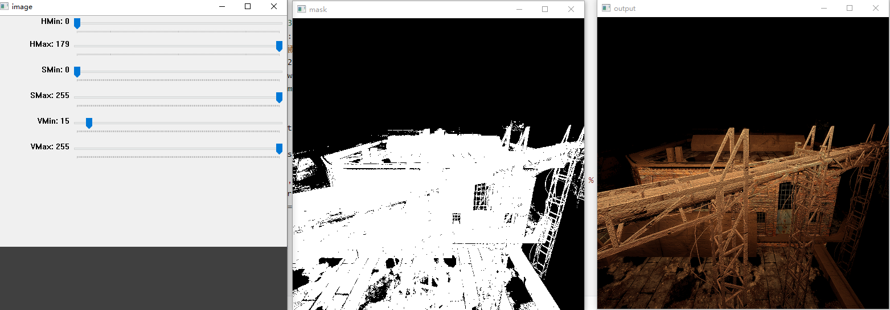

---

layout:     post
title:      「深度学习」图片遮罩生成技术
subtitle:   基于python语言和opencv库
date:       2021-12-01
author:     MRL Liu
header-img: img/the-first.png
catalog: True
tags:
    - 深度学习
---

​		本博客是记录作者生成一些图片遮罩的经验，介绍了使用cv2.inRange()获取图片黑白遮罩的方式。

# 一、基于cv2.inRange()函数

​		opencv-python库中直接提供了一个可以同时针对多通道实现二值化功能的cv2.inRange()函数。我们演示如何使用该函数生成黑白遮罩。

## 1、获取黑白遮罩的演示

导入相关包：

```python
import cv2
import numpy as np
import matplotlib.pyplot as plt
```

### （1）读取输入图片

```python
input = cv2.imread('./Image000.png') # BGR色彩模式
```

### （2）获取黑白遮罩

```python
lower = np.array([0, 0, 17])  # 最低阈值
upper = np.array([179, 255, 255]) # 最高阈值
hsv = cv2.cvtColor(input, cv2.COLOR_BGR2HSV) # BGR色彩空间转换为HSV色彩空间
mask = cv2.inRange(hsv, lower, upper) # 将图片二值化
```

可以发现获取黑白遮罩的函数中最关键的是设定两个阈值数组lower和upper，这两个怎么设定呢？可以使用下文第2节给出的小工具调节。

### （3）获取图片和遮罩的交集

```python
output = cv2.bitwise_and(input, input, mask=mask)
```

### （4）显示所有图片

```python
# 显示窗口
fig = plt.figure(figsize=(12, 4), tight_layout=True)  # tight_layout设置自动填充
fig.canvas.set_window_title('测试窗口')  # 设置窗口
plt.rcParams['font.sans-serif'] = ['SimHei']  # 使用中文字符
plt.rcParams['axes.unicode_minus'] = False  # 显示负数的负号
# 转换色彩空间
rgb_img = cv2.cvtColor(input, cv2.COLOR_BGR2RGB)  # BGR色彩空间转换为RGB色彩空间
rgb_output = cv2.cvtColor(output, cv2.COLOR_BGR2RGB)  # BGR色彩空间转换为RGB色彩空间
# 显示子窗口
ax = fig.add_subplot(131)
ax.set_title('原始图片')
ax.imshow(rgb_img)
ax = fig.add_subplot(132)
ax.set_title('黑白遮罩')
ax.imshow(mask,cmap=plt.cm.gray)
ax = fig.add_subplot(133)
ax.set_title('合并图片')
ax.imshow(rgb_output)
plt.show()
```

最终效果如下：





## 2、选定黑白遮罩阈值的工具

我们的工具的所有功能封装在一个名为inRangeHelper的Python类中，

首先我们使用初始化一个cv2库自带的API创建一个可以调节参数的简易窗口：

```python
    def __init__(self):
        # 创建一个窗口图片
        self.wndname = 'image'
        cv2.namedWindow(self.wndname)
        # 对颜色变化创建轨迹栏目
        cv2.createTrackbar('HMin', self.wndname, 0, 179, self._nothing)  # Hue is from 0-179 for Opencv
        cv2.createTrackbar('HMax', self.wndname, 0, 179, self._nothing)
        cv2.createTrackbar('SMin', self.wndname, 0, 255, self._nothing)
        cv2.createTrackbar('SMax', self.wndname, 0, 255, self._nothing)
        cv2.createTrackbar('VMin', self.wndname, 0, 255, self._nothing)
        cv2.createTrackbar('VMax', self.wndname, 0, 255, self._nothing)
        # 设置默认HSV空间的最大值
        cv2.setTrackbarPos('HMax', self.wndname, 179)
        cv2.setTrackbarPos('SMax', self.wndname, 255)
        cv2.setTrackbarPos('VMax', self.wndname, 255)
        # 初始化HSV空间最大、最小值
        self.img_tempPars = [0,0,0,0,0,0]
        self.parsName = ['HMin','SMin','VMin','HMax','SMax','VMax']
    def _nothing(self,x):
        pass
```

接着定义运行函数：

```python
    def run(self,img_path = './Image000.png'):
        # 读取输入图片
        img = cv2.imread(img_path)
        waitTime = 33
        # 循环渲染窗口
        while (True):
            # 获取轨迹栏的当前位置
            try:
                curPars = [cv2.getTrackbarPos(name, self.wndname) for name in self.parsName]
            except:
                print("窗口已关闭！")
                break
            # 设置显示的HSV最大最小值
            lower = np.array(curPars[:3])
            upper = np.array(curPars[3:])
            # 创建HSV图像，并根据最低、最高阈值进行阈值化
            hsv = cv2.cvtColor(img, cv2.COLOR_BGR2HSV)
            mask = cv2.inRange(hsv, lower, upper)
            output = cv2.bitwise_and(img, img, mask=mask)
            # 展示输出图像
            cv2.imshow('mask', mask)
            cv2.imshow('output', output)
            # 判断当前参数是否发生变化
            for cur,temp in zip(curPars,self.img_tempPars):
                if cur!=temp:
                    print("(hMin = %d , sMin = %d, vMin = %d), (hMax = %d , sMax = %d, vMax = %d)" % (
                        curPars[0], curPars[1], curPars[2], curPars[3], curPars[4], curPars[5]))
                    self.img_tempPars = curPars

            # 等待33毫秒或者按下q键退出循环
            if cv2.waitKey(waitTime) & 0xFF == ord('q'):
                break
        # 关闭所有窗口
        cv2.destroyAllWindows()
```

运行该工具：

```python
tool = inRangeHelper()
tool.run()
```

显示效果如下：




