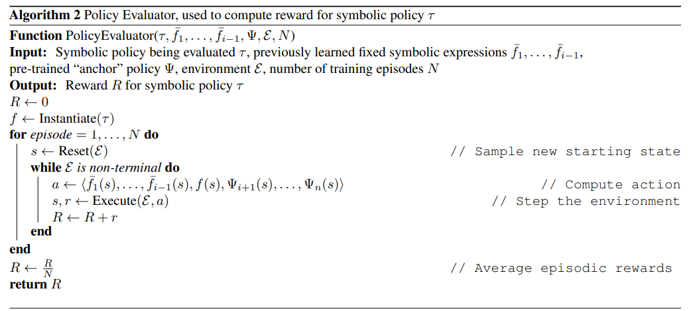

---

layout:     post
title:      「论文分享」利用深度强化学习发现符号策略
subtitle:   ICML 2021
date:       2021-12-17
author:     MRL Liu
header-img: img/the-first.png
catalog: True
tags: [论文分享]
   
---

​		《Discovering symbolic policies with deep reinforcement learning》是来自美国的Mikel Landajuela等人发表在ICML 2021（CCF推荐的A类会议）上的一篇论文，这里是[原文链接](http://proceedings.mlr.press/v139/landajuela21a.html)和[原文代码](https://github.com/brendenpetersen/deep-symbolic-optimization)。

# 摘要

​		深度强化学习（DRL）通过学习以神经网络为表示的策略成功地解决了许多困难的控制问题。然而，基于神经网络的策略涉及数千个组合的非线性算子，其复杂性可能使它们难以理解、信任和部署。相比之下，包含简短符号表达的简单策略可以促进人类的理解，同时也具有透明度并表现出可预测的行为。为此，本文提出了深度符号策略，这是一种直接搜索符号策略空间的新方法。本文使用自回归的循环神经网络（RNN）生成由可处理的数学表达式表示的控制策略，并使用风险寻求策略梯度来最大化生成策略的性能。为了扩展到具有多维行动空间的环境，本文提出了一种“anchoring”算法，该算法将预先训练的基于神经网络的策略一次一个动作维度地提取为完全符号化的策略。基于熵正则化和分布初始化的思想，本文还介绍了两种改进DRL组合优化中探索率的新方法。发现的符号策略不但大大降低了复杂性，而且本文证明，在八个基准环境中，发现的符号策略在平均排名和平均规范化回合奖励方面优于七种最先进的DRL算法。

# 一、简介

​		在过去几年中，深度强化学习（DRL）在解决许多难以控制的问题方面取得了显著的成功。DRL的成功很大程度上归功于深层神经网络（NNs）训练的最新进展，后者通常被用作RL策略的函数逼近器。然而，基于神经网络的策略表现出复杂的函数形式，涉及数千个嵌套的非线性算子和仿射变换。由于难以理解、验证、信任和预测RL代理的行为，这种复杂性对在现实环境中部署DRL策略构成了重大障碍。这些挑战与医学领域尤其相关，在相关领域，“黑盒”是难以接受的。

​		相比之下，数学物理和控制理论中的传统方法通常产生具有紧凑函数形式的简单控制器。这种控制器可以非常有效，也许是因为它们利用了“数学的不合理有效性”也就是说，他们对符号运算符的使用抓住了自然界的规律和一般原理（Wigner，1995）。从学习角度来看，符号运算符的使用可以被视为强制执行一种强大的正则化形式，这种形式限制模型以简洁的符号形式表示。

​		有鉴于此，我们提出了一个称为发现符号策略（DSP）的学习框架，在该框架中，我们直接搜索可处理的数学表达式空间，以用作具有连续动作空间的RL环境的控制策略。由易处理的数学表达式表示的学习策略提供了几个可取的特征：

（1）可解释性。从简明的数学表达式中获得的见解通常可以通过检查来收集。此外，我们证明了当已知过渡动力学时，可以进行形式稳定性分析。		

（2） 通用能力。正如我们将要演示的，符号策略可以有效地推广到连续时间设置，即使是在离散化的模拟环境中进行训练。

（3） 可部署性。符号化的策略是“小而快”；也就是说，它们可以很容易地部署在现实环境中，在现实环境中，对专用硬件的需求、策略的内存占用和执行策略的延迟可能是主要的限制因素。

（4） 透明度和可核查性。与基于神经网络的策略（很难重现）相比，符号策略性能很容易通过几行代码进行验证，策略的行为也很容易预测。

（5） 表演。与高度复杂的基于NN的策略相比，使用符号策略时可能会显著降低性能。然而，我们证明了符号策略表现出惊人的鲁棒性能，与基于神经网络的策略相比具有竞争力。

​		如图1所示，我们的方法涉及一个策略生成器，该生成器创建数学表达式直接用作控制策略，以及一个策略计算器，该计算器通过在模拟环境中运行事件来评估策略。然后，来自环境的奖励（内部RL循环）用作学习信号，通过策略梯度（外部RL循环）训练策略生成器。为了扩展解决多动作问题的方法，我们开发了一种新的模型提取技术，该技术利用预先训练的DRL策略来“锚定”正在学习的符号策略。基于神经网络的锚模型作为临时代理，一次移除一个维度；最终产品是一个完全符号化的策略，没有任何基于NN的维度。

​		图1 算法概述。（顶部）策略生成器对示例表达式进行采样。（中部）当前策略是以前学习的符号策略、当前样本和锚模型的构造。（底部）策略评估者将策略应用于环境，奖励用于训练策略生成器。该算法顺序学习动作，直到所有n个动作都是符号化的，并且锚模型被丢弃。

​		本文在一系列连续控制基准环境中演示了我们的方法。尽管与基于NN的DRL策略相比，所发现的符号策略的复杂性大大降低，但与七种DRL算法相比，它们在八个基准环境中实现了最高的规范化情节奖励、最高的平均排名和最低的最坏情况排名。我们将我们的贡献总结如下：

- 一种基于梯度的直接在RL循环中搜索符号控制策略空间的方法。
- 一种新的模型蒸馏算法，可扩展到具有多维动作空间的环境。

- 两种新的探索技术适用于使用DRL进行组合优化：一种是分层熵正则化器，以避免在前几个标记上过早收敛；另一种是软长度，以促进对序列长度的探索。
- 发现在整个基准环境中，在平均规范化情节奖励方面优于标准DRL算法的符号策略。

- 对于已知过渡动力学的三种环境，可证明稳定的符号策略（关于初始条件下的变量）。

  

  

  

# 二、相关工作

## 1、强化学习中的可解释性		

### （1）决策树

​		一些研究通过决策树学习策略的表示，其思路是一般将DRL模型压缩或提取为决策树策略。基于决策树的方法适用于具有离散动作空间的控制环境。

| **作者年份**                        | **论文题目**                                                 | **主要贡献** |
| ----------------------------------- | ------------------------------------------------------------ | ------------ |
| Ernst等人，2005                     | 《Tree-based batch mode reinforcement learning》             |              |
| Gupta等人，AAAI，2015年             | 《Policy tree: Adaptive representation for policy gradient》 |              |
| Liu等人，2018年                     | 《Toward interpretable deep reinforcement learning with linear model u-trees》 |              |
| Bastani等人，2018年                 | 《Verifiable reinforcement learning via policy extraction》  |              |
| Coppens等人，IJCAI Workshop，2019年 | 《Distilling deep reinforcement learning policies in soft decision trees》 |              |
| Roth等人，2019年                    | 《Conservative q-improvement: Reinforcement learning for an interpretable decision-tree policy》 |              |

### （2）符号表示

​		最近，许多通过策略的符号表示来解决RL中的可解释性的工作被提出。常见的思路是使用符号回归（symbolic regression）来获取符号策略的均值。

| **作者年份**        | **论文题目**                                                 | **主要贡献**                                                 |
| ------------------- | ------------------------------------------------------------ | ------------------------------------------------------------ |
| Kubalik等人，2017年 | 《 Optimal control via reinforcement learning with symbolic policy approximation》 | 使用遗传编程（ genetic programming）来符号化地逼近通过经典控制方法获得的策略。然而，这种方法需要访问基本的动力学方程。 |
| Hein等人，2018年    | 《Interpretable policies for reinforcement learning by genetic programming》 | 作者提出学习一个世界模型，并用它来指导一个基于遗传编程的符号回归算法。在他们的结果中，与使用单个RL算法训练的NN策略相比，发现的符号策略的性能有所下降，但是其不需要访问基本的动力学方程。 |
| Verma等人，2018年   | 《Programmatically interpretable reinforcement learning》    | 利用程序合成（program synthesis）从预先训练的DRL策略来学习可解释的策略。 |
| Wilson等人，2018年  | 《Evolving simple programs for playing atari games》         | 使用笛卡尔遗传编程（Cartesian Genetic Programming ）为Atari游戏开发了有效的程序。虽然他们的策略是完全可解释的，但最终可能会陷入局部最优，从而避免使用更复杂的策略。 |

​		上面讨论的基于模型提取和回归的方法有一个共同问题：训练目标和评估指标之间存在目标不匹配（objective mismatch）。也就是说，策略的训练使用某种监督学习的形式：使用从预先训练的模型中采样的数据来“模拟”预先训练的“oracle”策略。然而，最终的评估指标是RL目标：在环境中执行时获得高回报。

​		本文的实验证明了基于回归的策略提取方法通常会导致灾难性的失败。相比之下，DSP直接通过来自环境的奖励进行训练，因此，不存在目标不匹配。虽然DSP为具有多维动作空间的环境提供了一个“锚”模型，但学习信号始终与符号策略在环境中的性能直接相关。

## 2、自动机器学习

​		DSP还与自动机器学习（AutoML）和结构优化方法类似，其中使用自回归的RNN定义离散对象上的分布，然后使用RL在黑盒性能指标下优化该分布。

| **作者年份**           | **论文题目**                                                 |
| ---------------------- | ------------------------------------------------------------ |
| Zoph & Le, 2016年      | 《Neural architecture search with reinforcement learning》   |
| Bello等人, 2017        | 《Neural optimizer search with reinforcement learning》      |
| Ramachandran等人, 2017 | 《Searching for activation functions》                       |
| Abolafia等人, 2018     | 《Neural program synthesis with priority queue training》    |
| Pham等人, 2018         | 《Efficient neural architecture search via parameter sharing》 |

​		最近，Petersen等人（ICLR 2021）的《Deep symbolic regression: Recovering mathematical expressions from data via risk-seeking policy gradients》提出了一种基于RNN的符号回归方法和一种风险寻求策略梯度来优化最佳情况下的性能。在这里，本文在这些组合优化框架的基础上引入了两种新的方法来改进探索。此外，本文的锚定算法允许本文方法联合优化多个相关离散对象，而上述工作仅限于单个对象任务。

# 三、深层符号策略

​		 如图1所示，本文的总体方法包括两个部分:

​		1)策略生成器(**Policy Generator**)，它用于在RL环境中创建控制策略的数学表达式(表示为一系列符号)。

​		2)策略评估者(**Policy Evaluator**)，通过在RL环境中执行多个回合并输出平均回合奖励(average episodic reward)来检查生成的策略的性能。策略评估器的输出被作为奖励信号，然后使用风险寻求策略梯度（risk seeking policy gradient，Petersen等人（ICLR 2021）训练策略生成器。不断重复这个过程来对策略生成器进行迭代训练来生成性能更好的策略。DSP的伪代码与锚定算法（anchoring algorithm）在附录中提供。

## 1、策略生成器

​		策略生成器对数学表达式上的分布进行建模。表达式可以被采样，并直接用作RL环境的控制策略。每个采样表达式是一个函数$f: \mathcal{S} \rightarrow \mathbb{R}$，其中$\mathcal{S}$为环境观测空间。

​		所有的符号来自于一个库$\mathcal{L}$（例如$\left\{+, \times, \sin , s_{1}, s_{2}, 0.1,5.0\right\}$,其中$s_{i}$表示环境观测空间的第$i$个维度）

​		本文定义算法的搜索空间为一个离散符号序列$\tau$，这个序列由操作符、输入变量和常量组成,它的数学表达式实例定义为$f $。

​		**初始条件：**初始化一个具有参数$\theta$的RNN网络，定义一个数学符号库$\mathcal{L}$（例如$\left\{+, \times, \sin , s_{1}, s_{2}, 0.1,5.0\right\}$,其中$s_{i}$表示环境观测空间的第$i$个维度）。

​		**输入：**空的离散符号序列$\tau$

​		**输出：**符号策略$\tau$（本质是一个离散符号序列$\tau$）

​		**过程：**

​						RNN每次以一定的概率分布从数学符号库$\mathcal{L}$中采样一个符号并添加到$\tau$，得到$\tau^{(i)}$

​			策略$\tau_{i}$的第i个符号的概率表示为$ p\left(\tau_{i} \mid \tau_{1:(i-1)} ; \theta\right)=\psi_{\mathcal{L}\left(\tau_{i}\right)}^{(i)}$，其中$\theta$是RNN参数，$\psi^{(i)}$是RNN的第i个发射（对应于符号上的概率），$\mathcal{L}\left(\tau_{i}\right)$是与$\mathcal{L}$中对应的符号$\tau_{i}$的序号。整个采样的表达式$\tau$的概率可以使用条件概率的链式法则进行计算：
$$
p(\tau \mid \theta)=\prod_{i=1}^{|\tau|} p\left(\tau_{i} \mid \tau_{1:(i-1)} ; \theta\right)=\prod_{i=1}^{|\tau|} \psi_{\mathcal{L}\left(\tau_{i}\right)}^{(i)}
$$
​		采样过程的一个案例被展示在图1

定义一个数学表达式的概率分布

​		现在搜索被简化为离散序列，我们利用AutoML工作中使用自回归RNN优化序列上的分布（Zoph&Le，2016；Ramachandran等人，2017；Bello等人，2017；Pham等人，2018；Petersen等人，2021）的想法。

采样过程从一棵空树开始。

​		RNN在库$\mathcal{L}$里的符号发出分类分布，采样一个符号并将其添加到表达式树中。通常，RNN的下一个输入将是先前采样的符号表示。为了更好地捕获表达式树的层次结构，我们将父代和同级符号表示作为RNN的下一个输入（对于没有父代或同级的节点使用“空”符号）。此过程重复，直到表达式树完成（即所有树分支到达终端节点）。

​		因此，在给定先前符号（即RNN输入和cell状态）的情况下，每个从分类分布（即RNN发射）中采样的符号是条件独立的。策略$\tau_{i}$的第i个符号的可能性表示为$ p\left(\tau_{i} \mid \tau_{1:(i-1)} ; \theta\right)=\psi_{\mathcal{L}\left(\tau_{i}\right)}^{(i)}$，其中$\theta$是RNN参数，$\psi^{(i)}$是RNN的第i个发射（对应于符号上的概率），$\mathcal{L}\left(\tau_{i}\right)$是与$\mathcal{L}$中对应的符号$\tau_{i}$的序号。整个采样的表达式$\tau$（用于训练中的策略梯度）的可能性可以使用条件概率的链式法则进行计算：
$$
p(\tau \mid \theta)=\prod_{i=1}^{|\tau|} p\left(\tau_{i} \mid \tau_{1:(i-1)} ; \theta\right)=\prod_{i=1}^{|\tau|} \psi_{\mathcal{L}\left(\tau_{i}\right)}^{(i)}
$$
​		采样过程的一个案例被展示在图1（顶部）中。

## 2、原位约束

​		自回归采样的一个好处是能够通过直接对搜索空间施加约束来有效地编码领域知识。具体地说，我们可以引入一类广泛的原位约束，在这些约束中，我们只需能够确定在遍历过程中的任何点不允许使用哪些令牌。这是通过在采样之前简单地将选择违反约束的令牌的概率归零来实现的。该过程确保所有样品遵守现场所有约束条件（与目前的取样条件相同），无需事后拒收样品。为了提高所获得表达式的可解释性，本文施加了几个约束：（1）每个表达式的长度被约束在预定义的最小和最大长度之间。

（2）禁止一元运算符的子运算符是该运算符的逆运算符，例如log（exp（·））。

（3） 为简单起见，禁止嵌套三角度量运算符，如sin（1+cos（·））。

（4） 为了防止琐碎的策略，确保每个表达式至少包含一个输入变量。

## 3、策略评估器

#### （1）获取多维动作输出

​		给定策略生成器中的序列$\tau$，实例化为相应的数学表达式$f$，则第i个动作$a_{i}=f_{i}(s)$，

​		前$i-1$个动作使用固定符号策略$\bar{f}_{1}, \ldots, \bar{f}_{i-1}$计算，第$i$个动作$ a_{i}$使用$a_{i}=f_{i}(s)$计算，锚模型（预训练的NN策略模型）用于计算剩余动作$a_{i+1}, \ldots, a_{n}$，

#### （2）计算动作的奖励

​       为了评估策略的质量，使用内部RL循环运行$N$个回合并计算环境中的平均回合奖励$R(\tau)$，用其作为奖励信号用作外部RL循环来训练策略生成器，则策略生成器的奖励函数可以由以下公式表示：
$$
R(\tau)=\frac{1}{N} \sum_{i=1}^{N} \sum_{t=1}^{T^{(i)}} r_{t}^{(i)}
$$
​		其中$T^{(i)}$是回合i的长度，N是回合数，$r_{t}^{(i)}$是使用与$\tau$相对应的符号策略时在第i个回合的第t个时间步长处的瞬时奖励。

## 4、使用risk-seeking policy gradient训练

​		由于来自策略评估器的奖励函数来自控制环境，所以它是不可微分的。因此，使用一个外部RL循环来优化策略生成器。通常，具有黑盒性质的奖励函数的自回归模型使用标准的REINFORCE策略梯度（Williams，1992；Zoph&Le，2016；Ramachandran等人，2017；Bello等人，2017），其优化目标如下：
$$
J(\theta)=\mathbb{E}_{\tau \sim p(\tau \mid \theta)}[R(\tau)]
$$

​		值得注意的是，优化$J(\theta)$使分布的回报期望最大化。然而，正如绝大多数AutoML任务中，我们从分布中寻找单个或几个性能最好的样本。也就是说，最后，我们从策略生成器中找到性能最好的符号策略。因此，我们采用了Petersen等人（2021年）提出的risk-seeking policy gradient，这是一种改进的可优化最佳案例性能的策略梯度法，目标函数由下式给出：
$$
J_{\text {risk }}(\theta ; \epsilon)=\mathbb{E}_{\tau \sim p(\tau \mid \theta)}\left[R(\tau) \mid R(\tau) \geq R_{\epsilon}(\theta)\right]
$$

​		其中$\epsilon$是控制风险程度的超参数，$R_{\epsilon}(\theta)$ 是奖励的$(1-\epsilon)$分位数。

与标准REINFORCE策略梯度类似，该目标的梯度可以使用简单的蒙特卡罗估计进行近似（详情见Petersen等人，2021）。

## 5、常量优化

​		库$\mathcal{L}$包含预先指定的实值常量作为符号（特别是0.1、1.0和5.0）。策略生成器可以使用各种运算符组合这些符号来生成新值；然而，不太可能找到局部最优的常量值。为了进一步优化学习到的符号策略，我们对实值常量进行了微调（详见附录）。我们只对每个环境中性能最佳的符号策略执行一次常量优化。

# 四、扩展到多动作维度

​		到目前为止，本文已经在RL环境中讨论了具有一维动作空间的DSP，即$\mathcal{A} \in \mathbb{R}$ 然而，许多环境表现出n维行动空间，即$\mathcal{A} \in \mathbb{R}^{n}$.扩展到多维操作空间的一个可能解决方案是使用策略生成器按顺序生成n个表达式。单个样本将对应于$\left\{f_{1}, \ldots, f_{n}\right\}$，其中第i个动作ai由$a_{i}=f_{i}(s)$给出。然而，这种方法的扩展性不好。考虑库$\mathcal{L}$的大小$|\mathcal{L}|$，最大序列（每个表达式）的长度$k$，和具备动作空间$\mathcal{A} \in \mathbb{R}^{n}$的RL环境，与这个组合动作空间的大小是$\mathcal{O}\left(|\mathcal{L}|^{n k}\right)$的上界，也就是说，这是一个难度指数扩展的问题。

​		为了避免这种组合爆炸，本文提出了一种新的模型蒸馏方法，该方法将搜索减少到n个子问题，每个子问题的大小为$\mathcal{O}\left(|\mathcal{L}|^{k}\right)$。我们利用现有的预训练的策略模型（例如，使用现有DRL算法训练的基于神经网络的策略），我们称之为锚模型$\Psi: \mathcal{S} \rightarrow \mathcal{A}$，在一个$\mathcal{A} \in \mathbb{R}^{n}$的RL环境中学习纯符号策略的过程包含n轮连续但相互依赖的DSP。在第一轮中，DSP学习“子策略”$f_{1}: \mathcal{S} \rightarrow \mathbb{R}$、 用于确定第一个动作的值：$a_{1}=f_{1}(s)$。在策略评估器中，使用锚模型确定剩余动作：$a_{i}=\Psi(s)_{i} \forall i \in\{2, \ldots, n\}$，其中表示$\Psi(s)_{i}$向量$\Psi(s)$的第$i$个元素。第一轮DSP训练的最终结果是发现的最佳表达式$f_{1}^{\star}$。在下一轮DSP中，我们处理$f_{1}^{\star}$为固定值，此处使用符号$\bar{f}_{1}$表示。

​		在第二轮DSP中，子策略$f_{2}$（用于计算$ a_{2}$）成为学习目标；$\bar{f}_{1}$用于计算$ a_{1}$，锚模型用于计算剩余动作$a_{3}, \ldots, a_{n}$，一这一过程一直持续到整个策略完全变成符号意义为止。更加通用地说，对于DSP的第$i$轮，前$i-1$个动作使用固定符号策略$\bar{f}_{1}, \ldots, \bar{f}_{i-1}$计算，第$i$个动作$ a_{i}$使用学习目标$f_{i}$计算，锚模型用于计算剩余动作$a_{i+1}, \ldots, a_{n}$，因此，在最后一轮DSP中（就像在唯一一轮针对一维动作空间的DSP中一样），不再需要使用锚模型。本质上，锚模型就像一个“阶梯”：算法爬过每个“梯级”（即动作维度）后，就会丢弃它；在算法结束时，整个阶梯将被删除。包括锚定算法在内的DSP伪代码见附录。

# 五、改进探索

​		上述基于RNN的策略梯度设置是在表达树的组合空间中搜索的一种强大方法（Bello等人，2017）。然而，本文发现，它可能受到早期承诺现象和初始化偏差的影响，这两种情况都限制了探索。为了解决这些问题，我们提出了两种基于RNN的神经引导搜索的新探索技术：层次熵正则化和软长度优先。
​		我们通过消融实验证明了这两种方法的有效性（见附录）。

## 1、层次熵正则化

​		策略梯度法通常包括与自回归抽样每一步的熵成比例的损失函数的“红利”（Haarnoja等人，2018年；Abolafia等人，2018年）。更准确地说，将以下一项被添加到公式1或2中:
$$
\mathcal{H}(\theta)=\eta \mathbb{E}_{\tau \sim p(\tau \mid \theta)}\left[\sum_{i=1}^{|\tau|} H\left[p\left(\tau_{i} \mid \tau_{1:(i-1)} ; \theta\right)\right]\right.
$$
​		其中$H[p(X)]=-\sum_{x \in X} p(x) \log p(x)$是熵，$\eta $是控制熵系数重要性的超参数。熵正则化优化探索帮助避免RNN陷入一个局部最优。值得注意的是，公式3只是跨越时间步长i的总和；因此，所有的时间步骤贡献都是平等的。

​		当优化离散序列（或在具有确定性转换动力学的RL环境中导航）时，每个序列都可以被视为通过底层搜索树的路径。由于该树的层次性，其在以后的时间步长中更容易实现高熵，而这一点很少被探讨。这导致（3）中的和集中在后面的项中，而最早的项可以很快接近零熵。当这种情况发生时，RNN会完全停止探索早期的符号，从而阻碍搜索空间的分支，这会极大地影响性能。这种现象，我们称之为“early commitment problem”，可以从经验上观察到，如图2（上图）所示。请注意，序列的第一个符号的熵在训练早期下降到零。

​		本文提出了一个简单的更改来解决“early commitment problem”：将（3）中的和替换为权重呈指数衰减的加权和：
$$
\mathcal{H}_{\gamma}(\theta)=\eta \mathbb{E}_{\tau \sim p(\tau \mid \theta)}\left[\sum_{i=1}^{|\tau|} \gamma^{i-1} H\left[p\left(\tau_{i} \mid \tau_{1:(i-1)} ; \theta\right)\right]\right.
$$

​		使用（4）鼓励RNN不断探索最早的符号。在图2（下图）中，我们展示了这种分层熵正则化器在确保RNN在训练过程中保持符号多样性方面的有效性。

## 2、软长度优先

### （1）硬长度优先

​		在训练开始之前，使用零权重初始值设定项，RNN排放$\psi^{(i)}$从零开始。因此，符号上的概率分布是一致的：$p\left(\tau_{i}\right)=\frac{1}{|\mathcal{L}|} \forall \tau_{i} \in \mathcal{L}$。本文可以通过包含先验信息，即通过添加logit向量$\psi_{\circ}$来通知该起始分布。对于每个RNN发射$\psi^{(i)}$。例如，我们可以确保选择二进制、一元或终端标记的先验概率相等（与库中每种类型标记的数量无关）◦ 下,通过求解$\psi_{\circ}$:
$$
\operatorname{softmax}\left(\psi_{0}\right)=\left(\frac{1}{3 n_{2}}\right)_{n_{2}}\left\|\left(\frac{1}{3 n_{1}}\right)_{n_{1}}\right\|\left(\frac{1}{3 n_{0}}\right)_{n_{0}},
$$
​		其中对应于$\psi_{\circ}$的符号按递减算术排序，（·）n表示元素（·）重复n次，||表示向量串联，n2、n1和n0分别表示L中的二进制、一元和终端符号的数量。解决办法是：
$$
\psi_{\circ}=\left(-\log n_{2}\right)_{n_{2}}\left\|\left(-\log n_{1}\right)_{n_{1}}\right\|\left(-\log n_{0}\right)_{n_{0}}+c
$$
​		其中c是任意常数（参见附录中的证明）。在先验$\psi_{\circ}$下, 表达式长度上的分布严重偏向较长的表达式。特别是，预期的表达式长度为$\mathbb{E}_{\tau \sim \psi_{\circ}}[|\tau|]=\infty$（证据见附录）。在实践中，应用了长度约束；然而，根据经验，这导致绝大多数表达式的长度等于最大允许长度。我们在图3（上图）中以经验的方式展示了这一点。这种强烈的偏差使得分布很难学习合适的表达式长度。

### （2）软长度优先

为了提供这种能力，我们在RNN第i次发射之前引入了额外的软长度：
$$
\psi_{\circ}=\left(\frac{-(i-\lambda)^{2}}{2 \sigma^{2}} \mathbb{1}_{i>\lambda}\right)_{n_{2}}\left\|(0)_{n_{1}}\right\|\left(\frac{-(i-\lambda)^{2}}{2 \sigma^{2}} \mathbb{1}_{i<\lambda}\right)_{n_{0}}
$$
​		其中对应于$\psi_{\circ}$的符号按递减算术排序，λ和σ为超参数。在概率空间中，$\psi_{\circ}$是应用于二进制符号（i>λ）或终端符号（i<λ）的乘法高斯函数。因此，它不鼓励表达式太短或太长。图3（底部）显示，在表达式长度上，包含此先验结果会导致更平滑的先验分布。与长度约束相反（即硬长度优先）强制每个表达式位于预先指定的最小和最大长度之间，软长度优先为策略生成器提供学习最佳长度的能力；如附录所示，这大大改进了学习。

# 六、实验

## 1、实验设置

​		**策略生成器**是一个由具有32个隐藏单元的单层LSTM组成的RNN。对于控制任务中的每个动作，本文都使用不同的随机种子对DSP进行3次独立的训练，在训练结束时选择最佳符号策略。因此，对于具有$\mathcal{A} \in \mathbb{R}^{n}$的RL环境，本文进行了$3n$次训练然后选择了一个最佳策略。

​		由于常量优化在计算上非常昂贵，因此本文在每个环境中对找到的最佳符号策略只执行一次。所有任务都使用库：
$$
\mathcal{L}=   \left\{+,-, \times, \div, \sin , \cos , \exp , \log , 0.1,1.0,5.0, s_{1}, \ldots, s_{n}\right\} 
$$
​		其中$s_{i}$是环境观测的第$i$维。在计算动作时，**策略计算器**会将任何无限或未定义的动作替换为零，例如，对于符号策略$a_{1}=\log \left(s_{1}\right)$，如果$s_{1}>0$，返回$\log \left(s_{1}\right)$，否则返回$0$。本文将每个表达式的长度限制在4到30个标记之间，包括4到30个标记。

​		所有算法（DSP和所有基线）的评估都基于不同随机环境种子的1000个回合的平均奖励。特别地，环境种子主要用于确定环境的初始状态，有些种子可能比其他种子更具挑战性。因此，本文在相同的1000个随机环境种子的集合中评估了本文的策略，这一步骤对于确保算法之间的公平比较至关重要。

## 2、性能对比

### （1）八个环境的设置

​		本文在八个基准控制任务上对DSP进行评估：五个单动作环境（CartPole、MountainCar、Pendulum、InvertedDoublePendulum和InvertedPendulumSwingup和三个多动作环境（LunarLander、Hopper和BipedalWalker）。

其中RL环境的实现如下：

| **作者年份**                                                 | **论文题目**                        |
| ------------------------------------------------------------ | ----------------------------------- |
| CartPoleContinuous-v0                                        | https://gist.github.com/iandanforth |
| MountainCarContinuous-v0, Pendulum-v0, LunarLanderContinuous-v2, 和BipedalWalker-v2 | OpenAI Gym (Brockman等人, 2016))    |
| InvertedDoublePendulumBulletEnv-v0, InvertedPendulumSwingup BulletEnv-v0, 和HopperBulletEnv-v0 | PyBullet (Coumans& Bai, 2016).      |

### （2）不同基线的设置

表1列出了本文找到的每个环境的最佳符号策略，其中包括常量优化前后的结果（分别标记为$\mathrm{DSP}$和$\mathrm{DSP}^{o}$）。

​		“Regression”基线使用以下工作流程计算：（1）根据最佳预训练Zoo策略（如下所述）生成一个观察值-动作轨迹的离线数据集；（2）按照deep symbolic regression（Petersen等人，2021年）的方法在离线数据集上执行符号回归，并为每个动作选择误差最小的表达式；（3）在上述环境中评估最佳符号表达式。该基线的其他详细信息见附录。

 		除了MountainCar，“Regression”基线的结果是灾难性的。这表明使用基于回归的方法时存在一个潜在缺陷：回归目标（最小化预测误差）和控制目标（在环境中获得高回报）之间存在目标函数不匹配。换句话说，当在环境中进行评估时，回归中的小错误不一定对应于性能的小下降。虽然它可以有效地用于简单环境，如MountainCar（经Hein等人（2018）验证），但本文认为基于回归的方法最终存在根本性缺陷。

​		作为一个更强的基线，本文比较了七种最先进的DRL算法：DDPG、TRPO、A2C、PPO、ACKTR、SAC和TD3（Lillicrap等人，2015年；Schulman等人，2015年；Mnih等人，2016年；Schulman等人，2017年；Wu等人，2017年；Haarnoja等人，2018年；Fujimoto等人，2018年）。

​		本文利用一个包含经过预训练的DRL策略的开源仓库Zoo，其中这些策略已针对每个环境进行了单独调整。环境算法的子集组合没有预训练过的Zoo策略；在这些情况下，本文使用Zoo仓库中的培训脚本手动训练Zoo策略。

### （3）不同基线的设置

​		表2列出了$\mathrm{DSP}$和$\mathrm{DSP}^{o}$（即具有常数优化的DSP）、Regression基线和七个DRL基线的评估的平均回合奖励。为了实现跨环境的比较，表中还列举了平均排名（average rank）、最坏情况排名（worst-case rank）和平均标准化回合奖励（average normalized episodic reward，计算公式为$\bar{R}_{\mathrm{ep}}=(\text { score }-\min ) /(\max -\min )$），其中min和max计算所有算法中每个环境的最小值和最大值。附录中提供了多动作环境中中间混合策略的其他结果。

​		实验结果显示，尽管符号策略的复杂性显著降低，但DSP在各种环境中都表现依旧良好，与所有基线相比，它的平均排名最高，标准化回合奖励的平均排名最高，最差情况排名（与TD3并列）。此外，DSP在除Hopper之外的所有环境中都优于$\overline{\mathrm{Zoo}}$策略。

​		表2：七种不同DRL算法的$\mathrm{DSP}$、$\mathrm{DSP}^{o}$、Regression和7种不同DRL算法的Zoo策略的性能比较。这些值是使用同一组保留的环境种子（在不同算法中完全相同）超过1000个回合的平均回合奖励。$\overline{\mathrm{Zoo}}$代表七种Zoo策略的平均值。$\dagger$作为MountainCar的额外回归基线，本文评估了Hein等人（2018）论文中的最佳符号策略，其平均回合奖励为90.40。

​		DSP发现的符号策略的复杂性在三种RL环境中的降低情况可以在图4中非常清楚地看到。附录中提供了所有环境的类似热图。多媒体附录中提供了在每个环境中部署的表1中发现的符号策略的视频。

图4：在选定环境中，通过Anchor模型（中列）、DSP学习的符号策略（左列）和通过从锚模型生成的数据回归学习的符号策略（右列）计算的动作热图。

## 3、稳定性分析

​		本节内容中分析了CartPole中发现的符号策略的稳定性。附录中有对Pendulum和MountainCar的分析，这两个环境具有可以被写成可处理的动力学系统的状态转换规律。对于每个环境，我们将发现的策略应用于相应的动力系统（dynamical system），并利用标准特征值（standard eigenvalue）分析评估系统在平衡点（equilibrium points）的稳定性。

​		为了进行比较，本文还对不受控制的系统进行了分析(例如，在一段时间内将动作保持为零)。本文证明了CartPole策略在连续系统（the *continuous* system）中是稳定的，即使它只在离散化的转换动力学（the discretized version of the  transition dynamics）中训练过(即离散时间马尔科夫决策从微分方程的一阶欧拉时间离散化出现的过程)。这表明在离散时间设置中训练的符号策略的使用（例如模拟环境）仍然可以很好地泛化（generalize），甚至在现实世界的连续时间对应。（状态转换动力学是确定的，用常微分方程（ordinary differential equations）描述)）。
​		CartPole环境的连续动力学方程定义如下（Barto等人，1983年）：
$$
\begin{array}{c}
x^{\prime \prime}(t)=\frac{8 u(t)+2 m \sin (\theta(t))\left(4 l \theta^{\prime}(t)^{2}-3 g \cos (\theta(t))\right)}{8 m_{c}-3 m \cos (2 \theta(t))+5 m}, \\
\theta^{\prime \prime}(t)=\frac{g \sin (\theta(t))-\frac{\cos (\theta(t))\left(a_{1}(t)+l m \theta^{\prime}(t)^{2} \sin (\theta(t))\right)}{m_{c}+m}}{l\left(\frac{4}{3}-\frac{m \cos ^{2}(\theta(t))}{m_{c}+m}\right)},
\end{array}
$$
​		其中$g$是重力加速度（gravitational acceleration）， $m_{c}$是cart的质量，$m$是pole的质量， $l$是half-pole的长度，$x(t)$是cart的位置， $\theta(t)$是关于垂直轴的角度，$a_{1}(t)$是动作（action)。CartPole环境的任务是在平衡点$s_{\mathrm{eq}}=\left(x, x^{\prime}, \theta, \theta^{\prime}\right)=(0,0,0,0)$ 附近形成稳定系统。如果点$s_{\mathrm{eq}}$是系统的非稳定平衡点，可以通过在 (5) 中取 a1(t) = 0 来检查，围绕 $s_{\mathrm{eq}}$对系统进行线性化，并计算所得矩阵的特征值。此过程产生特征值 (−3.97, 3.97, 0, 0)。 由于第二个特征值是正的，我们使用 Hartman-Grobman 定理（Grobman，1959；Hartman，1960）得出结论，该$s_{\mathrm{eq}}$是一个不稳定的平衡。如果我们改为使用表 1 中 DSP 发现的策略并重复上述过程，本文得特征值 (-29.61, -14.3, 0, 0)。 由于所有特征值都是非正的，根据Hartman-Grobman定理得出该$s_{\mathrm{eq}}$是受控系统的稳定平衡。 因此，DSP 发现的策略通过将 $s_{\mathrm{eq}}$从不稳定的平衡转变为稳定的平衡来控制系统。本文在图5(左)中说明了这一点，它显示了所发现的策略在各种初始条件下的健壮性。

图5：非受控（左）和受控（右）的CartPole系统（x=0，x‘=0）的相位图。受控系统采用DSP发现的策略

# 七、总结

​		本文介绍了深层符号策略（deep symbolic policy），一种使用神经引导搜索来学习符号控制策略的方法。本文的框架包括一种新的模型提取方法，用于将方法扩展到具有多维动作空间的环境，以及两种新的用于DRL离散优化的探索技术。

​		我们在八个连续控制任务上演示了该方法，在平均秩和规范化情节奖励方面优于高度调优、预先训练的基于神经网络的策略。本文的通用策略具有易于解释、部署成本低、高度透明和易于复制等优点。此外，当过渡动力学可用时，我们的符号控制策略是可证明稳定的。我们的结果表明，符号策略可以是基于NN的策略的一个强有力的替代方案，特别是当人类的可解释性是一个需要的特性或部署约束（例如内存和延迟要求）是重要的设计标准时。
