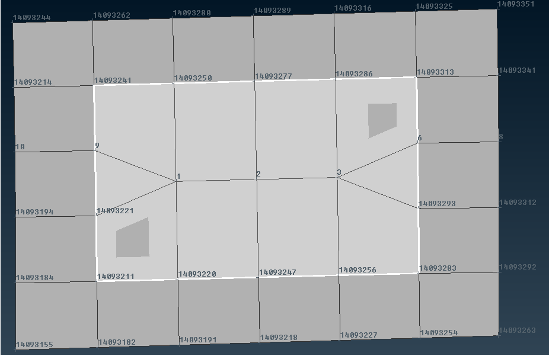
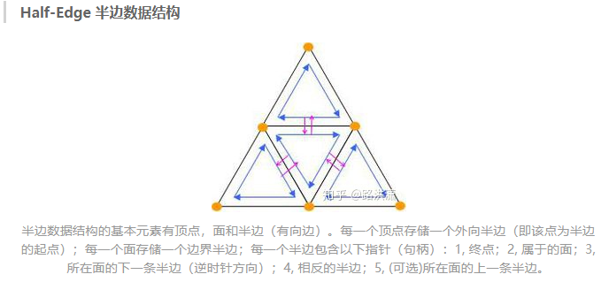
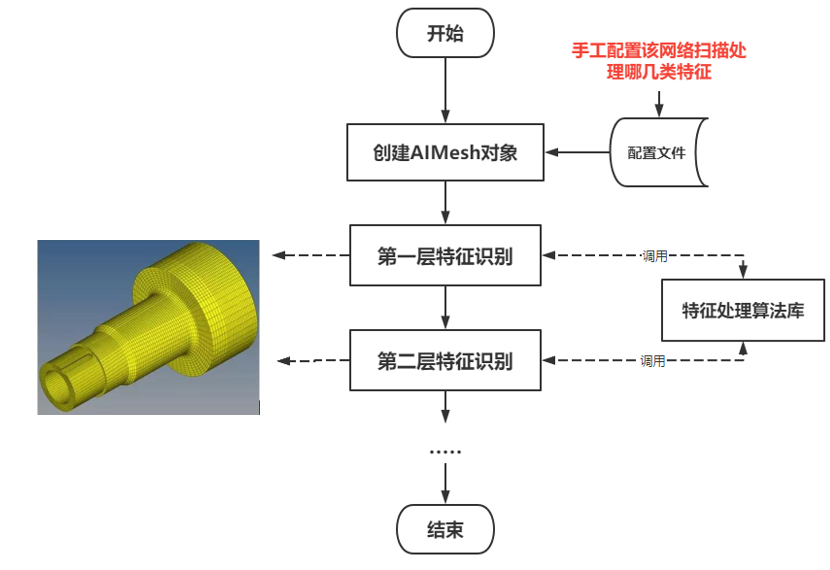
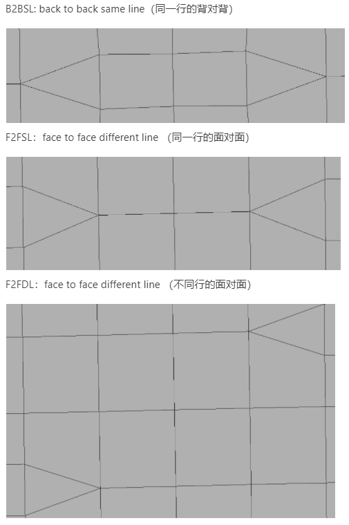

​	 	`某汽车仿真AI后处理工具开发`是一款`结合计算机图形学知识`的`网格优化的算法设计项目`，是作者研究生时期在导师指导下参与的科研项目开发。

[TOC]

## 一、项目主要介绍

​		CAE分析工程师需要大量时间来建立和修改有限元模型，即使在诸如ANSA的CAE前处理软件的协助下，仍然避免不了大量地重复性工作，该项目是针对汽车行业中常见的有限元网格模型特征进行识别和后处理，以加快有限元网格模型的修改效率。

​		该项目的主要工作就是设计可以快速识别鲜明特征的网格区域，采用适当的策略来将该网格区域内的三角形转换为几何拓扑结构简单的四边形。该项目是集成在ANSA软件上，调用ANSA的API接口获取有限元网格信息，然后针对网格特征设计算法和处理策略，主要编程语言为Python。

​		该项目是团队协作，**作者的主要工作是结合数据结构设计一些特征的识别和处理算法，以及为师兄师姐训练AI模型生成数据集（生成某类特征的大量数据样本）**。

​		例如，下图中存在2个三角面，需要通过算法识别到同类型的网格特征，然后调用AIMesh的API去除这2个三角面。




## 二、项目难点

​		该项目的主要难点如下：

（1）**需要设计数据结构。**有限元网格信息的点线面结构是杂乱而无规律的，**需要设计一种数据结构来构建这些数据之间的几何联系**。

（2）**需要设计大量识别算法。**针对上述数据结构，设计大量针对不同网格特征的算法以及对应的处理策略，每一种特征就可能具备一种特征识别算法。

### （1）设计数据结构

​		在计算机图形学的概念中，三维实体都是以具体的数据结构来实现的。如果想要对三维实体进行各种操作就必须建立顶点与面之间的关联。建立关联的过程就是构建数据结构的过程。通常我们需要建立的数据结构必须能够满足下面的临近查询的要求：

```
1、哪条边临近这个点
2、哪个面临近这条边
3、哪个边临近这条面
4、哪个面临近这几个面
```

​		目前常见的用来储存多边形的数据结构有Polygon Soup, Half Edge和Incidence Matrice。该项目采取了半边（Half Edge）的形式，半边是一种略微复杂的边表示方法。其表示如下：




​		基于该数据结构，作者团队设计了一种相应的数据结构类AIMesh，其分类存储了整个网格的点、边、面信息，其中边的信息包含其对应的半边描述。

### （2）特征处理流程

​		当AI工具程序启动后，首先根据配置文件确定要处理的特征种类，读取到整个网格的几何信息，然后构建出AIMesh对象，AIMesh会分层次识别调用不同特征的识别和处理算法，这种层次是按照特征识别难度划分的，例如第一层识别出最简单的网格特征，然后调用集成的API将其优化；第二层识别出更难的网格特征处理，直至所有预定义的特征都识别完或者已无法识别出特征后停止。




### （3）特征简要介绍

由于保密需要，这里只简单列举3种特征：




## 三、个人收获

### （1）数据结构的重要性

​		算法必须结合特定的数据结构，不同类型的数据结构对应的算法实现也不一样，好的数据结构可以帮助算法设计。

### （2）团队开发及时沟通很重要

​		该项目是作者团队开发，需要多个人相互协调，而且每个人的编码风格都不一样，每个人基本只能看懂自己负责的部分，在实际开发中要及时沟通，才能避免无效浪费。
