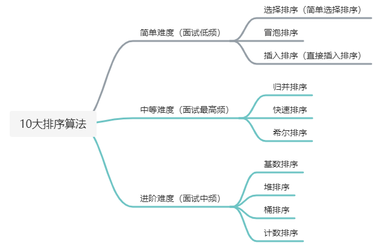
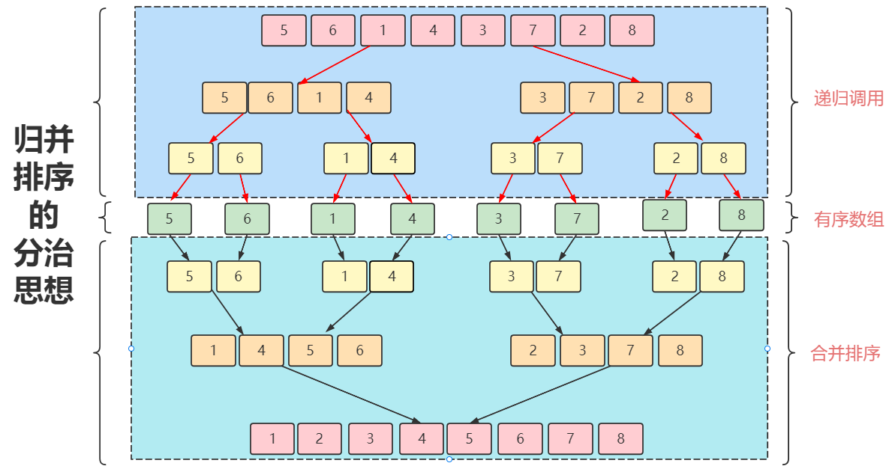
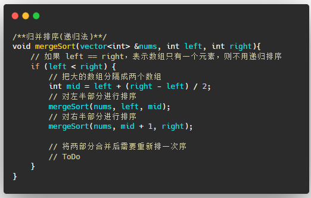
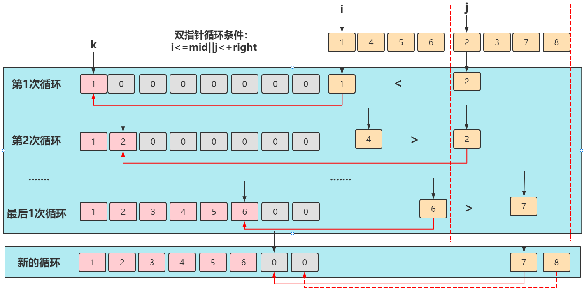
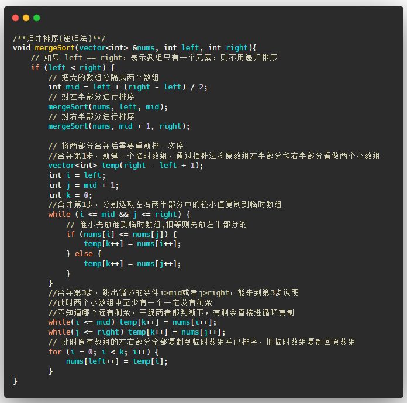

---

layout:     post
title:      「算法刷题」归并排序及其LeetCode题目
subtitle:   C++版本
date:       2022-02-10
author:     MRL Liu
header-img: img/the-first.png
catalog: True
tags: [算法刷题]
   
---

[TOC]

​         本文主要介绍排序算法中中常见的面试高频知识点：归并排序（merge-sort）。熟练本文的归并排序的代码后您将至少可以解决以下Leetcode题目：

| 题目序号                                 | 相关链接                                                     | 备注                                             |
| ---------------------------------------- | ------------------------------------------------------------ | ------------------------------------------------ |
| 912 排序数组（中等难度）                 | [912. 排序数组 - 力扣（LeetCode） (leetcode-cn.com)](https://leetcode-cn.com/problems/sort-an-array/submissions/) | 排序即可                                         |
| 75 颜色分类（中等难度）                  | [75. 颜色分类 - 力扣（LeetCode） (leetcode-cn.com)](https://leetcode-cn.com/problems/sort-colors/) | 排序即可                                         |
| 88 合并两个有序数组（简单难度）          | [88. 合并两个有序数组 - 力扣（LeetCode） (leetcode-cn.com)](https://leetcode-cn.com/problems/merge-sorted-array/submissions/) | 只使用排序算法中的合并排序即可                   |
| 面试题 10.01. 合并排序的数组（简单难度） | [剑指 Offer II 078. 合并排序链表 - 力扣（LeetCode） (leetcode-cn.com)](https://leetcode-cn.com/problems/vvXgSW/) | 只使用排序算法中的合并排序即可                   |
| 21 合并两个有序链表（简单难度）          | [21. 合并两个有序链表 - 力扣（LeetCode） (leetcode-cn.com)](https://leetcode-cn.com/problems/merge-two-sorted-lists/submissions/) | 只使用排序算法中的合并排序，针对链表特点改造即可 |

​		归并排序在10个排序中的地位如下：




## 一、归并排序

​		归并排序（merge-sort）采用了分治思想（即将一个大问题分解成若干个小问题来解决），分治思想在编码上一般容易使用递归法。

### 1、算法思路

​		归并排序认为如果要给一个数组排序，可以把整个大数组对等分成2个小数组，2个小数组继续分割，直到分出的每个小数组大小都是1，只有1个元素的数组一定是有序数组了，然后再把2个有序数组合并成新的更大数组，合并的时候需要重新排下序，合并后的数组就又有序了。




​		给2个小的有序数组（长度=N/2）重新排序通常比直接排序一个大的无序数组（长度=N）要快，这也是归并排序要先划分后合并的原因，先划分直至每个数组都是有序数组，然后合并排序成一个新的有序数组。

### 2、编码思路

​		在上述的思路分析中，归并排序的整个过程可以分为递归分组和合并排序两个阶段。

#### （1）递归分组

​		首先递归调用来不断分割数组的编码很简单了，代码如下：




#### （2）合并排序

​		合并排序就是考虑如何合并2个有序数组，归并排序使用了申请新数组的双指针法来合并排序。首先直接申请一个足够容纳2个有序数组的临时数组，然后i指针指向数组的左半部分nums[left,mid]，j指针指向数组的右半部分nums[mid+1,right]。接下来依次比较2个数组中的每个元素，哪个小数组的数更小就放入临时数组中，如下：




​		最后双指针循环结束后，原数组中还可能会有剩余的没有复制，因为双指针的循环条件是有一个指针达到其终点即可，所以循环结束时至少有一个数组的元素全部被复制完（图中是i指针指向的左数组），另一个数组则需要一个新的循环来复制，最后直接上代码。




### 3、性能分析

​			先给出归并排序的性能分析结论：


​			归并排序分为两部分：递归分组和合并排序。通过递归方式把整个大数组一层一层的折半分组，则由完全二叉树的深度可知，整个排序过程需要进行logn（向上取整）次分组,最后合并排序的时候需要将每个有序小数组的数都扫描一次，整个排序过程一共扫描了整个大数组的数，所以每轮合并排序的时间复杂度为O(n)，则总的时间复杂度为 O(nlogn)。归并排序的执行效率与要排序的原始数组的有序程度无关，所以在最好，最坏，平均情况下时间复杂度均为 O(nlogn) 。

​		归并排序所创建的临时数组都会在方法结束时释放，单次归并排序的最大空间是n，所以归并排序的空间复杂度为O(n).

​		归并排序的稳定性，取决于合并排序的时候如何处理相等的两个数。在归并排序的代码中，设置了nums[i]<=nums[j]，当两个元素相同时，先放nums[i]的值到大数组中，所以两个相同元素的相对位置没有发生改变，此处归并排序是稳定的排序算法。

### 4、参考资料

​		为了帮助读者学习该算法，笔者给出了自己写本文的参考资料和代码。本文的归并排序的代码如下：

```C++
/**归并排序(递归法)**/
void mergeSort(vector<int> &nums, int left, int right){
    // 如果 left == right，表示数组只有一个元素，则不用递归排序
    if (left < right) {
        // 把大的数组分隔成两个数组
        int mid = left + (right - left) / 2;
        // 对左半部分进行排序
        mergeSort(nums, left, mid);
        // 对右半部分进行排序
        mergeSort(nums, mid + 1, right);
      
        // 将两部分合并后需要重新排一次序
        //合并第1步，新建一个临时数组，通过指针法将原数组左半部分和右半部分看做两个小数组
        vector<int> temp(right - left + 1);
        int i = left;
        int j = mid + 1;
        int k = 0;
        //合并第1步，分别选取左右两半部分中的较小值复制到临时数组
        while (i <= mid && j <= right) {
            // 谁小先放谁到临时数组,相等则先放左半部分的
            if (nums[i] <= nums[j]) {
                temp[k++] = nums[i++];
            } else {
                temp[k++] = nums[j++];
            }
        }
        //合并第3步，跳出循环的条件i>mid或者j>right，能来到第3步说明
        //此时两个小数组中至少有一个一定没有剩余
        //不知道哪个还有剩余，干脆两者都判断下，有剩余直接进循环复制
        while(i <= mid) temp[k++] = nums[i++];
        while(j <= right) temp[k++] = nums[j++];
        // 此时原有数组的左右部分全部复制到临时数组并已排序，把临时数组复制回原数组
        for (i = 0; i < k; i++) {
            nums[left++] = temp[i];
        }
    }
}
```

​			更多参考资料：

[十大排序算法(背诵版+动图) - 力扣（LeetCode）](https://leetcode-cn.com/circle/article/0akb5U/)

[袁厨-今天说的是必须要熟练掌握的归并排序-微信公众号（吴师兄学算法）](https://mp.weixin.qq.com/s/62Gxkk3stiWK9Znhc6wZ-w)

## 二、LeetCode题目

`912 排序数组（中等难度）`和`75 颜色分类（中等难度）`几乎可以直接使用归并排序算法源码，此处不再列举。

`88 合并两个有序数组（简单难度）`和`面试题 10.01. 合并排序的数组（简单难度）`可以使用如下源码（变量名称可能需要稍变），此也是归并排序算法源码中的一部分的小变体：

```c++
class Solution {
public:
    void merge(vector<int>& nums1, int m, vector<int>& nums2, int n) {
        vector<int> temp(m+n);//临时数组
        int i=0,j=0,k=0;//双指针 //从小到大
        while(i<m&&j<n){
            if(nums1[i]<=nums2[j]){
                temp[k++]=nums1[i++];
            }
            else{
                temp[k++]=nums2[j++];
            }
        }
        while(i<m) temp[k++]=nums1[i++];
        while(j<n) temp[k++]=nums2[j++];
        for(int i=0;i<m+n;i++){
            nums1[i]=temp[i];
        }
    }
};
```

`21 合并两个有序链表（简单难度）`也可以使用归并排序算法源码中的归并排序，唯一的不同是遍历的写法改为链表的写法，如下：

```c++
/**
 * Definition for singly-linked list.
 * struct ListNode {
 *     int val;
 *     ListNode *next;
 *     ListNode() : val(0), next(nullptr) {}
 *     ListNode(int x) : val(x), next(nullptr) {}
 *     ListNode(int x, ListNode *next) : val(x), next(next) {}
 * };
 */
class Solution {
public:
    ListNode* mergeTwoLists(ListNode* list1, ListNode* list2) {
        ListNode* result = new ListNode(-1); // 结果链表,默认第一个为虚拟头结点
        ListNode* p = result;// 遍历指针，该指针会变化
        while(list1!=NULL&&list2!=NULL){
            if(list1->val<=list2->val){
                p->next=list1;
                list1=list1->next;
                p=p->next;
            }
            else{
                p->next=list2;
                list2=list2->next;
                p=p->next;
            }
        }
        while(list1!=NULL){
            p->next=list1;
            list1=list1->next;
            p=p->next;
        }
        while(list2!=NULL){
            p->next=list2;
            list2=list2->next;
            p=p->next;
        }
        return result->next;
    }
};
```

