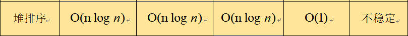

---

layout:     post
title:      「算法刷题」堆排序及其LeetCode题目
subtitle:   C++版本
date:       2022-02-11
author:     MRL Liu
header-img: img/the-first.png
catalog: True
tags: [算法刷题]
   
---

[TOC]

​         本文主要介绍排序算法中中常见的面试高频知识点：堆排序（heap-sort）。学习堆排序后，我们实际也同时掌握了堆、优先级队列的核心知识，可谓一石三鸟。熟练本文的归并排序的代码后您将至少可以解决以下Leetcode题目：

| 题目序号                 | 相关链接                                                     | 备注     |
| ------------------------ | ------------------------------------------------------------ | -------- |
| 912 排序数组（中等难度） | [912. 排序数组 - 力扣（LeetCode） (leetcode-cn.com)](https://leetcode-cn.com/problems/sort-an-array/submissions/) | 排序即可 |
| 75 颜色分类（中等难度）  | [75. 颜色分类 - 力扣（LeetCode） (leetcode-cn.com)](https://leetcode-cn.com/problems/sort-colors/) | 排序即可 |

​		如果您想趁热打铁，也可借机解决优先级队列的问题，相信事半功倍，至少可以解决以下Leetcode题目：

| 题目序号                                               | 相关链接                                                     | 备注                 |
| ------------------------------------------------------ | ------------------------------------------------------------ | -------------------- |
| 1046 最后一块石头的重量（简单难度）                    | [1046. 最后一块石头的重量 - 力扣（LeetCode） (leetcode-cn.com)](https://leetcode-cn.com/problems/last-stone-weight/) | 使用优先队列         |
| 215 数组中的第K个最大元素（中等难度）                  | [215. 数组中的第K个最大元素 - 力扣（LeetCode） (leetcode-cn.com)](https://leetcode-cn.com/problems/kth-largest-element-in-an-array/) | 使用优先队列         |
| 347 前K个高频元素（中等难度）                          | [347. 前 K 个高频元素 - 力扣（LeetCode） (leetcode-cn.com)](https://leetcode-cn.com/problems/top-k-frequent-elements/) | 使用哈希表和优先队列 |
| 剑指 Offer II 060. 出现频率最高的 k 个数字（中等难度） | [剑指 Offer II 060. 出现频率最高的 k 个数字 - 力扣（LeetCode） (leetcode-cn.com)](https://leetcode-cn.com/problems/g5c51o/) | 使用哈希表和优先队列 |
| 剑指 Offer 40. 最小的k个数（简单难度）                 | [剑指 Offer 40. 最小的k个数 - 力扣（LeetCode） (leetcode-cn.com)](https://leetcode-cn.com/problems/zui-xiao-de-kge-shu-lcof/) | 使用优先队列         |
| 面试题 17.14. 最小K个数（中等难度）                    | [面试题 17.14. 最小K个数 - 力扣（LeetCode） (leetcode-cn.com)](https://leetcode-cn.com/problems/smallest-k-lcci/) | 使用优先队列         |
| 295 数据流的中位数（困难难度）                         | [295. 数据流的中位数 - 力扣（LeetCode） (leetcode-cn.com)](https://leetcode-cn.com/problems/find-median-from-data-stream/) | 使用优先队列         |

​		（优先级队列的LeetCode题目的解决思路和代码将在优先级队列的博文中给出，本文不再给出）

​		堆排序在10个排序中的地位如下：


## 一、堆排序

​		堆排序（heap-sort）是利用一种叫做堆（heap）的数据结构所设计的排序算法。堆本质上就是用数组实现的二叉树，所以也叫做二叉堆。堆有一个性质，叫做堆有序。根据这种堆有序的性质，堆分为2种，最大堆（大顶堆）和最小堆（小顶堆）。在最大堆中，父节点的值都比每一个子节点的值要大；在最小堆中，父节点的值都比每一个子节点的值要小。（注意和二叉搜索树的区别，二叉搜索树是左子树的值比父节点的值小，右子树的值比父节点的值大）。下图是一个最大堆的内部数据的逻辑结构，根据这种特点，给定任意一个数所在的索引index，我们就可以知道它的父节点索引或者左右子节点的索引。


### 1、算法思路

​		假设从小到大排序，堆排序的基本思路是先将整个无序数组构造成一个最大堆，那么最大堆的根节点一定就是全局最大的数，将其取出来放入已排序序列；删除掉根节点的最大堆在重新构建一个最大堆，从而又找到了一个局部最大值，接着将其放入已排序序列，当无序序列中构建最大堆的数只剩下一个时，排序也就完成。过程如下：


### 2、编码思路

​		在上述思路分析中，可知将一个无序序列转换为堆是最关键的步骤。最大堆是一个父节点都大于子节点的二叉树，在编码上可以采取递归的方式来实现。我们首先借助C++的优先级队列来实现排序。

#### （1）借助优先级队列

​		在大多数编程语言中，优先级队列（Priority Queue）就可以看做是一个堆结构（其底层可能就是借助堆实现的），优先级队列的特点就是其队首元素始终是整个队列中最大或者最小的数，这和最大堆或最小堆的特点一样。所以，我们给出如下代码即可完成排序：


​		上述编码其实就是堆排序的思路，借助一个最大堆或最小堆，把无序序列始终调整为堆有序，其堆顶元素一定是全局最大或最小。现在假设面试官不让我们继续使用Priority Queue，让我们手写堆的调整结构，不要怕，难度也不会增加很多。

#### （2）手写堆排序

​		假设我们有一个函数adjust()，其功能就是负责将i为根节点的子树调整为堆有序，即满足最大堆或最小堆，那么我们借助这个adjust就可以写出如下堆排序的代码：


​		现在我们的任务就是写出adjust函数，其也利用了二叉树递归的思路，只要保证每个小子树中父节点比孩子节点都大或者都小即可，如下：


### 3、性能分析

​			先给出堆排序的性能分析结论：




​			此时我们已经完成了整个堆排序的任务，最重要的是adjust的实现，读者要多默写几遍。

### 4、参考资料

​		为了帮助读者学习该算法，笔者给出了自己写本文的参考资料和代码。本文的归并排序的代码如下：

```C++
//调整为堆有序，len是调整的序列长度，parent是堆对应的二叉树的根节点索引
void adjust(vector<int> &nums, int len, int parent){
    int left = 2 * parent + 1; // parent的左子节点
    int right = 2 * parent + 2;// parent的右子节点

    int maxIdx = parent;//假设父节点为最大值
    // 如果左子节点大于最大值，则最大值设为左子节点
    if (left < len && nums[left] > nums[maxIdx])     maxIdx = left;
    // 如果右子节点大于最大值，则最大值设为右子节点
    if (right < len && nums[right] > nums[maxIdx])     maxIdx = right;
    // 如果此时父节点已经不是最大值
    if (maxIdx != parent) {
        swap(nums[maxIdx], nums[parent]);//交换父节点和最大值，
        adjust(nums, len, maxIdx);//交换后，原来最大值的位置可能已不是其对应子树的最大值，所以要重新调整下
    }
}
/**堆排序**/
void heapSort(vector<int> &nums){
    int len=nums.size();
    // 构建最大堆（从右向左依次传入父节点的索引i，最右侧的父节点索引一定是（len-1）/2）
    for(int i = (len-1) / 2 ; i >= 0; i--){
        adjust(nums, len, i);// 负责将i为根节点的子树调整为堆
    }
    // 进行堆排序
    for(int i = len - 1; i >= 1; i--){
        // 把最大堆的堆顶元素与最后一个元素交换
        swap(nums[0], nums[i]); 
        // 调整剩余的打乱的数为最大堆，其根节点索引始终是0，长度为i（i=1时表示排序完成）
        adjust(nums, i, 0);              
    }
}
void heapSort_withPQ(vector<int> &nums){
    int len=nums.size();
    priority_queue<int> max_heap;//初始化一个优先级队列（默认就是最大堆的特点）
    // 将整个数组元素加入最大堆
    for(int i = 0; i <len; i++){
        max_heap.push(nums[i]);              
    }
    // 进行堆排序
    for(int i = len - 1; i >= 0; i--){
        nums[i] = max_heap.top(); // 把栈顶元素赋给末尾元素，剩下的元素max_heap会自动调整为最大堆
        max_heap.pop();     
    }
}
```

​			同时我们也给出一个简易堆的实现：

```c++
class Heap{
public:
    Heap(vector<int> &nums){
        int len=nums.size();
        showArray(nums,"构建堆前：");
        // 构建最大堆
        for(int i = (len-1) / 2 ; i >= 0; i--){
            adjust(nums, len, i);// 负责将i为父节点的子树调整为堆
        }
        showArray(nums,"构建堆后：");
    }
private:
    // 显示数组内容
    void showArray(vector<int> &nums,string name="",int start=0){
        cout<<name;
        for (int i = start; i < nums.size(); i++)
        {
            cout<<nums[i]<<" ";
        }
        cout<<endl;
    }
    // 调整为堆排序
    void adjust(vector<int> &nums, int len, int parent){
        int left = 2 * parent + 1; // index的左子节点
        int right = 2 * parent + 2;// index的右子节点

        int maxIdx = parent;//假设父节点为最大值
        // 如果左子节点大于最大值，则最大值设为左子节点
        if (left < len && nums[left] > nums[maxIdx])     maxIdx = left;
        // 如果右子节点大于最大值，则最大值设为右子节点
        if (right < len && nums[right] > nums[maxIdx])     maxIdx = right;
        // 如果此时父节点已经不是最大值
        if (maxIdx != parent) {
            swap(nums[maxIdx], nums[parent]);//交换父节点和最大值，
            adjust(nums, len, maxIdx);//交换后，原来最大值的位置可能已不是其对应子树的最大值，所以要重新调整下
        }
    }
};

int main(){
    //vector<int> nums={5,6,1,4,3,7,2,8};
    vector<int> nums={4,6,7,5,3,1,2};
    Heap* heap = new Heap(nums);
    
    system("pause");
    return 0;
}
```

​		更多参考资料：

[十大排序算法(背诵版+动图) - 力扣（LeetCode）](https://leetcode-cn.com/circle/article/0akb5U/)

[（四）排序【C++刷题】-Caoer199-博客园(cnblogs.com)](https://www.cnblogs.com/caoer/p/15722363.html)

## 二、LeetCode题目

`912 排序数组（中等难度）`和`75 颜色分类（中等难度）`几乎可以直接使用堆排序算法源码，此处不再列举。

