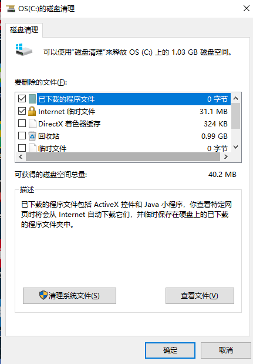
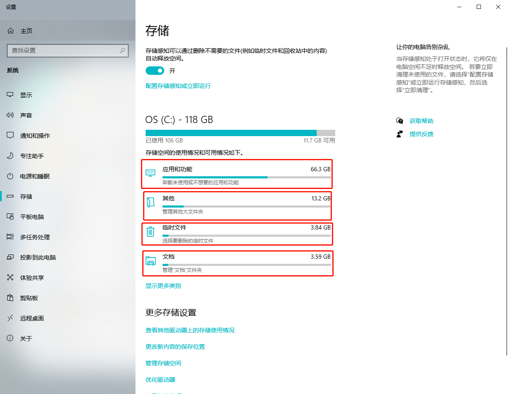

---

layout:     post
title:      「环境配置」windows清理C盘空间
subtitle:   windows系统
date:       2022-02-13
author:     MRL Liu
header-img: img/the-first.png
catalog: True
tags: [环境配置]
   
---

[TOC]

​         Windows电脑操作系统一般是安装在磁盘驱动器的C盘中，一旦运行，便会产生许多垃圾文件，C盘空间在一定程度上都会越来越小。伴随着电脑工作的时间越久，C盘常常会提示显示其内存已不足。本文记录笔者清理机器的步骤

## 一、使用Windows自带工具清理

​			在电脑桌面点击【此电脑】，鼠标右击【C盘】选择【属性】，在【属性】页面点击【磁盘清理】，然后点击【清理系统文件】，勾选需要删除的文件，点击【确定】后再点击【删除文件】。

## 二、清理系统中的大文件

​		先使用快捷键win+i打开设置界面，进入系统的存储Tab，可以查看到目前的主要大文件和大型应用：

可以根据需要删除目前的大型文件或文件夹缓存，主要网络搜索下该文件内容是否重要。
