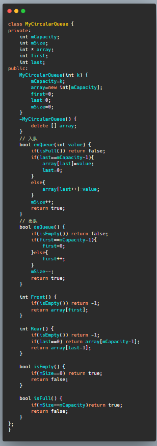
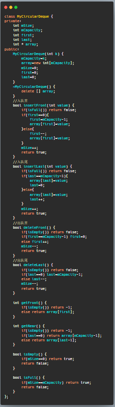
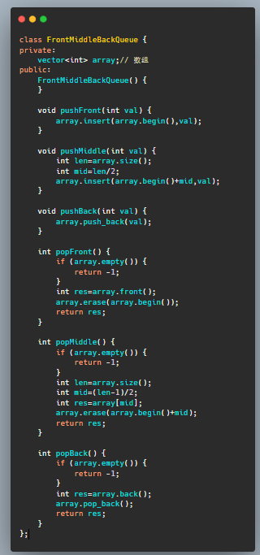
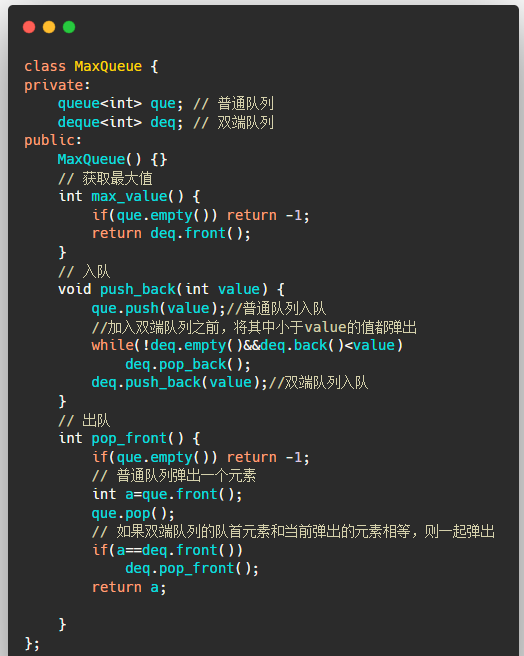

---

layout:     post
title:      「算法刷题」循环队列及其LeetCode题目
subtitle:   C++版本
date:       2022-02-14
author:     MRL Liu
header-img: img/the-first.png
catalog: True
tags: [算法刷题]
   
---

[TOC]

​         本文主要介绍数据结构算法中中常见的面试高频知识点：优先级队列（priority-queue）。如果您之前学习过本文的堆排序后，那本质上对优先级队列的底层实现也就非常了解了。本文不会讲解优先级队列的底层实现，只会关注于其使用和相关的题目。

​		熟练本文的优先级队列的代码后您将至少可以解决以下Leetcode题目：

| 题目序号                                     | 相关链接                                                     | 备注                         |
| -------------------------------------------- | ------------------------------------------------------------ | ---------------------------- |
| 622. 设计循环队列（中等难度）                | [622. 设计循环队列 - 力扣（LeetCode） (leetcode-cn.com)](https://leetcode-cn.com/problems/design-circular-queue/comments/) | 注意队首指针和队尾指针的定义 |
| 641. 设计循环双端队列（中等难度）            | [641. 设计循环双端队列 - 力扣（LeetCode） (leetcode-cn.com)](https://leetcode-cn.com/problems/design-circular-deque/) | 注意队首指针和队尾指针的定义 |
| 1670. 设计前中后队列（中等难度）             | [1670. 设计前中后队列 - 力扣（LeetCode） (leetcode-cn.com)](https://leetcode-cn.com/problems/design-front-middle-back-queue/) |                              |
| 剑指 Offer 59 - II. 队列的最大值（中等难度） | [剑指 Offer 59 - II. 队列的最大值 - 力扣（LeetCode） (leetcode-cn.com)](https://leetcode-cn.com/problems/dui-lie-de-zui-da-zhi-lcof/) |                              |

## 一、循环队列的相关LeetCode题目解析

【first队首指针】指向队列头部第 11 个有效数据的位置； 

【last队尾指针】指向队列尾部的下一个位置，即下一个从队尾入队元素的位置。

即使是循环双端队列，这种定义也不变。

### 1、设计循环队列

[622. 设计循环队列 - 力扣（LeetCode） (leetcode-cn.com)](https://leetcode-cn.com/problems/design-circular-queue/comments/)




### 2、设计循环双端队列

[641. 设计循环双端队列 - 力扣（LeetCode） (leetcode-cn.com)](https://leetcode-cn.com/problems/design-circular-deque/)




### 3、设计前中后队列

[1670. 设计前中后队列 - 力扣（LeetCode） (leetcode-cn.com)](https://leetcode-cn.com/problems/design-front-middle-back-queue/)




### 4、设计最大值队列

[剑指 Offer 59 - II. 队列的最大值 - 力扣（LeetCode） (leetcode-cn.com)](https://leetcode-cn.com/problems/dui-lie-de-zui-da-zhi-lcof/)

​		本题的解题思路：定义一个普通队列queue用于正常出入队，一个双端队列deque用于存放最大元素。

​		比如，连续放入三个元素1，2,3，那么queue里面就是1,2,3,，但是deque只存最大值3在队头

​		再比如1,2,3,4,5,4,1,2,3

​		按照这个顺序入队，那么deque只需存放5,4,3




## 二、LeetCode题目答案

​			本小节直接给出本文各个题目的答案，供有需求的读者复制。

### 1、622. 设计循环队列（中等难度）

```c++
class MyCircularQueue {
private:
    int mCapacity;
    int mSize;
    int * array;
    int first;
    int last;
public:
    MyCircularQueue(int k) {
        mCapacity=k;
        array=new int[mCapacity];
        first=0;
        last=0;
        mSize=0;
    }
    ~MyCircularQueue() {
        delete [] array;
    }
    // 入队
    bool enQueue(int value) {
        if(isFull()) return false;
        if(last==mCapacity-1){
            array[last]=value;
            last=0;
        }
        else{
            array[last++]=value;
        }
        mSize++;
        return true;
    }
    // 出队
    bool deQueue() {
        if(isEmpty()) return false;
        if(first==mCapacity-1){
            first=0;
        }else{
            first++;
        }
        mSize--;
        return true;
    }
    
    int Front() {
        if(isEmpty()) return -1;
        return array[first];
    }
    
    int Rear() {
        if(isEmpty()) return -1;
        if(last==0) return array[mCapacity-1];
        return array[last-1];
    }
    
    bool isEmpty() {
        if(mSize==0) return true;
        return false;
    }
    
    bool isFull() {
        if(mSize==mCapacity)return true;
        return false;
    }
};
```

### 2、641. 设计循环双端队列（中等难度）

```c++
class MyCircularDeque {
private:
    int mSize;
    int mCapacity;
    int first;
    int last;
    int * array;
public:
    MyCircularDeque(int k) {
        mCapacity=k;
        array=new int[mCapacity];
        mSize=0;
        first=0;
        last=0;
    }
    ~MyCircularDeque() {
        delete [] array;
    }
    //入队首
    bool insertFront(int value) {
        if(isFull()) return false;
        if(first==0){
            first=mCapacity-1;
            array[first]=value;
        }else{
            first--;
            array[first]=value;
        }
        mSize++;
        return true;
    }
    //入队尾
    bool insertLast(int value) {
        if(isFull()) return false;
        if(last==mCapacity-1){
            array[last]=value;
            last=0;
        }else{
            array[last]=value;
            last++;
        }
        mSize++;
        return true;
    }
    //出队首
    bool deleteFront() {
        if(isEmpty()) return false;
        if(first==mCapacity-1) first=0;
        else first++;
        mSize--;
        return true;
    }
    //出队尾
    bool deleteLast() {
        if(isEmpty()) return false;
        if(last==0) last=mCapacity-1;
        else last--;
        mSize--;
        return true;
    }
    
    int getFront() {
        if(isEmpty()) return -1;
        else return array[first];
    }
    
    int getRear() {
        if(isEmpty()) return -1;
        if(last==0) return array[mCapacity-1];
        else return array[last-1];
    }
    
    bool isEmpty() {
        if(mSize==0) return true;
        return false;
    }
    
    bool isFull() {
        if(mSize==mCapacity) return true;
        return false;
    }
};
```

### 3、1670. 设计前中后队列（中等难度）

```c++
class FrontMiddleBackQueue {
private:
    vector<int> array;// 数组
public:
    FrontMiddleBackQueue() {
    }
    
    void pushFront(int val) {
        array.insert(array.begin(),val);
    }
    
    void pushMiddle(int val) {
        int len=array.size();
        int mid=len/2;
        array.insert(array.begin()+mid,val);
    }
    
    void pushBack(int val) {
        array.push_back(val);
    }
    
    int popFront() {
        if (array.empty()) {
            return -1;
        }
        int res=array.front();
        array.erase(array.begin());
        return res;
    }
    
    int popMiddle() {
        if (array.empty()) {
            return -1;
        }
        int len=array.size();
        int mid=(len-1)/2;
        int res=array[mid];
        array.erase(array.begin()+mid);
        return res;
    }
    
    int popBack() {
        if (array.empty()) {
            return -1;
        }
        int res=array.back();
        array.pop_back();
        return res;
    }
};
```

### 4、剑指 Offer 59 - II. 队列的最大值（中等难度）

```c++
class MaxQueue {
private:
    queue<int> que; // 普通队列
    deque<int> deq; // 双端队列
public:
    MaxQueue() {}
    // 获取最大值
    int max_value() {
        if(que.empty()) return -1;
        return deq.front();
    }
    // 入队
    void push_back(int value) {
        que.push(value);//普通队列入队
        //加入双端队列之前，将其中小于value的值都弹出
        while(!deq.empty()&&deq.back()<value)
            deq.pop_back();
        deq.push_back(value);//双端队列入队
    }
    // 出队
    int pop_front() {
        if(que.empty()) return -1;
        // 普通队列弹出一个元素
        int a=que.front();
        que.pop();
        // 如果双端队列的队首元素和当前弹出的元素相等，则一起弹出
        if(a==deq.front())
            deq.pop_front();
        return a;

    }
};
```

