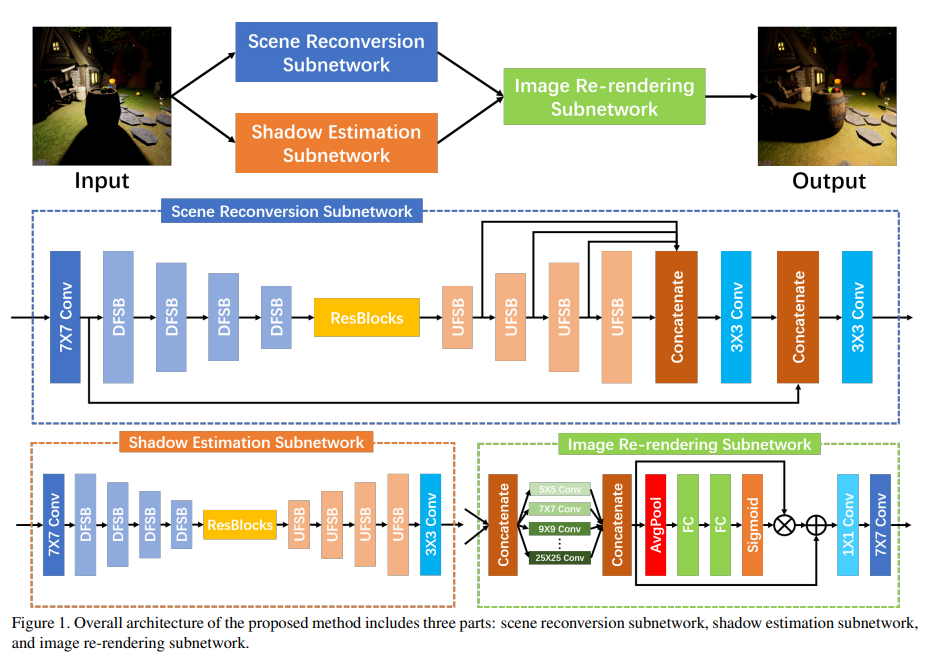
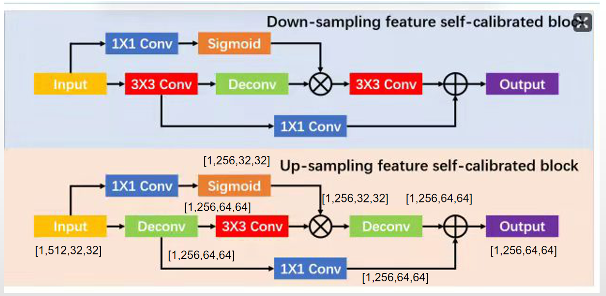

---

layout:     post
title:      「论文分享」用于图像光源迁移的多尺度自校准网络
subtitle:   CVPR 2021
date:       2022-03-21
author:     MRL Liu
header-img: img/the-first.png
catalog: True
tags: [论文分享]
   
---

[TOC]

​			本文介绍CVPR Workshop 2021年的《Multi-scale Self-calibrated Network for Image Light Source Transfer》，相关代码已经发布在 https://github.com/mdswyz/MCN-light-source-transfer。 该文的方法和DRN非常相似，甚至行文思路都非常相似，本文就不详细介绍，重点研究两者不同的地方。

# 主要贡献

​			在最新的研究（DRN）中，LLST被分解为场景恢复、阴影估计和图像重新渲染三个子任务，为图像重新照明提供了新的范式。 该文认为场景重建和阴影估计任务存在许多问题，包括未校准的特征信息和较差的语义信息，仍未解决，从而导致特征表示不足。 该文的主要贡献：

（1）提出了新的**下采样特征自校准块*down-sampling feature self-calibrated block*（DFSB）**和**上采样特征自校准块 *up-sampling feature self-calibrated block*（UFSB）**作为特征编码器和解码器的基本块，以提高特征表示能力。

（2） 将**多尺度特征融合方法**设计到**场景重建任务**的**特征解码器结构**中，为图像重新渲染任务提供更准确的主要场景结构。

# 该文方法

​		该文提出的多尺度重照明网络的架构（MCN）如下图所示：




​		MCN和DRN一样，都由三部分组成：场景重建、阴影先验估计和重新渲染器。  图像重新渲染子网络和DRN提出的重新渲染器组件一样。其中MCN的改进在于：

（1）场景重建子网和阴影估计子网都使用该文所提出的 DFSB 和 UFSB 作为特征编码和解码的基本块。

（2） 该文在场景重建子网络的特征解码部分融合了多尺度特征，以丰富输出特征的语义信息。




## 1、DFSB和UFSB

DFSB

```python
# 上采样块UFSB
class UpBlock(torch.nn.Module):
    def __init__(self, input_size):
        super(UpBlock, self).__init__()
        output_size = input_size//2
        self.conv1 = DeconvBlock(input_size, output_size, kernel_size=4, stride=2, padding=1, bias=True)
        self.conv2 = ConvBlock(output_size, output_size, kernel_size=3, stride=2, padding=1, bias=True)
        self.conv3 = DeconvBlock(output_size, output_size, kernel_size=4, stride=2, padding=1, bias=True)
        self.local_weight1 = ConvBlock(input_size, output_size, kernel_size=1, stride=1, padding=0, bias=True)
        self.local_weight2 = ConvBlock(output_size, output_size, kernel_size=1, stride=1, padding=0, bias=True)

    def forward(self, x):
        hr = self.conv1(x)
        lr = self.conv2(hr)
        lr_calibration = torch.mul(torch.sigmoid(self.local_weight1(x)), lr)# residue = self.local_weight1(x) - lr
        hr_calibration = self.conv3(lr_calibration)
        hr_weight = self.local_weight2(hr)
        return hr_weight + hr_calibration

```

UFSB

```python
# 下采样块DFSB
class DownBlock(torch.nn.Module):
    def __init__(self, input_size):
        super(DownBlock, self).__init__()
        output_size = input_size*2
        self.conv1 = ConvBlock(input_size, output_size, kernel_size=3, stride=2, padding=1, bias=True)
        self.conv2 = DeconvBlock(output_size, output_size, kernel_size=4, stride=2, padding=1, bias=True)
        self.conv3 = ConvBlock(output_size, output_size, kernel_size=3, stride=2, padding=1, bias=True)
        self.local_weight1 = ConvBlock(input_size, output_size, kernel_size=1, stride=1, padding=0, bias=True)
        self.local_weight2 = ConvBlock(output_size, output_size, kernel_size=1, stride=1, padding=0, bias=True)

    def forward(self, x):
        lr = self.conv1(x)
        hr = self.conv2(lr)
        hr_calibration = torch.mul(torch.sigmoid(self.local_weight1(x)), hr)# residue = self.local_weight1(x) - hr
        lr_calibration = self.conv3(hr_calibration)
        lr_weight = self.local_weight2(lr)
        return lr_weight + lr_calibration
```

## 2、场景重建网络

（1）定义模块

```python
# 编码器
"""
Encoder = []
for i in range(n_downsampling):
    mult = 2 ** i
    Encoder += [DownBlock(ngf * mult)]
self.encoder = nn.Sequential(*Encoder)
"""
self.encoder1 = DownBlock(ngf*(2**0))
self.encoder2 = DownBlock(ngf*(2**1))
self.encoder3 = DownBlock(ngf*(2**2))
self.encoder4 = DownBlock(ngf*(2**3))
# 解码器
        """
        Decoder = []
        for i in range(n_downsampling):
            mult = 2 ** (n_downsampling - i)
            Decoder += [UpBlock(ngf * mult)]
        self.decoder = nn.Sequential(*Decoder)
        """
        self.decoder1 = UpBlock(ngf*(2**(4-0)))
        self.decoder2 = UpBlock(ngf*(2**(4-1)))
        self.decoder3 = UpBlock(ngf*(2**(4-2)))
        self.decoder4 = UpBlock(ngf*(2**(4-3)))

        self.multi_scale_1 = nn.ConvTranspose2d(ngf * (2 ** (4 - 1)), ngf * (2 ** (4 - 4)), kernel_size=8, stride=8, bias=True)
        self.multi_scale_2 = nn.ConvTranspose2d(ngf * (2 ** (4 - 2)), ngf * (2 ** (4 - 4)), kernel_size=4, stride=4, padding=0, bias=True)
        self.multi_scale_3 = nn.ConvTranspose2d(ngf * (2 ** (4 - 3)), ngf * (2 ** (4 - 4)), kernel_size=4, stride=2, padding=1, bias=True)
        #self.multi_scale_4 = nn.ConvTranspose2d(ngf * (2 ** (4 - 3)), ngf * (2 ** (4 - 3)), kernel_size=4, stride=, padding=1, bias=True)
        self.cat = nn.Conv2d(ngf * (2 ** (4 - 4))*4, ngf * (2 ** (4 - 4)), kernel_size=3, padding=1)
```

（2）前向传播

```python
def forward(self, input):
        # 输入块
        m_in = self.inlayer(input) # 处理后的tensor，shape=(1,32,512,512)
        # 编码器
        #m = self.encoder(m_in) # 处理后的tensor，shape=(1,512,32,32)
        feature_d1 = self.encoder1(m_in)
        feature_d2 = self.encoder2(feature_d1)
        feature_d3 = self.encoder3(feature_d2)
        feature_d4 = self.encoder4(feature_d3)
        # 残差块
        m = self.manipulate(feature_d4) # 处理后的tensor，shape=(1,512,32,32)
        # 解码器
        #m = self.decoder(m) # 处理后的tensor，shape=(1,32,512,512)
        feature_u1 = self.decoder1(m)
        feature_u2 = self.decoder2(feature_u1)
        feature_u3 = self.decoder3(feature_u2)
        feature_u4 = self.decoder4(feature_u3)
        scale1 = self.multi_scale_1(feature_u1)
        scale2 = self.multi_scale_2(feature_u2)
        scale3 = self.multi_scale_3(feature_u3)
        feature_u4 = torch.cat([scale1,scale2,scale3,feature_u4],dim=1)
        feature_u4 = self.cat(feature_u4)
        # 跳跃链接
        m = torch.cat([m_in, feature_u4], dim=1) # 处理后的tensor，shape=(1,64,512,512)
        # 卷积操作
        m = self.shortconect(m) # 处理后的tensor，shape=(1,32,512,512)
        # out = self.out(m)
        return m
```

