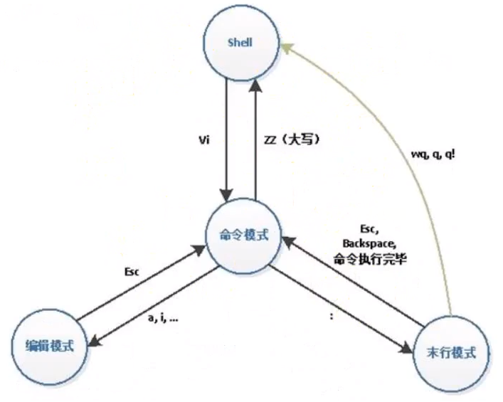
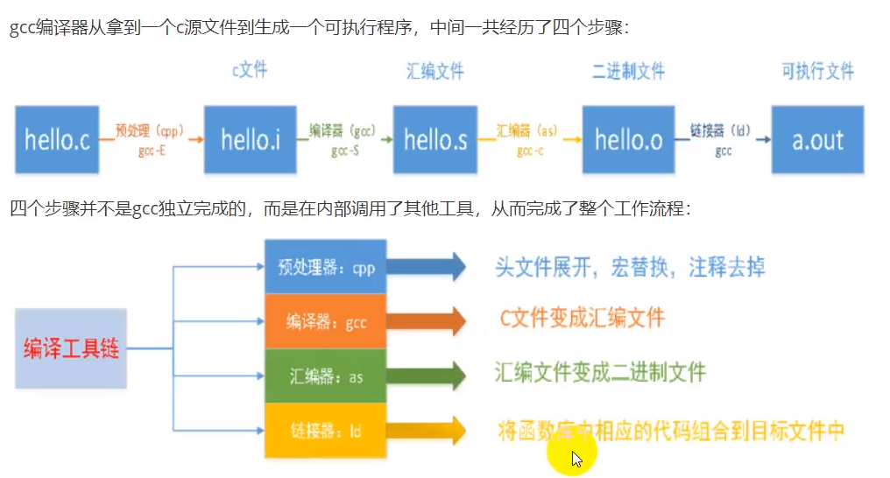

---

layout:     post
title:      「项目复现」Linux基础知识
subtitle:   C++11
date:       2022-03-26
author:     MRL Liu
header-img: img/post-bg-hacker.png
catalog: true
tags:
    - 项目复现
---

[TOC]

​		本文记录linux的一些基础知识。

# 一、Linux的常见目录

```c++

/: Linux根目录。
	/home:存放主目录的家目录。命令行中切换到根目录：“cd /home”
		/~:存放用户文件的主目录。命令行中切换到主目录：“cd /home/用户名”或者“cd ~”
    /root:系统管理员的目录。
	/bin:存放可执行二进制文件的二进制目录，如常用的命令ls，tar，mv,cat等
    /sbin:存放系统管理员使用的二进制命令的目录。
	/boot:存放系统启动时用到的引导文件的引导目录。
        /boot/grub:系统引导管理器
        /boot/vmlinuz:Linux的内核文件
	/dev:设备目录。存放系统的设备文件。
	/etc:系统配置文件存放的目录。
	/lib:系统使用的函数库的目录。
    /srv:服务启动用之后需要访问的数据文件。
    /usr:应用程序存放目录。
        /usr/bin：存放应用程序
        /usr/share：存放共享数据
        /usr/lib：存放程序运行的函数库文件。
        /usr/local:存放软件升级包。
    /sys:系统文件存放目录
    /var:系统执行过程中产生的动态目录。
    /tmp:程序执行的临时文件存放目录。
	/lost+found:系统异常产生错误时，将一些遗失片段放置于该目录下。
        
    
```

# 二、Linux的命令解释器

​		命令解释器比图形界面执行要快。Linux系统提供了多种命令解释器，如shell（/bin/sh），如bash（/bin/bash）。其中Bash解释器就是Linux中终端默认的命令解释器

## 1、Bash解释器常用快捷键

```C++
Tab键：补齐命令、补齐路径、显示当前目录下的所有目录（按两下）
Ctrl+L：清屏，等价于输入“clear”。
Ctrl+C：中断进程，将当前正在运行的命令中断。
遍历历史命令：ctrl+p（向上），ctrl+n（向下）
移动光标命令：
    光标左移：ctrl+b（向左）
    光标右移：ctrl+f（向右）
    移动到头部：ctrl+a（home）
    移动到尾部：ctrl+e（end）
```

## 2、Linux命令格式

`command [-option][pararmeter]`

查看内建命令和外部命令的区别

```c++
type -a 命令
```

# 三、Linux的文本编辑器

Linux下的纯文本编辑器gedit，等价于windows中的记事本。

vi是linux中最常用的文本编辑器，是所有linux程序都自带的文本编辑器，其工作在字符模式下。

vim是vi的升级版，兼容vi的所有指令。

## 1、vim的是工作模式

vim有三种基本工作模式：命令模式、编辑模式、末行模式




相关命令：

```c++
$ vim //进入vim的命令模式
//输入i进入vim的编辑模式，此时可以编辑文本
//输入:进入vim的末行模式，此时可以输入编辑器命令  
//退出vim则输入:q
```

# 四、Linux的GCC编译器

​		Linux的GCC编译器（GNU Cimpiler Collection，GNU编译器套件）是由GNU开发的编程语言编译器，现已被大多数类UNIX操作系统（如Linux、BSD、Max OS X等）采纳为标准编译器，同样存在Windows版本的GCC编译器。GCC最初用于编译C语言，现在已经能够编译C、C++、Java、Go等主流语言。

​		查看GCC版本：gcc -V / --version

## 1、GCC的工作流程

​		GCC编译器的编译命令：

```C++
常见编译格式：
gcc hello.c -o hello //将hello.c编译为为hello.out
gcc -g hello.c -o hello //将hello.c编译为为hello.out,包含调试信息
等价于四步编译指令：
gcc -E hello.c -o hello.i //将hello.c预处理为hello.i
gcc -S hello.i -o hello.s //将hello.i编译为hello.s(汇编文件)
gcc -c hello.s -o hello.o //将hello.s汇编为hello.o(二进制文件)
gcc hello.o -o hello      //将hello.o链接为hello.out(linux的可执行文件)
其他编译指令：
gcc -On
gcc -Wall hello.c//显示所有警告信息
gcc -Wall -Werror hello.c //将所有警告信息当作错误处理
gcc hello.c -DDEBUG //编译时定义宏（-D后跟着DEBUG）
```

​		GCC的工作流程：




## 2、静态链接库和动态链接库

​			在为客户提供软件服务时，有时候不能提供自己的核心代码，这时候就可以将自己的核心代码做成链接库的形式。链接库分为静态链接库和动态链接库。

​			静态链接库（.lib）在GCC编译时执行静态链接到最后的可执行文件（.out），其优点是兼容性高，对环境依赖性低；缺点是最终生成的可执行文件（.out）会变大，当库函数更新时，需要重新编译整个应用程序。

​			动态链接库（.ddl）在程序运行时才将所需资源调入可执行程序，其优点是可以降低可执行文件（.out）的大小，多个应用程序间可以共享东一个动态链接库；缺点是缺少动态库则不能独立运行，对版本依赖严重

# 四、Linux的GDB调试器

1、生成调试信息

gcc -g hello.c -o hello

g++ -g hello.cpp -o hello

2、启动GDB

启动GDB：gdb hello.out (hello就是你的执行文件)

设置运行时参数：set args  10 20 30 40

查看运行时参数：show args

启动程序：run start

# 四、Linux的项目编译工具

​		一个项目目录中一般存在多个源文件（.c/.cpp）和相关目录，不同文件之间的编译顺序也不相同。Linux提供了Makefile作为项目自动化编译的工具。make是一个命令工具。

​		Makefile文件的命名规则：推荐使用Makefile

​		make的工具的安装：sudo apt install make.
Makefile基本规则三要素：

​		

