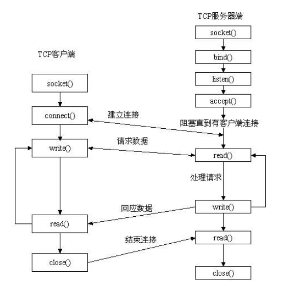

---

layout:     post
title:      「项目复现」linux并发编程之Socket编程
subtitle:   互斥锁+局部静态变量+C++11
date:       2022-03-29
author:     MRL Liu,WJ
header-img: img/post-bg-hacker.png
catalog: true
tags:
    - 项目复现
---

[TOC]

​		**套接字**作为绝大部分应用的网络编程范式，是非常重要的。本文主要参考了《Linux高性能服务器编程》

# 一、建立Socket连接




重要的Socket函数介绍如下:

## 1、创建socket：socket()函数

作用：创建一个Socket文件描述符，唯一标识一个socket

> \#include<sys/tpyes.h> 
>
> \#include<sys/socket.h>
>
> int  socket(int domain, int type, int protocol);

### （1）参数		

domain参数指定底层协议族，最常用的是TCP/IP协议族，应该设置为PE_INET(Protocol Family of Internet，用于IPv4)或PE_INET6（用于IPv6）；对于UNIX本地域协议族而言，该参数应该设 置为PF_UNIX。

​		type参数指定服务类型。服务类型主要有SOCK_STREAM服务（流 服务）和SOCK_UGRAM（数据报）服务。对TCP/IP协议族而言，其值 取SOCK_STREAM表示传输层使用TCP协议，取SOCK_DGRAM表示传 输层使用UDP协议。

​		protocol参数是在前两个参数构成的协议集合下，再选择一个具体 的协议。不过这个值通常都是唯一的（前两个参数已经完全决定了它的值）。几乎在所有情况下都设置为0，表示使用默认协 议。

### （2）返回值

​		该函数调用成功则返回一个socket文件描述符，失败则返回-1并设置errno。

## 2、命名socket：bind()函数

作用：把一个地址族中的特定socket地址（IP地址+端口号）赋给socket，通常用于服务端程序。

> \#include<sys/tpyes.h> 
>
> \#include<sys/socket.h> 
>
> int bind(int sockfd, const struct sockaddr *addr, socklen_t addrlen);

### （1）参数

​		sockfd是socket()函数创建的socket文件描述符。

​		addr是struct sockarrr 类型的socket地址指针。

​		addrlen是该socket地址的长度。

### （2）返回值

​		该函数调用成功则返回0，失败则返回-1并设置errno。其中两种常见的 errno是EACCES和EADDRINUSE，它们的含义分别是：

​		EACCES，被绑定的地址是受保护的地址，仅超级用户能够访问。比如普通用户将socket绑定到知名服务端口（端口号为0～1023）上 时，bind将返回EACCES错误。

​		EADDRINUSE，被绑定的地址正在使用中。比如将socket绑定到 一个处于TIME_WAIT状态的socket地址

## 3、监听socket：listen()函数

如果作为一个服务器，在调用socket()、bind()之后就会调用listen()来监听这个socket；

如果作为一个客户端，这时调用connect()发出连接请求，服务器端就会接收到这个请求。

> \#include<sys/tpyes.h> 
>
> \#include<sys/socket.h> 
>
> int listen(int sockfd, int backlog);

### （1）参数

​		sockfd为要监听的socket文件描述符，

​		backlog为内核监听队列的最大长度。监听队列的长度如果超过backlog，服务器将不受理新的客户 连接，客户端也将收到ECONNREFUSED错误信息

### （2）返回值

​		listen成功时返回0，失败则返回-1并设置errno。

## 4、接收连接：accept()函数

accept只是从监听队列中取出连接而不论连接处于何种状态，更不关心任何网络状况的变化。

> \#include<sys/tpyes.h> 
>
> \#include<sys/socket.h> 
>
> int accept(int sockfd, struct sockaddr* addr，socklen_t * addrlen);

### （1）参数

​		sockfd为要监听的socket文件描述符，

​		addraddr参数用来获取被接受连接的远端socket地址，

​		addrlen参数指出获取的该socket地址的长度。

### （2）返回值

​		accept成功时返回一个新的连接socket，失败则返回-1并设置errno。

## 5、发起连接：connect()函数

connect只是从监听队列中取出连接而不论连接处于何种状态，更不关心任何网络状况的变化。

> \#include<sys/tpyes.h> 
>
> \#include<sys/socket.h> 
>
> int connect(int sockfd, const struct sockaddr* serv_addr，socklen_t * addrlen);

### （1）参数

​		sockfd为要监听的socket文件描述符，

​		addraddr参数用来获取服务端监听的socket地址，

​		addrlen参数指出获取的该socket地址的长度。

### （2）返回值

​		connect成功时返回0，失败则返回-1并设置errno。

​		其中两种常见的errno是ECONNREFUSED和 ETIMEDOUT，它们的含义如下： 

​		ECONNREFUSED表示目标端口不存在，连接被拒绝。

​		ETIMEDOUT表示连接超时

## 6、关闭连接：close()函数和shutdown()函数

关闭一个连接实际上就是关闭该连接对应的socket，这可以通过如下关闭普通文件描述符的系统调用来完成： 

> \#include<unistd.h> 
>
> int close(int sockfd);

### （1）参数

​		sockfd为要关闭的socket文件描述符。

​       close系统调用并非总是立即关闭一个连接，而是将fd的引用计数减1。只有当fd的引用计数为0时，才真正关闭连接。多进程程序中，一次fork系统调用默认将使父进程中打开的socket的引用计数加1，因此我们必须在父进程和子进程中都对该socket执行close调用才能将连接关闭。 如果无论如何都要立即终止连接（而不是将socket的引用计数减1），可以使用如下的shutdown系统调用（相对于close来说，它是专门为网络编程设计的）

> #include<sys/socket.h> 
>
> int shutdown(int sockfd,int howto); 

### （2）参数

​		sockfd参数是待关闭的socket。

​		howto参数决定了shutdown的行为。

### （3）返回值

​		shutdown成功时返回0，失败则返回-1并设置errno。

# 二、Socket数据读写

## 1、TCP数据读写

​		对文件的读写操作read和write同样适用于socket。但是socket编程接口提供了几个专门用于socket数据读写的系统调用，它们增加了对数据读写的控制。其中用于TCP流数据读写的系统调用是：

> #include<sys/tpyes.h> 
>
> \#include<sys/socket.h> 
>
> ssize_t recv(int sockfd,void*buf,size_t len,int flags); 
>
> ssize_t send(int sockfd,const void*buf,size_t len,int flags); 

​		recv读取sockfd上的数据，buf和len参数分别指定读缓冲区的位置和 大小，flags参数的含义见后文，通常设置为0即可。

​		recv成功时返回实际读取到的数据的长度，它可能小于我们期望的长度len。因此我们可能 

要多次调用recv，才能读取到完整的数据。

​		recv可能返回0，这意味着通信对方已经关闭连接了。recv出错时返回-1并设置errno。

​		send往sockfd上写入数据，buf和len参数分别指定写缓冲区的位置和大小。send成功时返回实际写入的数据的长度，失败则返回-1并设置 errno。

# 三、Socket的应用

## 1、服务端程序

```c++
#include<sys/socket.h>
#include<netinet/in.h>
#include<string.h>
#include<errno.h>
#include<fcntl.h>
#include<arpa/inet.h>
#include<stdio.h>
#include<assert.h>
#include<unistd.h>
#include<stdlib.h>
#include"log/logger.h"

#define MAXLINE 4096
#define DEFAULT_PORT 8000


void Server(int port){
    LOG_INFO("服务端程序启动...\n");
    // 创建一个IPv4的socket地址
    struct sockaddr_in address;//socket地址
    bzero(&address, sizeof(address));//将该地址清空为0
    address.sin_family = AF_INET;//设置IPv4的地址族
    //inet_pton(AF_INET,ip,&address.sin_addr);//手动设置IP地址
    address.sin_addr.s_addr = htonl(INADDR_ANY);// 自动获取本机的IP地址并且设置
    address.sin_port = htons(port);//端口号
    // 创建一个监听套接字
    int m_listenfd = socket(PF_INET, SOCK_STREAM, 0);
    if(m_listenfd == -1) {
        LOG_ERROR("创建socket出错：%s(errno:%d)\n",strerror(errno),errno);
    }
    else {
        LOG_DEBUG("创建socket成功\n");
    }
    // 监听套接字绑定socket地址
    int flag = 1;
    setsockopt(m_listenfd, SOL_SOCKET, SO_REUSEADDR, &flag, sizeof(flag));//允许重用本地地址和端口
    int ret = bind(m_listenfd, (struct sockaddr *)&address, sizeof(address));//绑定socket地址
    if(ret == -1) {
        LOG_ERROR("绑定socket出错：%s(errno:%d)\n",strerror(errno),errno);
    }
    else {
        LOG_DEBUG("绑定socket成功\n");
    }
    // 开启监听
    ret = listen(m_listenfd, 5);
    if(ret == -1) {
        LOG_ERROR("监听socket出错：%s(errno:%d)\n",strerror(errno),errno);
    }
    else {
        LOG_DEBUG("监听socket成功\n");
    }
    // 开启监听循环
    int connfd=-1;
    char buff[4096];
    int n;
     LOG_INFO("等待客户端请求中...\n");
    while(1){
        // 阻塞等待接受客户端的连接
        struct sockaddr_in client;
        socklen_t client_addrlen=sizeof(client);
        connfd=accept(m_listenfd,(struct sockaddr*)&client,&client_addrlen);
        //connfd=accept(m_listenfd,(struct sockaddr*)NULL,NULL);
        // 如果连接失败
        if(connfd==-1){
            LOG_ERROR("连接socket出错: %s(errno: %d)\n",strerror(errno),errno);
            continue;
        }
        // 如果连接成功
        else{
            // 输出客户端的IP地址和端口号
            char remote[INET_ADDRSTRLEN]; 
            LOG_INFO("连接到客户端,ip：%s and port：%d\n",inet_ntop(AF_INET,&client.sin_addr,remote,INET_ADDRSTRLEN),ntohs(client.sin_port));
        }
        // 从客户端接受数据
        n = recv(connfd,buff,MAXLINE,0);//从connfd中接收最大长度为ΪMAXLINE的数据到buff中，返回接收到的长度
        buff[n] = '\0';
        LOG_INFO("接收到客户端消息: %s\n",buff);
        if(!fork()){
            if(send(connfd,"你好，服务端欢迎你\n",26,0)==-1){
                LOG_ERROR("给客户端发送消息出错: %s(errno: %d)\n",strerror(errno),errno);
            }
            close(connfd);
            exit(0);
        }
        // 关闭客户端
        close(connfd);
    }
    // 关闭socket
    close(m_listenfd);
}


int main(int argc, char * argv[]){
    Server(DEFAULT_PORT);
    return 0;
}
```

## 2、客户端程序

可以使用telnet来模拟客户端： telnet 127.0.0.1 8000

```c++
#include<sys/socket.h>
#include<netinet/in.h>
#include<string.h>
#include<errno.h>
#include<fcntl.h>
#include<arpa/inet.h>
#include<stdio.h>
#include<assert.h>
#include<unistd.h>
#include<stdlib.h>
#include"log/logger.h"//自定义日志模块

#define MAXLINE 4096
#define DEFAULT_PORT 8000
void Client(const char*ip,int port){
    LOG_INFO("客户端程序启动...\n");
     // 创建一个IPv4的socket地址
    struct sockaddr_in server_address; 
    bzero(&server_address,sizeof(server_address)); 
    server_address.sin_family=AF_INET; 
    inet_pton(AF_INET,ip,&server_address.sin_addr); 
    server_address.sin_port=htons(port);
    // 创建一个监听套接字
    int sockfd=socket(PF_INET,SOCK_STREAM,0); 
    if(sockfd == -1) {
        LOG_ERROR("创建socket出错：%s(errno:%d)\n",strerror(errno),errno);
    }
    else {
        LOG_DEBUG("创建socket成功\n");
    }
    // 监听套接字绑定socket地址
    int ret=-1;
    ret=connect(sockfd,(struct sockaddr*)& server_address,sizeof(server_address));
    if(ret == -1) {
        LOG_ERROR("连接服务端出错：%s(errno:%d)\n",strerror(errno),errno);
    }
    else {
        LOG_DEBUG("连接服务端成功\n");
        // 向服务器发送消息
        const char*oob_data="abc"; 
        const char*normal_data="123"; 
        send(sockfd,normal_data,strlen(normal_data),0); 
        send(sockfd,oob_data,strlen(oob_data),MSG_OOB); 
        send(sockfd,normal_data,strlen(normal_data),0);
        // 接收服务器消息
        char buff[4096];
        int n =recv(sockfd,buff,MAXLINE,0); 
        buff[n] = '\0';
        LOG_INFO("接收到服务端消息: %s\n",buff);
    }
    // 关闭socket
    close(sockfd); 
}

int main(int argc, char * argv[]){
    if(argc<=2){
        Client("127.0.0.1",DEFAULT_PORT);
    }
    else{
        const char*ip=argv[1];
        int port=atoi(argv[2]);
        Client(ip,port);
    }
    return 0;
}
```

