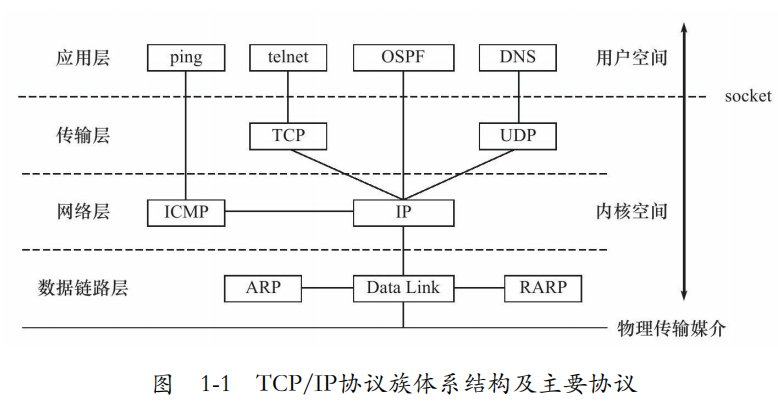
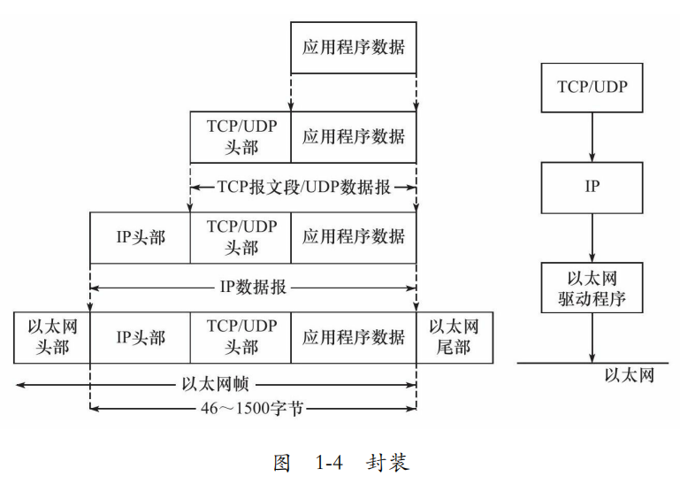
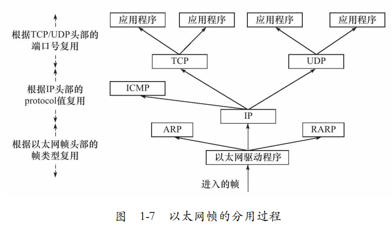

---

layout:     post
title:      「项目复现」linux高性能服务器编程之TCPIP协议
subtitle:   互斥锁+局部静态变量+C++11
date:       2022-04-01
author:     MRL Liu,WJ
header-img: img/post-bg-hacker.png
catalog: true
tags:
    - 项目复现
---

[TOC]

​		现在Internet（因特网）使用的主流协议族是**TCP/IP协议族**，它是一个分层、多协议的通信体系。本文主要参考了《Linux高性能服务器编程》。

# 一、TCP/IP协议族

​		TCP/IP协议族是一个四层协议系统，自底而上分别是**数据链路层**、 **网络层**、**传输层**和**应用层**。每一层完成不同的功能，且通过若干协议来实现，上层协议使用下层协议提供的服务，如图1-1所示。

## 1、数据链路层

​		**数据链路层**实现了网卡接口的网络驱动程序，以处理数据在物理媒介（比如以太网、令牌环等）上的传输。		数据链路层两个常用的协议是**ARP协议**（Address Resolve Protocol，地址解析协议）和**RARP协议**（Reverse Address Resolve Protocol，逆地址解析协议）。

​		数据链路层使用**物理地址**（也叫MAC地址）来寻址一台机器，ARP协议负责将IP地址转换为物理地址。RARP协议负责将物理地址转换为IP地址。

​		由于现在的交换机、路由器等设备具备一定的存储空间，可以记住自身的IP地址，所以RARP协议使用越来越少，仅用于某些没有无存储空间的设备来在网络上查询自身的IP地址。

## 2、网络层

​		**网络层**最核心的协议是**IP协议**（Internet Protocol，因特网协议）。 IP协议根据数据包的目的IP地址来决定如何投递它。IP 协议使用逐跳（hop by hop）的方式确定通信路径（发送方到接收方要经过的网络节点）。

​	    网络层另外一个重要的协议是ICMP协议（Internet Control Message Protocol，因特网控制报文协议）。它是IP协议的重要补充，主要用于检测网络连接。

## 3、传输层

​		**传输层**为两台主机上的应用程序提供端到端（end to end）的通信。 传输层协议主要有三个：TCP协议、UDP协议和SCTP协议。

​		**TCP协议**（Transmission Control Protocol，传输控制协议）为应用层提供可靠的、面向连接的和基于流（stream）的服务。TCP协议使用超时重传、数据确认等方式来确保数据包被正确地发送至目的端，因此TCP服务是可靠的。使用TCP协议通信的双方必须先建立TCP连接，并在内核中为该连接维持一些必要的数据结构，比如连接的状态、读写缓冲区，以及诸多定时器等。当通信结束时，双方必须关闭连接以释放这些内核数据。TCP服务是基于流的。基于流的数据没有边界（长度）限制，它源源不断地从通信的一端流入另一端。发送端可以逐个字节地向数据流中写入数据，接收端也可以逐个字节地将它们读出。 

​		**UDP协议**（User Datagram Protocol，用户数据报协议）则与TCP协议完全相反，它为应用层提供不可靠、无连接和基于数据报的服务。“不可靠”意味着UDP协议无法保证数据从发送端正确地传送到目的端。如果数据在中途丢失，或者目的端通过数据校验发现数据错误而将其丢弃，则UDP协议只是简单地通知应用程序发送失败。因此，使用UDP协议的应用程序通常要自己处理数据确认、超时重传等逻辑。UDP协议是无连接的，即通信双方不保持一个长久的联系，因此应用程序每次发送数据都要明确指定接收端的地址（IP地址等信息）。基于数据报的服务，是相对基于流的服务而言的。每个UDP数据报都有一个长度， 接收端必须以该长度为最小单位将其所有内容一次性读出，否则数据将被截断。

​		**SCTP协议**（Stream Control Transmission Protocol，流控制传输协议）是一种相对较新的传输层协议，它是为了在因特网上传输电话信号而设计的，本文不在介绍。

## 4、应用层

​		**应用层**负责处理应用程序的逻辑。数据链路层、网络层和传输层负责处理网络通信细节，这部分必须既稳定又高效，因此它们都在内核空间中实现，而应用层则在用户空间实现，因为它负责处理众多逻辑，比如文件传输、名称查询和网络管理等。 应用层协议很多，仅列举其中的几个： 

​		ping是应用程序，而不是协议，前面说过它利用ICMP报文检测网络连接，是调试网络环境的必备工具。 

​		telnet协议是一种远程登录协议，它使我们能在本地完成远程任务。

# 二、数据的封装与分用

## 1、封装

​		上层协议通过封装 （encapsulation）将应用程序的数据沿着协议栈从上往下依次传递，每层协议都将在上层数据的基础上加上自己的头部信息（有时还包括尾部信息），以实现该层的功能。

## 2、分用

​		当帧到达目的主机时，将沿着协议栈自底向上依次传递。各层协议依次处理帧中本层负责的头部数据，以获取所需的信息，并最终将处理后的帧交给目标应用程序，这个过程称为分用（demultiplexing）。分用是依靠头部信息中的类型字段实现的。下图显示了以太网帧的分用过程。

# 三、socket和TCP/IP协议栈的关系

​		前文提到，数据链路层、网络层、传输层协议是在操作系统的内核中实现的，因此操作系统需要实现一组系统调用，使得应用程序能够在用户空间访问这些协议提供的服务。实现这组系统调用的API（Application Programming Interface，应用程序编程接口）主要有两套：socket和XTI。XTI现在基本不再使用，本文也仅讨论socket。

​		socket函数库主要提供如下两点功能：

​		一是实现应用程序数据的send和read。send是将应用程序数据从用户缓冲区中复制到TCP/UDP内核发送缓冲区，以交付内核来发送数据，read是从内核TCP/UDP接收缓冲区中复制数据到用户缓冲区，以读取数据；

​		二是精细地控制协议栈的通信行为。应用程序可以通过它们来修改内核中各层协议的某些头部信息或其他数据结构，从而精细地控制底层通信的行为。比如可以通过setsockopt函数来设置IP数据报在网络上的存活时间。

