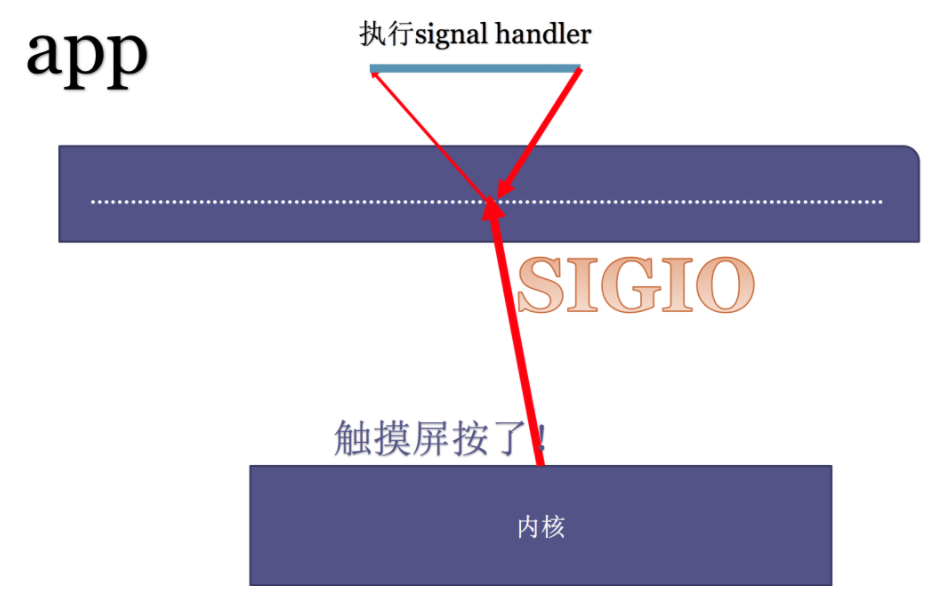

---

layout:     post
title:      「项目复现」linux高性能服务器编程之IO模型
subtitle:   阻塞I/O、非阻塞I/O、I/O复用、信号I/O和异步I/O
date:       2022-04-05
author:     MRL Liu,WJ
header-img: img/post-bg-hacker.png
catalog: true
tags:
    - 项目复现
---

[TOC]

​	我们常说的IO，指的是文件的输入和输出。在操作系统层面，IO就是：将**文件**从**磁盘**中通过**内核空间**，将文件拷贝到**用户空间**里面，涉及三个位置：磁盘、内核空间、用户空间。本文主要参考了《Linux高性能服务器编程》。

# 一、5种IO模型

​		在操作系统中，我们将I/O操作描述为：

> 将**数据**从**内核缓冲区**读入**用户缓冲区**，
>
> 或将**数据**从**用户缓冲区**写入**内核缓冲区**

​		我们通常所说的**阻塞I/O**实际上指的是**阻塞的文件描述符**，非阻塞I/O指的是非阻塞的文件描述符，依次类推

​		操作系统中共存在5种I/O模型，大体上可以分为同步I/O和异步I/O，两者的区别是：

> **同步I/O**要求**用户代码**自行执行I/O操作，即同步I/O向应用程序通知的是I/O就绪事件，都是在I/O时间发生之后，由应用程序来完成读写操作。
>
> **异步I/O**则由**内核代码**自动执行I/O操作，即异步I/O向应用程序通知的是I/O完成事件，异步I/O总是立即返回，不论是否阻塞，因为真正的读写操作已经由内核接管。

​		其中同步I/O可以进一步划分为阻塞I/O和非阻塞I/O，但是非阻塞I/O一般不会单独使用，需要结合一些具体的I/O通知机制，例如I/O复用机制、信号驱动I/O机制。

​		所以在Linux学习资料中一般会介绍**阻塞I/O**、**非阻塞I/O**、**I/O复用**、**信号I/O**和**异步I/O**的5种I/O模型。


## 1、阻塞IO

​		 **阻塞I/O**执行的系统调用可能因为无法立即完成而被操作系统挂起，直到等待的事件发生为止。


​		【常见优点】在阻塞等待过程中不消耗CPU资源，提高程序性能。

​		【常见缺点】阻塞I/O**只能串行**，不适合大量并发场景，例如socket默认创建出来是阻塞I/O，这样socket server每连接一个新的socket client都必须使用一个新的进程/线程去处理它的读写问题，那么client足够多时不然会造成性能的下降。例如经典的C10K问题，意思是使用在一台服务器上维护1w个连接，需要建立1w个进程或者线程。那么如果维护1亿用户在线，则需要1w台服务器。

​		【应用场景】适合串行场景，例如各种编程语言提供的wait()、pause()、sleep()等函数。

​		【编码场景】：

```c++
// 先读取鼠标设备的输入
memset(buf,0,sizeof(buf));
fd = open("/dev/input/mouse0",O_RDONLY|O_NONBLOCK);//获取鼠标设备文件描述符
ret = read(fd,buf,5);//read设置为阻塞，有数据才返回
printf("鼠标读出的内容是：[%s]\n",buf);
// 再读取键盘设备的标准输入
memset(buf,0,sizeof(buf));
ret = read(0,buf,5);//read设置为阻塞，有数据才返回
printf("键盘读出的内容是：[%s]\n",buf);
```

## 2、非阻塞IO

​		**非阻塞I/O**也叫**并发式IO**，执行的系统调用则总是立即返回，而不管事件是否已经发生。如果事件没有立即发生，这些系统调用就返回-1，和出错的情况一样。此时程序员必须根据errno来区分这两种情况。


​		【常见优点】适合用于并发场景

​		【常见缺点】非阻塞I/O需要不断检查，可能会消耗大量CPU资源

​        【应用场景】非阻塞I/O适用于并发场景，但一般不会单独使用，要和其他I/O通知机制一起使用，比如I/O复用和SIGIO信号。

​		【编码场景】：

```C++
......
while(1) // 不断检查
{
    // 立即读取鼠标设备的输入
    memset(buf,0,sizeof(buf));
    fd = open("/dev/input/mouse0",O_RDONLY|O_NONBLOCK);//获取鼠标设备文件描述符
    ret = read(fd,buf,5);//read设置为非阻塞，没有数据也返回
    if(ret > 0){
        printf("鼠标读出的内容是：[%s]\n",buf);
    }
    // 立即读取键盘设备的标准输入
    memset(buf,0,sizeof(buf));
    ret = read(0,buf,5);//read设置为非阻塞，没有数据也返回
    if(ret > 0){
        printf("键盘读出的内容是：[%s]\n",buf);
    }
}
......
```

## 3、IO复用

​		阻塞I/O需要多进程/线程才能用于并发场景，普通的非阻塞I/O需要在应用程序中不断检查才能用于并发场景，两者在并发场景中都不高效。I/O复用是并发场景中最常使用的I/O通知机制。I/O复用的原理是：

> 应用程序通过**I/O复用函数**向内核程序注册一组事件集合；
>
> 内核程序不断轮询事件集合，通过I/O复用函数把其中就绪的事件通知给应用程序。


​		本质上IO复用将普通的非阻塞I/O在应用程序中的轮询通过**I/O复用函数**交给了内核程序，所以其可以在一个进程/线程中同时处理多个I/O操作。

​		Linux上常用的I/O复用函数是select、poll和epoll_wait。

​		需要指出的是，I/O复用函数本身是阻塞的，它们能提高程序效率的原因在于它们可以在同一个线程/进程中具有同时监听多个I/O事件的能力，所以IO复用可以解决阻塞I/O不能用于大量并发的缺陷。

​		【常见优点】非常适合用于并发场景

​		【常见缺点】实现复杂。

​        【应用场景】网络socket。

## 3、信号IO

​		SIGIO信号也可以辅助非阻塞I/O报告I/O事件。我们可以为一个目标文件描述符指定宿主进程，那么被指定的宿主进程将捕获到SIGIO信号。这样，当目标文件描述符上有事件发生时，SIGIO信号的信号处理函数将被触发，也就可以在该信号处理函数中对目标文件描述符执行非阻塞I/O操作了。




​		目前在linux程序开发中很少被用到，Linux内核某个IO事件ready，通过kill出一个signal，应用程序在signal IO上绑定处理函数。

```c++
//异步通知函数，绑定SIGIO信号，在函数内处理异步通知事件
void func(int sig){
    char buf[200] = {0};
    if(sig != SIGIO)return;
    //读取鼠标
    read(mousefd,buf,5);//read默认是阻塞的
    printf("鼠标读出的内容是：[%s]\n",buf);
}
int main(void){
        char buf[200];
		//获取鼠标设备文件描述符
        mousefd = open("/dev/input/mouse0",O_RDONLY);
        //注册异步通知（把鼠标的文件描述符设置为可以接受异步IO）
        int flag = fcntl(mousefd,F_GETFL);
        flag |= O_ASYNC;
        fcntl(mousefd,F_SETFL,flag);
		fcntl(mousefd,F_SETOWN,getpid());//把异步IO事件的接收进程设置为当前进程
        //注册当前进程的SIGIO信号捕捉函数
        signal(SIGIO,func);
    	// 执行其他程序	
    	while(1){	
            ....
        }
        return 0;
}
```

## 5、异步IO

​		异步IO就是操作系统用软件实现的一套中断系统。
​		异步IO的工作方法：我们当前进程注册一个异步IO事件（使用signal注册一个信号SIGIO的处理函数），然后当前进程可以正常处理自己的事情，当异步事件发生后当前进程会收到一个SIGIO信号从而执行绑定的处理函数去处理这个异步事件。


​		异步 I/O 与信号 I/O 的区别在于，异步 I/O 的信号是***\*通知应用进程 I/O 完成\****，而信号驱动 I/O 的信号是***\*通知应用进程可以开始 I/O\****。

# 二、IO复用

## 1、select

​			select系统调用的用途是：在一段指定时间内，监听用户感兴趣的文件描述符上的可读、可写和异常等事件。	它把1000个fd加入到fd_set（文件描述符集合），通过select监控fd_set里的fd是否有变化。如果有一个fd满足读写事件，就会依次查看每个文件描述符，那些发生变化的描述符在fd_set对应位设为1，表示socket可读或者可写。Select通过轮询的方式监听，对监听的FD数量 t通过FD_SETSIZE限制。

```c++
#include＜sys/select.h＞
int select(intnfds,fd_set*readfds,fd_set*writefds,fd_set*exceptfds,struct timeval*timeout);
```

​	1）nfds参数指定被监听的文件描述符的总数。它通常被设置为select监听的所有文件描述符中的最大值加1，因为文件描述符是从0开始计数的。

   2）readfds、writefds和exceptfds参数分别指向可读、可写和异常等事件对应的文件描述符集合。应用程序调用select函数时，通过这3个参数传入自己感兴趣的文件描述符。select调用返回时，内核将修改它们来通知应用程序哪些文件描述符已经就绪。这3个参数是fd_set结构指针类型。

​		【优点】非常适合用于并发场景

​		【缺点】效率低，性能不太好，不能解决大量并发请求的问题。两个问题：

1、select初始化时，要告诉内核，关注1000个fd， 每次初始化都需要重新关注1000个fd。前期准备阶段长。
2、select返回之后，要扫描1000个fd。 后期扫描维护成本大，CPU开销大。

## 2、poll

​		poll()是一个系统调用函数，和select类似，也是在指定时间内轮询一定数量的文件描述符，以测试其中是否有就绪者。用法如下：

### （1）定义fds数组

假设我们要监控5个socket描述符,其中1个是服务端socket描述符，4个是客户端socket描述符。那么首先定义一个数组：

```c++
pollfd fds[5];//要监控的文件描述符数组
// 设置第一个为服务端socket描述符：listenfd
fds[0].fd=listenfd; 
fds[0].events=POLLIN|POLLERR; //监控可读、错误类型的事件
fds[0].revents=0; 
// 初始化其余的客户端socket描述符，其还没连接客户端
for(int i=1;i<=USER_LIMIT;++i) {
    fds[i].fd=-1; 
    fds[i].events=0; 
}
```

其中每个元素是一个pollfd结构体类型，其定义如下：

```c++
struct pollfd{
	int fd;			//文件描述符
	short events;	//等待的事件
	short revents;	//实际发生的事件
};
```

### （2）调用poll函数

接下来就可以调用poll函数，该函数会在内核程序中注册一系列事件表，阻塞等待某一个事件发生，一旦有事件发生就会返回，由于我们要多次监控时间，所以要放入while(1)循环中。

```c++
while(1) {
	// 系统调用
    ret=poll(fds,5,-1);//阻塞等待 
    if(ret<0) {
        printf("poll failure\n"); 
        break; 
    }
    // 处理各类事件
}
```

poll函数原型如下：

```C++
#include＜poll.h＞
int poll(struct pollfd*fds,nfds_t nfds,int timeout);
```

1）fds参数是一个pollfd结构类型的数组头地址，

2）nfds参数用来指定第一个参数数组元素个数

3）timeout参数指定等待的毫秒数，无论 I/O 是否准备好，poll() 都会返回

### （3）处理各类事件

接下来继续在while(1)循环中遍历fds数组，看哪个事件发生就处理某个事件：

```c++
int user_counter=0; 
for(int i=0;i<5;++i) {
     // 服务端的可读事件：处理客户端连接请求
     if((fds[i].fd==listenfd)&&(fds[i].revents&POLLIN)) {
         int connfd=accept(listenfd,(struct sockaddr*)NULL,NULL);
         setnonblocking(connfd);//设置connfd为非阻塞模式
         user_counter++;
         fds[user_counter].fd=connfd; 
         fds[user_counter].events=POLLIN|POLLRDHUP|POLLERR; //可读、关闭、错误
         fds[user_counter].revents=0;
     }
     // 客户端的关闭事件
     else if(fds[i].revents&POLLRDHUP) {
         close(fds[i].fd);//关闭该socket
         fds[i]=fds[user_counter]; //清除
         i--; 
         user_counter--;
     }
     // 客户端的可读事件
     else if(fds[i].revents&POLLIN){
         // 接收该客户端的消息到缓存中
         int connfd=fds[i].fd; 
         recv(connfd,users[connfd].buf,BUFFER_SIZE-1,0); 
         ...
         // 遍历所有的其余客户端，设置其可写事件
         for(int j=1;j<=user_counter;++j) {
             if(fds[j].fd==connfd) {continue; }
             fds[j].events|=~POLLIN; //去除其可读事件
             fds[j].events|=POLLOUT; //注册其可写事件
             users[fds[j].fd].write_buf=users[connfd].buf; 
         }
     }
     // 客户端的可写事件
     else if(fds[i].revents&POLLOUT){
         // 将缓存中的消息发送出去
         int connfd=fds[i].fd; 
         ret=send(connfd,users[connfd].write_buf,strlen(users[connfd].write_buf),0); 
         users[connfd].write_buf=NULL; 
         /*写完数据后需要重新注册fds[i]上的可读事件*/ 
         fds[i].events|=~POLLOUT; 
         fds[i].events|=POLLIN; 
     }
   	 // 服务端或者客户端的错误事件
     else if(fds[i].revents&POLLERR){
         int connfd=fds[i].fd; 
         char errors[100]; 
         memset(errors,'\0',100); 
         socklen_t length=sizeof(errors); 
         // 获取错误消息
         if(getsockopt(connfd,SOL_SOCKET,SO_ERROR,&errors, &length)<0) {
             printf("get socket option failed\n"); 
         }
     }
```

## 3、epoll

​		epoll是Linux特有的IO复用函数 ，其实现和使用与select或者poll有较大差异,其性能也更加高效。epoll机制需要多个系统调用。

​		epoll对文件描述符的操作有两种模式：**LT模式（Level Trigger，电平触发）**和**ET模式（Edge Trigger，边沿触发）**。LT模式是默认的工作模式，这种模式下epoll相当于一个效率较高的poll。当往epoll内核事件表中注册

一个文件描述符上的EPOLLET事件时，epoll将以ET模式来操作该文件描述符。ET模式是epoll的高效工作模式。

> LT：epoll的默认工作模式。epoll_wait每个事件会通知多次，应用程序可以不立即处理
>
> ET：epoll的高效工作模式。epoll_wait每个事件只会通知一次，应用程序必须要立即处理

​	  ET模式在很大程度上降低了同一个epoll事件被重复触发的次数，因此效率要比LT模式高。

### （1）创建epoll模型

主要代码如下：

```c++
int epollfd=epoll_create(5); 
assert(epollfd!=-1); 
```

其中的关键API如下：

```c++
#include＜sys/epoll.h＞
int epoll_create(int size);
```

size参数现在并不起作用，只是给内核一个提示，告诉它事件表需要多大。

该函数返回一个**epoll文件描述符**，用来唯一指定要访问的**内核事件表**。

### （2）操作epoll模型

主要代码如下：

```c++
addfd(epollfd,listenfd,true);//监控listenfd
/*将文件描述符fd上的EPOLLIN注册到epollfd指示的epoll内核事件表中*/ 
void addfd(int epollfd,int fd,bool enable_et) {
    epoll_event event; 
    event.data.fd=fd;//要监控的listenfd
    event.events=EPOLLIN;// 可读事件
    if(enable_et) {event.events|=EPOLLET; }//指定是否对fd启用ET模式
    epoll_ctl(epollfd,EPOLL_CTL_ADD,fd,&event); //注册epoll事件
    setnonblocking(fd); //设为非阻塞模式
}
/*将文件描述符设置成非阻塞的*/
int setnonblocking(int fd) {
    int old_option=fcntl(fd,F_GETFL); 
    int new_option=old_option|O_NONBLOCK; 
    fcntl(fd,F_SETFL,new_option); 
    return old_option; 
}
```

其中的关键API如下：

```c++
#include＜sys/epoll.h＞
int epoll_ctl(int epfd,int op,int fd,struct epoll_event*event)
```

fd参数是要操作的文件描述符，op参数则指定操作类型。操作类型有如下3种：

> EPOLL_CTL_ADD，往事件表中注册fd上的事件。
>
> EPOLL_CTL_MOD，修改fd上的注册事件。
>
> EPOLL_CTL_DEL，删除fd上的注册事件。

​		event参数指定事件，它是epoll_event结构指针类型。epoll_event的定义如下：

```c++
结构体
struct epoll_event{
	__uint32_t events;/*epoll事件*/
	epoll_data_t data;/*用户数据*/
};
// 联合体
typedef union epoll_data {
    void*ptr;
    int fd;//目标文件描述符
    uint32_t u32;
    uint64_t u64;
 }epoll_data_t;
```

epoll_ctl成功时返回0，失败则返回-1并设置errno。

### （3）检测epoll事件

主要代码如下：

```c++
epoll_event events[MAX_EVENT_NUMBER];//存储监听到的事件
while (1)
{
    int ret=epoll_wait(epollfd,events,MAX_EVENT_NUMBER,-1); // 阻塞监听事件
    if(ret<0) {
        printf("epoll_wait failure\n"); 
        break; 
    }
    lt(events,ret,epollfd,listenfd);/*使用LT模式*/ 
    //et(events,ret,epollfd,listenfd);/*使用ET模式*/ 
}
```

其中的关键API如下：

```c++
#include＜sys/epoll.h＞
int epoll_wait(int epfd,struct epoll_event*events,int maxevents,int timeout);
```

​		epoll_wait函数如果检测到事件，就将所有就绪的事件从内核事件表（由epfd参数指定）中复制到它的第二个参数events指向的数组中。这个数组只用于输出epoll_wait检测到的就绪事件，而不像select和poll的数组参数那样既用于传入用户注册的事件，又用于输出内核检测到的就绪事件。这就极大地提高了应用程序索引就绪文件描述符的效率。

​		epoll获取事件的时候，无须遍历整个被侦听的描述符集，只要遍历那些被内核I/O事件异步唤醒而加入就绪队列的描述符集合。

### （4）LT模式和ET模式

LT模式：

```c++
/*LT模式的工作流程*/ 
void lt(epoll_event*events,int number,int epollfd,int listenfd) {
    char buf[BUFFER_SIZE]; 
    for(int i=0;i<number;i++) {
        int sockfd=events[i].data.fd; 
        if(sockfd==listenfd) {
            struct sockaddr_in client_address; 
            socklen_t client_addrlength=sizeof(client_address); 
            int connfd=accept(listenfd,(struct sockaddr*)&client_address, &client_addrlength); 
            addfd(epollfd,connfd,false);
            /*对connfd禁用ET模式*/ 
        }else if(events[i].events &EPOLLIN){
            /*只要socket读缓存中还有未读出的数据，这段代码就被触发*/ 
            printf("event trigger once\n"); 
            memset(buf,'\0',BUFFER_SIZE); 
            int ret=recv(sockfd,buf,BUFFER_SIZE-1,0); 
            if(ret<=0) {
                close(sockfd); 
                continue; 
            }
            printf("get%d bytes of content:%s\n",ret,buf); 
        }else {
            printf("something else happened\n"); 
        }
    }
}
```

ET模式：

```c++
#include <sys/epoll.h>
/*ET模式的工作流程*/ 
void et(epoll_event*events,int number,int epollfd,int listenfd) {
    char buf[BUFFER_SIZE]; 
    for(int i=0;i<number;i++) {
        int sockfd=events[i].data.fd; 
        if(sockfd==listenfd) {
            struct sockaddr_in client_address; 
            socklen_t client_addrlength=sizeof(client_address); 
            int connfd=accept(listenfd,(struct sockaddr*)&client_address,& client_addrlength); 
            addfd(epollfd,connfd,true);/*对connfd开启ET模式*/ 
        }
        else if(events[i].events&EPOLLIN) {
            /*这段代码不会被重复触发，所以循环读取数据，以确保把socket读缓存中的所有 数据读出*/ 
            printf("event trigger once\n"); 
            while(1) {
                memset(buf,'\0',BUFFER_SIZE); 
                int ret=recv(sockfd,buf,BUFFER_SIZE-1,0); 
                if(ret<0) {
                    /*对于非阻塞IO，下面的条件成立表示数据已经全部读取完毕。
                    此后，epoll就能再次触 发sockfd上的EPOLLIN事件，以驱动下一次读操作*/ 
                    if((errno==EAGAIN)||(errno==EWOULDBLOCK)) {
                        printf("read later\n");
                        break; 
                    }
                    close(sockfd); 
                    break; 
                }else if(ret==0) {
                    close(sockfd); 
                }else {
                    printf("get%d bytes of content:%s\n",ret,buf); 
                }
            }
        }
        else {
            printf("something else happened\n"); 
        }
    }
}

```

​		总结：epoll是几乎是大规模并行网络程序设计的代名词，一个线程里可以处理大量的tcp连接，cpu消耗也比较低。很多框架模型，nginx, nodejs, 底层均使用epoll实现。

