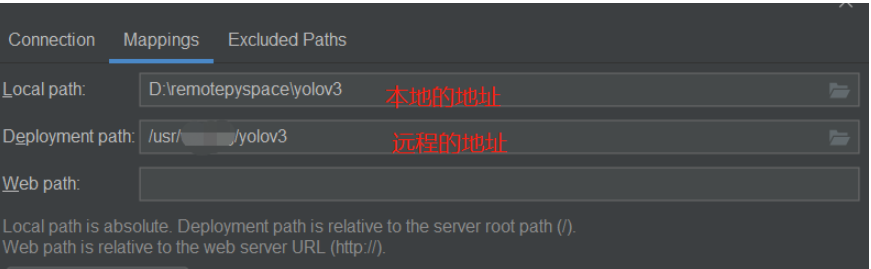

---

layout:     post
title:      「环境配置」PyCharm专业版SSH远程操作
subtitle:   PyCharm专业版+SSH远程
date:       2022-04-07
author:     MRL Liu
header-img: img/the-first.png
catalog: True
tags: [环境配置]
   
---

[TOC]

​         本文讲解在Windows系统上使用**PyCharm专业版**进行SSH远程连接操作。该文参考自博客[Ubuntu安装MySQL_wavehaha的博客-CSDN博客_ubuntu下载mysql](https://blog.csdn.net/sdkjkfk/article/details/108202094)

## 一、SSH远程连接

### 1、打开配置页面		

打开pycharm，通过“Deployment ==> Configuration”进入配置页面。

### 2、添加SFTP连接

​		添加一个要远程的服务器，并在弹出的下拉菜单中选择“SFTP”

在弹出的对话框中起一个名字：

### 3、配置SSH连接

​	点击下面的红框所框按钮来配置SSH：

相关界面的设置如下：

### 4、设置地址路径

首先在当前页面的Root path中设置/，后面还要再进一步设定。

切换到Mappings页面，设置映射路径：

​		实际上映射路径是——Connection选项卡里的root path + Mappings选项卡里的deployment path。假设自己想要远程的地址为/A/B/C，可以在Root path中输入/A/B，然后在Mappings Deployment path中输入/C，即不要在这两个位置重复输入。

## 二、同步设置

​		可以通过`Tools > Deplotment > Browse Remote Host`来打开相应的RemoteHost面板，这个面板显示的就是服务器上设置文件夹的文件。接下来做一些本地和远程的同步设置：

打开配置面板后：

## 三、配置远程python解释器

首先，通过File > Settings,打开设置选项卡。

在设置选项卡里，点击"Project:项目名"这个按钮，在展开的小项里再点击Project Interpreter，右边就会变成Interpreter的配置页面。

点击Interpreter配置页面的小此轮按钮，然后再选择Add或Add Remote：

在Add Python Interpreter 窗口选择 `SSH Interpreter`，选中`Existing server configuration`，在下拉框中选择我们刚才新建的server。

点击next之后，出现如下对话框，按图示填写：

这里同步的local path 就是在配置Deployment时，设置的本地的地址，所以这里不需要改动。 Remote Path是远程服务器同步的文件夹，和上面配置Deployment时的文件夹路径设置保持一致。

填写无误后，点Finish，大功告成。

## 四、打开远程终端

Tools -> Start SSH session
