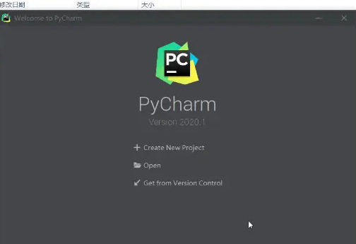

---

layout:     post
title:      「环境配置」Windows安装PyCharm专业版
subtitle:   windows+PyCharm专业版
date:       2022-04-07
author:     MRL Liu
header-img: img/the-first.png
catalog: True
tags: [环境配置]
   
---

[TOC]

​         本文讲解在Windows系统上安装和破解PyCharm专业版。该文参考自博客[pycharm破解(2021年亲测)完美版(永久有效)](https://www.bilibili.com/read/cv10386031/) 。

​		PyCharm是一种功能强大的Python IDE，但是官方提供的免费版本只有PyCharm社区版，PyCharm专业版是需要付费的，只有PyCharm专业版才能使用SSH远程连接功能。

### 1、双击打开软件		

​		直接双击pycharm-professional-2020.1.exe，开启安装。下载链接：https://pan.baidu.com/s/16DkCjj2bKJuT7gL3-ViSgg 提取码：ajqe 

### 2、免费试用

​		安装成功后，打开pycharm，选择免费试用。

### 3、快速激活

​		从下载的文件夹中找到`jetbrains-agent-3.2.0/lib`中找到`jetbrains-agent.jar`,将其拖到wecome to PyCharm页面。

​		然后将其重启：

​		安装JetbrainsAgent助手：

		

​		然后激活完成：

