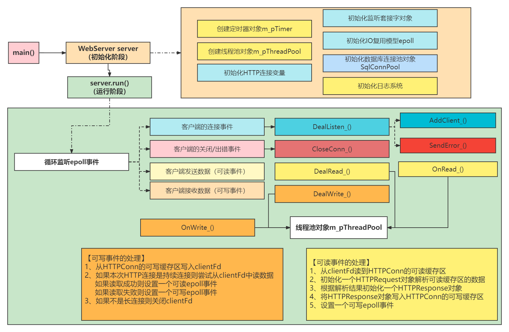

---

layout:     post
title:      「项目复现」Web服务器编程之简介
subtitle:   高并发、多线程、I/O复用、线程池
date:       2022-04-08
author:     MRL Liu,WJ
header-img: img/post-bg-hacker.png
catalog: true
tags:
    - 项目复现
---

[TOC]

​	   本文总结作者学习的Web服务器项目（WebServer），分析其中的**主要模块**的作用及**相关知识点**。一个WebServer是一个运行在**linux系统**上的C++编码的**服务器程序**，其需要处理来自**浏览器程序**（客户端）的各种HTTP请求，并对其请求作出HTTP响应。

​		本项目的主要流程如下：

​		从上述图中可以看出其中共有7个模块：日志系统模块、监听套接字模块、IO复用模型epoll模块、线程池模块、数据库连接池模块、HTTP连接模块、定时器模块。接下来分别介绍这几个模块的相关知识。

# 一、日志系统模块

1、项目编译工具MakeFile

2、C++11的智能指针

3、C++11中哈希表的使用

# 二、监听套接字模块

​		用户在Web浏览器在浏览器中输入“域名”或“IP地址:端口号”，浏览器则先将你的域名解析成相应的IP地址或者直接根据你的IP地址向对应的Web服务器发送一个HTTP请求。这一过程首先要通过**TCP协议的三次握手建立与目标Web服务器**的连接，然后HTTP协议生成针对目标Web服务器的HTTP请求报文，通过TCP、IP等协议发送到目标Web服务器上。

​		Web服务器想要建立与浏览器的TCP连接，就需要进行**Socket编程**。

## 1、Socket编程

（1）服务器创建监听套接字的步骤和API分别是什么？

创建socket【socket()】、绑定socket地址【bind()】，监听socket【listen()】

（2）TCP的断开方式有哪些？本项目中如何设置TCP的断开方式？

（3）socket默认是阻塞的，本项目中为什么将其设置为非阻塞模式？

2、TCP/IP协议

（1）TCP/IP协议的特点是什么，TCP/IP协议与socket的关系？

（2）TCP/IP协议的三次握手与四次挥手是什么？

3、IO复用模型Epoll

4、HTTP协议的特点

5、HTTP请求和HTTP相应的实现

# 三、IO复用模型epoll模块

# 四、线程池模块

1、互斥锁

2、条件变量

3、线程池

# 五、数据库连接池模块

1、数据库连接池

2、RAII机制	

5、单例模式的C++实现

8、阻塞队列

# 六、HTTP连接模块

4、正则表达式的使用

6、状态机

# 七、定时器模块

7、基于小根堆实现的定时器
