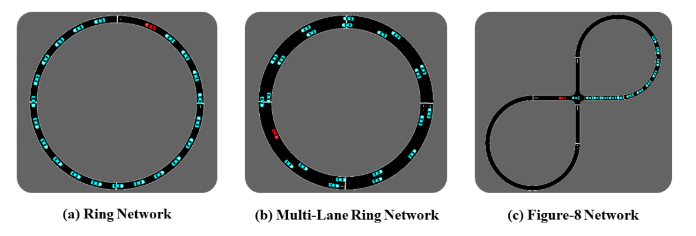

---

layout:     post
title:      「论文分享」学习连续控制问题的可解释的高性能策略
subtitle:   arXiv 2022
date:       2022-04-12
author:     MRL Liu
header-img: img/the-first.png
catalog: True
tags: [论文分享]
   
---

​		《Learning Interpretable, High-Performing Policies for Continuous Control Problems》是来自美国佐治亚理工学院的Rohan Paleja等人发表在arXiv 2022（论文预发表平台）上的一篇论文，这里是[原文链接](https://arxiv.org/pdf/2202.02352.pdf)和[原文代码](https://github.com/anonymous9628/ICCT)。

# 一、简介

​		基于梯度的强化学习（RL）方法在连续控制问题的学习策略方面取得了巨大成功。虽然这些方法的性能保证了在自动驾驶和机器人技术等领域的实际应用，但这些策略缺乏可移植性，限制了在安全、关键和法律监管领域的可部署性。这些领域需要可解释和可验证的控制策略，以保持高性能。本文提出了可解释连续控制树（ICCT），这是一种基于树的模型，可以通过基于梯度的现代RL方法进行优化，以产生高性能、可解释的策略。我们的方法的关键是一个允许在稀疏决策树状表示中进行直接优化的过程。本文根据六个领域的基线验证了ICCT，结果表明，ICCT能够在可解释的策略表示中学习，这些策略表示在自动驾驶场景中与基线持平或优于基线33%，同时和深度学习基线相比减少了300-600倍的策略参数。

# 二、相关工作

​		可解释人工智能（xAI）涉及理解和解释人工智能系统的行为（***2021年的《Explainable ai: A review of***

***machine learning interpretability methods》***）。近年来，对于安全关键领域和法律监管领域，对人类可理解模型的需求大幅增加，其中许多领域涉及连续控制（2017年ICCV的***《Interpretable learning for self-driving cars by visualizing causal attention》***，2017年的***《Towards a rigorous science of interpretable machine learning***》）。

​		*连续控制问题在整个机器人学中都很明显（2018年的**《Qt-opt: Scalable deep reinforcement learning***

***for vision-based robotic manipulation》***，2018年的***《Soft actor-critic algorithms and applications》***），在任何不能将动作分解为离散单元的领域中都会遇到（例如，指定机器人手臂的关节力矩或自主车辆的转向角）。

## 1、黑盒方法

​		在这些领域，之前的工作通常使用高度参数化的深层神经网络来学习高性能策略，完全缺乏模型透明度。

| **作者年份**                      | **论文题目**                                                 | **备注**             |
| --------------------------------- | ------------------------------------------------------------ | -------------------- |
| John Schulman等人，2017年         | 《Proximal policy optimization algorithms》                  |                      |
| Timothy等人，CoRR，2016年         | 《Continuous control with deep reinforcement》               |                      |
| Tuomas Haarnoja等人，PMLR，2018年 | 《Soft actor-critic: Off-policy maximum entropy deep reinforcement learning with a stochastic actor》 | 该文使用的RL算法框架 |
| Scott Fujimoto等人，2018年        | 《Addressing function approximation error in actor-critic methods》 |                      |

## 2、决策树方法

​		可解释机器学习方法是指产生全局转换策略的xAI技术的子集（即人类可以检查整个模型，如决策树[11,6,40]或规则列表[2,53,33,13]）。

​		基于树的框架对该文的工作尤为重要。决策树表示一种层次结构，其中输入决策可以通过对决策节点的评估（即对属性进行“测试”）追溯到输出，直到到达叶节点。树中的决策节点能够将问题空间分割成有意义的子空间，随着树的深入，问题也会变得简单。

| **作者年份**                         | 论文题目                                                     |
| ------------------------------------ | ------------------------------------------------------------ |
| Leo Breiman等人，1983年              | 《Classifification and regression trees》                    |
| Dmitry Laptev等人，GCPR，2014年      | 《Convolutional decision trees for feature learning and segmentation》 |
| Peter Kontschieder等人，ICCV，2015年 | 《Deep neural decision forests》                             |
| Ryutaro Tanno等人，2018年            | 《Adaptive neural trees》                                    |

​		决策树还提供在整个输入空间有效的决策策略的全局解释（2021年的***《Pytorch, explain! a python library for logic explained networks》***），而不是通常通过“事后”解释能力技巧提供的局部解释（2019年的***《Model-agnostic explanations and evaluation of machine learning》***）。可解释性（Explainability）与可描述性（Interpretability）形成对比，因为Explainability可能无法捕捉模型的真实决策过程，或者可能仅适用于决策空间的局部区域，从而阻止人类建立整个策略的清晰或准确的心智模型[44,37,1]。(2018年的Nature Machine Intelligence***《Stop explaining black box machine learning models for high stakes decisions and use interpretable models instead》***，2018年的**《 The mythos of model interpretability: In machine learning, the concept of interpretability is both important and slippery》**，2018年的**《Peeking inside the black-box: a survey on explainable artifificial intelligence (xai)》**)

​		最近，2021年的***《Interpretable machine learning: Fundamental principles and 10 grand challenges》***提出了可解释机器学习的一系列重大挑战，以指导该领域解决关键的研究问题，这些问题必须在机器学习能够安全地部署到现实世界中之前得到解决。该文的方法涉及其中的两个挑战：

​	（1）优化稀疏逻辑模型，如决策树

​	（10）可解释强化学习的解决方案。

​		该文提出了一种新的高性能、可解释且稀疏的体系结构，即可解释连续控制树（ICCT），直接允许最终用户检查和理解决策策略。

# 三、背景知识

## 1、可微决策树（DDTs）

​		1999年的***《Globally optimal fuzzy decision trees for classifification and regression》***和2019年的***《Neural-encoding human experts’ domain knowledge to warm start reinforcement learning》***使用了可微决策树（DDT）。这是一种采用决策树（DT）拓扑结构的神经网络体系结构。与决策树类似，DDT包含决策节点和叶节点；然而，DDT中的每个决策节点都使用一个S形激活函数（“软”决策），而不是布尔决策（“硬”决策）。标准的sigmoid激活函数如下：
$$
S(x)=\frac{1}{1+e^{-x}}
$$
​		每个决策节点$i$由一个sigmoid激活函数表示，如下等式所示。
$$
y_{i}=\frac{1}{1+\exp \left(-\alpha\left(\vec{w}_{i} \cdot \vec{x}-b_{i}\right)\right)}
$$
​				

​		其中描述当前状态的特征向量$\vec{x}$由$\vec{w}_{i}$加权，并减去分割准则$b_{i}$，形成分割规则。$y_{i}$是决策节点$i$评估为真的概率，$\alpha$控制sigmoid激活函数的强度，其中$\alpha \rightarrow \infty$结果是一个阶跃函数。

​		之前使用离散行动DDT的工作，在可能的输出类上以概率分布对每个叶节点进行建模(48，2019年的***《Neural-encoding human experts’ domain knowledge to warm start reinforcement learning》***,41，2020年的***《Interpretable and personalized apprenticeship scheduling: Learning interpretable scheduling policies from heterogeneous user demonstrations》***)。然后，叶节点分布通过到达叶的可能性加权求和，从而生成最终动作分布。

## 2、将DDT转换为DT

​		具有以方程式1形式表示的决策节点的DDT是不可解释的。由于DDT在结构上与DTs保持一对一的对应关系，因此之前的工作[48,41]提出了将DDT转换为可解释决策树的方法（称为“crisfication”的过程）。

​		“crisfication”是一个特征简化过程。首先将每个决策节点从所有变量的线性组合转换为单个特征检查（即，带有变量和阈值的二元谓词）。原来每个特征：
$$
y_{i}=\sigma\left(\alpha\left(\vec{w}_{i} \cdot \vec{x}-b_{i}\right)\right)
$$
​		特征约简是通过考虑与最大幅度的权重相对应的特征来实现的，
$$
k=\arg \max _{j}\left|w_{i}^{j}\right|
$$
​		从而得到决策节点表示:
$$
y_{i}=\sigma\left(\alpha\left(w_{i}^{k} x^{k}-b_{i}\right)\right)
$$
​		α也被设置为无穷，导致“硬”决策（向左或向右分支），将此过程应用于每个决策节点后，决策节点由表示
$$
y_{i}=\left(w_{i}^{k} x^{k}-b_{i}>0\right)
$$
​		由于每个叶节点都表示为输出类别上的概率分布函数，因此在crisfication过程中必须修改叶节点$l$，以生成单个输出类o。因此，可以应用参数$o_{d}=\arg \max _{a}\left|l_{d}^{a}\right|$在第d个叶节点分布中找到最大概率的类别。

​		**缺点**：最终的实验证明，这种crisfication程序导致crisp tree与原始DDT不一致（每个argmax操作产生的模型差异），因此不适用于复杂的连续控制域。

​		本文设计了一种新的体系结构，它能够通过梯度下降来更新其参数，同时保持可解释的决策树，从而避免通过精简过程产生的任何不一致。

## 3、强化学习（RL）

​		一个马尔科夫决策过程（MDP）$M$被定义为一个六元组$\left\langle S, A, R, T, \gamma, \rho_{0}\right\rangle$,其中$S$表示状态空间，$A$表示动作空间，$R(s, a)$表示一个智能体在状态$s$下采取动作$a$后收到的奖励，$ T\left(s^{\prime} \mid s, a\right)$表示从状态$s$采取动作$a$后转换到状态$s^{\prime}$的概率，$\gamma \in[0,1]$表示折扣因子，$\rho_{0}(s)$表示初始状态分布。

​		策略$\pi(a \mid s)$表示一个智能体在状态$s$下采取动作$a$的可能性。RL的目标是找到一个优化策略来最大化累计折扣奖励:
$$
\pi^{*}=\arg \max _{\pi} \mathbb{E}_{\tau \sim \pi}\left[\sum_{t=0}^{T} \gamma^{t} R\left(s_{t}, a_{t}\right)\right]
$$
​		其中$\tau=   \left\langle s_{0}, a_{0}, \cdots, s_{T}, a_{T}\right\rangle$是一个智能体的轨迹。

​		在本文工作中，尽管ICCTs是一个框架，但是该文使用SAC（2018年***《Soft actor-critic: Off-policy maximum entropy deep reinforcement learning with a stochastic actor》***）作为本文的强化学习算法，SAC中的actor的目标函数如下方程所示：
$$
\begin{array}{c}
J_{\pi}(\theta)=\mathbb{E}_{s_{t} \sim \mathcal{D}}\left[\mathbb { E } _ { a _ { t } \sim \pi _ { \theta } } \left[\alpha \log \left(\pi_{\theta}\left(a_{t} \mid s_{t}\right)\right)-\right.\right. 
\left.\left.Q_{\omega}\left(s_{t}, a_{t}\right)\right]\right]
\end{array}
$$
​		其中是$Q_{\omega}\left(s_{t}, a_{t}\right)$通过函数近似器来学习的预期的未来折扣奖励。

# 四、方法

​		尽管决策树（DT）通常被认为是可解释的[33]，但任意深度的树可能很难理解[20]和模拟[37]。足够稀疏的DT是被认为是可取并且可解释的[31]。在叶节点上使用线性控制器也允许我们保持可解释性，因为线性控制器被广泛使用，通常被认为对人类是可解释的[24]。

## 1、ICCT的架构

​		该文的ICCT是一个对称的二叉决策树，其中有$l$个决策叶节点和$l-1$个决策节点（树深度为$\log _{2}(l)$）。决策通过决策节点路由到叶控制器，然后叶控制器产生用于连续控制领域的动作输出。

​		该文的ICCT类似于一种分层模型：在几个低级别控制器之上维护一个高级别控制器。2018年的NeurIPS上的***《Data-effiffifficient hierarchical reinforcement learning》***表明这是一种可以取得成功的连续控制范例。

​		每个决策节点$i$都有一个激活陡度权重$\alpha$，相关权重$\vec{w}_{i}$，与输入特征向量$\vec{x}$相匹配的基数$m$，还有一个标量偏置项$b_{i}$。

​		每个叶节点$l_{d}$（其中$ d \in\{1, \ldots, l\}$）由一个线性稀疏控制器表示，，包含每个叶节点的权重$\vec{\beta}_{d} \in \mathbb{R}^{|m|}$，每个叶节点的偏差项$ \vec{\phi}_{d} \in \mathbb{R}^{|m|} $，每个叶节点的标量标准差$\gamma_{d} $和每个叶选择器权重学习候选分裂准则的相对重要性$ \vec{\theta}_{d} \in \mathbb{R}^{|m|} $。

## 2、ICCT的关键元素

​		如下算法1提供了ICCT决策过程的一般伪代码。

​		在每个时间步，ICCT模型$I(\cdot)$接收一个状态特征向量$\vec{x}$。

​		对于**决策节点**来讲，其需要进行如下两步：

​		（1）***NODE_CRISP***：使每个决策节点仅以单个变量为条件，增加可解释性

​		（2）***OUTCOME_CRISP***：使每个决策节点采用硬决策。

​		对于**决策叶节点**来讲，其需要进行如下三步：

​		（1）***INTERPRETABLE_NODE_ROUTING***：确定依靠哪个叶节点进行动作输出

​		（2）***ENFORCE_CONTROLLRT_SPARSITY***：以超参数e稀疏化处理叶节点，增加可解释性

​		（3）根据训练或者运行情景输出动作

### （1）决策节点的NODE_CRISP

|                      | 公式表示                                                     | 原因                                                         |
| -------------------- | ------------------------------------------------------------ | ------------------------------------------------------------ |
| 决策节点的传统表示   | $\sigma\left(\alpha\left(\vec{w}_{i}^{T} \vec{x}-b_{i}\right)\right) $ | 每个**决策节点**输入的**特征向量**$\vec{x}$是多维的，这制约了该决策节点的可解释性。 |
| 决策节点的可解释表示 | $\sigma\left(\alpha\left(w_{i}^{k} x^{k}-b_{i}\right)\right)$，其中k是最具影响力的特征向量索引 |                                                              |

​		该文将$\sigma\left(\alpha\left(\vec{w}_{i}^{T} \vec{x}-b_{i}\right)\right) \rightarrow \sigma\left(\alpha\left(w_{i}^{k} x^{k}-b_{i}\right)\right)$标记为NODE_CRISP过程

​		先前的研究工作[48]使用**不可微的argmax函数**取$\vec{x}$和对应的$\vec{w}_{i}$的单个维度，完成NODE_CRISP过程。由于NODE_CRISP不可微，无法直接用于反向传播，所以其只能先训练好决策树模型，然后使用NODE_CRISP重新转换为一个可解释的模型，这是一种事后解释的方式，转换好的可解释模型性能会下降很多。

​		该文的NODE_CRISP过程如下：

​	（1）使用一种可微的Soft-Argmax函数，表示为$f(\cdot)$，其输入$\vec{w}_{i}$,输出最大权重所在的索引近似值$k$。

​	（2）使用一个one_hot函数，表示为$g(\cdot)$，其输入$k$，然后得到一个one_hot向量$\overrightarrow{z_{i}}$.该过程通过使用***the straight-through trick***[9]保持可微性

​	（3）one_hot向量$\overrightarrow{z_{i}}$可以与原始权重$\vec{w}_{i}$相乘，得到一组新的权重$w_{i}^{k}$(该向量中只有索引k的权重值存在).

​		公式表示如下：
$$
\overrightarrow{z_{i}}=g\left(f\left(\left|\overrightarrow{w_{i}}\right|\right)\right)
$$

### （2）决策节点的OUTCOME_CRISP

​		决策节点的OUTCOME_CRISP负责将决策节点的输出转换为布尔式的硬决策。

​		传统的决策树方式是一种**软决策**，即通过sigmoid函数生成1个概率值，对应左分支的概率即$p=y_{i}$，对应右分支的概率即$q=1-y_{i}$。

​		该文的OUTCOME_CRISP过程如下：

​		（1）创建第$i$个决策节点的向量表示的输出$\vec{v}_{i}=\left[\alpha\left(w_{i}^{k} x^{k}-b_{i}\right), 0\right]$。

​		（2）将$\vec{v}_{i}$输入softmax函数，得到一组选择左分支或右分支的概率向量。

​		（3）将概率向量输入one-hot函数来产生一个OneHot向量$y_{i}$，其结果是一种硬决策。

​       整个过程的公式如下：
$$
y_{i}=g\left(f\left(\vec{v}_{i}\right)\right)
$$
​		该硬决策等价于判断$\alpha\left(w_{i}^{k} x^{k}-b_{i}\right)>0$是否为真来决定左右分支，则每一个决策节点$i$的决策依据都可以用代数方法化简为$x^{k}>\frac{b_{i}}{w_{i}^{k}}$（给定$w_{i}^{k}>0$）。

​	 **示例**：假设有1个决策节点和2个叶节点的决策树，输入特征为$\vec{x}$=[2,3]，m=2，相关权重为$\vec{w_{1}}=[2,1]^{T}$，偏差项$b_{1}$为1。Sigmoid陡度$α$设置为1。

（1）***NODE_CRISP过程***：
$$
\overrightarrow{z_{i}}=g\left(f\left(\left|\overrightarrow{w_{i}}\right|\right)\right)=g\left(0\right)=[1,0]
$$

$$
\sigma\left(\alpha\left(\vec{w}_{i}^{T} \vec{x}-b_{i}\right)\right) \rightarrow \sigma\left(\alpha\left(w_{i}^{k} x^{k}-b_{i}\right)\right)\rightarrow 
\sigma\left(\alpha\left(\vec{z}_{i}^{T} \vec{x}-b_{i}\right)\right)\rightarrow
\sigma\left(2 x^{1}-1\right)\rightarrow
\sigma(3)=0.95
$$

（2）***OUTCOME_CRISP过程***：

生成一个向量$\vec{v}_{i}=\left[2x^{1}-1, 0\right]=\left[3, 0\right]$，
$$
y_{1}=g\left(f\left(\vec{v}_{i}\right)\right)=g(0)=[1,0]
$$
这表示决策树应遵循左分支。

### （3）稀疏线性叶节点控制器

​		ICCT的最终输出是一个动作，如果连续动作空间是多维的，那么只有叶节点控制器（和相关权重）在$|A|$维上展开，其中$|A|$是动作空间的基数。

| 阶段       | 公式表示                                                     | 含义解释             |
| ---------- | ------------------------------------------------------------ | -------------------- |
| 线性处理   | $l_{d}(\vec{x})=\vec{\beta}_{d}^{T} \vec{x}-\phi_{d}$        | 叶节点的正常输出     |
| 稀疏化处理 | $l_{d}^{*}(\vec{x})$=ENFORCE_CONTROLLER_SPARSITY$\left(e, l_{d}(\vec{x})\right)$ | 该文的稀疏化处理     |
| 训练期间   | $a \sim \mathcal{N}\left(l_{d}^{*}(\vec{x}), \gamma_{d}\right)$ | 从动作概率分布中采样 |
| 运行期间   | $a \leftarrow l_{d}^{*}(\vec{x})$                            | 最终结果             |

​		该文的特殊点就是在线性处理后引入了一个稀疏化处理步骤***ENFORCE_CONTROLLRT_SPARSITY***，该步骤将叶节点的动作输出和稀疏度超参数$e$相关联，引入稀疏度超参数$e$（$e \in\{0, \ldots, m\}$,m即状态空间的大小）是为了可以自行在模型的可解释性和性能上进行平衡。

​		e=0时，即使用静态叶节点分布，在第7节中表示为ICCT-static；e=m时，即使用完整的叶节点分布，在第7节中表示为ICCT complete；

​		接下来介绍该文的稀疏化处理步骤***ENFORCE_CONTROLLRT_SPARSITY***：

​		该步骤只是为线性处理添加了一个参数$\vec{u}_{d}$，如下：
$$
\vec{\beta}_{d}^{T} \vec{x}-\phi_{d}\rightarrow \left(\vec{u}_{d} \circ \vec{\beta}_{d}\right)^{T}\left(\vec{u}_{d} \circ \vec{x}\right)+\vec{u}_{d}^{T} \vec{\phi}_{d}
$$
​		其中$\vec{u}_{d}$是一个k_hot编码向量的过程，其计算方式如下：
$$
\vec{u}_{d}=h\left(f\left(\left|\vec{\theta}_{d}\right|\right)\right)
$$
​		其中$h(\cdot)$表示一个k_hot函数，其输入类别权重向量，输出一个等维的k_hot编码向量，该向量中k个权重最高的元素设置为1。

# 五、环境

​		本小节讲述该文实验评估所用的6个连续控制领域的强化环境：

## 1、3个连续控制问题的RL环境

| RL环境                      | 目标策略                                                     | 奖励策略                                                     | 状态空间                                                     | 提供者                                                       |
| --------------------------- | ------------------------------------------------------------ | ------------------------------------------------------------ | ------------------------------------------------------------ | ------------------------------------------------------------ |
| 倒立摆（Inverted Pendulum） | 智能体通过对小车施加一个力，使其上的一根杆子保持平衡，防止杆子掉落 | 如果杆在每个时间步保持直立，则在每个时间步提供加一个单位的奖励。 | 小车的位置、速度、角度和角速度。                             | MujoCo（2012年的ICIRS《A physics engine for model-based control》） OpenAI Gym（2016年的《Openai gym》） |
| 月球着陆器（Lunar Lander）  | 智能体对着陆器的主发动机和侧发动机推进器进行点火控制，以便着陆器降落在指定的着陆平台上 | 在每一个时间步，着陆者的奖励取决于离着陆平台的距离、每条腿是否接触着陆平台以及燃油成本。 | 着陆器的当前位置、线速度、倾斜度、角速度和地面接触信息。如果着陆器坠毁，并提供-100的最终奖励，则本集结束。如果着陆器成功着陆，将提供100的正终端奖励。 | Box2D（2017年的《Introduction to Game Physics with Box2D》） OpenAI Gym（2016年的《Openai gym》） |
| 车道保持（Lane-Keeping）    | 智能体必须控制车辆的转向角以保持在弯道内                     | 在每个时间步，如果车辆能够保持在车道中心，将提供+1奖励。奖励随着车辆驶离车道中心而减少。 | 车辆的横向位置、航向、横向速度、横摆率、线性、横向和角速度，以及车道信息 | 2018年的[《An environment for autonomous driving decision》](https://github.com/eleurent/highway) |

## 2、3个自动驾驶模拟器Flow中的RL环境

2017年的《Flow:Architecture and benchmarking for reinforcement learning in traffiffiffic control》

​		状态空间：交通网络中所有车辆的全局位置和速度。

​		奖励策略：通过交通网络的平均速度与用户定义的平均速度的匹配程度来衡量，所有车辆接近速度设定值的平均速度则认为交通网络趋于稳定。

| RL环境                                              | 目标策略                                                     |
| --------------------------------------------------- | ------------------------------------------------------------ |
| Flow单车道环形网络（Flow Single-Lane Ring Network） | 智能体可以控制其中的一辆小车是否加速，尽可能稳定整个车辆组成的交通流 |
| Flow多车道环形网络（Flow Muti-Lane Ring Network）   | 智能体可以控制其中的一辆小车是否加速或换道，尽可能稳定整个车辆组成的交通流 |
| Flow8字型网络（Flow Figure-8 Network）              | 智能体可以控制其中的一辆小车是否加速，尽可能稳定整个车辆组成的交通流 |

# 六、实验结果

​		该文的所有实验都通过SAC算法框架进行训练，其中的critic网络相同（由2个隐藏层（每个包含256个神经元）的MLP组成）。实验都使用了5个随机种子，缓冲区大小始终设置为1000000，折扣系数γ始终设置为0.99。在单车道环形网络中，训练步数为100000，其他所有方法的训练步数均为500000。每个基于树的框架都经过了训练，同时最大限度地提高了性能，并最小化了表示这种策略所需的复杂性，从而强调了可互操作性。

## 1、基线

| 基线简写               | 含义                             | 详细解释                                                     |
| ---------------------- | -------------------------------- | ------------------------------------------------------------ |
| DT                     | 决策树                           | 通过CART（1983年的《Classifification and regression trees》）训练MLP-Max，从MLP-Max中生成的状态-动作对来训练DT。 |
| CDDT                   | 连续DDT                          | 通过修改叶节点来表示静态概率分布，将[48]的框架转化为具有连续动作空间的函数。（第3.1.1节说明了将CDDT转换为可解释形式的详细过程）。 |
| CDDT-controllers       | 带控制器的连续DDT                | 将CDDT叶节点从静态分布变为线性控制器。                       |
| CDDT Crisp             | CDDT的事后可解释版本             |                                                              |
| CDDT-controllers Crisp | CDDT-controllers的事后可解释版本 |                                                              |
| ICCT-static            | 具有静态叶分布的ICCT             | 修改ICCT的叶节点为静态分布。比较ICCT和ICCT静态显示了添加稀疏线性子控制器的有效性。 |
| ICCT-complete          | 具有完整线性子控制器的ICCT       | 允许叶节点在所有特征上保持权重（不强制稀疏）                 |
| ICCT-L1-sparse         | 具有L1正则化控制器的ICCT         | 在ICCT complete上应用L1正则化来实现稀疏性。虽然该基线生成稀疏的子控制器，但也存在限制其可解释性的缺点。L1正则化强制权重接近零，而不是0 ，这些小权重必须在决策节点中表示，并限制可解释性。 |
| MLP-Max                |                                  | 包含大量参数的多层感知器。                                   |
| MLP-Upper              | 具有大量参数的多层感知器         | 在初始化时与该文的ICCT的参数数量大致相同。                   |
| MLP-Lower              | 具有大量参数的多层感知器         | 与该文的ICCT保持相同数量的活跃参数                           |

​		由于该模型是通过Crispifications（2019年的***《Neural-encoding human experts’ domain knowledge to warm start reinforcement learning》***）推导出来的。

​		2020年的***《Interpretable and personalized apprenticeship scheduling: Learning interpretable scheduling policies from heterogeneous user demonstrations》***

## 2、静态叶节点分布的对比

## 3、控制器叶节点分布的对比

## 4、黑盒方法的对比

## 5、学习曲线

## 6、稀疏超参数e和模型深度的影响

该实验都是在RL环境Lunar Lander上的结果：

# 七、结论

## 1、该论文的总结和不足		

​        该文提出了一种可解释连续控制树ICCT，ICCT可以在保持一定的可解释性的同时来表示高性能的连续控制策略。用户可以调节ICCT的超参数e来在模型的可解释性和性能之间找到一个平衡点。该文的实验也表明，在许多情况下，ICCT具备竞争力。

​		该文认为其缺点：

（1）在部分连续RL环境中的可解释性差（如预测转向角），可能需要进行后处理以增强用户的理解。

（2）ICCT的深度的超参数需要进行预定义，而树深度的加深又会降低模型的可及时性，作者声称会继续提出一种动态增长算法来改进。

## 2、笔者的思考	

​		笔者认为这篇论文的原文其实很绕，但是读懂后发现，ICCT取得成功的关键在于对决策节点实现了可微化处理和硬决策处理，对决策叶节点实现了稀疏化处理。实现这2点的关键在于：

​		（1）具备可微性质的Soft-Argmax函数（Ian Goodfellow等人的《*Deep Learning*》）：
$$
f\left(\vec{w}_{i}\right)_{k}=\frac{\exp \left(\frac{w_{i}^{k}}{\tau}\right)}{\sum_{j}^{m} \exp \left(\frac{w_{i}^{j}}{\tau}\right)}
$$
​		（2）可以将one_hot或者k_hot操作可微化的编程技巧***the straight-through trick***（2013年的《Estimating or propagating gradients through stochastic neurons for conditional computation》）：

不足：该文只使用了一种RL算法SAC，在6种RL环境中实验，其附录中的某些结果也只展示少数RL环境，该ICCT模型的通用能力有待研究，不过其控制决策树稀疏性来保留可解释性的想法对笔者很新颖。

​		
