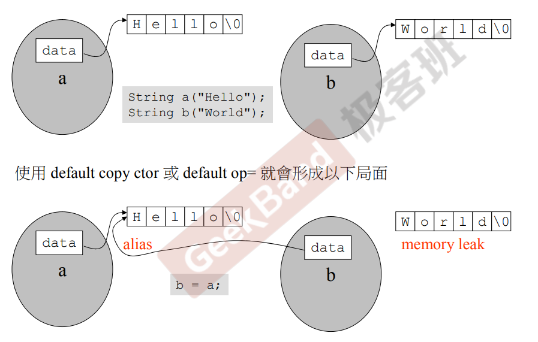
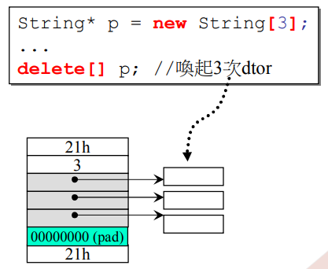
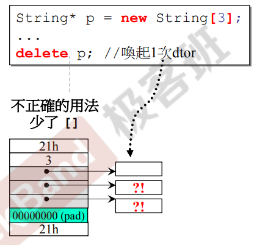
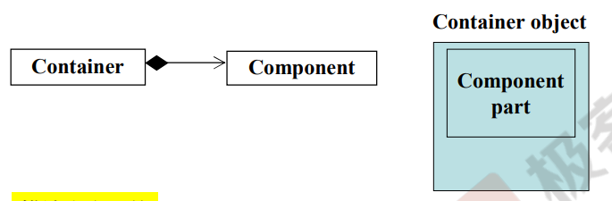
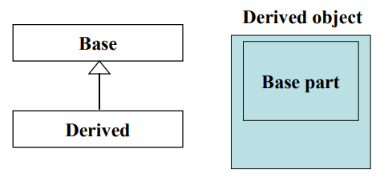
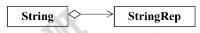

---

layout:     post
title:      「学习笔记」候捷C++教程笔记（面向对象高级开发（一））
subtitle:   C++11
date:       2022-04-23
author:     MRL Liu
header-img: img/post-bg-hacker.png
catalog: true
tags:
    - 学习笔记
---

[TOC]

​		C++是一门面向对象的语言，诞生于1983年左右，其共经历了多次版本迭代，比较著名的有C++98（1.0），C++11（2.0），C++14等。C语言是用大量的函数来处理数据；C++是用大量的成员函数来处理成员数据。不带指针的类和带指针的类的写法是不一样的。

# 一、无指针成员的类定义

​		本节介绍不带指针的类的写法：complex

## 1、预编译声明

​     类要加防护式的声明，即预编译声明，该声明是为了避免一个头文件在多个.cpp文件中被包含而被重复编译。

```c++
#ifndef __COMPLEX__
#define __COMPLEX__
class complex{

};
#endif //__COMPLEX__
```

注意C++中的类之后必须有“；”，否则会报错。

​	也有的程序员会使用C++11中新添加的预编译声明：

```c++
#pragma once
class complex{

};
```

## 2、访问权限控制

​		C++类中封装的成员的默认访问权限是private，首先需要显示声明不同的访问权限（也叫访问级别），其中private一般用来存放私有的成员变量，public存放公有的成员函数。

```C++
#ifndef __COMPLEX__
#define __COMPLEX__
class complex{
public:
    
private:
    double re,im;// 成员变量，分别表示实数的实部和虚部
};
#endif //__COMPLEX__
```

​		C++中共有3个关键字来控制成员的访问权限：

|           | 类外（实例化对象） | 类内成员 | 子类成员     | 友元函数 |
| --------- | ------------------ | -------- | ------------ | -------- |
| public    | 可访问             | 可访问   | 可访问       | 可访问   |
| protected | **不可访问**       | 可访问   | 可访问       | 可访问   |
| private   | **不可访问**       | 可访问   | **不可访问** | 可访问   |

​		在C++编程中，鼓励将所有数据声明为private，想要访问数据则单独定义public的成员函数来访问。

## 3、构造函数和析构函数

​		构造函数和析构函数是C++类中2个非常特殊的成员函数。C++创建类的对象时自动调用的创建函数就是构造函数，C++销毁类的对象时自动调用的析构函数就是析构函数。C++类的定义会提供默认的构造函数和析构函数，但是**构造函数一般要自定义，如果类中没有指针成员变量时一般可以不写析构函数或者使用默认的析构函数**。

```c++
#ifndef __COMPLEX__
#define __COMPLEX__
class complex{
public:
    complex(double r=0,double i=0):re(r),im(i){}// 构造函数
    ~complex(){}// 析构函数，无指针成员变量时可以省略
private:
    double re,im;// 成员变量，分别表示实数的实部和虚部
};
#endif //__COMPLEX__
```

​		构造函数和析构函数的对比如下：

|          | 形式              | 访问权限                            | 参数   | 返回值 | 重载方式                     |
| -------- | ----------------- | ----------------------------------- | ------ | ------ | ---------------------------- |
| 构造函数 | 类名(参数列表){}; | 一般为public，单例模式中设为private | 自定义 | 无     | 可以重载，一般有多个构造函数 |
| 析构函数 | ~类名(){};        | public                              | 无     | 无     | 可以重载，只能有一个析构函数 |

​		构造函数中有一种特殊的**初始化列表**，用其来初始化类的成员变量执行效率会更高：

```C++
// 构造函数(2种写法实现的功能一致，但是第一种写法效率更高)
complex(double r=0,double i=0):re(r),im(i){}
complex(double r=0,double i=0){re=r;im=i;}
```

## 4、内联函数

​		C++类中一般只进行成员函数的声明，不进行成员函数的定义，但在类中进行成员函数的定义也不会报错。**C++类中的已定义的成员函数自动被视为内联函数（inline），在类外定义的函数想要声明为inline函数，可以加inline关键字**。

```c++
inline double complex::real() {return re;}
```

​		内联函数的优点是**可以减少函数调用的开销，提高程序执行效率，是一种优化效率的手段**。程序在进行函数调用时需要开辟额外的资源，所以C++允许程序员将小而简单、执行很快的函数声明为内联函数。声明为内联函数后，编译器处理内联函数时，不会单独进行函数调用，而是直接将整个函数体的代码插入调用语句处，就像整个函数体在调用处被重写了一遍一样，这样执行内联函数不需要付出执行函数调用的额外开销，很显然，使用内联函数会使最终可执行程序的体积增加，因为内联函数是以空间换取时间。

​		请注意，内联函数适用于小而简单、执行很快的函数，如果一个函数非常庞大或者需要消耗大量时间，那么将其声明为内联函数虽然节省了函数调用的时间，但是却让程序体积增加了更多，这样程序执行速度很可能反而会下降。现代C++编译器提供了内联函数的保护机制，一般程序员声明的内联函数只是给编译器的建议，具体编译器是否真的按照内联函数的方式处理可能由内部算法决定。

## 5、const关键词

​       常量成员函数（const member functions）。不可以改变数据内容的函数就是const

const在 C++ 中是用来修饰内置类型变量，自定义对象，**成员函数**，返回值，函数参数，**不可以修饰类外全局函数**。函数名称中const属于函数签名的一部分，所以添加const的函数或者不添加const的函数属于函数重载。

// 常量成员函数double real() const{return re;}

在书写类成员函数时，如果该函数不会改变其中数据的值，应尽可能地使用const来修饰，这样当用户声明一个const类对象时，就可以调用该const成员函数，即const修饰的类对象只能调用其const修饰的类成员函数。

## 6、this指针和临时变量

10、this指针。类的每一个成员函数都有一个this指针变量，其指向该函数的调用者。		

12、临时对象。typename();其返回不能按引用返回

## 7、参数传递和返回值传递

7、参数传递：按值传递（pass by value）和按引用传递（pass by reference）。在可以的情况下尽可能避免按值传递。如果按引用传递并且不希望对方改动其内容，可以传递const complex&。

8、返回值传递：按值返回（return by value）和按引用返回（return by reference）。在可以的情况下尽可能避免按值返回。函数内部的局部变量要尽可能避免返回引用。按引用返回在操作符重载中很常见，可以实现操作符连续执行。

## 8、友元函数

友元函数可以直接访问类成员的私有数据和私有函数。友元函数打破了类的封装性，相同类的各个对象互为友元。


11、操作符重载。

# 二、含指针成员的类定义

​		本节介绍带指针的类的写法：string。带指针成员的类对象的特殊之处就是其需要new动态分配内存，delete手动释放内存，这个过程是需要手动管理的。

## 1、构造函数、拷贝构造函数和析构函数

带指针的类，一定要自己写复制构造函数（拷贝构造函数）、析构函数

```c++
#ifndef __STRING__
#define __STRING__
class String
{
public:                                 
   String(const char* cstr=0);// 构造函数                  
   String(const String& str); // 拷贝构造函数     
   ~String();// 析构函数                                    
   char* get_c_str() const { return m_data; }
private:
   char* m_data;// 指针成员，指向字符数组
};
#endif
```

### （1）字符串的构造函数

假设我们希望以如下的方式初始化对象：

```c++
String s1();
String s2("hello");
```

那么我们可以定义如下的构造函数：

```c++
inline
String::String(const char* cstr)
{
   // 如果存在参数
   if (cstr) {
      m_data = new char[strlen(cstr)+1];// 指向一个字符数组
      strcpy(m_data, cstr);// 将cstr指向的数据复制给m_data指向的内存
   }
   // 如果不存在参数
   else {   
      m_data = new char[1];// 指向一个结束字符
      *m_data = '\0';
   }
}
```

### （2）字符串的析构函数

​		带指针的类的特殊点是指针指向的内存中的数据不属于C++类管理的内存，所以类对象在销毁时会自动销毁类自身开辟的内存，而其成员指针指向的内存无法自动销毁，这是成员指针的内存由于没有指针指向它也就在程序结束前永远无法销毁，这对于程序非常危险。

​		所以带有成员指针的类必须自定义析构函数来销毁构造函数中分配的内存：

```c++
inline
String::~String()
{
   delete[] m_data;
}
```

### （3）字符串的拷贝构造函数

假设我们还希望以如下的方式初始化对象：

```c++
String s1("hello");
String s2(s1);
```

s2对象的参数是该对象类型，它传递的是自身的类对象，一般C++类会提供默认的拷贝构造函数来处理这种情况。但是在带成员指针的类中，由于我们也需要将成员指针指向的内存也拷贝，所以必须自定义一个专门的拷贝构造函数：

```c++
inline
String::String(const String& str)
{
   m_data = new char[ strlen(str.m_data) + 1 ];// 新分配一块内存
   strcpy(m_data, str.m_data);// 拷贝内存数据
}
```

如果不自定义拷贝构造函数，那么该构造就是一种**浅拷贝**；

而自定义拷贝构造函数，该构造才是一种**深拷贝**；




## 2、栈和堆

​		C++中声明的局部对象会被存储在栈中，动态分配的对象会被存储在堆中。

​		栈（Stack）在C++中是存在于某一个作用域（scope）的一块内存空间（memory space）。一般指的是函数体内，函数本身会形成一个stack来存放它所接收的参数以及返回地址，在函数体内声明的任何变量，其实用的内存块都来自于该栈。

```C++
{
   Complex c(3); // 生命周期
}
```

​		堆（heap）在C++中是由操作系统提供的全局内存空间，程序员通过new来从该内存块中手动分配一块内存给自己的变量使用。

```C++
Complex* p=new Complex(3);
```

## 3、数据的生命周期

​		数据的生命周期指的是数据在内存中的保留时间，即分配内存到回收内存的时间。数据生命周期的不同是因为其定义生命的起始时间可能不一样。

​		C语言和C++都不允许在一个函数中定义另一个函数，因此函数的生命周期都是静态存储持续期，即从程序开始执行到程序结束。

​		变量可以在各种代码块中定义，存在不同的生命周期，总体分为如下4种：

| **生命周期**   | **内存分配**                                                 | **相关变量**                                                 |
| -------------- | ------------------------------------------------------------ | ------------------------------------------------------------ |
| 自动存储持续性 | 函数被执行时分配内存；函数执行完毕，内存释放                 | 函数定义内部声明的变量（**局部变量**）和函数参数（**临时变量**） |
| 静态存储持续性 | 程序被执行时分配内存；程序执行完毕，内存释放                 | 函数定义外定义的变量（**全局变量**）和使用关键字static声明的变量（**静态变量**） |
| 动态存储持续性 | new运算符被执行时分配内存；delete运算符被执行或程序结束内存释放 | 由new运算符分配的变量                                        |
| 线程存储持续性 | 生命周期和所属线程一样长（属于并行编程内容）                 | 使用关键字thread_local声明的变量                             |

## 4、new和delete

​		new和delete的常见使用语句如下：

```c++
int *p=new int(3);// 动态分配1个int型空间
delete p;
int *q=new int[3](0);// 动态分配含3个int型元素的数组,其中每个元素初始化为0
delete[] q;
```

​			当程序员使用new操作符初始化对象时，编译器会执行如下动作：

1、调用malloc()分配一块对象大小的内存空间，得到void指针

2、将void指针转换为对象指针

3、调用指针对象的构造函数

​		  当程序员使用delete操作符销毁对象时，编译器会执行如下动作：

1、调用指针对象的析构函数

2、调用free()释放该对象大小的内存空间

​		假如使用delete来删除一个new出来的数组指针，会发生什么？假设我们正常删除:

```c++
String *p=new String[3];// 动态分配含3个String型元素的数组
delete[] p;// 调用3次String对象的析构函数，所以String对象中指针指向的内存会被全部删除
```


		

​		假设我们错误删除:

```c++
String *p=new String[3];// 动态分配含3个String型元素的数组
delete p;// 调用1次String对象的析构函数，所以String对象中指针指向的内存没有全部被删除，会造成内存泄漏
```


		

## 5、static关键字

​		static关键字修饰的函数就是静态函数，static关键字修饰的变量就是静态变量。

​		**类的静态成员变量所占据的内存不属于类对象的内存空间，其属于静态内存空间**。所以一个类对象所占的内存大小就是其非静态成员变量的内存大小之和，所以complex类对象的大小是2个double变量的大小（32位系统下为8个字节），String类对象的大小是一个指针变量的大小（32位系统下为4个字节）。

​		类的静态成员变量必须在类外进行单独声明，类的所以对象都共享同一个静态成员变量。

​		类的一般成员函数会有一个this指针来标识是谁在调用当前函数，但是类的静态成员函数中没有this指针，所以静态成员函数中不能访问this指针，**类的静态成员函数只能访问类的静态成员变量**。调用静态函数由2种方式：

**通过对象调用**或者**通过类名调用**。

## 6、单例模式

```C++
class A{
public:
    static A& getInstance();
private:
    A();
}
A& A::getInstance(){
    static A a;
    return a;
}
// 外部调用
A::getInstance()
```

## 7、cout的分析

cout为什么可以输入很多种不同类型的数据？

cout全称_IO_ostream_withassign，继承自ostream，继承自ios

## 8、类模板和函数模板

类模板和函数模板

```c++
// 类模板
template<typename T>
class complex{}
// 函数模板
template<class T>
inline const T& min(const T& a,const T& b){
    return b<a?b:a;
}
```

## 9、命名空间

C++11提供了命名空间（namespace），**在命名空间中声明的函数和变量都默认具有外部链接性**，所以它允许程序的其他部分使用该命名空间中声明的东西，**同时，一个命名空间中的名称不会与另一个命名空间的相同名称发生冲突**。使用命名空间内部的东西需要添加作用域解析运算符::或者using声明。

命名空间是一个逻辑分组，其用来作为附加信息区分不同库中的相同名称的函数、类和变量等。命名空间的定义需要使用namespace关键字，**C++中的关键字都在命名空间std中**。

```C++
namespace std{}
using namespace std;
using std::cout;
```

# 三、类的关系

## 1、组合、继承和委托

在复杂问题中，需要处理类和类之间的关系。可以认为，类和类之间的关系有如下3种：

|                     | 表示  | 简单解释                   | 构造顺序           | 析构顺序           | 内存关系                                                     |
| ------------------- | ----- | -------------------------- | ------------------ | ------------------ | ------------------------------------------------------------ |
| 组合（Composition） | has-a | 类A有一个成员类B的对象     | 由内而外（先B后A） | 由外向内（先A后B） | <br/> |
| 继承（Inheritance） | is-a  | 子类B继承于一个父类A       | 由内而外（先A后B） | 由外向内（先B后A） | <br/> |
| 委托（Delegation）  |       | 类A有一个成员类B的对象指针 |                    |                    | <br/> |

组合对应的设计模式 Adapter

引用计数，写时复制

## 2、虚函数和纯虚函数

## （1）3种继承方式

C++中子类会继承父类的全部数据（即成员变量），同时根据继承方式来继承父类的成员函数的调用权限。假设类B要公有继承一个类A：

```c++
class B: public A
```

当一个类派生自基类，该基类可以被继承为 **public、protected** 或 **private** 几种类型。我们几乎不使用 **protected** 或 **private** 继承，通常使用 **public** 继承。当使用不同类型的继承时，遵循以下几个规则：

- **公有继承（public）：**当一个类派生自**公有**基类时，基类的**公有**成员也是派生类的**公有**成员，基类的**保护**成员也是派生类的**保护**成员，基类的**私有**成员不能直接被派生类访问，但是可以通过调用基类的**公有**和**保护**成员来访问。
- **保护继承（protected）：** 当一个类派生自**保护**基类时，基类的**公有**和**保护**成员将成为派生类的**保护**成员。
- **私有继承（private）：**当一个类派生自**私有**基类时，基类的**公有**和**保护**成员将成为派生类的**私有**成员。

子类调用父类函数的API时，如果父类函数中存在一个被子类覆盖的虚函数，则父类函数会调用子类重写的函数方法。

## （2）组合+继承

C++为类的继承提供了专门的虚函数机制。在C++类中的成员函数前添加一个virtual关键字就可以表示虚函数。

## （2）委托+继承

观察者模式

被观察对象（Subject）、观察者对象（Observer）

Subject中有若干个Observer指针，这是一种委托关系

Observer可能存在很多子类，这是一种继承关系
