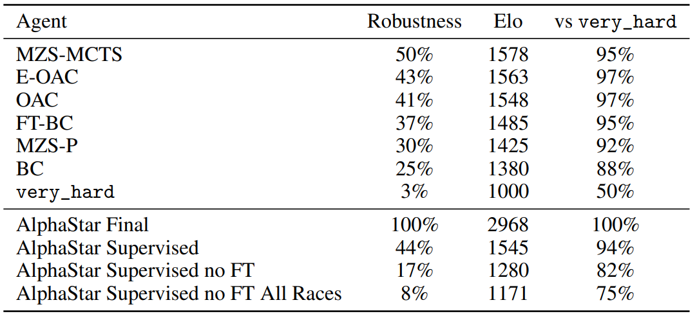
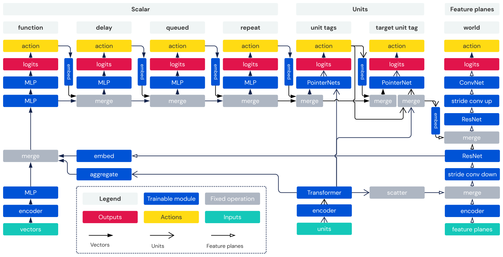

---

layout:     post
title:      「论文分享」大规模离线强化学习的脱机星际争霸II
subtitle:   Workshop NeurIPS 2021
date:       2022-05-21
author:     MRL Liu
header-img: img/the-first.png
catalog: True
tags: [论文分享]
   
---

​		***《StarCraft II Unplugged Large Scale Offline Reinforcement Learning》***是来自美国DeepMind团队的Michaël Mathieu等人发表在NeurIPS 2021上的一篇Workshop论文，这里是[原文链接](https://arxiv.org/pdf/2201.13425.pdf)和[原文代码](https://github.com/Blizzard/s2client-proto/tree/master/samples/replay-api)。

# 摘要

​		《星际争霸2》是最具挑战性的强化学习（RL）环境之一，它是部分可观察的、随机的和多智能体的，掌握《星际争霸2》需要在长期范围内进行战略规划，并实时低水平执行。它还有一个活跃的人类竞争场景。《星际争霸2》特别适合学习离线RL算法，这既是因为它的挑战性，也是因为暴雪公司发布了数百万人类玩家玩的《星际争霸2》游戏的海量数据集。本文利用了这一点，并建立了一个基准，称之为**脱机星际争霸II**，它为离线强化学习带来了前所未有的挑战。本文定义了一个数据集（暴雪版本的子集），可用于机器学习方法的标准化API的工具和评估协议。本文还介绍了基线代理，包括行为克隆，以及V-trace actor-critic和MuZero的脱机变体。本文发现，与之前发布的AlphaStar的行为克隆智能体相比，这些具有动作价值估计和单步策略改进的算法变体效果最好，胜率超过90%。

# 一、相关工作

​        在线RL要求训练策略时智能体必须不断与RL环境交互，深度强化学习（RL）领域中大部分成功都是在线RL领域中的，例如：

> Atari【34】（2015年Nature上的***《Human-level control through deep reinforcement learning》***）、
>
> Go【43】（2016年Nature上的***《Mastering the game of go with deep neural networks and tree Search》***）、
>
> Chess【44】（2017年的***《Mastering chess and shogi by self-play with a general reinforcement learning algorithm》***）
>
> AlphaStar，StarCraft II【51】（2019年的Nature上的《***Grandmaster level in starcraft ii using multi-agent reinforcement learning》***）、
>
> DOTA 2【7】（ 2019年的***《Dota 2 with large scale deep reinforcement learning》***）
>
> robotics【2】（2020年的IJRR***《Learning dexterous in-hand manipulation》***）

​       在线RL的特点使其在显示应用中很不安全，因为它要求训练策略时智能体必须不断与RL环境交互。所以离线RL逐渐成为一个活跃的研究领域。离线RL中智能体可以从之前的固定数据集中学习，这样就可以将训练好的策略再部署到现实世界。离线RL方法包括：

> 1）将训练策略规范化来接近行为策略的策略约束方法，如【15】（2019年的ICML***《Off-policy deep reinforcement learning without exploration》***）、【54】（2020年的***《Critic regularized regression》***）
>
> 2）通过悲观的规范化或不确定性鼓励更保守的价值估计的基于价值的方法[29，16]，如【29】（2020年的***《Conservative q-learning for offline reinforcement learning》***）、【16】（2021年的***《Regularized behavior value estimatio》***）
>
> 3）基于模型的方法，如【56】（2020年的***《Mopo: Model-based offline policy optimization》***）、【27】（2020年的***《Morel: Model-based offline reinforcement learning》***）、Atari【41】（2021年的***《Online and offline reinforcement learning by planning with a learned model》***）
>
> 4）标准非策略RL方法的改编，如DQN【1】（2020年的ICML***《An optimistic perspective on offline reinforcement learning》***）或D4PG【54】（2020年的***《Critic regularized regression》***）。最近，仅使用一步策略改进的方法已被证明对离线强化学习非常有效，如【16】（2021年的***《Regularized behavior value estimatio》***）、【8】（2021年的***《Offline rl without off-policy evaluation》***）。

​     也有一些尝试统一离线RL基准的研究工作，例如：

​       D4RL【14】（2020年的***《D4rl: Datasets for deep data-driven reinforcement learning》***）是一个离线RL基准测试套件，只关注混合数据源、

​        RL unplugged【17】（2020年的***《Rl unplugged: Benchmarks for offline reinforcement learning》***）为离线RL引入了一套基准测试，其中包含一组具有统一API和评估协议的不同任务域、

​         但是这些研究工作主要集中在由RL代理生成数据的简单RL环境，缺乏高维、部分可观察的任务，缺乏挑战性。

​        本文通过引入《星际争霸2》的基准来填补这一空白，本文的引入的离线RL基准测试环境—《星际争霸2》的脱机版本，包括规范代理的代码和数据处理程序，可以让AI社区中的更多研究人员可以访问此环境。《星际争霸2》是目前最复杂的模拟RL环境之一，具有部分可观测性、随机性、巨大的行动和观察空间、延迟奖励和多智能体动力学等特点。而且，《星际争霸2》拥有一个独立的人类玩家排行榜，它还构成了训练和评估离线RL代理丰富的数据源。

​        本文介绍了几种离线RL代理，它们可以从人工回放中学习竞争策略。架构和算法的创新使这成为可能。先前工作中大量实验和评估测试表明，许多现有的离线RL算法在此基准测试中失败。经过详细分析，该文认为构建成功智能体的方法主要有以下：首先训练一个策略和价值函数网络来估计行为策略和价值函数。然后，在评估期间，要么执行单个策略改进步骤，要么使用固定且预先训练的行为值函数改进策略。本文相信，分享这些见解对任何对离线RL感兴趣的人都很有价值，尤其是在大规模情况下。

# 三、背景知识

## 1、星际争霸

​        《星际争霸（StarCraft）》是一个实时战略游戏，玩家需要通过收集资源、构建单位和结构来相互竞争以求控制共享地图。游戏有多种模式，例如团队游戏或自定义地图。例如，《星际争霸》多智能体挑战赛【38】是一项越来越受欢迎的多智能体强化学习任务，包括一系列任务。在本文中，我们将《星际争霸2》视为一款双人游戏，因为这是《星际争霸2》的主要环境，它可以在各个级别上玩，从休闲网络游戏到专业电子竞技。它将长期的高级推理与快节奏的单元管理相结合。星际争霸2有很多具有挑战性的策略，表现出循环性和非传递性，尤其是因为玩家在游戏开始时从三个外星种族中选择一个，每个种族都有根本不同的机制、优势和劣势。该游戏在具有不同地形的大型地图上进行。可以通过与人类玩家（包括专业玩家、内置机器人、来自社区的脚本机器人，甚至是AlphaStar[50]或TStarBot[19]等更强大的在线RL代理）进行游戏来评估代理。

​         当人类玩家使用鼠标和键盘玩游戏时，智能体使用一个称为原始界面的API，该API在附录A.3中有详细说明。在这个界面中，观测向量分为三部分，即世界（world）、单位（units）和标量输入（scalar_inputs），这三部分足以描述完整的观测。这些动作被编码为7个部分，称为参数：函数（function）、延迟（delay）、排队（queued）、重复（repeat）、单位标记（unit_tags）、目标单位标记（target_unit_tags）和world。需要注意的是，这些参数并不是相互独立的，尤其是函数决定使用哪些其他参数。

​        《星际争霸2》星际争霸2的特点是玩家可以在大型地图上移动他们的单位。他们还可以建造建筑物（不能移动的单位），并收集资源。在任何给定的时间，他们只能通过相机观察整个地图的一个子集，以及整个地图的粗略缩小版本，称为小地图。此外，单位有一个视野，因此其他玩家拥有的任何单位都是隐藏的，除非它在视野中。玩家也可以接收到额外的信息，例如拥有的资源数量或当前选定单位的一些详细信息，以及游戏中事件的声音提示。我们称之为标准接口。玩家通过首先选择单位，然后选择一种能力，最后，对于某些动作，可以在相机或小地图上的目标来发布命令。我们的代理使用作为原始接口公开的API。它包括三类观察结果：

World：一个称为世界的张量，对应于向人类玩家显示的小地图。观察到8幅分辨率为128x128的特征图。特征图包括：

> –高度图（height_map）：地图的地形，在整个游戏中保持不变。
> –视野图（visibility map）：任何代理单位视野内的区域。
> –爬行图（creep）：虫族（Zerg）“爬行”所覆盖的地图区域。
> –玩家图（player relative）player\u relative：对于每个像素，如果该像素上存在一个单位，则表示该单位是由代理、对手、或者中间方所有。
> –警报（alerts）：对标准界面的小地图上显示的警报进行编码，例如当部队开始战斗时。
> –可路径（pathable）：地图上可供地面部队使用的区域。
> –可建造（buildable）：地图上可以放置建筑物的区域。
> –虚拟相机（virtual camera）：虚拟相机当前覆盖的区域。虚拟相机限制了许多单元属性的详细视图，并限制了针对摄影机外部单元/点的某些操作。它可以作为动作移动。

Units：代理观察到的单位列表。它包含代理的所有单位，以及代理视野内的对手单位和对手建筑的最后已知状态。对于每个单元，观察值是一个大小为43的向量，包含游戏界面中可用的所有信息。特别是，如果对手的某些单位信息不在代理的虚拟相机中，则这些信息会被屏蔽。此外，该列表还包含游戏中临时、局部事件的效果条目（虽然效果在严格意义上不是单位，但可以表示为单位）。在我们的实现中，此列表最多可以包含512个实体。在一次存在超过512个单位/效果的罕见情况下，额外的观察结果将被截断，并且对代理不可见。

标量输入：标量输入是游戏界面中可用的全局输入。他们是：

> 玩家ID：玩家的ID（0或1），这是对智能体没有用的
>
> 矿物：
>
> 在原始界面中，动作也不同。每个原始动作最多可组合三个标准动作：单位选择、能力选择和目标选择。实际上，每个原始操作被细分为7个部分，称为参数，依次执行：
>
> 函数：这对应于星际争霸II API的能力部分，并指定了动作。
> 示例包括：修复、训练SCV、建造命令中心CommandCenter或移动相机。
>
> 延迟：理论上，代理可以在每个环境步骤中执行操作。然而，由于《星际争霸2》是一款实时游戏，环境步骤非常快，因此它对人类不公平，因为人类无法以如此快的速度发布动作。此外，这将使剧集非常长，这对学习来说是一个挑战。因此，代理指定在下一个观察操作对之前将发生多少个环境步骤。节流用于确保代理每秒不能发出太多操作。
>
> Queued：此参数指定是立即应用此操作，还是排队应用此操作。这对应于在游戏界面中按下Shift键
>
> 是否重复：通过快速按键盘键，可以在标准界面中快速执行某些重复的相同操作，有时甚至可以在每个环境步骤中执行多个操作。repeat参数允许代理在同一步骤中最多重复操作4次。这对于快速建造大量虫族单位非常有用。
>
> 单位标记：这相当于标准界面中的选择操作。此参数是代理单元上的掩码，用于确定哪些单元正在执行操作。例如，对于修复操作，“单元标记”参数指定要执行修复的单元。
>
> 目标单位标记：行动应针对哪个单位。例如，修复操作需要特定的单元/建筑进行修复。星际争霸II中没有针对多个单位的动作（有些动作可以影响多个单位，但指定一个目标点）。
>
> 世界：这一行动应该针对世界上的哪一点。它是一对（x，y）坐标，与世界观测站对齐。例如，移动相机需要知道将相机移动到哪里。

## 2、强化学习

​        星际争霸II的底层系统动力学可以被一个马尔科夫决策过程（***Markov decision process*** ，MDP [6]）描述。

​		一个马尔科夫决策过程（MDP）$M$被定义为一个六元组$\left\langle S, A, R, T, \gamma, \rho_{0}\right\rangle$,其中$S$表示状态空间，$A$表示动作空间，$R(s, a)$表示一个智能体在状态$s$下采取动作$a$后收到的奖励，$ T\left(s^{\prime} \mid s, a\right)$表示从状态$s$采取动作$a$后转换到状态$s^{\prime}$的概率，$\gamma \in[0,1]$表示折扣因子，$\rho_{0}(s)$表示初始状态分布。

​		策略$\pi(a \mid s)$表示一个智能体在状态$s$下采取动作$a$的可能性。RL的目标是找到一个优化策略来最大化累计折扣奖励:
$$
\pi^{*}=\arg \max _{\pi} \mathbb{E}_{\tau \sim \pi}\left[\sum_{t=0}^{T} \gamma^{t} R\left(s_{t}, a_{t}\right)\right]
$$
​		其中$\tau=   \left\langle s_{0}, a_{0}, \cdots, s_{T}, a_{T}\right\rangle$是一个智能体的轨迹。

​       强化学习算法方法的核心是策略迭代，即反复进行策略评估和策略改进的过程。策略评估：通过估计来自状态 s 或状态动作对的预期回报的价值函数，然后在策略改进过程中使用价值函数来增加选择更高价值的动作的概率。

## 3、离线强化学习

​        **在线RL **在训练阶段与RL环境进行交互来学习策略，在部署阶段使用训练好的策略在RL环境中进行测试。

​        **离线RL**在训练阶段，不能与RL环境进行任何交互，只能使用数据集或者回放缓冲区中的数据来训练策略；在测试（部署）阶段，使用训练好的策略在RL环境中进行测试。

​         **离线RL**的原理来自**数据驱动**方法的**监督学习**，它需要使用遵循了MDP模型的数据集来进行训练。离线RL的主要挑战之一是：***如何学习到比生成训练数据集的策略更好的策略？***

​        离线RL领域可以使用在线RL的训练算法，但是需要进行一些特殊设计，例如在Actor-Critic在线算法中要更关注动作价值的估计。

# 四、一个离线RL基准：脱机星际争霸2

​		该文工作建立在《星际争霸2》的学习环境和相关的回放数据集（【52】，2017年的***《Starcraft ii: A new challenge for reinforcement learning》***）和先前工作的智能体（【51】，2019年的Nature上的《***Grandmaster level in starcraft ii using multi-agent reinforcement learning》***）上，提供了离线RL基准所需的几个关键组件：

> **评估指标**。本文提出了一种新的替代指标。内置的基于规则的代理提供了一种性能度量，但这种度量很快就会饱和。在这项工作中，我们提出了替代指标。
>
> **基线代理**。本文提供了许多经过良好调整的基线代理。
>
> **开源代码**。本文提供了一个在《星际争霸2》上表现良好的行为克隆代理，它构成了本文中介绍的所有代理的主干。

## 3.1 离线强化学习的挑战点

​           当从离线数据学习时，算法的性能在很大程度上取决于数据中不同**状态-动作对**的可用性，该文称之为覆盖率（***coverage***），状态操作对缺少得越多，覆盖率越低，问题就越有挑战性。

​          本小节通过和Atari游戏对比，重点介绍《星际争霸2》的一些特性，这些特性使离线RL学习更有挑战性。

**动作空间**。《星际争霸2》有一个大型且高度分层化和结构化的动作空间。如【51】中所述，智能体必须先选择一种动作类型，然后选择其要应用动作的单位的一个子集，最后选择动作作用的目标（一个地图位置或一个可见单位），然后决定下一步观测和施加动作的时间。粗略估计，每个步骤大约有10^26个可能的动作。相比之下，Atari游戏每一步只有18种可能的动作。这使得《星际争霸2》获得较高的状态-动作的覆盖率变得更具挑战性。

**部分可观测性**。《星际争霸2》具有战争迷雾设计，即玩家只能看到在自己单位视野内的对手单位的信息，如果它没有探索环境，很可能不知道对手在做什么。相比之下，对于Atari游戏来说，使用上下3帧的记忆基本就可以获取整个游戏全局的信息。这意味着RL的状态转移函数非常复杂且随机，RL环境的下一个状态并不能根据RL环境的当前状态和智能体采取的动作来确定。

**随机环境**。《星际争霸2》随机性的主要来源是未知的可能是随机的对手策略，其次来自很小程度上来自于RL环境中游戏引擎本身的随机性的，例如一些单位有随机的移动或随机的诞生点，并且一些命令可以有随机的延迟。相比之下，在Atari环境中，随机性只产生于RL环境本身的粘性动作[33]。在随机环境可能需要更多的轨迹来获得高状态动作覆盖率。

**数据源**。《星际争霸2》有数百万人类玩家的回放数据集。这些回放显示了广泛多样的探索和开发策略。相比之下，现有的基准测试【17，1】偏向于RL智能体生成的数据集。回放（Replays）还标有玩家的MMR，这是关于他们技能的宝贵数据。

​          这些特性给现有算法带来了挑战，并且可能会在行为克隆、在线RL算法和离线RL算法之间产生差异。

## 3.2 数据集

​         目前网路有《星际争霸2》的大约2000万个游戏重播包在公开发售。出于技术原因，该文使用的游戏数据来自于《星际争霸2》版本4.8.2至4.9.2之间，这依旧有留下近500万个游戏重播包。他们来自《星际争霸2》的ladder（官方的配对机制）。每个玩家都由其MMR（一种类似于Elo【12】的排名机制）评分）。

​        MMR范围从0到7000左右。图1显示了MMR在各集之间的分布。为了获得高质量的训练数据，该文只使用MMR大于3500的玩家玩的游戏，这相当于前22%的玩家，这给该文留下了大约140万场比赛。由于本文考虑两个玩家的游戏，从机器学习的角度来看，每个游戏形成两集，每一方一集，因此数据集中有280万集。这代表了总共30多年的游戏历史。

​		回合可以跨越许多步骤。《星际争霸2》是一款实时战略游戏，其内部的游戏时钟很快。为了缩短轨迹，本文只观察玩家采取动作时的步骤。因此，数据集的每个时间步$t$都包含一对$(s_{t},a_{t})$，同时也包含delay，即自上次采取动作$a_{t-1}$之后的内部游戏经过的时间步数，delay被编码为$s_{t}$的一部分，每个回合也包含一些元数据，最重要的一些数据如是输出R（1表示胜利，-1表示被打败，0表示平局，平局的可能性可以忽略不计）和每个玩家的MMR，因为这款游戏是使用暴雪的配对系统在线玩的，所以在大多数游戏中，玩家都拥有相似的MMR。

图1.用于训练的回放数据中玩家MMR的分布直方图

​        为了训练我们的代理，我们对公开的2000万款星际争霸II游戏进行过滤，以获得更高质量的数据。我们使用版本4.8.2至4.9.2，并将游戏限制为MMR大于3500的更熟练的玩家。这给我们留下了大约140万场比赛（表4）。这些回放跨越了两个不同的平衡补丁，在旧游戏和新游戏之间引入了星际争霸2规则的细微差异，这些差异小到可以忽略8。此外，在此期间地图池发生了一次变化，因此游戏总共在10张不同的地图上进行。
​         平均双人游戏长约11分钟，总帧数约为15482帧，这对建模提出了重大挑战，因为这使得监督和离线RL训练变得越来越困难和缓慢。因此，智能体只观察那些动作，会将回合的帧数的有效长度缩短12倍。有关训练集中使用的数据的其他统计信息，请参见表4。
​          这些重播由暴雪提供并托管在其服务器上。这些数据是匿名的，不包含玩家的个人信息。

# 五、方法

## 4.1、训练

​		该文的《星际争霸2》的脱机版本是一个数据驱动方法的大规律基准。算法只使用在附录A.2中描述的数据集中的数据来学习。算法和环境交互时没有收集更多的数据。但是，该方法允许可以在RL环境中运行来评估它们的性能，这种评估可能有助于优化超参数。

​        【51】中的AlphaStar智能体训练针对《星际争霸2》不同的种族和不同的游戏地图来训练不同的智能体，本文方法在《星际争霸2》的所有三个种族和数据集中所有的10张地图上来训练相同的智能体，这更具挑战性。

​        本文典型地在K个连续时间步的序列$\left(s_{0}, a_{0}, r_{1}, \ldots s_{K-1}, a_{K-1}, r_{K}\right)$中训练智能体，每次取出一个M的最小批次。除非特别说明，最小批次是各自独立的，这样两个连续的最小批次就不想管了。序列K在不同方法中不同，将在章节5中解释。

## 4.2、参考智能体

​		该文中将在该数据集上训练了六个代理作为参考智能体。本文建议通过衡量新代理和它们的获胜率来评估未来的工作。它们分为三类：行为克隆、演员评论家和蒙特卡罗树搜索（MCTS）。第5节给出了有关这些代理、它们的实现和消融实验的详细信息，其性能见表1。

表1.在提出的指标上6个参考智能体的评估。表格底部是【51】中AlphaStar智能体的性能，注意所有的AlphaStar智能体在不同的赛道上使用了针对性的模型（见章节4.1）。本文的所有的智能体都在所有的赛道上进行训练和评估。

***行为克隆（BC）***。本文的行为克隆基线是一个模仿学习方法，即在数据集给定的状态集下去预测下一个动作是什么，它在《星际争霸2》中使用了一个监督型的交叉熵损失。BC智能体仅仅使用数据集中的状态和动作来估计行为策略$\hat{\mu}$。

***细调的行为克隆（FT-BC）***。FT-BC智能体在训练好的BC智能体上只在和获胜的最高的MMR数据中再次训练，进一步详细优化预训练的参数，这一步是和【51】中的细化相似的。

***离线Actor-Critic（OAC）***。OAC智能体将V-trace算法从Impala【13】调整为离线RL的i.i.d.设置。为了计算重要性采样比率，它使用BC智能体估计的行为策略$\hat{\mu}$。Actor-Critic方法从$\hat{\mu}$开始训练，然后学习一个改进的策略$\pi$。不同的是，Actor-Critic方法的在线版本使用改进策略的价值函数$V^{\pi}$作为Critic，本智能体使用行为策略的价值函数$V^{\mu}$作为Critic。

***强化离线Actor-Critic（E-OAC）***。强化法是提高非策略学习稳定性的理论工具【47，25】。该代理将N步强调跟踪（N-steps Emphatic Traces，NETD）【26】应用于离线演员-评论家代理，但使用连续的数据序列。

***使用MCTS监督的MuZero（MZS-MCTS）***。本文使用了【40】中用于《星际争霸2》MuZero的脱机版本，但是有一个关键性的不同，MuZero的脱机版本在训练时使用了蒙特卡罗树搜索（MCTS，【9】），该智能体使用监督学习来训练，其中使用行为策略和行为价值函数。在推理阶段，策略、价值和最新模型用来MCTS的策略改进和动作选择。

***使用策略监督的MuZero（MZS-P）***。为了完整性，本文还评估了相同MuZero监督代理的性能，但在推理时没有MCT，而是直接使用策略网络。这类似于行为克隆代理，但由于训练值函数和潜在模型所产生的额外正则化效应，通常可以表现得更好，而这些在推理过程中没有使用（如[18、40、22]中所述）。

## 4.3、评估和指标

​        许多的指标可以用来评估智能体。一方面，最容易计算（且信息量最小）的指标就是查看损失函数的值。另一方面，也许信息量最大（也最难计算）的指标是和包括专业玩家在内的众多人类玩家来评估智能体。该文的指标在这两个指标上做了平衡：通过与固定的7个对手进行反复博弈来评估该文的智能体： ***the very_hard built-in bot***（《星际争霸2》没有打破游戏规则的不公平优势中的最强内置机器人）和上述6个参考智能体。

​       在训练中，本文只用 ***the very_hard built-in bot***评估智能体，因为它成本更低，本文主要使用它作为验证指标，来调整超参数并放弃不具前景的运行。

​       训练有素的智能体将根据上述所有对手进行评估。我们将这些获胜率组合成两个聚合指标，同时对这些代理的任何一对进行统一采样：鲁棒性，计算为1减去参考代理集上的最小获胜率，以及Elo评级【12】（1978年的***《The rating of chessplayers, past and present》***）。有关指标计算的详细信息，请参见附录A.5。这些指标如表1所示。

评估指标的细节：

# 六、 深入分析参考智能体

​        该文的6个参考智能体的性能在表1中进行了展示，在本节的剩余部分来提供这些智能体的细节和消融实验。表1中的结果是被评估在一个softmax temperature为0.8的智能体上进行评估。这意味着在评估时，在转换为概率之前，softmax logits乘以0.8。这使代理更具确定性，但也更强大。

## 5.1 架构

​       该文中提供的智能体使用了相同的架构，它是从[51]中使用的模型推导出来的，并进行了一些改进。星际争霸II API的输入和输出是围绕三种类型的数据构建的：向量、单位和特征平面（更多细节见A.1和A.3节）。我们围绕它们构建架构，如图3所示。与[51]中的模型不同，我们不使用LSTM模块或任何形式的内存，这将在第5.2节中讨论。有关架构的更多详细信息，请参见附录A.4。

图3. 我们用于参考代理的架构的说明。不同类型的数据用不同类型的数据(向量、单位或特征平面)来表示。

标量输入被标量编码器嵌入到一维矢量中。此处还嵌入了之前执行的操作的标量参数。该向量由连续的MLP块进行变换。这是一个无内存模型，但在我们的消融研究中（以及在[50]中），这也是我们添加LSTM模块的地方。最后，从该向量生成logit，以生成动作的函数参数。采样的动作被再次嵌入，并对下一个参数（延迟）进行采样，然后排队并重复

单元特征和上一个动作的单元参数嵌入到每个单元的一维向量中，从而生成一个固定长度的嵌入列表（以及一个指示列表中哪些元素未使用的掩码）。它们由三层transformer处理，然后通过指针网络【52】生成单元标记和目标单元标记参数。为了生成单元标记参数（最多可以选择64个单元），我们迭代应用指针网络64次，因此从概念上讲，单元标记表示64个参数。

世界特征嵌入到特征平面中。之前动作的世界参数没有被嵌入，因为我们发现这会导致过拟合。嵌入的世界特征由残差卷积网络（ResNet）【20】处理。ResNet的一部分将输入缩小为128个尺寸为16的要素平面⇥ 16、世界动作是通过将特征平面放大为单个对数平面获得的，分辨率为256⇥ 256（与游戏世界的分辨率相匹配）。

通过特殊操作，信息在模型的标量、单位和世界部分之间流动。
在transformer层之后，单位向量被聚合（平均averaged）并合并到标量输入的嵌入中。单元还通过分散操作（scatter）嵌入到世界特征平面中，分散操作将每个单元的嵌入与特征平面的相应（x，y）坐标合并。特征平面被缩小比例并重塑为一维向量，以便与标量输入的嵌入合并。指针网络自然地将标量嵌入（它们形成查询）与单元嵌入（它们形成键）合并在一起。最后，标量嵌入和选定的目标标记参数一起被重塑为世界特征平面。请注意，world参数不以target\u unit\u标记为条件，因为API中的任何动作都不能同时使用target\u unit\u标记和world参数。

我们将开放我们的架构的源代码，我们架构的确切超参数和细节可以在发布的代理中找到。

## 5.2 行为克隆

​         智能体BC和FT-BC是通过使用一个**监督损失**来训练的，其中给定一个轨迹$\left(s_{0}, a_{0}, \ldots, s_{t-1}, a_{t-1}, s_{t}\right)$，模型预测结果$a_{t}$。这类似于训练语言模型。附录中的算法1详细介绍了该过程。这与AlphaStar监督代理创建随后的大师级AlphaStar最终代理所使用的程序相同【51】，不同之处在于我们在星际争霸的所有三个种族上训练一个代理，而不是三个单独的代理。这使得问题更具挑战性。agent的输入是观测$s_{t}$和上一个动作$a_{t-1}$，玩家的MMR和先前的LSTM状态（对于使用LSTM的模型）。在推理过程中，我们可以通过更改MMR输入来控制代理所玩游戏的质量。在实践中，我们将MMR设置为最高值，以确保代理发挥最佳效果。我们将Adam优化器【32】与余弦学习率计划【30】一起使用。实施细节见附录B.1.1。

​        Memory。[51]中的AlphaStar代理使用一个LSTM模块。令人惊讶的是，我们的实验表明，尽管损失的最终值更高，但完全删除LSTM可以得到性能更好的模型。基于LSTM的代理在与非常困难的机器人对决中达到了70%的胜率（和无内存代理对决达到了84%的胜率）。因此，本文提出的所有代理都是无内存的。

​        数据过滤。由于行为克隆只是模仿训练数据，因此更高质量的数据可以带来更好的性能。我们通过实验筛选数据，只包括顶级MMR和/或获胜的游戏回合。不幸的是，由于过滤数据也会减少事件的数量，代理的总体性能会恶化。过滤后的剧集数和最终表现如表3所示。

     表2. 使用了不同最小批次和rollout长度的行为克隆的性能对比。所有代理看到的观察总数相同（10^10)。

 最小批量大小和rollout长度。小批量大小M和rollout长度K影响最终行为克隆的性能，如表2所示。我们发现每次学习步长的数据总量越大，导致最终性能更好。我们在行为克隆上使用K=1和M=32768。

​        详细优化。当添加额外的辅助训练阶段时，BC代理可以获得更好的结果。我们将得到的方法称为FT-BC。我们首先对代理进行所有数据的训练（MMR>3500），然后，在降低学习率后，我们进一步对代理进行最佳数据（MMR>6200）的培训，并且只对获胜的游戏进行训练。如表3所示，此方案可获得最佳的行为克隆结果。
FT-BC代理的实施详情见附录B.1.1。

​        表3.使用不同的MMR过滤方案和可用的剧集数针对非常硬的机器人训练的性能代理。由于剧集数量减少，对高质量数据的训练会导致糟糕的表现。最好是在完整数据集上进行训练，然后在更高质量上进行微调。

## 5.3 离线Actor-Critic

Actor-critic[55,5]算法学习一个策略和一个值函数。在离线策略设置下，其中策略随行为策略而变化，它计算重要性采样。

我们的设置不同于经典的非策略Actor-critic。事实上，我们无法访问玩家使用的行为策略µ，我们只能观察他们的动作。相比，我们使用BC代理提供行为策略的估计值，并使用估计值⇢ˆdef=⇡/代替基本真相的是比率。BC代理还用作OAC的起点（即，它用于初始化权重）。

学习行为策略的值函数。我们训练网络来生成估计的行为策略，使用一个额外的输出，通过特征上额外添加的以特征为条件的MLP，它被使用一个均方误差来学习。我们尝试在行为克隆的同时对其进行训练，或在训练前的模型上进行训练，但没有观察到性能上的显著差异。然后对OAC和E-OAC模型的值函数进行训练。它达到了72%的精度，即Vµ的符号与R相同的步长分数。

**策略值函数的发散**。标准的Actor-critic方法学习策略，行为策略和策略的值函数，行为策略的值函数，期间通常通过时分误差（TD）来学习。我们发现这样做时，在训练中使用策略的值函数会导致发散（附录5的展示），我们探索了几条改进该问题的方法：

> **早期终止**：策略首先改进然后发散。因此我们可以提前终止来保持一个改进的策略，我们不使用这个方法因为它要求使用环境来检测什么时候终止。
>
> **固定的行为策略的值函数**：相比于迭代地估计策略值函数，我们可以使用行为策略的值函数并保持固定。这和[16]的行为值估计相似。
>
> **训练参数**：因为Actor-critic使用时分技术，rollout的长度必须大于1，我们使用K=64，因为该方式强调轨迹的计算方式，E-OAC代理需要从连续的小批量中学习，细节可以在附录B.1.2和附录B.1.3中学习。如附录A.3所述，为了简单起见，我们仅对动作的函数和延迟参数应用策略改进。

## 5.4 Muzero

MuZero Unplugged[40]是最近引入的离线RL方法，它在各种离线RL基准上实现了最先进的性能[17，11]。受最近处理随机环境扩展的启发，我们将MuZero评估为星际争霸II的离线RL方法。

我们使用采样的MuZero中引入的方法[24]来处理星际争霸II的大动作空间。Sampled MuZero对策略中的多个动作进行采样，然后将搜索限制为仅对采样的动作进行。这让我们可以扩展到星际争霸2的大动作空间。我们在附录B.1.4**中提供了进一步的实施细节**

**监督的MCTS**。我们的第一个关键结果是，当使用监督学习训练模型时，MCTS对星际争霸II来说是一个强有力的策略改进。在整个训练过程中，甚至对于相对较弱的策略和价值函数，我们发现，在通过监督学习训练策略和价值函数时，MCTS几乎总是比神经网络策略表现更好。

**脱机MCTS**。使用完整的MuZero脱机算法的初步实验即使用MCTS目标训练没有成功。我们发现，该策略将很快崩溃为少数几个具有高（高估）价值的动作。虽然在推理时使用MCT可以提高性能，但在训练时使用MCT会导致策略崩溃。为了进一步调查这一点，我们评估了重复应用MCTS策略改进对行为策略和价值Vµ的绩效，我们通过训练一个新的MuZero模型，使用一个行为策略的MCTS动作。因此，重复应用MCT不会继续改善政策。我们认为，这可能是由于MCTS政策分布产生的分布行动样本具有高估的价值估计。

# 五、实验

​           百分位曲线[47]允许我们在一幅图片中查看我们代理人的整个结果。我们在图4中绘制了这些值的百分位数，而不是汇总分数f（p，q），并且可以定义一个代理优于另一个代理，当且仅当它在0到50之间的百分位数上占主导地位时（超过50的主导地位，代表中位分数只会加重对一小部分参考对手的过度专业化）。特别是前面章节中的稳健性指标是该曲线上的百分位0。值得注意的是，这种方法强加了偏序，如果其中一个更稳健，而另一个在中值上更好，则某些代理可能无法进行比较。因此，使用it最大限度地提高进度将鼓励开发既健壮又平均性能良好的代理。当涉及到我们的参考试剂时，可以使用百分位曲线对它们进行完全排序，将MZS-MCT放在顶部，然后是E-OAC、OAC、FT-BC、MZS-P、BC，最后是非常硬的机器人，这一排序与鲁棒性给出的排序一致。

# 七、结论

​        **行为克隆代理**是这项工作中所有代理的基础。它在训练期间以MMR为条件，这有助于过滤出质量较低的轨迹。然而，**行为克隆代理**基本上仍然局限于估计行为策略，忽略了奖励。因此，它学习的策略本质上是生成数据集的所有策略的平滑版本。本文以奖励为条件对**行为克隆代理**进行了训练实验，并以获胜的游戏结果对其进行了评估，但没有观察到任何效果改善。相比之下，使用奖励的离线RL方法以不同的方式来改进所学策略。MZS-P在辅助损失中使用奖励，FT-BC在选择回合进行微调时使用奖励，OAC、E-OAC和MZS-MCTS在执行强化学习时使用奖励。最终结果表明，使用奖励的强化学习的代理表现最好。

​        本文观察到，最初为在线学习设计的算法，即使进行了非策略修正，在直接应用于完全离线RL设置时，也不能很好地工作。我们将这种现象归因于致命的Deadly Triads问题【49、46、50】。然而，许多最近的研究发现，只需进行修改，确保学习的策略保持接近行为策略µ，学习的值保持接近Vµ，或两者兼而有之，这些算法就可以变得更加有效。本文的Actor-Critic和MuZero的实验结果与这些发现一致。

​        引用代理是我们尝试的改进策略的方法。然而，我们尝试了其他几种方法，但没有成功，包括优势加权回归（AWR）【36】、PPO【42】和基于状态行动值的方法，如SARSA【38】、CRR【54】和R-BVE【16】。到目前为止，该文还不知道这是否有根本原因，或者我们只是没有找到这些方法在这个数据集上运行良好所需的必要更改。         

​        离线RL能够将RL部署到现实世界中，学术界对这一领域的兴趣不断增长，并提出了若干基准，包括RL -Unpluged和D4RL标准【14】和RWRL标准【11】。然而，由于这些基准测试的规模相对较小，而且是综合性的，因此它们无法捕获现实世界脱机RL的挑战。

​         本文介绍了《星际争霸2》的脱机基准版本，用于评估只从离线数据学习星际争霸II的代理。这些数据由超过一百万个游戏组成，大多数游戏是由业余的《星际争霸2》玩家在暴雪的战网（Battle.Net）平台中玩的。因此，基准测试更准确地捕获了离线RL的挑战，在离线RL中，代理必须从由不同弱势专家组生成的记录数据中学习，并且数据不会耗尽环境的全部状态和行动空间。

​         本文证明，离线RL算法相对于之前发布的AlphaStar监督代理（使用行为克隆进行训练）的胜率可以超过90%。然而，在线和离线方法之间的差距仍然存在，我们希望该基准将作为一个测试平台，以提升离线RL算法的最新水平。

​		
