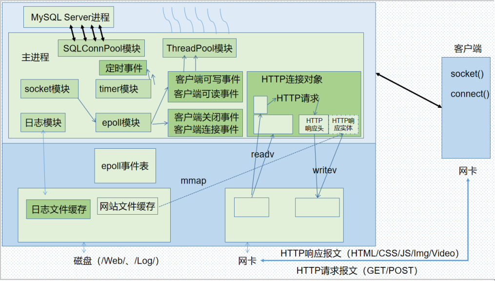
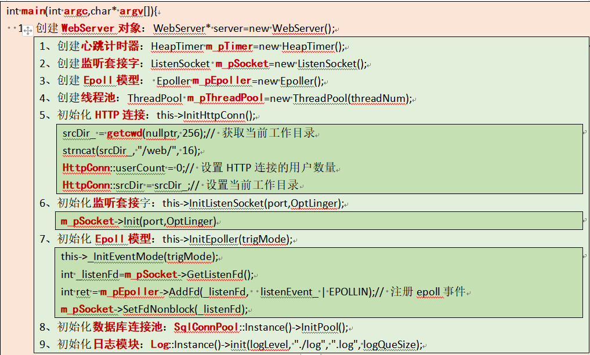
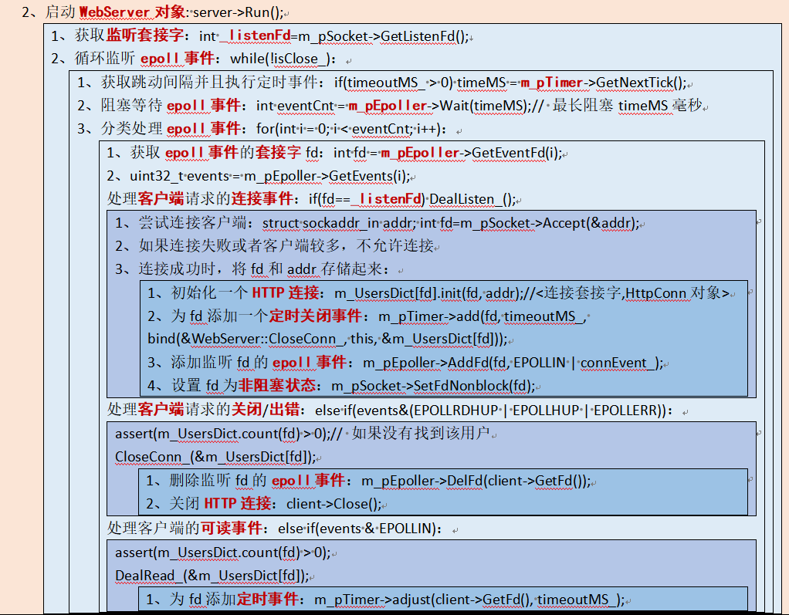
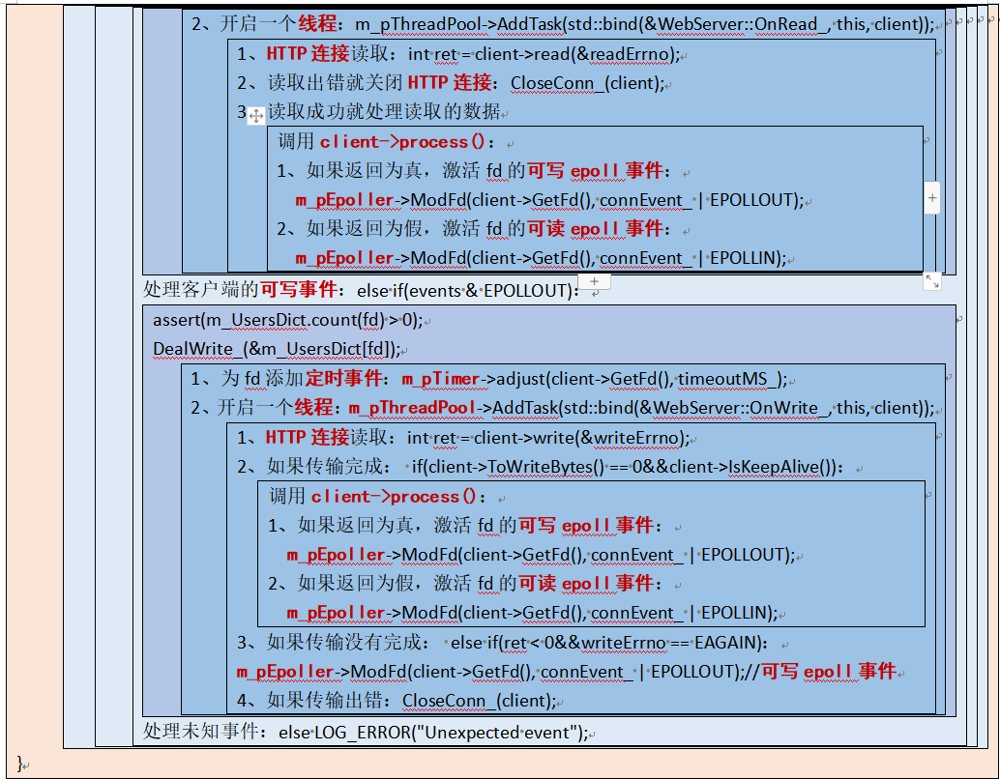
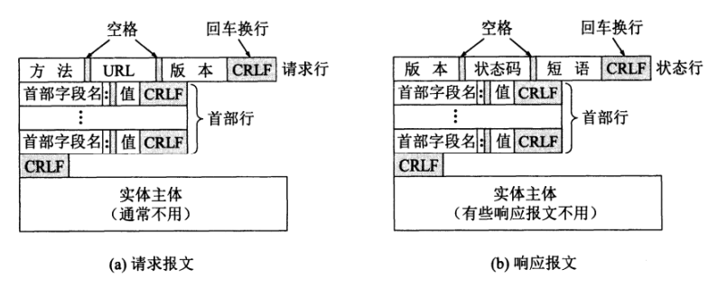

​	 	  该项目是作者在学习Linux服务端编程时整理的项目，Web简易服务器是一款用C++实现的基于Linux的`轻量级高性能Web服务器`，经过web bench工具的压力测试，可以实现上万的`QPS` (Query Per Second，每秒查询率)。

## 技术栈

* 基于`多进程网络通信`和`匿名管道技术`的`Web bench`测试工具；
* 基于`互斥锁`和`条件变量`等多线程同步技术实现的`线程池模块`，实现将多个任务同时分配给多个线程；
* 基于`Socket编程`和`IO复用技术Epoll`实现的`Reactor高并发模型`，实现同时监听多个客户端事件；
* 基于`最小堆结构`的`定时器模块`，实现非活动连接的超时管理；
* 基于`正则表达式`和`状态机`的HTTP/1.1解析和响应模块，实现处理Web静态资源的请求；
* 支持`分散读`和`集中写`的缓冲区模块，实现缓存数据的合理管理，提高文件数据拷贝效率；
* 基于`RAII机制`实现的`MySQL数据库连接池模块`，减少数据库连接建立与关闭的开销；
* 基于`单例模式`和`阻塞队列`的`异步日志系统`，实现以文件形式按日期记录服务器运行信息；

## 项目架构

## 程序逻辑

### 创建服务器

### 启动服务器

## HTTP请求和响应格式

