---

layout:     post
title:      「论文分享」智能交通系统中基于模糊推理的深度强化学习的信号灯控制
subtitle:   T-ITS 2021
date:       2022-07-01
author:     MRL Liu
header-img: img/the-first.png
catalog: True
tags: [论文分享]
   
---

​		***《Fuzzy Inference Enabled Deep Reinforcement Learning-Based Traffific Light Control for Intelligent Transportation System》***是来自印度的Neetesh Kumar等人发表在T-ITS 2021（Transactions on Intelligent Transportation Systems 2021）上的一篇论文，这里是[原文链接](https://ieeexplore.ieee.org/abstract/document/9072340)。

​        由于车辆数量的巨大增长和交通基础设施的有限，智能交通系统（ITS）已成为一个突出的研究领域。因此，针对交通信号灯的优化控制在最近几十年得到了较大关注。

#   一、相关工作

该文的文献综述部分如下：

> Du等人【1】（2018年Trans.Veh.Technol上的***《Deep reinforcement learning for traffific light control in vehicular Networks》***）已经使用并建议使用卷积神经网络（CNN）和强化学习来控制动态交通灯，但作者没有考虑不同车辆之间的优先级。
>
> Abadi等人【2】（2015年T-ITS上的***《Traffific flflow prediction for road transportation networks with limited traffific data》***）使用了自回归模型和蒙特卡洛模拟技术提出了一种预测道路交通车辆网络上交通流的策略，但交通数据有限且没有考虑车辆优先级。
>
> Quek等人【3】（2006年T-ITS上的***《POP-TRAFFIC: A novel fuzzy neural approach to road traffific analysis and prediction》***）提出了一种新的模糊神经方法，以利用真值约束的伪外积模糊神经网络分析和预测道路交通。这项工作考虑了不同优先级的车辆，但不是为了流动交通而设计的。
>
> Zhang等人【4】（2018年T-ITS上的***《Force-driven traffific simulation for a future connected autonomous vehicle-enabled smart transportation system》***）提出了一种用于未来互联自主车辆智能交通系统的力驱动交通模拟，然而，他们通过理解车辆动力学错过了交通控制的要求。
>
> Belletti等人【5】（2018年T-ITS上的***《Expert level control of ramp metering based on multi-task deep reinforcement learning》***）将多任务深度强化学习用于匝道计量的专家级控制，他们证明了基于神经网络的深度强化对于参数已知的问题是有效的。
>
> Bekiaris Liberis等人【6】（2016年T-ITS上的***《Highway traffific state estimation with mixed connected and conventional vehicles》***）开发了一种混合连接车辆和传统车辆的公路交通状态估计方法。作者通过使用著名的二阶交通流模型进行仿真，验证了所开发的估计方案的性能。
>
> Kafash等人【7】（2013年IFSC上的***《Designing fuzzy controller for traffific lights to reduce the length of queues in according to minimize extension of green light time and reduce waiting time》***）、
>
> Azimirad等人【8】（2010年的***《A novel fuzzy model and control of single intersection at urban traffific network》***）利用模糊模型开发信号灯控制器，以最小化平均等待时间（AWT）和队列长度（QL），但它们没有考虑紧急车辆的优先级，也不支持多种模式的切换。
>
> Mir和Hassan【9】（2018年ICMA上的***《Fuzzy inference rule based neural traffific light controller》***）开发了一种交通灯控制器，利用神经网络和模糊控制器来最小化汽车的AWT和QL。
>
> Kachroo和Sastry【10】（2016年T-ITS上的***《Travel time dynamics for intelligent transportation systems: Theory and applications》***）开发了一个理论数学模型，用于分析基于密度的实时车辆动力学行程时间。作者指出，对于行程时间是一个重要因素的智能交通系统应用而言，这一点很重要。
>
> Khan等人【11】（2018年的***《EVP-STC: Emergency vehicle priority and self-organising traffific control at intersections using Internet-of-things platform》***）利用微控制器、ZigBee、GPS和其他物联网设备开发了EVP-STC协议，并使用PTV Vissim改变其性能有效性。然而，作者考虑了线路开通时间，但忽略了车辆动力学中的几个重要参数。
>
> Younes和Boucherche【12】（2018年上的***《An effificient dynamic traffific light scheduling algorithm considering emergency vehicles for intelligent transportation systems》***）开发了一种基于启发式的算法，并在SUMO中进行了仿真验证，然而，他们忽略了其他优先车辆。

上述研究的对比可以看下图所示：

 综上所述，关于交通信号灯控制的现有研究存在以下不足：

> 1）对于现有的交通灯控制系统，交通信号只会扩散到固定的间隔内，绿灯/红灯的持续时间只能是相同间隔的倍数
>
> 2） 现有研究的重点仅在于找到准确的交通持续时间，而没有考虑车辆优先级[1]。显而易见，许多优先和应急车辆，如消防队、救护车等，需要尽快到达目的地。
>
> 3） 现有交通灯控制器无法根据交通行为并在不同模式下运行，即紧急/优先/公平模式。
>
> 4）传统的ITS解决方案在开发车载网络的IT和物联网基础设施（Rasberry pi、云等）方面不具有成本效益。这种类型的系统对发展中国家来说在商业上很昂贵。

​        为了克服上述局限性，该文提出了一种高效、动态、智能的交通灯控制系统（DITLCS），其重要贡献可以总结如下：

> 1）DITLCS可以根据车辆网络的信息（车辆优先级、交通负荷程度等）来计算交通灯信号每个相位的持续时间。
>
> 2） DITLCS可以利用模糊推理系统在三种模式间动态切换：FM（公平模式：所有车辆具有相同的权重）、PM（优先模式：根据优先级区分车辆权重）、EM（紧急模式：优先安排紧急车辆路线）。
>
> 3） DITLCS可以利用交通数据的深度强化学习模型对代理进行训练，该学习模仿经验丰富的人类代理的行为，可以在轻型计算设备上运行。
>
> 4）为了验证DITLCS的有效性，本文利用开源模拟器工具SUMO进行了真实模拟实验。在各种测试参数上，DITLCS的结果与几种最先进的算法相比，具有较好的性能和稳定性。

​       该文的其余部分组织如下：第二节介绍了文献综述。第三节介绍了模型和问题陈述。第四节介绍了强化学习的背景。第五节介绍了DITLCS的技术细节。第六节给出了模型的仿真研究。最后，本文在第七节得出结论。

#   二、本文模型

##    1、整体架构

 交通信号灯控制的流程如下：

上述流程可以被***算法1***描述：

在上述算法中，

**qL** ：（实时）队列长度，当前十字路口等待的车辆数之和
**WT** ：（实时）等待时间，当前十字路口车辆等待的时间之和
**phase**：相位。一个十字路口有多个红绿灯，这些红绿灯需要相互配合从而确保多个方向的交通流不冲突。**一个十字路口的多个红绿灯停留在一个特定信号（R，Y，G）的持续时间称为一个相位**，相位总数由十字路口可能的信号数决定。十字路口的所有相位是一个不断重复的循环周期变化。交通信号灯控制就是动态设置不同相位的持续时间。

通过上述流程可以发现，该文的DITLCS主要由两部分组成：**深度强化学习模型**和**模糊推理模块**。**深度强化学习模块**致力于最大化奖励函数，指导智能体做出决策。在深度强化学习模块的每个周期中测量累积奖励。**模糊推理模块**专门用于通过观察车辆交通场景的当前状态，从三种执行模式（PM、FM和EM）中选择一种执行模式。

## 2、深度强化学习模型

深度强化学习训练的智能体负责根据当前交通场景选择适当的动作，使车辆在交叉口处顺畅流动。

首先考虑一个十字路口的交通状态

### （1）MDP模型

强化学习模型由三元组（S、a、R）很好地定义，该文定义的三个参数如下：

#### A、状态

状态由一个十字路口中每个车辆在车辆网络中的位置P和速度V组成。

一个十字路口有四个方向，每个方向对应一个通道图，则位置矩阵P和速度矩阵V分别由四个通道图组成：

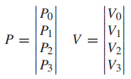

每个通道图是一张如下所示的由大小相同、长度为c的方形网格构建的二维网络：

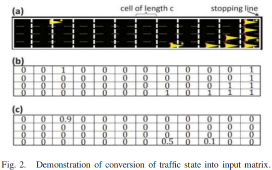

位置通道图的每个值是一个布尔值，0表示网格内没有车辆，1表示有车辆。

速度通道图的每个值是一个浮点值，以米/秒表示车辆的当前速度。

通道图中方形网格的长度c，可以手动修改来尽可能确保没有两辆车位于同一网格上。

#### B、动作空间

0-不改变交通信号相位

1-依次打开序列中的下一个交通灯的绿灯。

#### C、奖励

奖励的计算和车辆的$W T$(等待时间)和交通路口的等待队列长度$L$有关。

智能体每次获取的奖励$R=r1− r2$，其中$r1$是执行动作前的奖励，$r2$是执行动作后的奖励，其计算如下：

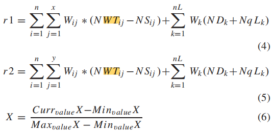

其中：

$W_{i j}$和$W_{k}$都表示对应的权重

$N W T_{i j}$表示第$i$个十字路口的第j辆车归一化后的**等待时间**

$N S_{i j}$表示第$i$个十字路口的第j辆车归一化后的**行驶速度**

$N D_{k}$表示第$k$个车道的归一化后的**延迟时间**

$N q L_{k}$表示第$k$个车道的归一化后的**队列长度**

在RL中，智能体的目标是**最大化累计奖励**。

在该MDP模型中，智能体最大化累计奖励就等价于**最小化交通网络中的所有车辆的平均等待时间**、**平均延迟时间**和**平均队列长度**、**最大化车辆的平均行驶速度**。

### （2）RL算法

该论文使用DQN算法来训练RL智能体，其中Q值网络的使用如下架构的卷积神经网络：

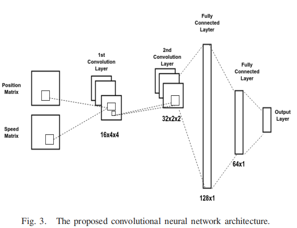

CNN的第1层是16个大小为4×4、步长为2的卷积核+ReLU

CNN的第2层是32个大小为2×2、步长为1的卷积核+ReLU

CNN的第3层是128个神经元的全连接层

CNN的第4层是64个神经元的全连接层

CNN的第5层是2个神经元的输出层，输出每个动作的Q值

### （3）RL训练

在训练阶段，用随机权重初始化CNN。

在每个时间步开始时，agent将位置矩阵P和速度矩阵V作为状态空间S输入CNN表示的Q网络，得到每个动作的Q值，挑选Q值最大的动作$A_{t}$执行

执行动作后，agent收到一个奖励$R_{t}$，agent将此时的$（S_{t}、A_{t}、R_{t}、S_{t+1}）$存储在缓存池中，缓存池被预先定义了最大内存，一旦达到内存的阈值，最旧的数据就会被删除。

Q网络从缓存池中提取一组$（S_{t}、A_{t}、R_{t}、S_{t+1}）$来进行训练，其训练的目标函数是一个均方误差（MSE）：

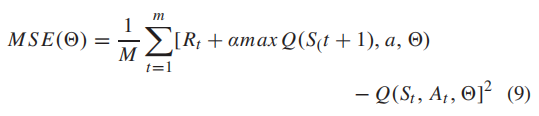

## 3、模糊推理模块

​        模糊一词指的是不太清楚或模糊的事物。在现实世界中，很多时候，当很难确定状态是真是假时，会遇到很多情况。因此，模糊逻辑为推理提供了非常有价值的灵活性。这样，任何情况下都可以考虑不精确性和不确定性。在布尔系统真值中，1.0表示绝对真值，0.0表示绝对假值。然而，在模糊系统中，不存在绝对真值和绝对假值的逻辑。但在模糊逻辑中，也存在中间值，它部分为真，部分为假。

​       该文的模糊推理模块负责从FM、PM和EM三种运行模式中为特定交通场景选择最合适的运行模式。

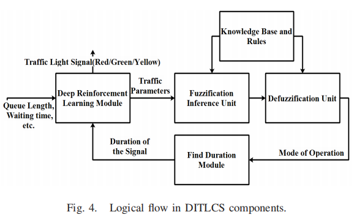

其中输入模糊推理模块的交通信息如下：

qL （实时）队列长度，当前十字路口等待的车辆数之和
WT （实时）等待时间，当前十字路口车辆等待的时间之和

所有模糊系统都可以划分出以下子系统：

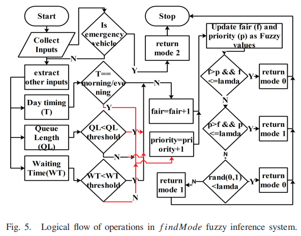

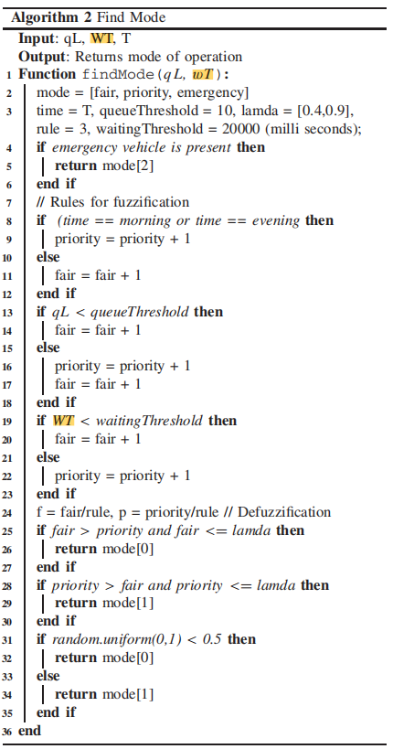

### （1）规则库

基础规则是一组以IF-THEN条件形式表示的规则集。在这项工作中，我们考虑了规则形成的三个参数；。基于上述参数的规则形成的更多信息将在下一节/小节中讨论。

模糊输入量：等待时间WT、排队长度qL和当天时间T

模糊化（**Fuzzification**）：将模糊输入量输入规则库（**Rule Base**）中，得到一组隶属度值

IF 存在紧急车辆，THEN 选择紧急模式

IF 当天时间T是早晨或者晚上，THEN 优先模式+1

IF 当天时间T不是早晨或者晚上，THEN 公平模式+1

IF 队列长度qL<阈值queueThreshold，THEN 公平模式+1

IF 队列长度qL>=阈值queueThreshold，THEN 优先模式+1

IF 等待时间WT<阈值waitingThreshold，THEN 公平模式+1

IF 等待时间WT>=阈值waitingThreshold，THEN 优先模式+1

IF 等待时间WT>=阈值waitingThreshold，THEN 优先模式+1

去模糊化（**DeFuzzification**）：将模糊化获得的模糊集转换为清晰值。该文λ切割方法[28]来获得清晰值输出，其中λ是一个阈值，将考虑所有大于λ的隶属度值。

f==fair/rule,p=priority/rule

### （2）模糊化

模糊化是一种将crisp number转换为fuzzy set（模糊集）的技术。Crisp输入是指从车辆网络中获得的输入信息，例如等待时间、队列长度和操作时间。

设A为给定的模糊集。隶属度函数（membership）可用于定义模糊集：

根据车辆的类型设定其通行的优先级，根据车辆的优先级和当前运行模式，为不同的车辆分配相应的权重，每个十字路口中累计权重最高的一边将具有更多的绿色信号持续时间：

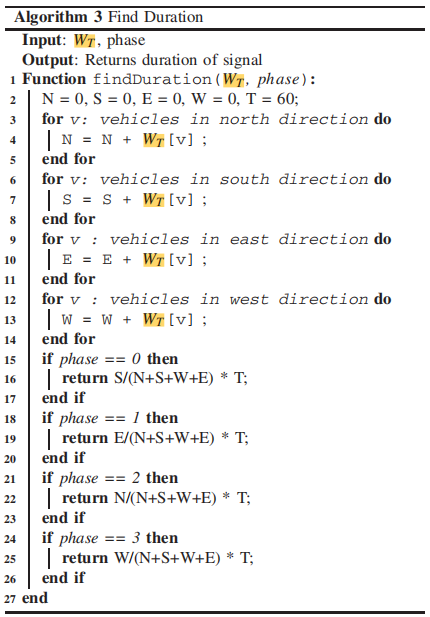

# 三、实验结果

​       该文的作者团队使用Python实现了所提出的DITLCS算法，并在SUMO中进行了仿真实现。DITLCS的深度强化学习组件是在构建于Tensorflow之上的Keras的帮助下构建的。该模拟是在印度一个主要城市瓜廖尔进行的，利用真实地图，借助于相位转换工具（如netconvert）将其转换为道路和交通。

## 1、环境设置

​         该文提出的深度强化学习模型在迭代中训练。在每次迭代结束时，根据之前和当前交通流的队列长度和其他参数的变化来计算我们模型的回报。我们模型的目标是通过动态改变交通信号持续时间来最大化整体回报。使用回放内存大小（M=2000）、最小批量大小（B=64）、目标网络速率（α=0.001）、折扣因子（γ=0.99）、学习速率（r=0.0001）和泄漏ReLU（β=0.01）模拟深度网络。对于交通灯信号的实施，每个引入道路交叉口的交通负荷是按照泊松分布过程动态生成的，因此交通密度根据交通条件动态变化。

## 2、评价指标

本小节详细介绍了所提出的DITLCS的实验结果，并在几个参数上与其他最先进的算法进行了比较。

### （1） 平均等待时间

平均等待时间（AWT）可以通过测量**车辆到达时间**和**当前时间**之间的时间间隔获得

其中$N$是车辆网络中的所有车辆数量，$CT$是当前时间，$AT_{i}$是车辆到达十字路口的时间。

### （2）吞吐量

吞吐量（Tp）是指每个周期（即当十字路口的所有红绿灯都变绿一次时）通过十字路口的车辆数量。

其中$N$是车辆网络中的十字路口的数量，$qL_{i}$是在第$i$个路口的队列长度

### （3）平均队列长度

平均队列长度（AQL）是在交通区间等待的平均车辆数。

其中$N$是车辆网络中的十字路口的数量，$v_{i}$是在第$i$个路口等待的车辆数量

### （4）平均速度

平均速度（AS）是通过网络中十字路口的所有车辆的平均速度。

其中$N$是车辆网络中的所有车辆数量，$s_{i}$是第$i$个车辆的速度

### （5）碳排放

碳排放定义如下：

其中，$Liters/Kilometers$用于描述车辆燃油经济性的车辆技术相关参数，$MassCO2/Liters$用于描述每单位燃料产生的二氧化碳排放量，$KilometersTravelled$用于描述车辆的行驶距离

## 3、实验结果

### （1）不含紧急车辆

> NFM【6】（2016年T-ITS上的***《Highway traffific state estimation with mixed connected and conventional vehicles》***）开发了一种混合连接车辆和传统车辆的公路交通状态估计方法。作者通过使用著名的二阶交通流模型进行仿真，验证了所开发的估计方案的性能。
>
> FIRNTL【7】（2013年IFSC上的***《Designing fuzzy controller for traffific lights to reduce the length of queues in according to minimize extension of green light time and reduce waiting time》***）、
>
> FCTL【8】（2010年的***《A novel fuzzy model and control of single intersection at urban traffific network》***）利用模糊模型开发信号灯控制器，以最小化平均等待时间（AWT）和队列长度（QL），但它们没有考虑紧急车辆的优先级，也不支持多种模式的切换。

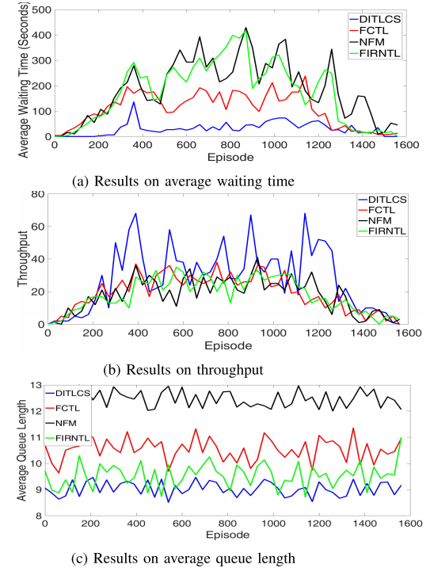

图6（a）表明，DITLCS能够显著减少平均等待时间。

图6（b）表明，DITLCS将吞吐量提高到68

图6（c）表明，DITLCS将AQL降低到8.5，

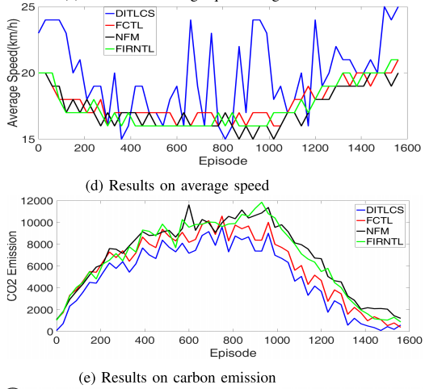

因此，为了分析交通平稳性，

图6（d）表明，DITLCS能够实现车辆的最高平均速度。

图6（e）表明，与现有算法相比，DITLCS分别减少了14.21%、11.52%和6.45%的二氧化碳排放。

### （2）含紧急车辆

​        为了验证DITLCSETLSA[12]。

> EVP-STC【11】（2018年的***《EVP-STC: Emergency vehicle priority and self-organising traffific control at intersections using Internet-of-things platform》***）利用微控制器、ZigBee、GPS和其他物联网设备开发了EVP-STC协议，并使用PTV Vissim改变其性能有效性。然而，作者考虑了线路开通时间，但忽略了车辆动力学中的几个重要参数。
>
> ETLSA【12】（2018年上的***《An effificient dynamic traffific light scheduling algorithm considering emergency vehicles for intelligent transportation systems》***）开发了一种基于启发式的算法，并在SUMO中进行了仿真验证，然而，他们忽略了其他优先车辆。

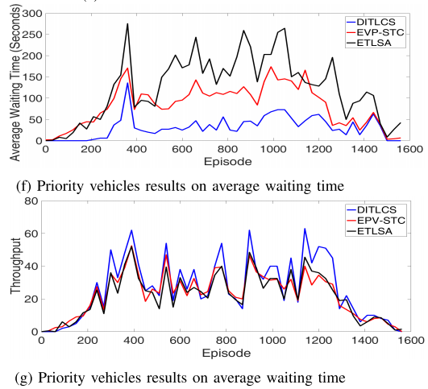

图6（f）表明，DITLCS能够显著降低含优先车辆的平均等待时间。

图6（g）表明，DITLCS能够显著降低含优先车辆的红绿灯交叉口的吞吐量。

# 四、本文总结

​        本文提出了一种可针对不同类型车辆进行交通控制的动态智能交通灯控制系统DITLCS。DITLCS可以在三种模式（公平模式（FM）、优先模式（PM）和紧急模式（EM））下自动切换来工作。

​		DITLCS是深度强化学习和模糊推理系统的组合。深度学习强化致力于动态生成交通信号灯的相位，模糊推理系统根据深度强化学习模型的交通行为、异构性和动态性选择执行模式。该文的实验证明了DITLCS的有效性和高效性。

​		
