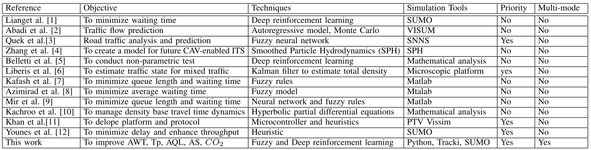
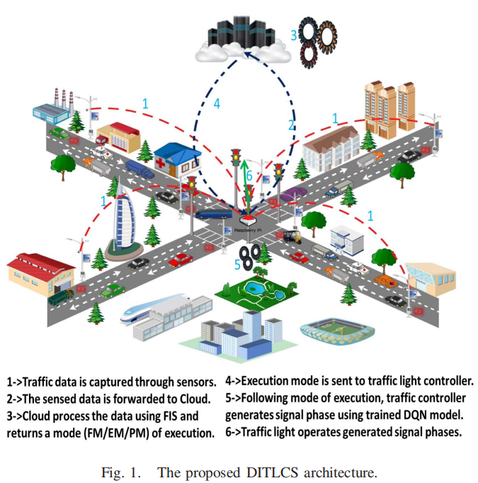
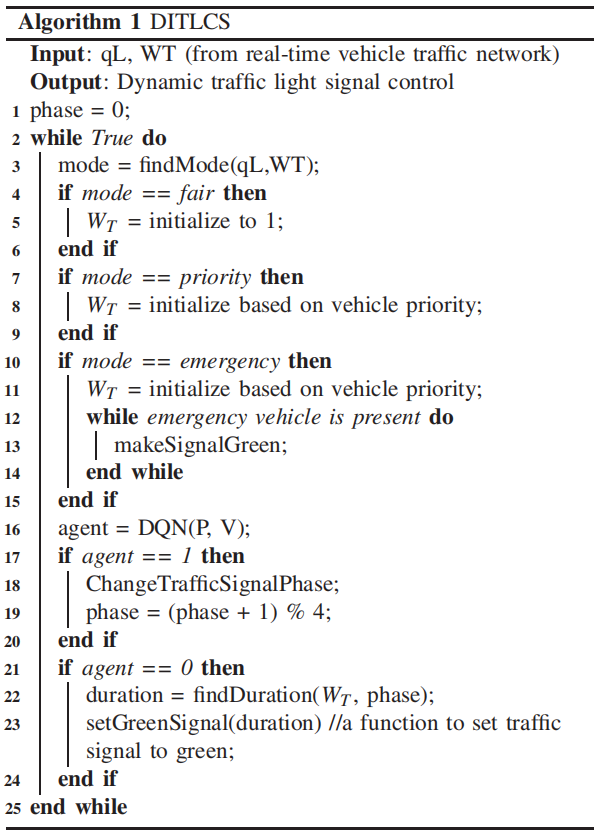

---

layout:     post
title:      「论文分享」智能交通系统中基于模糊推理的深度强化学习的信号灯控制
subtitle:   T-ITS 2021
date:       2022-07-01
author:     MRL Liu
header-img: img/the-first.png
catalog: True
tags: [论文分享]
   
---

​		***《Fuzzy Inference Enabled Deep Reinforcement Learning-Based Traffific Light Control for Intelligent Transportation System》***是来自印度的Neetesh Kumar等人发表在T-ITS 2021（Transactions on Intelligent Transportation Systems 2021）上的一篇论文，这里是[原文链接](https://ieeexplore.ieee.org/abstract/document/9072340)。

​        由于车辆数量的巨大增长和交通基础设施的有限，智能交通系统（ITS）已成为一个突出的研究领域。因此，针对交通信号灯的优化控制在最近几十年得到了较大关注。

#   一、相关工作

该文的文献综述部分如下：

> Du等人【1】（2018年Trans.Veh.Technol上的***《Deep reinforcement learning for traffific light control in vehicular Networks》***）已经使用并建议使用卷积神经网络（CNN）和强化学习来控制动态交通灯，但作者没有考虑不同车辆之间的优先级。
>
> Abadi等人【2】（2015年T-ITS上的***《Traffific flflow prediction for road transportation networks with limited traffific data》***）使用了自回归模型和蒙特卡洛模拟技术提出了一种预测道路交通车辆网络上交通流的策略，但交通数据有限且没有考虑车辆优先级。
>
> Quek等人【3】（2006年T-ITS上的***《POP-TRAFFIC: A novel fuzzy neural approach to road traffific analysis and prediction》***）提出了一种新的模糊神经方法，以利用真值约束的伪外积模糊神经网络分析和预测道路交通。这项工作考虑了不同优先级的车辆，但不是为了流动交通而设计的。
>
> Zhang等人【4】（2018年T-ITS上的***《Force-driven traffific simulation for a future connected autonomous vehicle-enabled smart transportation system》***）提出了一种用于未来互联自主车辆智能交通系统的力驱动交通模拟，然而，他们通过理解车辆动力学错过了交通控制的要求。
>
> Belletti等人【5】（2018年T-ITS上的***《Expert level control of ramp metering based on multi-task deep reinforcement learning》***）将多任务深度强化学习用于匝道计量的专家级控制，他们证明了基于神经网络的深度强化对于参数已知的问题是有效的。
>
> Bekiaris Liberis等人【6】（2016年T-ITS上的***《Highway traffific state estimation with mixed connected and conventional vehicles》***）开发了一种混合连接车辆和传统车辆的公路交通状态估计方法。作者通过使用著名的二阶交通流模型进行仿真，验证了所开发的估计方案的性能。
>
> Kafash等人【7】（2013年IFSC上的***《Designing fuzzy controller for traffific lights to reduce the length of queues in according to minimize extension of green light time and reduce waiting time》***）、
>
> Azimirad等人【8】（2010年的***《A novel fuzzy model and control of single intersection at urban traffific network》***）利用模糊模型开发信号灯控制器，以最小化平均等待时间（AWT）和队列长度（QL），但它们没有考虑紧急车辆的优先级，也不支持多种模式的切换。
>
> Mir和Hassan【9】（2018年ICMA上的***《Fuzzy inference rule based neural traffific light controller》***）开发了一种交通灯控制器，利用神经网络和模糊控制器来最小化汽车的AWT和QL。
>
> Kachroo和Sastry【10】（2016年T-ITS上的***《Travel time dynamics for intelligent transportation systems: Theory and applications》***）开发了一个理论数学模型，用于分析基于密度的实时车辆动力学行程时间。作者指出，对于行程时间是一个重要因素的智能交通系统应用而言，这一点很重要。
>
> Khan等人【11】（2018年的***《EVP-STC: Emergency vehicle priority and self-organising traffific control at intersections using Internet-of-things platform》***）利用微控制器、ZigBee、GPS和其他物联网设备开发了EVP-STC协议，并使用PTV Vissim改变其性能有效性。然而，作者考虑了线路开通时间，但忽略了车辆动力学中的几个重要参数。
>
> Younes和Boucherche【12】（2018年上的***《An effificient dynamic traffific light scheduling algorithm considering emergency vehicles for intelligent transportation systems》***）开发了一种基于启发式的算法，并在SUMO中进行了仿真验证，然而，他们忽略了其他优先车辆。

上述研究的对比可以看下图所示：

 综上所述，关于交通信号灯控制的现有研究存在以下不足：

> 1）对于现有的交通灯控制系统，交通信号只会扩散到固定的间隔内，绿灯/红灯的持续时间只能是相同间隔的倍数
>
> 2） 现有研究的重点仅在于找到准确的交通持续时间，而没有考虑车辆优先级[1]。显而易见，许多优先和应急车辆，如消防队、救护车等，需要尽快到达目的地。
>
> 3） 现有交通灯控制器无法根据交通行为并在不同模式下运行，即紧急/优先/公平模式。
>
> 4）传统的ITS解决方案在开发车载网络的IT和物联网基础设施（Rasberry pi、云等）方面不具有成本效益。这种类型的系统对发展中国家来说在商业上很昂贵。

​        为了克服上述局限性，该文提出了一种高效、动态、智能的交通灯控制系统（DITLCS），其重要贡献可以总结如下：

> 1）DITLCS可以根据车辆网络的信息（车辆优先级、交通负荷程度等）来计算交通灯信号每个相位的持续时间。
>
> 2） DITLCS可以利用模糊推理系统在三种模式间动态切换：FM（公平模式：所有车辆具有相同的权重）、PM（优先模式：根据优先级区分车辆权重）、EM（紧急模式：优先安排紧急车辆路线）。
>
> 3） DITLCS可以利用交通数据的深度强化学习模型对代理进行训练，该学习模仿经验丰富的人类代理的行为，可以在轻型计算设备上运行。
>
> 4）为了验证DITLCS的有效性，本文利用开源模拟器工具SUMO进行了真实模拟实验。在各种测试参数上，DITLCS的结果与几种最先进的算法相比，具有较好的性能和稳定性。

​       该文的其余部分组织如下：第二节介绍了文献综述。第三节介绍了模型和问题陈述。第四节介绍了强化学习的背景。第五节介绍了DITLCS的技术细节。第六节给出了模型的仿真研究。最后，本文在第七节得出结论。

#   二、本文模型

​     交通信号灯控制的流程如下：

上述流程可以被***算法1***描述：

通过上述流程可以发现，该文的DITLCS主要由两部分组成：**深度强化学习模型**和**模糊推理模块**。**深度强化学习模块**致力于最大化奖励函数，指导智能体做出决策。在深度强化学习模块的每个周期中测量累积奖励。**模糊推理模块**专门用于通过观察车辆交通场景的当前状态，从三种执行模式（PM、FM和EM）中选择一种执行模式。

## 1、深度强化学习模型

​       D4RL【14】（2020年的***《D4rl: Datasets for deep data-driven reinforcement learning》***）是一个离线RL基准测试套件，只关注混合数据源、

​        RL unplugged【17】（2020年的***《Rl unplugged: Benchmarks for offline reinforcement learning》***）为离线RL引入了一套基准测试，其中包含一组具有统一API和评估协议的不同任务域、

​         但是这些研究工作主要集中在由RL代理生成数据的简单RL环境，缺乏高维、部分可观察的任务，缺乏挑战性。

## 2、模糊推理模块

​        本文通过引入《星际争霸2》的基准来填补这一空白，本文的引入的离线RL基准测试环境—《星际争霸2》的脱机版本，包括规范代理的代码和数据处理程序，可以让AI社区中的更多研究人员可以访问此环境。《星际争霸2》是目前最复杂的模拟RL环境之一，具有部分可观测性、随机性、巨大的行动和观察空间、延迟奖励和多智能体动力学等特点。而且，《星际争霸2》拥有一个独立的人类玩家排行榜，它还构成了训练和评估离线RL代理丰富的数据源。

​        本文介绍了几种离线RL代理，它们可以从人工回放中学习竞争策略。架构和算法的创新使这成为可能。先前工作中大量实验和评估测试表明，许多现有的离线RL算法在此基准测试中失败。经过详细分析，该文认为构建成功智能体的方法主要有以下：首先训练一个策略和价值函数网络来估计行为策略和价值函数。然后，在评估期间，要么执行单个策略改进步骤，要么使用固定且预先训练的行为值函数改进策略。本文相信，分享这些见解对任何对离线RL感兴趣的人都很有价值，尤其是在大规模情况下。

# 三、实验结果

​       该文的作者团队使用Python实现了所提出的DITLCS算法，并在SUMO中进行了仿真实现。DITLCS的深度强化学习组件是在构建于Tensorflow之上的Keras的帮助下构建的。该模拟是在印度一个主要城市瓜廖尔进行的，利用真实地图，借助于相位转换工具（如netconvert）将其转换为道路和交通。

# 四、本文总结

​        本文观察到，最初为在线学习设计的算法，即使进行了非策略修正，在直接应用于完全离线RL设置时，也不能很好地工作。我们将这种现象归因于致命的Deadly Triads问题【49、46、50】。然而，许多最近的研究发现，只需进行修改，确保学习的策略保持接近行为策略µ，学习的值保持接近Vµ，或两者兼而有之，这些算法就可以变得更加有效。本文的Actor-Critic和MuZero的实验结果与这些发现一致。

​        引用代理是我们尝试的改进策略的方法。然而，我们尝试了其他几种方法，但没有成功，包括优势加权回归（AWR）【36】、PPO【42】和基于状态行动值的方法，如SARSA【38】、CRR【54】和R-BVE【16】。到目前为止，该文还不知道这是否有根本原因，或者我们只是没有找到这些方法在这个数据集上运行良好所需的必要更改。         

​         本文介绍了《星际争霸2》的脱机基准版本，用于评估只从离线数据学习星际争霸II的代理。这些数据由超过一百万个游戏组成，大多数游戏是由业余的《星际争霸2》玩家在暴雪的战网（Battle.Net）平台中玩的。因此，基准测试更准确地捕获了离线RL的挑战，在离线RL中，代理必须从由不同弱势专家组生成的记录数据中学习，并且数据不会耗尽环境的全部状态和行动空间。

​		
