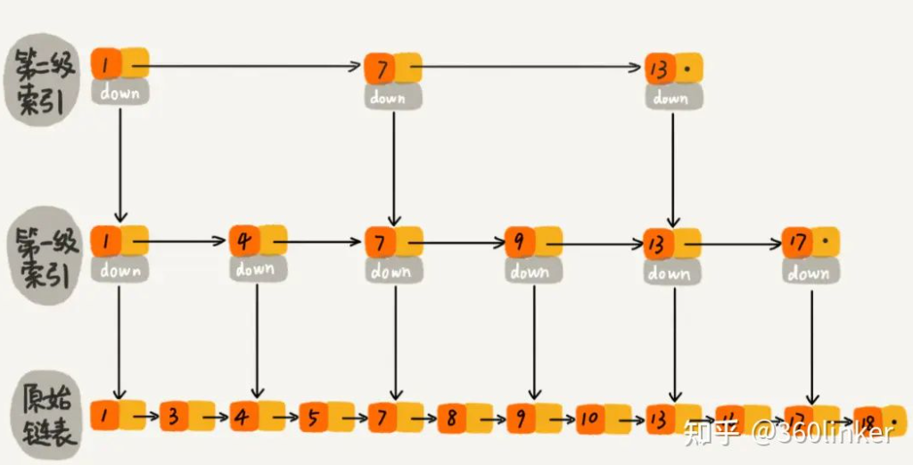

​	 	  该项目是作者学习**数据库技术**时整理的项目，非关系型数据库Redis的核心存储引擎使用的数据结构就是**跳表**，该项目采用**C++语言**基于**跳表结构**设计了一个**轻量级键值型存储引擎**，支持**插入**、**查询**、**删除**、**显示**、**导出**、**重加载**6种基本操作。为了测试引擎效率，作者开发了一个使用和web bench相似技术的压力测试工具**Stress Bench**。在**随机读写**情况下，该引擎每秒在**多个并发线程**下的**累计执行成功次数**都可以保持在**30000**左右。

## 1、技术栈

* 基于**跳表结构**和**面向对象思想**的节点类、跳表类的开发与封装；
* 基于**父子多进程**和**匿名管道技术**的**Stress Bench**测试工具；
* 使用**互斥锁**，防止并发插入数据时发生冲突；
* 基于**MakeFile**的多文件编译方式；

## 2、对外接口

* insert_element(int,string)  				// 插入记录
* srase_element(int)                              // 删除记录
* search_element(int)                            // 查询记录
* displayList(int)                                     // 显示结构
* dumpFile(string)                                  // 导出数据
* loadFile(string)                                    // 加载数据
* size()                                                     // 获取数据规模

## 3、跳表原理

跳表是在一个原始链表中添加了多级索引，通过每一级索引来进行二分搜索的数据结构，其架构如下：




在上述跳表中，假如查询key=10的记录，则可以从第二级索引开始快速定位：

- 遍历第二级索引，从1开始，发现7<10<13，7就是该层要找的索引，通过它跳到下一级索引
- 遍历第一级索引，从7开始，发现9<10<13，9就是该层要找的索引，通过它跳到下一级索引
- 遍历原始链表，从9开始，发现10=10，10就是该层要找的最终索引

相比于直接遍历原始链表，多级索引的存在使跳表查询效率更快，总结：

**跳表的优点**： 可以实现高效的插入、删除和查询  ，时间复杂度为O(logn). 

**跳表的缺点**：需要存储多级索引，增加了额外的存储空间

**跳表的用途**：经典的以空间换时间的数据结构，常用于非关系数据库的存储引擎中

## 4、跳表实现

跳表的原理很好理解，在实现上比一般链表要难一点。

### （1）跳表的节点

首先对于每个跳表的节点来讲，其肯定要保存两个方向的指针：向右和向下，可以定义如下：

```C++
// 节点类
class Node {
public:
    // 构造函数
    Node(Node* right,Node* down,const int k, const string v):right(right),down(down),key(k),value(v){}
    int get_key() const{return key;};
    string get_value() const{return value;}
    void set_value(string){this->value=value;}
public:
    Node* right;// 右节点指针
    Node* down;// 下节点指针
private:
    int key; // 索引
    string value;// 数据
};
```

### （2）遍历的跳表

首先跳表有一个**虚拟头结点_header**（下面的“+”）指向链表的**最上层索引的第一个节点**：

```C++
/* 
level 4     +-->1+                                             +---->100
                 |
                 |                     
level 3         1+-------->10+---------------->50+------>70 
                 |
                 |                                             
level 2         1+------> 10+------> 30+------>50+------->70 
				 |
                 |
level 1         1+-->4+-->10+------> 30+------>50+------->70 
				 |
                 |
level 0         1+>4->9+->10+------> 30+->40+->50+-->60+->70 
*/
```

假如要把上述跳表的每一层的key打印出来，则可以从**_header**出发：

```C++
Node *p_header = this->_header;
Node *p= nullptr;// 每一层的头结点
int level=this->_skip_list_level;
// 从上到下搜索
while(p_header){
    std::cout << "Level " << level << ": ";
    p=p_header;// 获取当前层的头结点
    // 从左向右查找,打印当前层
    while(p->right){
       p=p->right;
       std::cout <<p->get_key() << ":" << p->get_value() ;
    }
    std::cout << std::endl;
    p_header = p_header->down;// 下降一层
    level--;
}
```

上述代码好理解

### （3）跳表的插入

跳表的插入负责构建整个跳表，是跳表中最难的需求。跳表的插入原理如下：


在上图中，要插入一个节点16，则要在多个层都插入这个节点16，这个多个层要可能随机，保证每一层都比上一层的节点少一半。

```C++
// 插入某条记录
int SkipList::insert_element(const int key, const string value) {
    mtx.lock();
    //从上至下记录搜索路径
    pathList.clear();
    Node *p = this->_header;
    // 从上到下去搜索，搜索后p指向次小于key的位置，应在p后新插入
    while(p){
        // 从左向右查找
        while(p->right&&p->right->get_key()<key)p=p->right;
        pathList.push_back(p);// 此时的p是最后一个小于num的节点
        p = p->down;// 下降一层
    }
    // 如果current存在,放弃插入
    Node* current=pathList.back()->right;
    if (current!= NULL && current->get_key() == key) {
        std::cout << "key: " << key << ", exists" << std::endl;
        mtx.unlock();
        return 1;
    }
    // 此时p指向最底层中插入位置前
    bool  insertUp = true;
    Node* downNode = NULL;// 下一个节点为NULL
    // 从下至上搜索路径回溯，50%概率
    // 这里实现是会保证不会超过当前的层数的，然后靠头结点去额外加层， 即每次新增一层
    int level=0;
    while (insertUp && pathList.size() > 0){
        Node *insert = pathList.back();
        pathList.pop_back();
        // 添加新结点
        insert->right = new Node(insert->right,downNode,key,value); 
        // 把新结点赋值为downNode
        downNode = insert->right; 
        // 50%概率   
        insertUp = (rand()&1)==0;
        level++;
    }
    // 说明pathList已经不为空，插入新的头结点，加层
    if(insertUp){  
        this->_header = new Node(new Node(NULL,downNode,key,value), this->_header, -5,to_string(level)+"head");
        this->_skip_list_level++;
    }

    this->_element_count ++;
    std::cout << "Successfully inserted key:" << key << ", value:" << value << std::endl;
    mtx.unlock();
    return 0;
}
```

### （4）跳表的查询

```C++
bool SkipList::search_element(int key) {
mtx.lock();
Node *p = this->_header;// 从虚拟头结点出发
while(p){
        // 从左向右寻找目标区间
        while(p->right && p->right->get_key()<key)p=p->right;
        // 没找到目标值，则继续往下走
        if(!p->right||p->right->get_key()>key)p=p->down;
        // 如果找到目标值
        else{   
            std::cout << "key: " << key<< ":"<<p->right->get_value()<<endl;
            return true;////找到目标值，结束
        }
    }
    std::cout << "无法找到key: "<<key<<endl;
    mtx.unlock();
    return false;
}
```

### （5）跳表的删除

```C++
bool SkipList::erase_element(int key) {
Node *p = this->_header;
bool seen = false;
while (p){
     // 当前层向右找到次小的点
     while (p->right && p->right->get_key()<key)p = p->right;
     // 无效点，或者 太大， 则到下一层去
     if (!p->right||p->right->get_key()>key)p=p->down;
     else{
            // 搜索到目标结点，进行删除操作，结果记录为true
            // 继续往下层搜索，删除一组目标结点
            seen = true;
            p->right = p->right->right;
            p = p->down;
        }
    }
    if(seen) {
        this->_element_count--;
        std::cout << "成功删除key: "<<key<<endl;
    }
    else std::cout << "无法删除key: "<<key<<endl;
    return seen;
}
```

## 5、压力测试

​        该项目包含一个作者开发的压力测试工具**Stress Bench**，其中文名叫做**压力工作台**，是借鉴了**Web Bench**的技术经验。该项目可以测试在规定时间t秒内n个**进程**同时执行某项操作的**成功次数**和**失败次数**。

### （1）创建N个子进程

​		该工具首先使用**fork()**创建n个子进程，**子进程**负责在规定时间内执行某项操作，**父进程**负责统计某个子进程的执行结果，**父进程**和**子进程**间通过**匿名管道**进行**进程间通信**。

```C++
pid_t pid=0;
FILE *f;
// 拷贝clients个进程
for(int i=0;i<_thread_count;i++){
    pid=fork();
    // 如果是子进程或者出错
    if(pid <= (pid_t) 0){
        sleep(1); /* make childs faster */
        break;// 退出循环
    }
}
// 如果出错
if(pid<(pid_t)0) perror("fork failed."); 
// 子进程将要执行的代码
if(pid== (pid_t) 0){
    int count=0;
    int failed=0;
    this->test_target_function(count,failed);// 子进程进行测试
    // 将该进程的测试结果写入匿名管道
    f=fdopen(_pipe[1],"w");// 打开管道的写端
    if(f==NULL) perror("open pipe for writing failed.");
    fprintf(f,"%d %d\n",count,failed);//每次写入一行格式化的数据
    fclose(f);
}
// 父进程执行的代码
else{
    f=fdopen(_pipe[0],"r");// 打开匿名管道的读端
    if(f==NULL) perror("open pipe for reading failed.");
    setvbuf(f,NULL,_IONBF,0);
    int count=0;
    int failed=0;
    int i,j,client=_thread_count;
    while(1){
         pid=fscanf(f,"%d %d",&i,&j);// 在此处阻塞
         if(pid<2){
         fprintf(stderr,"Some of our childrens died.\n");
                break;
         }
         count+=i;
         failed+=j;
         if(--client==0) break;
    }
    fclose(f);
    printf("success= %d failed= %d",count,failed);
}
```

#### （A）fork的使用

​		Linux中通过**fork()**来创建子进程，**在执行fpid=fork()之前，只有当前的父进程在执行这段代码**；在执行fpid=fork()之后，当前的父进程和新复制出的子进程都开始并发执行之后的代码。所以为了父进程和子进程执行不同的代码，需要根据fpid的值分别处理，否则就会执行相同的代码。子进程的fork返回值是0，父进程的fork返回值>0，这也是区分父进程和子进程的方法，至于其他的内容，在fork之前的东西两个进程的一样的。

#### （B）fork的底层

​		在调用**fork()**时，Linux的内核程序实际上只会复制**父进程**的页表以及给子进程创建一个进程描述符，并不会立即开辟新的内存空间来复制一份父进程的数据，此时父进程和子进程共享同一份数据资源，只有父进程或者***\*子进程\****发生写的操作时，**子进程**才会复制**父进程**的数据到一个新的内存空间，这种技术就是**写时拷贝技术**。但是在程序员看来，**fork()**就是立即克隆出了一个和**父进程**完全相同的子进程，只不过其底层使用了**写时拷贝技术**来**优化**。

#### （C）父子进程的关闭

假如**父进程**先于**子进程**关闭，那么子进程就成为**孤儿进程**，被操作系统接管

假如**子进程**先于**父进程**终止，而父进程又没有调用**wait**或**waitpid函数**，**父进程**结束后，**子进程**成为**僵尸进程**，此时**子进程**虽然执行完毕但是**始终占有内核资源**，同时也减少了系统可以创建的最大进程数。

假如**子进程**先于**父进程**终止，而父进程调用了**wait**或**waitpid函数**，那么**父进程**会等待**子进程**结束后再结束，子进程不会成为**僵尸进程**。

#### **（D）匿名管道技术**

​		这里使用的是Linux的**匿名管道**（因为其创建管道使用了**pipe()**,命名管道使用**mkfifo()**），**匿名管道**的特点如下：

1、**匿名管道**是一种**半双工通信**，数据只能从写端流入读端。

2、**匿名管道**读写的是**内核程序**的**缓冲区**的两端fd[0]和fd[1]。

3、**匿名管道**只能用于**父子进程通信**。这是因为匿名管道没有标识符，其他无亲缘关系的进程无法访问到该管道，只有创建它的父进程和使用它的子进程可以访问。在进行父子进程间通信时，**一定要父进程先创建管道，再创建子进程**，这样子进程才能访问匿名管道。

4、**匿名管道**默认是**阻塞**的，父子进程抢占式运行，**如果父进程或者子进程先读**，发现是空管道时就会阻塞，等待写入；某个进程写入一次后，读进程抢占到才能读入。

5、**匿名管道**读取数据是**将数据剪切**，所以**多个进程读匿名管道，无法拿到相同的数据**

6、**匿名管道**的读写具有**原子性**，即读操作或写操作要么完成，要么没有开始，不存在边读边写，或者同时写

7、**匿名管道**的读写是**字节流**，用户write两次写入字符串，对于管道来说两次输入的数据没有明显边界，read可以读任意字节大小，在读取时无法区分两次输入，前后两次输入粘连在一起，read的返回值是读取到数据的字节数。

### （2）定时信号处理

​        **子进程**执行某项操作达到规定时间就会退出，其**定时操作**使用如下操作：

```C++
void StressBench::set_alarm_signal(){
    struct sigaction sa;
    sa.sa_handler=alarm_handler;// 函数指针，指向一个信号处理函数
    sa.sa_flags=0;// 设置信号处理的其他相关操作
    if(sigaction(SIGALRM,&sa,NULL))
        exit(3);
    alarm(_benchtime);// 定时操作
}
```


