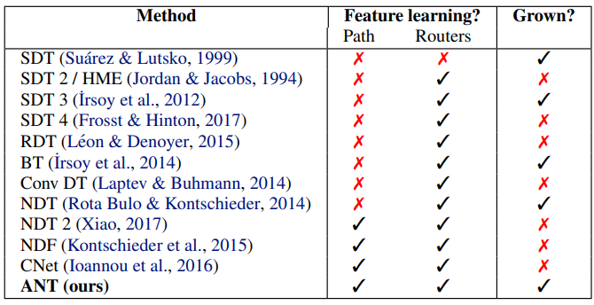
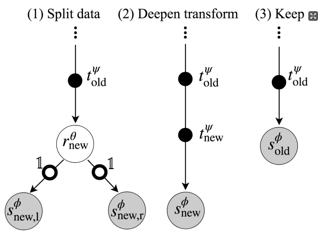
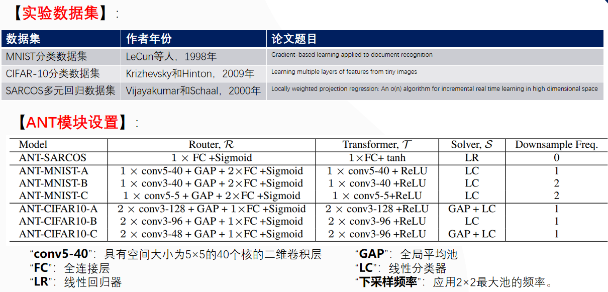
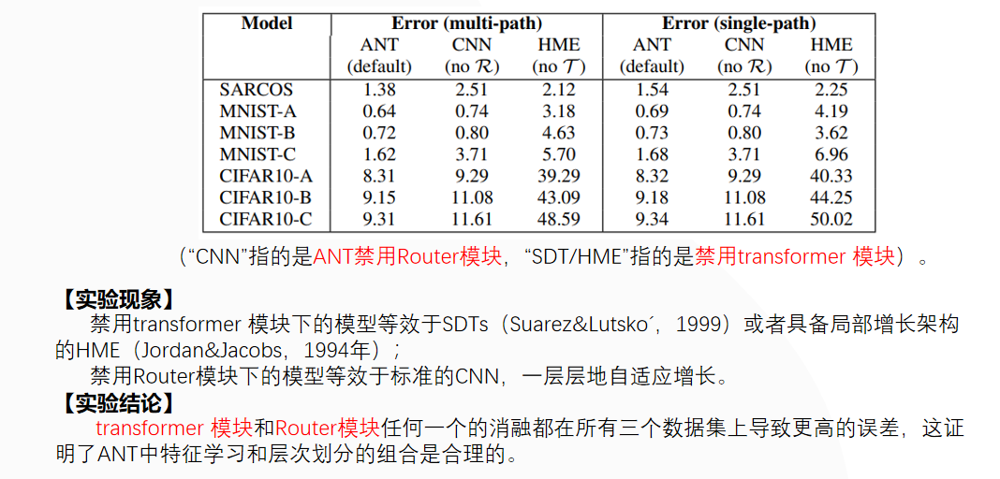
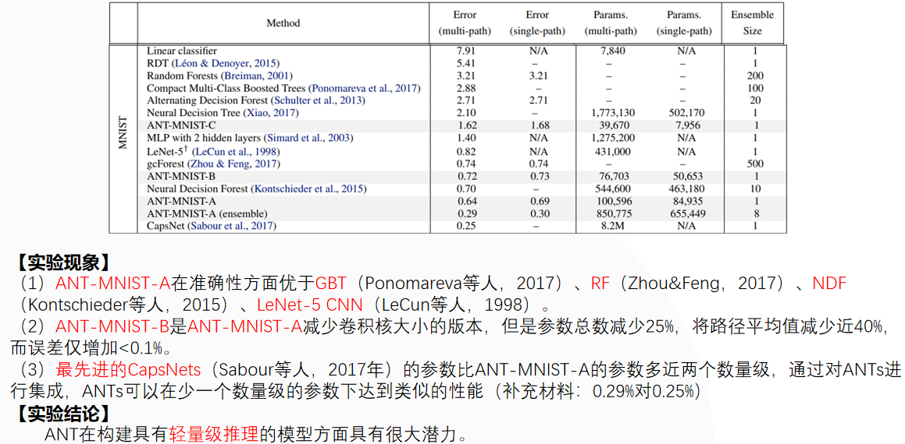
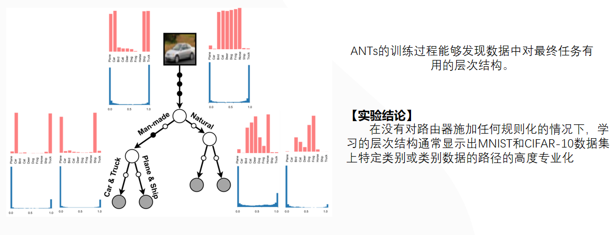
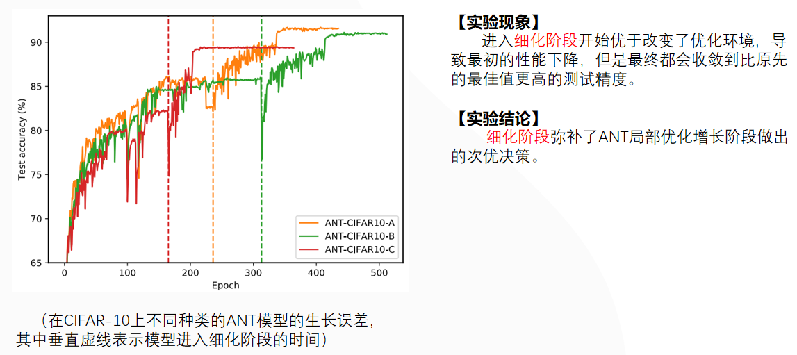
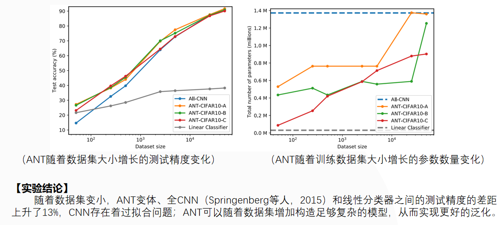

---

layout:     post
title:      「论文分享」利用深度强化学习发现符号策略
subtitle:   Computer Graphics Forum. 2021
date:       2021-12-18
author:     MRL Liu
header-img: img/the-first.png
catalog: True
tags: [论文分享]
   
---

​		《Deep Neural Models for Illumination Estimation and Relighting: A Survey》是来自美国的Mikel Landajuela等人发表在ICML 2021（CCF推荐的A类会议）上的一篇论文，这里是[原文链接](http://proceedings.mlr.press/v139/landajuela21a/landajuela21a.pdf)和[原文代码](https://github.com/brendenpetersen/deep-symbolic-optimization)。

# 摘要

​		深层神经网络和决策树在很大程度上依赖于不同的范式；通常，前者使用 预先指定的体系结构进行表征学习，而后者通过使用数据驱动的体系结构学习预先指定的特征的层次结构来实现。本文通过自适应神经树（ANTs）将这两种方法结合起来，该算法将表征学习融入决策树的**边缘**（edges）、**路由函数**（routing functions）和**叶节点**（leaf nodes），以及基于反向传播的训练算法，该算法从原始模块（例如卷积层）自适应地增长体系结构。本文证明，ANTs不仅在实现分类和再分类数据集上具有竞争性能，而且具备如下好处：

（i）通过条件计算进行轻量级推理；

（ii）对任务有用的特征进行更高层次的分离，例如学习有意义的类关联，如分离自然和人造对象；

（iii）使体系结构适应训练数据集大小和复杂性的机制。

# 1、简介

​		神经网络（NNs）和决策树（DTs）都是强大的机器学习模型，在学术和商业应用中都取得了成功。然而，这两种方法通常具有相互排斥的优点和局限性。

| **模型**       | **优点**                                                     | **局限性**                                                   | **常见改进思路**                   |
| -------------- | ------------------------------------------------------------ | ------------------------------------------------------------ | ---------------------------------- |
| 神经网络（NN） | 自动学习数据的分层表示，减少了对数据特征工程的需求；使用随机优化法进行训练，可以扩展到大型数据集；在现代硬件加持下可以在众多问题中取得前所未有的精度。 | 体系结构通常需要针对特定任务或数据集进行设计或修改；大型模型具备重量级推理，计算量很大 | 知识蒸馏、迁移学习                 |
| 决策树（DT）   | 自动学习分层数据集群和如何分割输入空间，具备高度可解释性；体系结构可以根据训练数据进行优化；轻量级推理 | 需要手动设计好的数据特征，路径函数表达能力不如神经网络，无法直接使用神经网络的优化方法， | 增加决策树数量的方法，如随机森林等 |

​		该文的工作的目标是结合NNs和DTs，以获得这两种方法的互补优势。

​		根据该文介绍，ANTs从DTs和NNs继承了以下理想特性：

​	（1）表征学习：由于ANTs的每个根到叶路径都是一个神经网络，因此可通过基于梯度的优化进行端到端的特征学习。

​	（2）架构学习：通过逐渐增长的ANTs，架构适应数据集的可用性和复杂性，增长过程可以看作是对模型类具有硬约束的体系结构搜索。

​	（3）轻量级推理：在推理时，ANTs进行条件计算，在每个样本的基础上选择树上的单个根到叶路径，只激活模型参数的一个子集。

​		该文通过基于如下三个数据集的实验验证了ANTs在回归任务和分类任务的高性能表现：

| **数据集**           | **作者年份**                | **论文题目**                                                 |
| -------------------- | --------------------------- | ------------------------------------------------------------ |
| MNIST分类数据集      | LeCun等人，1998年           | 《Gradient-based learning applied to document recognition》  |
| CIFAR-10分类数据集   | Krizhevsky和Hinton，2009年  | 《Learning multiple layers of features from tiny images》    |
| SARCOS多元回归数据集 | Vijayakumar和Schaal，2000年 | 《Locally weighted projection regression: An o(n) algorithm for incremental real time learning in high dimensional space》 |

​		实验结果显示，在SARCOS多元回归数据集上性能最好的方法都是基于树的，ANTs的在均方误差（MSE）指标上最小；ANT在图像分类方面远远优于最先进的深度随机森林RF（Zhou&Feng，2017）和GBT（Ponomareva等人，2017）方法，其结构在MNIST上的准确率超过99%，在CIFAR-10上的准确率超过90%。

# 2、相关工作

​		决策树是机器学习中的一种预测模型，常应用于数据挖掘中。模糊决策树是传统决策树的一个扩充和完善，使决策树可以处理不确定性。

软决策树是模糊决策树中的一类，通过结合树的生长和修剪来确定软决策树的结构，并对树进行了修正来提高它的泛化能力。软决策树的决策准则是一个范围区间，而非一个特定的数值。相比较于标准决策树，软决策树的分类结果更准确。

​		决策树和神经网络结合的相关工作：

| **作者年份**                  | **论文题目**                                                 | **主要贡献**                                                 |
| ----------------------------- | ------------------------------------------------------------ | ------------------------------------------------------------ |
| Jordan和Jacobs，1994          | Hierarchical mixtures of experts and the em algorithm        | 提出了一种树结构的监督学习体系结构：分层混合专家（HME），其模型的学习被视为一个最大似然问题，然后使用一种期望最大化（EM）算法来调整结构的参数。该模型中树的分割不是硬决策（hard decision），而是由软概率（soft probabilistic）决定的，但是其树结构是固定的，路由器是简单的线性分类器。 |
| Suarez和Lutsko ,1999          | Globally optimal fuzzy decision  trees for classification and regression | 提出了一种新颖的模糊决策树，其通过在CART决策树的骨架上叠加模糊结构将决策树转换为一种强大的函数逼近，并可以使用一种自动生成方法来处理分类和回归问题。 |
| Irsoy等人，2012               | Soft decision trees                                          | 提出了一种新的决策树结构，其既具备HME的软决策，又可以在需要时添加新节点，并使用梯度下降学习参数。 |
| Irsoy等人，2014               | Budding trees                                                | 提出了一种萌芽树BT，其中一个节点既可以是叶子，也可以是内部决策节点。每个花蕾节点从一个叶节点开始，然后可以生长子节点，但随后，如果必要，可以修剪其子节点。 |
| Laptev和Buhmann, 2014.        | Convolutional decision trees for feature learning and segmentation | 提出了一种通用的分割算法ConvDT，在构建多元决策树的同时，将信息量最大、可解释性最强的特征提取为卷积核。该算法的训练速度比常规CNN快几个数量级，并在基准数据集的处理质量方面达到了最先进的水平。 |
| Rota Bulo和Kontschieder, 2014 | Neural decision forests for semantic image labelling         | 提出了神经决策森林NDT，用于分割语义图像；该文章通过引入随机多层感知器（rMLP）作为新的分割节点来弥补这一差距，该节点可以学习非线性、数据特定的表示，并通过为新出现的子节点找到最佳预测来利用它们。 |
| Kontschieder等人，2015        | Deep neural decision forests                                 | 提出了一种新的深度决策森林NDF，通过端到端的方式对分类树进行训练，将分类树与深度卷积网络中已知的表示学习功能统一起来。 |
| Leon和Denoyer, 2016           | Policy-gradient methods for decision trees.                  | 提出了一种新的强化决策树（RDT），主要思想是将分类问题视为一个序贯决策过程，通过直接求解全局（可导）目标函数，而不使用基于启发式的贪婪技术来学习分类策略； |
| Ioannou等人，2016             | Decision forests, convolutional networks and the models      | 将决策森林和卷积神经网络结合在一起，提出了条件网络（CNet）。 |
| Frosst和Hinton，2017          | Distilling a neural network into a soft decision tree        | 使用软决策树来从一个训练好的神经网络中提取知识，从而尝试解释神经网络的分类决策，其结果证明，这种软决策树比直接从训练数据中学习的软决策树具有更好的泛化能力。 |
| Xiao ,2017                    | Neual decision tree towards fully functioned neural graph    | 提出了一种神经决策树的变体NDT，其在反向传播过程中，可以近似地计算出特定条件变量的梯度，从而生成一个功能完备的神经网络图。 |

# 3、自适应神经树

​		ANT使用了自己的一套术语来定义其结构，其结构基本统一了许多现有的树结构模型。

​		首先ANT的学习仍然是一种监督学习，其训练数据简记为一组N个标记过的样本：$\left(\mathbf{x}^{(1)}, \mathbf{y}^{(1)}\right), \ldots,\left(\mathbf{x}^{(N)}, \mathbf{y}^{(N)}\right) \in \mathcal{X} \times \mathcal{Y}$，ANT的目标是从中学习一个条件分布 $p(\mathbf{y} \mid \mathbf{x})$。

​		该文将ANT定义为一个二元组 $(\mathbb{T}, \mathbb{O})$,其中$\mathbb{T}$表示模型的拓扑结构（本质是一个有限图结构），$\mathbb{O}$表示其拓扑结构上进行的操作集（本质是一系列非线性函数）。

## （1）拓扑结构$\mathbb{T}$

拓扑结构$\mathbb{T}$定义为$\mathbb{T}:=\{\mathcal{N}, \mathcal{E}\}$，其中$\mathcal{N} $是所有节点的集合，$\mathcal{E}$是所有节点边的集合，

ANT的拓扑结构也是基于二叉树的图结构，除了顶部根节点外，每个节点都是一个父节点的子节点。

| 种类     | 符号表示                   | 定义和其他标准树对比                                         |
| -------- | -------------------------- | ------------------------------------------------------------ |
| 内部节点 | $j\in \mathcal{N}_{int}$   | 基本相同，每个内部节点$j\in \mathcal{N}_{\text {int }}$正好有两个子节点，由$\operatorname{left}(j)$和$\operatorname{right}(j)$表示。 |
| 叶子节点 | $l \in \mathcal{N}_{leaf}$ | 基本相同，没有子节点的节点叫做叶节点$\mathcal{N}_{\text {leaf }}$ |
| 边       | $e \in \mathcal{E}$        | 略有不同，$\mathcal{E}$包含输入数据$\mathbf{x}$到根节点的边。 |

## （2）操作集$\mathbb{O}$

操作集$\mathbb{O}$定义为一个三元组$\mathbb{O}=(\mathcal{R}, \mathcal{T}, \mathcal{S})$，其所有操作都由三个可微模块构建：

| 可微模块                              | 模块特点                                                     | 内部计算                                                     |
| ------------------------------------- | ------------------------------------------------------------ | ------------------------------------------------------------ |
| 路由器（Routers，$\mathcal{R}$）      | 每个内部节点$j\in \mathcal{N}_{\text {int }}$对应一个路由器模块，其负责将来自传入边的样本发送到左子节点或右子节点。 | $r_{j}^{\theta}: \mathcal{X}_{j} \rightarrow[0,1] \in \mathcal{R} $、 由$\theta$参数化，其中$\mathcal{X}_{j}$表示节点j处的输入，对于每个$\mathbf{x}_{j} \in \mathcal{X}_{j}$，输入$r_{j}^{\boldsymbol{\theta}}$（可以是一个小的CNN），得到输出值$r_{j}^{\boldsymbol{\theta}}\left(\mathbf{x}_{j}\right)$求若干个$r_{j}^{\boldsymbol{\theta}}\left(\mathbf{x}_{j}\right)$的均值，然后构建一个伯努利分布，从分步中采样一个一个0或1的决策（左分支为1，右分支为0） |
| 转换器（Transformers，$\mathcal{T}$） | 每条边$e \in \mathcal{E}$对应一或多个转换器模块,每个转换器负责将前一个模块的样本转换为下一个模块的样本。 | 每个转换器$t_{e}^{\psi} \in \mathcal{T}$是一个非线性函数，由$\psi$参数化。其形式可以是一个卷积层和ReLU。和标准的决策树不同，其每条边允许通过添加更多转换器来“增长”。 |
| 求解器（Solvers，$\mathcal{S}$）      | 每个叶节点$l \in \mathcal{N}_{\text {leaf }}$对应一个求解器模块，其负责将输入数据转换为一个条件分布$p(\mathbf{y} \mid \mathbf{x})$的近似值。 | $s_{l}^{\phi}: \mathcal{X}_{l} \rightarrow \mathcal{Y} \in \mathcal{S}$、 参数化为$\phi$，对于分类任务，$s^{\phi}$可以定义为特征空间$\mathcal{X}_{l}$上的线性分类器，该分类器输出类的分布。 |

整个ANT树的结构由下图所示：

在上图中，黑色圆圈表示边上的转换器，白色圆圈表示内部节点上的路由器，灰色圆圈表示叶子节点上的求解器。

以红色阴影路径为例，其计算如下

输入$\mathbf{x}$经历一系列转换器和路由器之后：$\mathbf{x} \rightarrow \mathbf{x}_{0}^{\psi}:=   t_{0}^{\psi}(\mathbf{x}) \rightarrow \mathbf{x}_{1}^{\psi}:=t_{1}^{\psi}\left(\mathbf{x}_{0}^{\psi}\right) \rightarrow \mathbf{x}_{4}^{\psi}:=t_{4}^{\psi}\left(\mathbf{x}_{1}^{\psi}\right) $，

经过求解器模块产生预测分布：$p_{4}^{\phi, \dot{\psi}}(\mathbf{y}):=s_{4}^{\phi}\left(\mathbf{x}_{4}^{\psi}\right)$。

选择这条路径的概率：$\pi_{2}^{\psi, \theta}(\mathbf{x}):=   r_{0}^{\boldsymbol{\theta}}\left(\mathbf{x}_{0}^{\boldsymbol{\psi}}\right) \cdot\left(1-r_{1}^{\boldsymbol{\theta}}\left(\mathbf{x}_{1}^{\boldsymbol{\psi}}\right)\right)$。

## （3）概率模型

假设我们有L个叶节点，参数$ \Theta=(\boldsymbol{\theta}, \boldsymbol{\psi}, \boldsymbol{\phi})$，其中$\boldsymbol{\theta}, \boldsymbol{\psi}, \boldsymbol{\phi}$分别表示树中路由器、转换器和解算器模块的参数，则完整的概率分布预测计算由叶子分配概率$\pi_{l}^{\theta, \psi} $和叶子预测概率$p_{l}^{\phi, \psi}$组成：

其中$\mathbf{z} \in\{0,1\}^{L}$是一个L维的二元潜在变量，并且满足$\sum_{l=1}^{L} z_{l}=1$，其用来描述叶节点的选择（例如，$z_{l}=1$表示使用叶节点L）。

### A  叶子分配概率$\pi_{l}^{\theta, \psi} $的计算

$\pi_{l}^{\theta, \psi}(\mathbf{x}):=p\left(z_{l}=1 \mid \mathbf{x}, \boldsymbol{\psi}, \boldsymbol{\theta}\right)$量化了x被分配给叶l的概率，其由从根节点到叶节点$l$的唯一路径$P_{1}$上所有路由器模块的决策概率的乘积给出：

其中$l \swarrow j$是表示叶子结点$l$是否在内部节点$j$的左子树中，$\mathbf{x}_{j}^{\psi}$是$\mathbf{x}$在节点$j$下的特征表示。

假设$\mathcal{T}_{j}=\left\{t_{e_{1}}^{\psi}, \ldots, t_{e_{n}}^{\psi}\right\}$表示从根节点到节点j的路径上的n个转换器模块的有序集，特征向量$\mathbf{x}_{j}^{\psi}$计算如下：

$\mathbf{x}_{j}^{\psi}:=\left(t_{e_{n}}^{\psi} \circ \ldots \circ t_{e_{2}}^{\psi} \circ t_{e_{1}}^{\psi}\right)(\mathbf{x})$

### B  叶子预测概率$p_{l}^{\phi, \psi}$的计算

叶子预测概率$p_{l}^{\phi, \psi}$的计算如下：

$p_{l}^{\phi, \boldsymbol{\psi}}(\mathbf{y}):=p\left(\mathbf{y} \mid \mathbf{x}, z_{l}=1, \boldsymbol{\phi}, \boldsymbol{\psi}\right)$

其预测了一个叶子节点l上的求解器$s_{l}^{\phi}\left(\mathbf{x}_{\text {parent }(l)}^{\psi}\right) $在目标$\mathbf{y}$上的近似值

## （4）推理方案

该文在准确率和计算力的权衡上考虑了两个推理方案，分别是多路径推理和和单路径推理。

| 推理方案   | 预测分布的计算方式                                           | 特点                                                   |
| ---------- | ------------------------------------------------------------ | ------------------------------------------------------ |
| 多路径推理 | 使用完整地概率预测分布，其需要平均所有叶节点上的分布，包括计算树的所有节点和边上的所有操作， | 对于大型ANT来说是必要的                                |
| 单路径推理 | 使用其中一条特殊路径的预测分布，该特殊路径通过贪婪地在路由器的最高置信度方向遍历树的决策而得到 | 将计算限制在一条路径上，从而实现更节省内存和时间的推理 |

# 4、优化

ANT的训练分两个阶段进行：

1）生长阶段，局部优化学习模型架构；

2）细化阶段，全局优化调整模型参数。

其损失函数使用负对数似然（NLL）：

由于ANT的所有组件模块都是可微的，所以该方法可以使用基于梯度的优化。

## （1）生长阶段

生长阶段的目的是局部优化模型的结构。

其方法是首先按广度优先顺序选择一个叶节点，对于选择的每个叶节点都可以使用如下3类评估：

固定计算图的前一部分，局部优化新添加的（1）和（2）操作，然后计算各自损失值，如果损失值得到减少，则选择该类型的操作否则保留原来的模型。

## （2）细化阶段

生长阶段确定了模型的拓扑结构后，然后继续执行全局优化来优化模型的整体参数。

# 5、实验

## （1）实验设置

## （2）消融实验

## （3）SARCOS多元回归实验的性能对比

## （4）MNIST数字分类实验的性能对比

## （5）CIFAR-10图像分类实验的性能对比

## （6）模型的可解释性

## （7）细化阶段的影响

## （8）自适应模型的复杂性

# 6、总结

​		本文引入了自适应神经树（ANTs），将决策树（DTs）的体系结构学习、条件计算和层次聚类与深层神经网络（DNN）的层次表示学习和梯度下降优化相结合，结合本文提出的训练算法来渐进式增长和优化ANTs的参数和结构。
​       实验证明ANTs在回归（SARCOS数据集）和分类（MNIST和CIFAR10数据集）方面的优势，同时仍然实现了高性能。

​		ANT模型和shortcut connections的结合可能使ANT在图像分类上的性能进一步提升。
