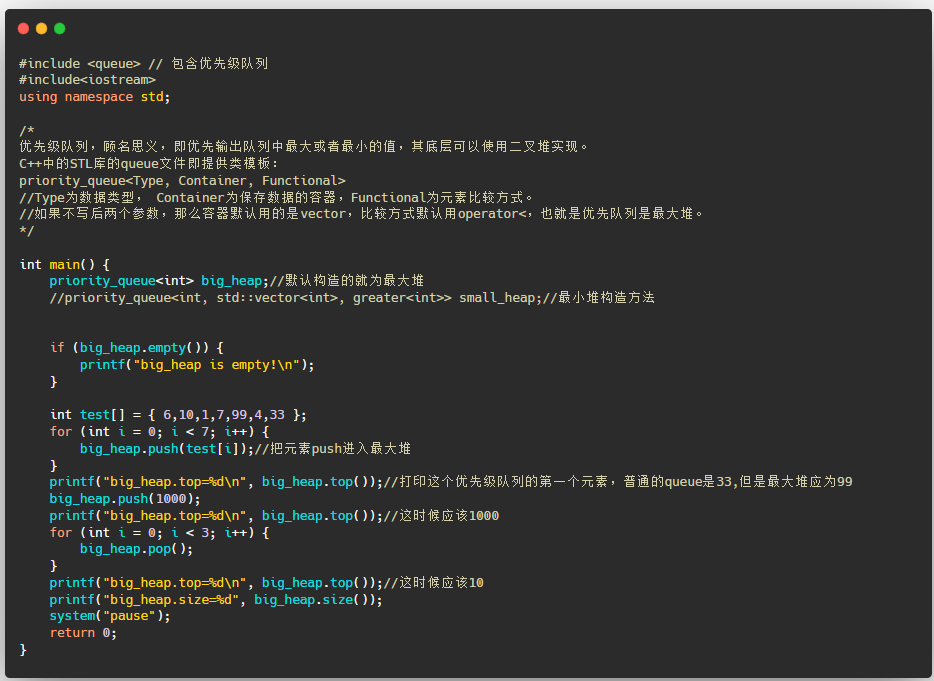
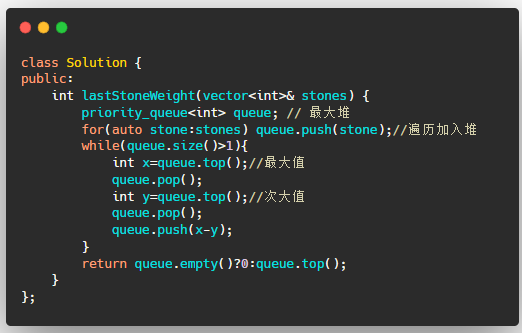
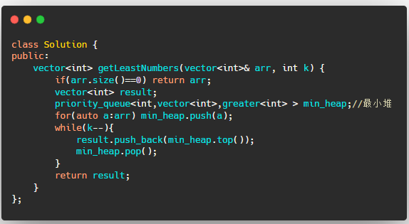
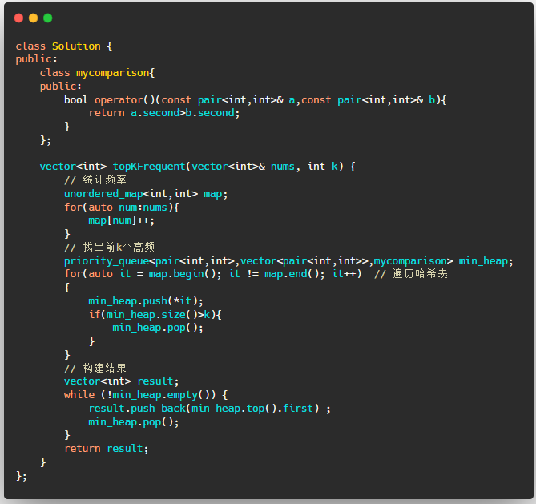

---

layout:     post
title:      「算法刷题」哈希表及其LeetCode题目
subtitle:   C++版本
date:       2022-02-12
author:     MRL Liu
header-img: img/the-first.png
catalog: True
tags: [算法刷题]
   
---

[TOC]

​         本文主要介绍数据结构算法中中常见的面试高频知识点：哈希表（hash table），也叫散列表。

​		熟练本文的优先级队列的代码后您将至少可以解决以下Leetcode题目：

| 题目序号                                               | 相关链接                                                     | 备注                 |
| ------------------------------------------------------ | ------------------------------------------------------------ | -------------------- |
| 1046 最后一块石头的重量（简单难度）                    | [1046. 最后一块石头的重量 - 力扣（LeetCode） (leetcode-cn.com)](https://leetcode-cn.com/problems/last-stone-weight/) | 使用优先队列         |
| 剑指 Offer 40. 最小的k个数（简单难度）                 | [剑指 Offer 40. 最小的k个数 - 力扣（LeetCode） (leetcode-cn.com)](https://leetcode-cn.com/problems/zui-xiao-de-kge-shu-lcof/) | 使用优先队列         |
| 面试题 17.14. 最小K个数（中等难度）                    | [面试题 17.14. 最小K个数 - 力扣（LeetCode） (leetcode-cn.com)](https://leetcode-cn.com/problems/smallest-k-lcci/) | 使用优先队列         |
| 347 前K个高频元素（中等难度）                          | [347. 前 K 个高频元素 - 力扣（LeetCode） (leetcode-cn.com)](https://leetcode-cn.com/problems/top-k-frequent-elements/) | 使用哈希表和优先队列 |
| 剑指 Offer II 060. 出现频率最高的 k 个数字（中等难度） | [剑指 Offer II 060. 出现频率最高的 k 个数字 - 力扣（LeetCode） (leetcode-cn.com)](https://leetcode-cn.com/problems/g5c51o/) | 使用哈希表和优先队列 |
| 215 数组中的第K个最大元素（中等难度）                  | [215. 数组中的第K个最大元素 - 力扣（LeetCode） (leetcode-cn.com)](https://leetcode-cn.com/problems/kth-largest-element-in-an-array/) | 使用优先队列         |
| 295 数据流的中位数（困难难度）                         | [295. 数据流的中位数 - 力扣（LeetCode） (leetcode-cn.com)](https://leetcode-cn.com/problems/find-median-from-data-stream/) | 使用优先队列         |

## 一、优先级队列

​		在大多数编程语言中，优先级队列（Priority Queue）就可以看做是一个堆结构（其底层可能就是借助堆实现的），优先级队列的特点就是其队首元素始终是整个队列中最大或者最小的数，这和最大堆或最小堆的特点一样。我们直接给出其使用代码：




## 二、LeetCode题目解析

### 1、1046 最后一块石头的重量（简单难度）

[1046. 最后一块石头的重量 - 力扣（LeetCode） (leetcode-cn.com)](https://leetcode-cn.com/problems/last-stone-weight/)			

​			这道题每回合要从一堆石头中取出最重的2个石头，从只要知道优先级队列的存在，思路和代码应该就很容易，借助优先级队列我们可以很容易的给出编码，思路容易，编码要多写几遍，好好打磨自己的代码：




### 2、剑指 Offer 40. 最小的k个数（简单难度）和面试题 17.14. 最小K个数（中等难度）

  [剑指 Offer 40. 最小的k个数 - 力扣（LeetCode） (leetcode-cn.com)](https://leetcode-cn.com/problems/zui-xiao-de-kge-shu-lcof/)

  [面试题 17.14. 最小K个数 - 力扣（LeetCode） (leetcode-cn.com)](https://leetcode-cn.com/problems/smallest-k-lcci/)

​		这两道题目就是同一道题，注意最小堆的初始化语句。




### 3、347 前K个高频元素（中等难度）和剑指 Offer II 060. 出现频率最高的 k 个数字（中等难度）

[347. 前 K 个高频元素 - 力扣（LeetCode） (leetcode-cn.com)](https://leetcode-cn.com/problems/top-k-frequent-elements/)

[剑指 Offer II 060. 出现频率最高的 k 个数字 - 力扣（LeetCode） (leetcode-cn.com)](https://leetcode-cn.com/problems/g5c51o/)

​		该2道题考察的都是出现频率最多的几个数，一说到频率，自然想到要使用哈希表来解决，首先要统计出各个数字出现的频率。为了找出频率最高的前k个数字，需要使用优先级队列建立一个最小堆（将小值移除）。维护一个长度适中为k的最小堆，扫描一遍哈希表后，优先级队列中剩余的就是频率最高的前k个数字。




​			这道题的难点在于如何初始化一个可以存储哈希映射的最小堆。

### 4、347 前K个高频元素（中等难度）和剑指 Offer II 060. 出现频率最高的 k 个数字（中等难度）

## 三、LeetCode题目答案

### 1、1046 最后一块石头的重量（简单难度）

​			本小节直接给出本文各个题目的答案，供有需求的读者复制。

```c++
class Solution {
public:
    int lastStoneWeight(vector<int>& stones) {
        priority_queue<int> queue; // 最大堆
        for(auto stone:stones) queue.push(stone);//遍历加入堆
        while(queue.size()>1){
            int x=queue.top();//最大值
            queue.pop();
            int y=queue.top();//次大值
            queue.pop();
            queue.push(x-y);
        }
        return queue.empty()?0:queue.top();
    }
};
```

### 2、剑指 Offer 40. 最小的k个数（简单难度）和面试题 17.14. 最小K个数（中等难度）

```c++
class Solution {
public:
    vector<int> getLeastNumbers(vector<int>& arr, int k) {
        if(arr.size()==0) return arr;
        vector<int> result;
        priority_queue<int,vector<int>,greater<int> > min_heap;//最小堆
        for(auto a:arr) min_heap.push(a);
        while(k--){
            result.push_back(min_heap.top());
            min_heap.pop();
        }
        return result;
    }
};
```

### 3、347 前K个高频元素（中等难度）和剑指 Offer II 060. 出现频率最高的 k 个数字（中等难度）

```c++
class Solution {
public:
    class mycomparison{
    public:
        bool operator()(const pair<int,int>& a,const pair<int,int>& b){
            return a.second>b.second;
        }
    };
    
    vector<int> topKFrequent(vector<int>& nums, int k) {
        // 统计频率
        unordered_map<int,int> map;
        for(auto num:nums){
            map[num]++;
        }
        // 找出前k个高频
        priority_queue<pair<int,int>,vector<pair<int,int>>,mycomparison> min_heap;
        for(auto it = map.begin(); it != map.end(); it++)  // 遍历哈希表
        {
            min_heap.push(*it);
            if(min_heap.size()>k){
                min_heap.pop();
            }
        }
        // 构建结果
        vector<int> result;
        while (!min_heap.empty()) {
            result.push_back(min_heap.top().first) ;
            min_heap.pop();
        }
        return result;
    }
};
```


### 更多参考资料

[十大排序算法(背诵版+动图) - 力扣（LeetCode）](https://leetcode-cn.com/circle/article/0akb5U/)

[（四）排序【C++刷题】-Caoer199-博客园(cnblogs.com)](https://www.cnblogs.com/caoer/p/15722363.html)
