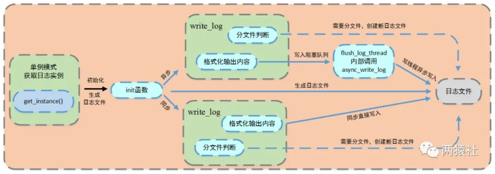

---

layout:     post
title:      「项目复现」linux并发编程之同步/异步的日志系统
subtitle:   互斥锁+条件变量+生产者-消费者模型
date:       2022-03-28
author:     MRL Liu,WJ
header-img: img/post-bg-hacker.png
catalog: true
tags:
    - 项目复现
---

[TOC]

​		**日志系统**是服务器端的常见模块，服务器在运行时一般会自动创建一些日志，用来记录自身的运行状态、错误信息和访问数据的文件等。本文考虑的是一个支持同步/异步的日志系统。

​		本文所讲的日志系统涉及到的知识有可变参数宏+单例模式+阻塞队列（互斥锁+条件变量+生产者-消费者模型），但是不再讲解**单例模式**和**阻塞队列**，其相关知识可以参考作者的其他博客。

# 一、可变参数宏

​		日志输出的文本信息一般是要分level的，常见的如debug，info，warning，error四种级别。如何让我们的日志系统在编码中插入十分方便呢？答案就是使用**可变参数宏**。

​		`__VA_ARGS__`是一个可变参数的宏，定义时宏定义中参数列表的最后一个参数为`省略号`，在实际使用时会发现有时会加`##`，有时又不加。

```c++
//最简单的定义
#define LOG_INFO(...)  printf(__VA_ARGS__)
#define LOG_INFO(...)  printf(##__VA_ARGS__)//推荐
//搭配__VA_ARGS__的format使用
#define LOG_INFO(format, ...) printf(format,__VA_ARGS__)
#define LOG_INFO(format, ...) printf(format,##__VA_ARGS__)//推荐
```

# 二、日志系统的流程图

-  本文的日志系统的流程图如下：




可以看到，上图中关键逻辑如下。

> - 日志文件
>
> - - 局部变量的懒汉模式获取实例
>   - 生成日志文件，并判断同步和异步写入方式
>
> - 同步
>
> - - 判断是否分文件
>   - 直接格式化输出内容，将信息写入日志文件
>
> - 异步
>
> - - 判断是否分文件
>   - 格式化输出内容，将内容写入阻塞队列，创建一个写线程，从阻塞队列取出内容写入日志文件

# 三、日志类的实现

在多线程中，需要考虑共享资源的安全性，使用互斥锁

### （1）单例模式的日志类		

单例模式有两种实现方法，分别是懒汉模式和饿汉模式。顾名思义，。

```c++
#include<iostream>
#include<pthread.h>
using namespace std;

class Singleton{
protected:
    //构造函数被保护，不能被外界访问
    Singleton(){
        pthread_mutex_init(&lock, NULL);
        cout<<"构造函数执行成功"<<endl;
    };
private:
    //设置一个私有的静态类指针，用来保存全局唯一的实例对象
    static Singleton* _instance;//静态成员变量
    static pthread_mutex_t lock;//静态锁，是由于静态函数只能访问静态成员
public:
    //设置一个公有的静态成员函数，用来作为外界唯一的创建接口
    static Singleton* Instance(){ 
        if (_instance==NULL){
            pthread_mutex_lock(&lock);
            if (_instance==NULL){
                _instance = new Singleton();
            }
            pthread_mutex_unlock(&lock);
        }
        return _instance;
    };
};
// 全局变量类外声明,直接实例化
Singleton* Singleton::_instance=NULL;
pthread_mutex_t Singleton::lock;
```

**`为什么要用双检测，只检测一次不行吗？`**		

​		如果只检测一次，在每次调用获取实例的方法时，都需要加锁，这将严重影响程序性能。双层检测可以有效避免这种情况，仅在第一次创建单例的时候加锁，其他时候都不再符合NULL == p的情况，直接返回已创建好的实例。

### （2）局部静态变量之线程安全懒汉模式

​		前面的双检测锁模式，写起来不太优雅，《Effective C++》（Item 04）中的提出另一种更优雅的单例模式实现，使用函数内的局部静态对象，这种方法不用加锁和解锁操作。**它不用加锁是因为在C++11之后，编译器会保证局部静态变量的线程安全性，所以不需要程序员额外为局部静态变量设置线程安全性**。

```c++
class Singleton{
protected:
    //构造函数被保护，不能被外界访问
    Singleton(){cout<<"构造函数执行成功"<<endl;};
public:
    //设置一个公有的静态成员函数，用来作为外界唯一的创建接口
    static Singleton* Instance(){ 
        static Singleton _instance;//静态成员变量
        return &_instance;
    };
};
```

# 二、阻塞队列的介绍

​		阻塞队列常用于**生产者和消费者的场景**，生产者是向队列里添加元素的线程，消费者是从队列里获取元素的线程。**阻塞队列**（block queue）是一种支持阻塞的插入和移除的队列，用于多线程或多进程同步的情景。阻塞队列使用的是生产者-消费者模式，生产者指的是向队列中添加元素的线程，消费者是从队列中获取元素的线程。

> - 支持阻塞的插入方法：意思是**当队列满时，队列会阻塞插入元素的线程，直到队列不满**。
> - 支持阻塞的移除方法：意思是**队列为空时，获取元素（同时移除元素）的线程会被阻塞，等到队列变为非空**。

​		和阻塞队列相关的知识点有：互斥锁+条件变量+生产者-消费者模型。

​		有关阻塞队列的介绍，可以参考读者的其他文章。		
